# Jenkins+Gradle实现android开发持续集成问题汇总

来源：[测试蜗牛，一步一个脚印](http://blog.csdn.net/hwhua1986/article/details/48155163)

## 问题1：Android系统的环境变量不能被jenkins调用导致编译失败，需要在jenkins里面配置环境变量

报错信息：

>  What went wrong: 
> A problem occurred configuring root project 'BloodGlucose'. 
> SDK location not found. Define location with sdk.dir in the local.properties file or with an ANDROID_HOME environment variable.

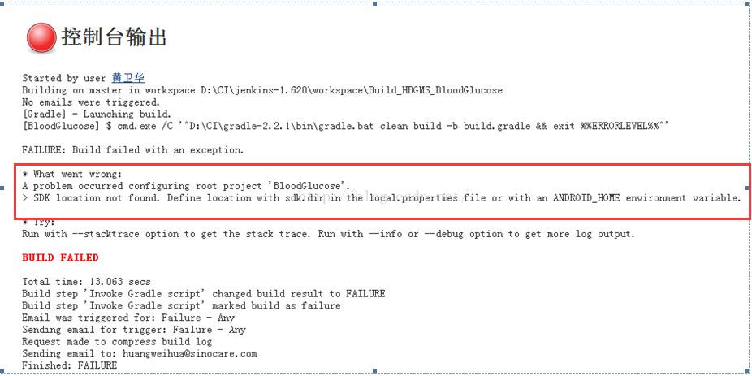

解决：在系统管理->环境变量里面新增一个全局环境变量

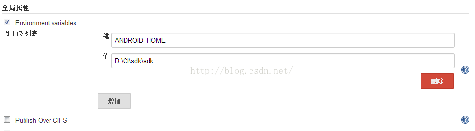

## 问题2：Gradle版本不对，导致编译失败
报错信息：

> What went wrong: 
> A problem occurred evaluating root project 'BloodGlucose'. 
> Failed to apply plugin [id 'android'] 
   > Gradle version 2.1 is required. Current version is 2.6. If using the gradle wrapper, try editing the distributionUrl in D:\CI\jenkins-1.620\workspace\Build_HBGMS_BloodGlucose\BloodGlucose\gradle\wrapper\gradle-wrapper.properties to gradle-2.1-all.zip

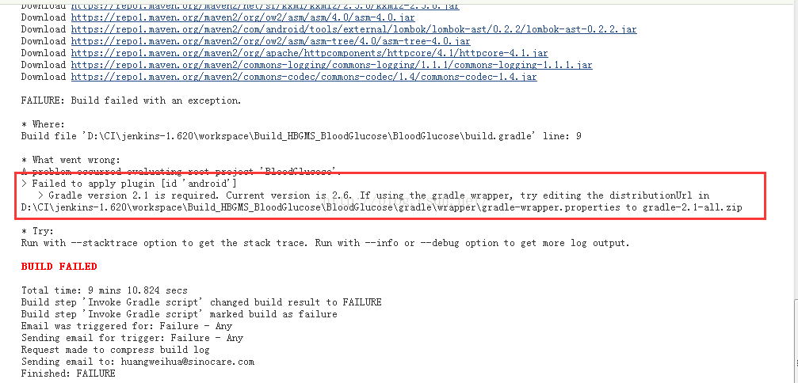
   
解决：在服务器上安装2.2.1版本的gradle，并在jenkins里面配置gradle。

(1)在系统管理->环境变量里面新增一个全局环境变量

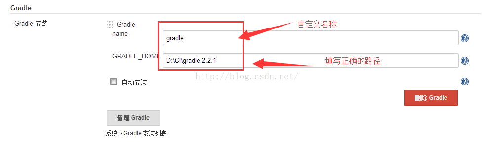

(2)在job里面选择gradle版本

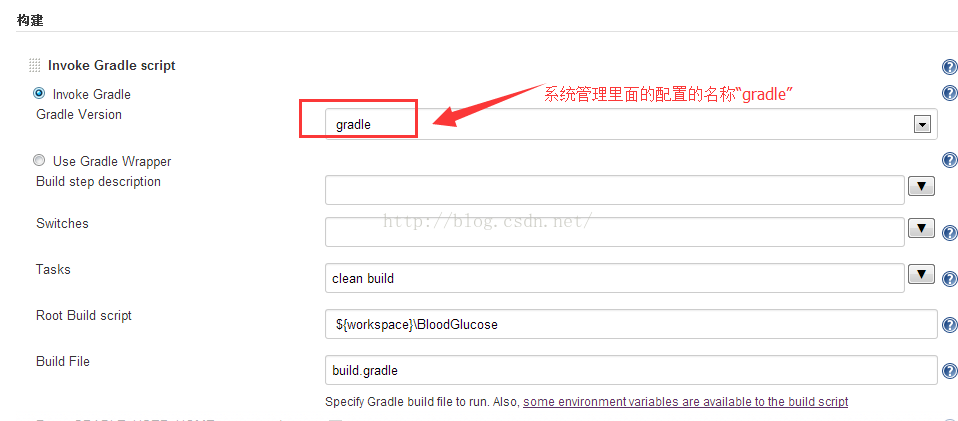

## 问题3：build.gradle文件路径配置错误，导致失败

报错信息：

> What went wrong: 
> Build file 'D:\CI\jenkins-1.620\workspace\Build_HBGMS_BloodGlucose\build.gradle' does not exist.

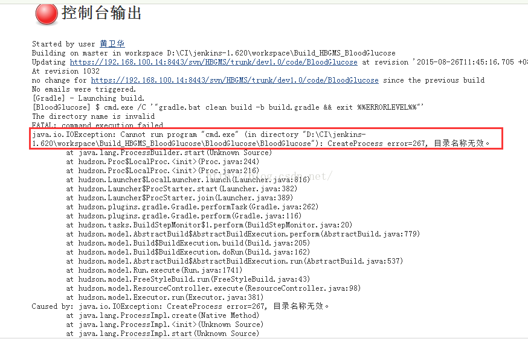

解决：根据实际情况配置build.gradle文件的路径及名称。

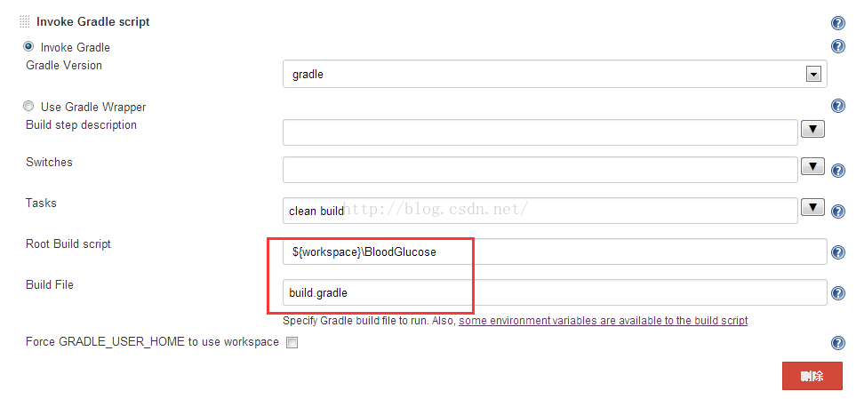

## 问题4：Sdk未安装导致编译失败，环境变量配置错误，导致编译失败

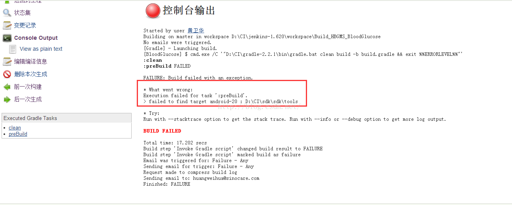

解决：配置tools的环境变量

步骤1：下载并解压adt-bundle-windows-x86 

步骤2：设置环境变量

1、新增ANDROID_HOME，值为sdk解压目录，如下图

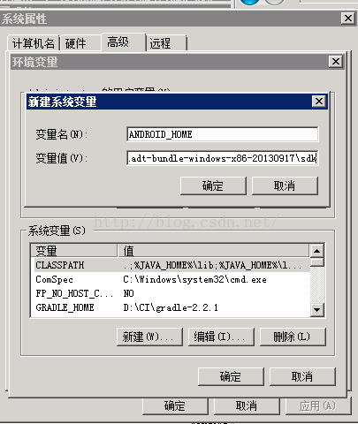

2、增加path路径，如下图

备注：2.2以上的sdk版本adb命令\工具在\platform-tools下：

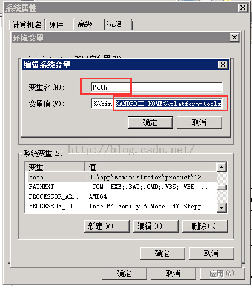

环境变量的验证

在cmd命令里面输入“adb”，如下图

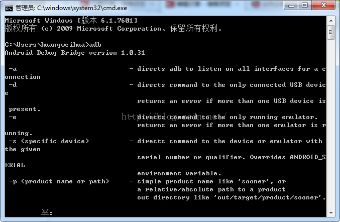
