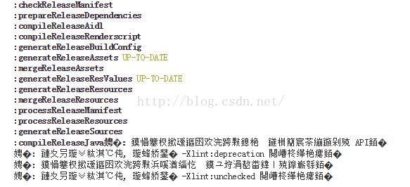
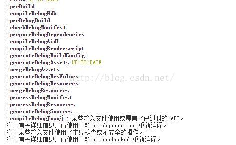

# Jenkins中Console Output中文乱码问题

来源:[测试蜗牛，一步一个脚印](http://blog.csdn.net/hwhua1986/article/details/51204845)

**解决方案：**

在`.jenkins/jenkins.xml`中新增`-Dfile.encoding=utf-8`，可解决jenkins信息乱码问题，如下：

> <arguments>-Xrs -Xmx256m -Dfile.encoding=utf-8 -	Dhudson.lifecycle=hudson.lifecycle.WindowsServiceLifecycle 	-jar "%BASE%\jenkins.war" --httpPort=8080</arguments>

添加前的乱码，如下图：

添加后就无乱码了，如下图：

