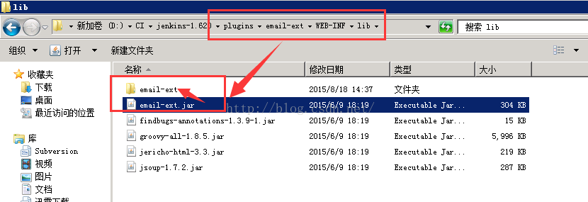
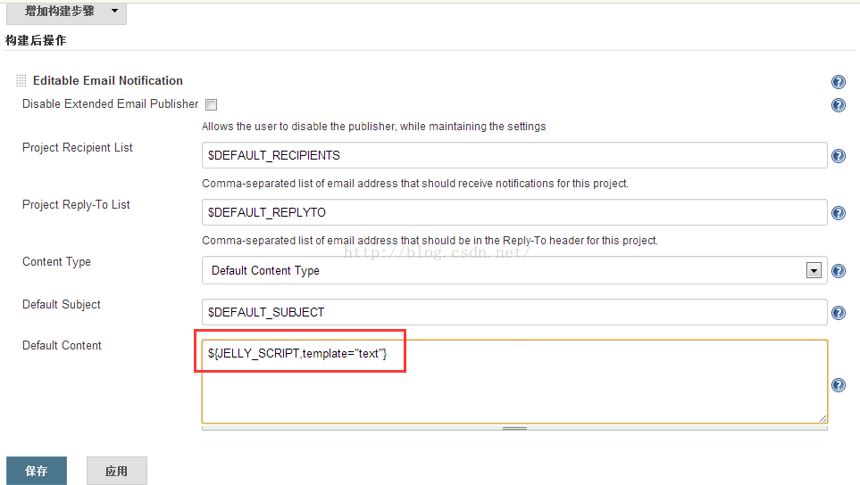
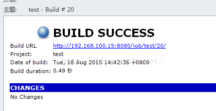

# Jenkins中Jelly邮件模板的配置

来源:[测试蜗牛，一步一个脚印](http://blog.csdn.net/hwhua1986/article/details/47975237)

1、找到email-ext.jar并解压，路径为：D:\CI\jenkins-1.620\plugins\email-ext\WEB-INF\lib

2、在jenkins里的default content 里面设置${JELLY_SCRIPT,template="html"}，或者${JELLY_SCRIPT,template="text"}，如下图

3、执行job并查看邮件

