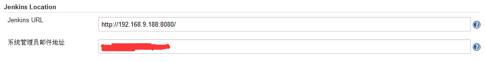
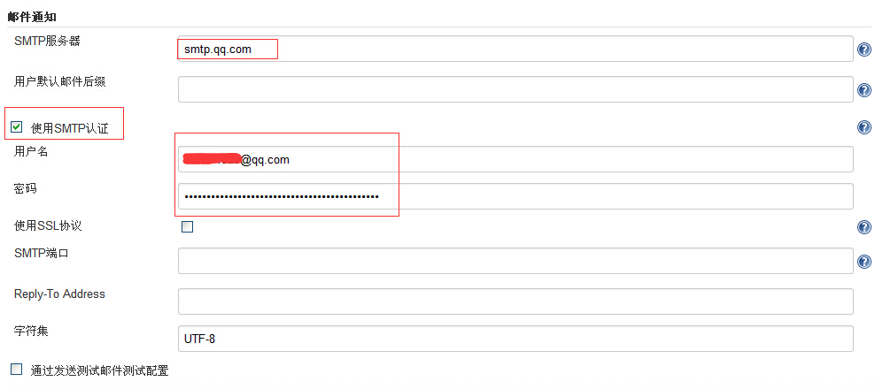
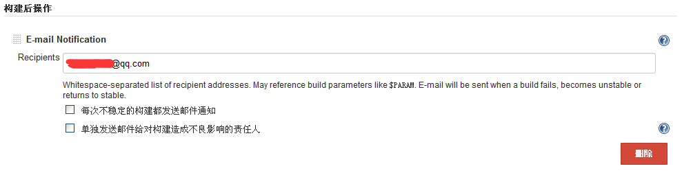
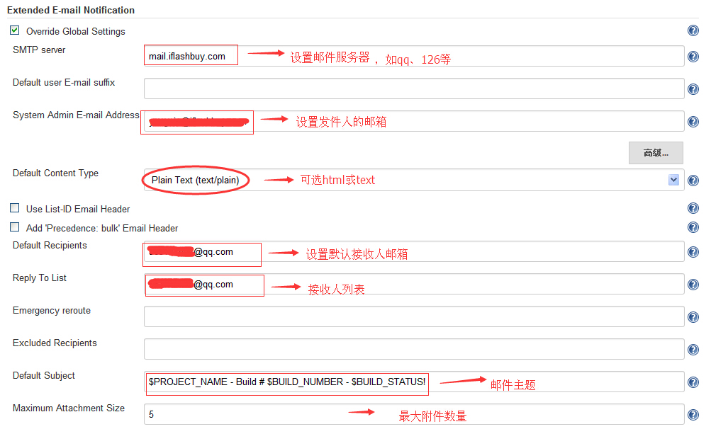
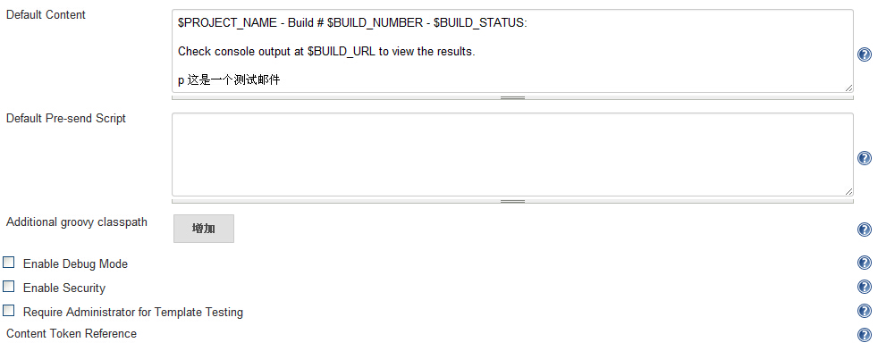
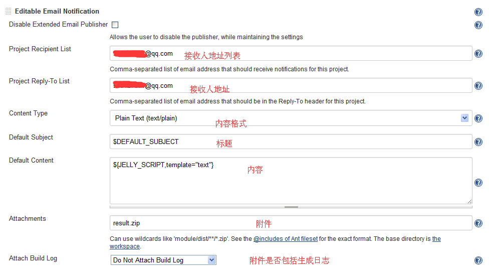
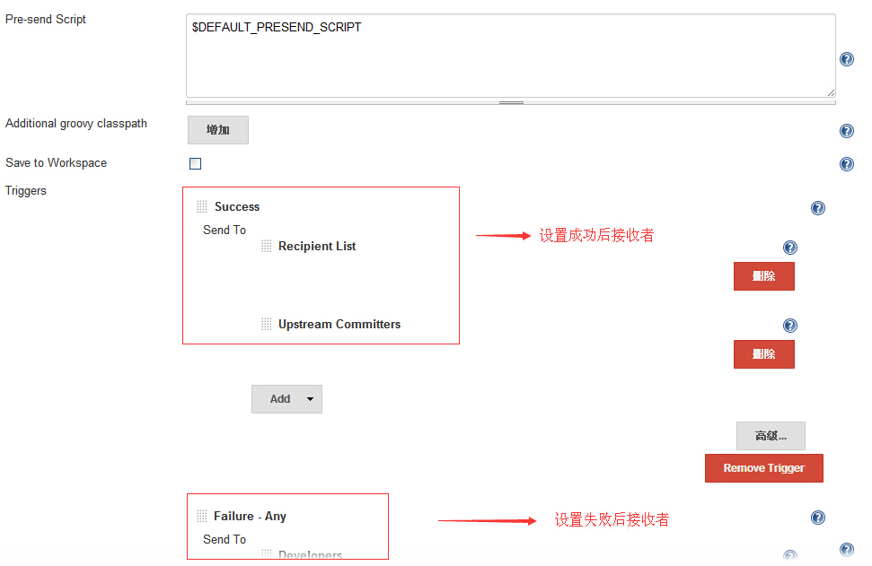
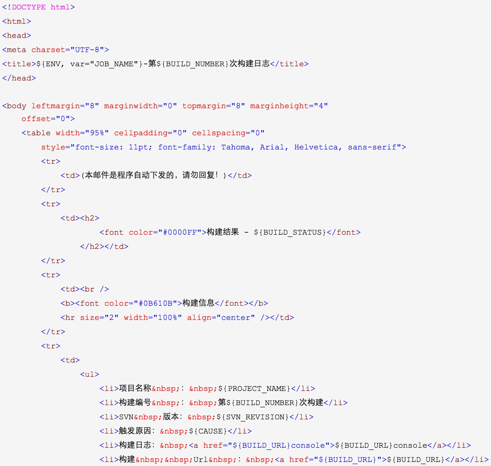
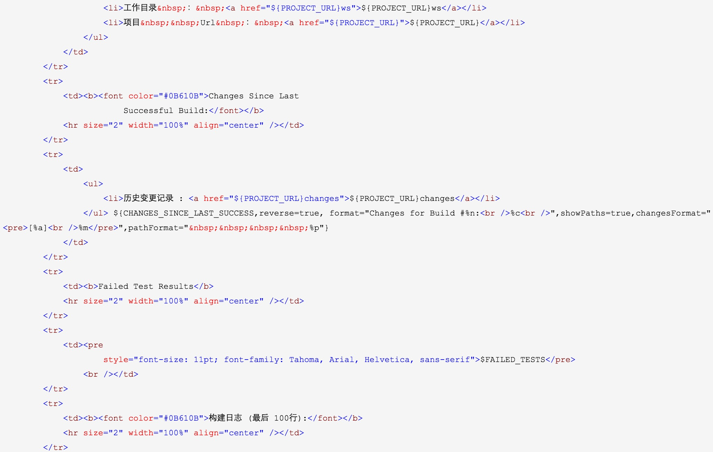
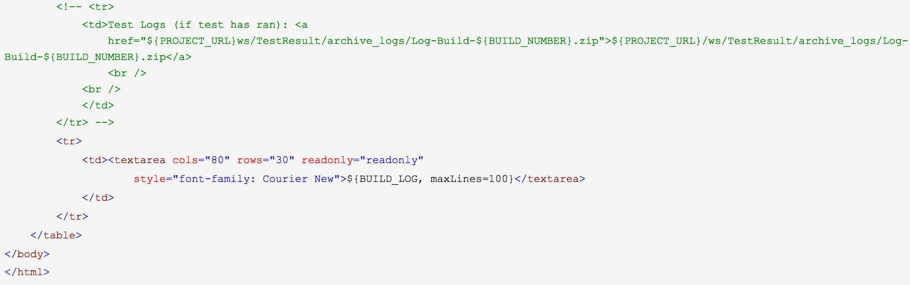

# Jenkins学习四：Jenkins 邮件配置

来源:[http://www.cnblogs.com/yangxia-test/p/4366172.html](http://www.cnblogs.com/yangxia-test/p/4366172.html)

## 本文主要对Windows环境 jenkins 的邮件通知进行介绍
jenkins 内置的邮件功能
使用email-ext插件扩展的邮件功能
 

邮件通知功能主要包含两个部分：全局配置和项目配置。

## 一. 先介绍下内置的Jenkins 邮件服务器 配置

1、系统管理－系统设置，先设置发件人的邮件，**切记：一定要设置，且在系统管理员那个地方设置的email地址要和email配置的相同**

2、系统管理－系统设置，再设置全局设置：

可以勾选 “通过发送测试邮件配置”  测试此配置能否连通， 如果收到以下邮件，恭喜`This is test email #1 sent from Jenkins`

3、对构建的job 添加邮件发送的步骤，针对具体job名称-配置，如下图：

这样每次build后都会发送邮件给这个接收者， 到这里你会发现，只能发给 固定的对象，且格式单一（txt）

## 二、介绍email-ext插件配置

Jenkins默认提供了一个邮件通知，能在构建失败、构建不稳定等状态后发送邮件。但是它本身有很多局限性，比如它的邮件通知无法提供详细的邮件内容、无法定义发送邮件的格式、无法定义灵活的邮件接收配置等等。在这样的情况下，我们找到了Jenkins Email Extension Plugin。该插件能允许你自定义邮件通知的方方面面，比如在发送邮件时你可以自定义发送给谁，发送具体什么内容等等。

email-ext插件可根据构建的结果，发送构建报告，给当前的committer （用git做代码管理）

1) 该插件支持jenkins 1.5以上的版本，插件的安装此处略 ，若您可选插件的页卡的列表是空的，先去高级页面检查更新下。

2）插件用于job配置页面，添加构建后步骤“Editable Email Notification”

### 1、系统管理－系统设置，先设置全局：

详细参数说明如下：

> 1、**Override Global Settings：**如果不选，该插件将使用默认的E-mail Notification通知选项。反之，您可以通过指定不同于( 默认选项)的设置来进行覆盖。 
> 2、**Default Content Type：**指定构建后发送邮件内容的类型，有Text和HTML两种. 
> 3、U**se List-ID Email Header：**为所有的邮件设置一个List-ID的邮件信头，这样你就可以在邮件客户端使用过滤。它也能阻止邮件发件人大部分的自动回复(诸如离开办公室、休假等等)。你可以使用你习惯的任何名称或者ID号，但是他们必须符合如下其中一种格式(真实的ID必须要包含在<和>标记里)： 
<ci-notifications.company.org> 
Build Notifications <ci-notifications.company.org> 
“Build Notifications” <ci-notifications.company.org> 
> 4、**Add 'Precedence:** bulk' Email Header：设置优先级, 
> 5、**Default Recipients：**自定义默认电子邮件收件人列表。如果没有被项目配置覆盖,该插件会使用这个列表。您可以在项目配置使用$ DEFAULT_RECIPIENTS参数包括此默认列表，以及添加新的地址在项目级别。添加抄送：cc:电子邮件地址例如,CC:someone@somewhere.com 
> 6、**Reply To List：**回复列表, A comma separated list of e-mail addresses to use in the Reply-To header of the email. This value will be available as $DEFAULT_REPLYTO in the project configuration. 
> 7、**Emergency reroute：**如果这个字段不为空，所有的电子邮件将被单独发送到该地址（或地址列表）。 
> 8、**Excluded Committers：**防止邮件被邮件系统认为是垃圾邮件,邮件列表应该没有扩展的账户名(如:@domain.com),并且使用逗号分隔 
> 9、**Default Subject：**自定义邮件通知的默认主题名称。该选项能在邮件的主题字段中替换一些参数，这样你就可以在构建中包含指定的输出信息。 
> 10、**Maximum Attachment Size：**邮件最大附件大小。 
> 11、 **Default Content：**自定义邮件通知的默认内容主体。该选项能在邮件的内容中替换一些参数，这样你就可以在构建中包含指定的输出信息。 
> 12、**Default Pre-send Script：**默认发送前执行的脚本（注：grooy脚本，这是我在某篇文章上看到的，不一定准确）。 
> 13、**Enable Debug Mode：**启用插件的调试模式。这将增加额外的日志输出，构建日志以及Jenkins的日志。在调试时是有用的，但不能用于生产。 
> 14、**Enable Security：**启用时，会禁用发送脚本的能力，直接进入Jenkins实例。如果用户试图访问Jenkins管理对象实例，将抛出一个安全异常。 
> 15、**Content Token Reference：**邮件中可以使用的变量，所有的变量都是可选的。

### 2、项目配置

1）要想在一个项目中使用email-ext插件，你首先必须在项目配置页激活它。在构建后操作——”Add Post-build Actions”选项中勾选”Editable Email Notification”标签。如下图：

项目基本配置参数说明：

当插件激活后你就能编辑如下字段（只列出常用的字段）：

> **Project Recipient List：**这是一个以逗号(或者空格)分隔的收件人邮件的邮箱地址列表。允许您为每封邮件指定单独的列表。Ps：如果你想在默认收件人的基础上添加收件人：$DEFAULT_RECIPIENTS,<新的收件人> 
> **Default Subject：**允许你配置此项目邮件的主题。 
> **Default Content：**跟Default Subject的作用一样，但是是替换邮件内容。 
> **Attach Build Log：**附件构建日志。 
> **Compress Build Log before sending：**发送前压缩生成日志（zip格式）。
 

2）点击高级，设置触发器：（注意：所有的触发器都只能配置一次）

触发器参数说明：

> **Failure：**即时发送构建失败的邮件。如果”Still Failing”触发器已配置，而上一次构建的状态是”Failure”，那么”Still Failing”触发器将发送一封邮件来替代(它)。 
> **Unstable：**即时发送构建不稳固的邮件。如果”Still Unstable”触发器已配置，而上一次构建的状态是”Unstable”，那么”Still Unstable”触发器将发送一封邮件来替代(它)。 
> **Still Failing：**如果两次或两次以上连续构建的状态为”Failure”，发送该邮件。 
> **Success：**如果构建的状态为”Successful”发送邮件。如果”Fixed”已配置，而上次构建的状态为“Failure”或“Unstable”，那么”Fixed”触发器将发送一封邮件来替代(它)。 
> **Fixed：**当构建状态从“Failure”或“Unstable”变为”Successful”时发送邮件。 
> **Still Unstable：**如果两次或两次以上连续构建的状态为” Unstable “，发送该邮件。 
> **Before Build：**当构建开始时发送邮件。 

对于内容，你也许注意到了 这里调用了个 [‘html.jelly’](https://github.com/jenkinsci/email-ext-plugin/blob/master/src/main/resources/hudson/plugins/emailext/templates/html.jelly) 的模板，这是插件内置的，直接用即可。

当然也可以自己写 jelly文件， 确保放置`jenkins/home/email-template`下 以供jenkins调用。  

 

## 三、附email-ext邮件通知模板
发现一个很好的邮件通知模板，如下：

Default Subject：

> 构建通知: ${BUILD_STATUS} - ${PROJECT_NAME} - Build # ${BUILD_NUMBER} !

Default Content：

