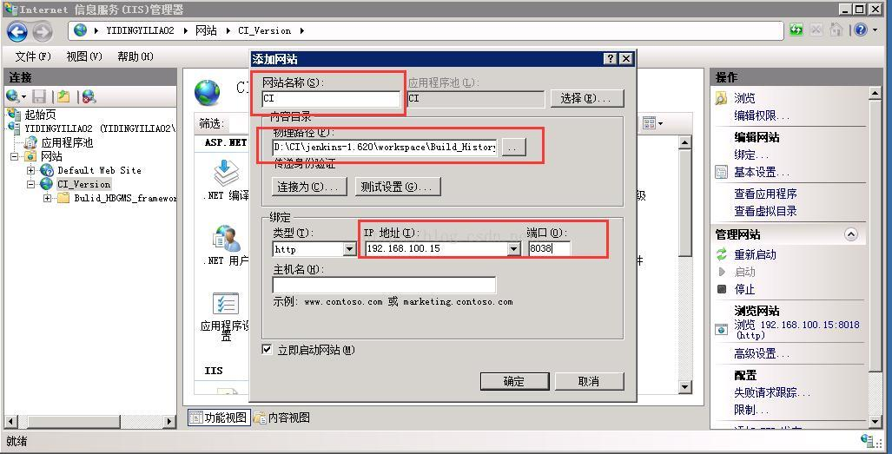
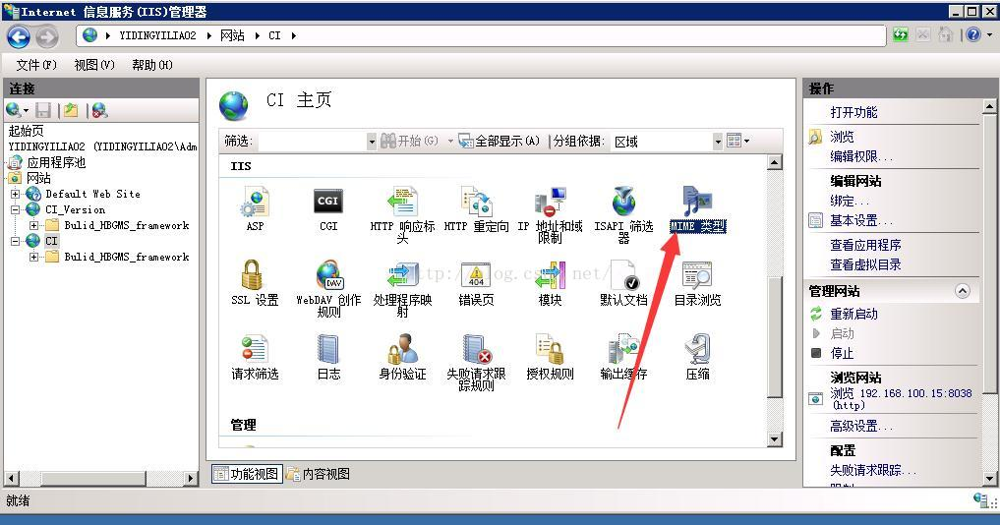
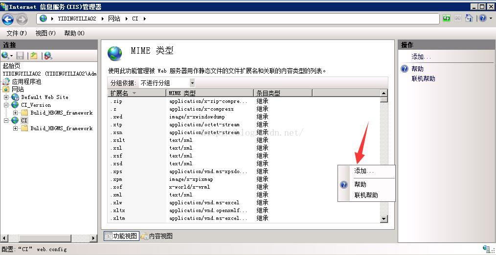
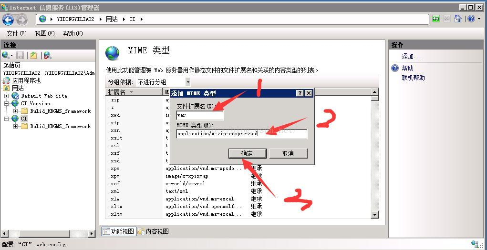
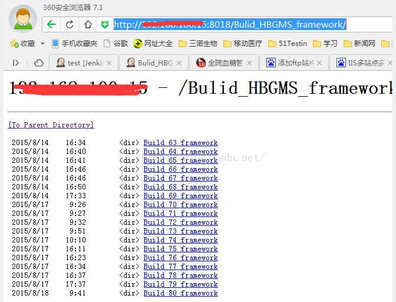

# Jenkins构建的版本包如何发布成可下载的资源__IIS发布方式

来源:[测试蜗牛，一步一个脚印](http://blog.csdn.net/hwhua1986/article/details/47974499)

备注：另外一种是ftp站点方式，可以百度搜下就出来了。

1、右键->添加站点，物理路径为版本包的跟目录

2、添加mime类型

如果是zip压缩包，则添加类型名“application/x-zip-compressed”，扩展名为“zip”

如果是apk包，则增加类型名为“application/vnd.android”，文件扩展名为“apk”

3、通过连接访问并下载

http://192.168.**.**:8018/Bulid_HBGMS_framework/

