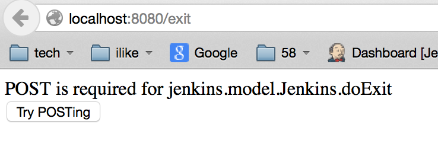

# Jenkins的关闭、重启

来源:[CSDN](http://m.blog.csdn.net/article/details?id=44876517)

我们用jar -jar jenkins.war来启动jenkins服务器，那么我们如何关闭或者重启jenkins服务器呢？经过搜索找到了相应的方法.

## 关闭jenkins服务

只需要在访问jenkins服务器的网址url地址后加上exit。例如我jenkins的地址http://localhost:8080/，那么我只需要在浏览器地址栏上敲下`http://localhost:8080/exit` 网址就能关闭jenkins服务.

按return键后会跳转到如下网页：

点击Try POSTing按钮后，就直接将jenkins服务器关闭了。

## 重新启动jenkins服务器

将上面的`exit`改为`restart`后就可以重新启动jenkins服务器。

按return后，出现如下界面：

点击Yes按钮后，就将Jenkins重启了。

## 重载

将上面的`restart`改为`reload`就可以实现重新加载配置信息。

按return后，跳转到下面的界面：

点击Try POSTing按钮后就可以重载配置了。

