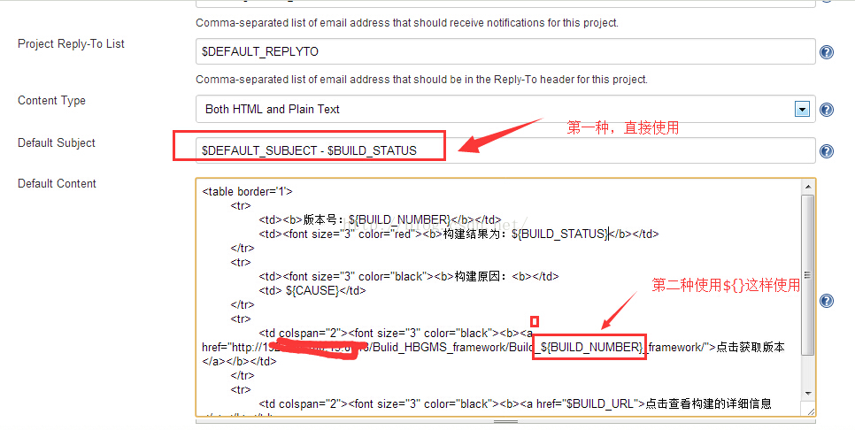

# Jenkins的环境变量的使用

来源：[测试蜗牛，一步一个脚印](http://blog.csdn.net/hwhua1986/article/details/47749853)

两种使用方式

1、直接使用$标志：如$BUILD_STATUS

2、使用${}标志：如${BUILD_STATUS}

备注：

如果是使用批处理命令来使用环境变量，则是通过%%来标志，如% BUILD_STATUS %

环境变量列表:
 
**BUILD_NUMBER**， 唯一标识一次build，例如23；
 
**BUILD_ID**，基本上等同于BUILD_NUMBER，但是是字符串，例如2011-11-15_16-06-21；
 
**JOB_NAME**， job的名字，例如JavaHelloWorld；
 
**BUILD_TAG**，作用同BUILD_ID,BUILD_NUMBER,用来全局地唯一标识一此build，例如jenkins-JavaHelloWorld-23；

**EXECUTOR_NUMBER**， 例如0；
 
**NODE_NAME**，slave的名字，例如MyServer01；
 
**NODE_LABELS**，slave的label，标识slave的用处，例如JavaHelloWorldMyServer01；
 
**JAVA_HOME**， java的home目录，例如C:\Program Files (x86)\Java\jdk1.7.0_01；
 
**WORKSPACE**，job的当前工作目录，例如c:\jenkins\workspace\JavaHelloWorld；

**HUDSON_URL** = JENKINS_URL， jenkins的url，例如http://localhost:8000/；
 
**BUILD_URL**，build的url 例如http://localhost:8000/job/JavaHelloWorld/23/；
 
**JOB_URL**， job的url，例如http://localhost:8000/job/JavaHelloWorld/；
 
**SVN_REVISION**，svn 的revison， 例如4；