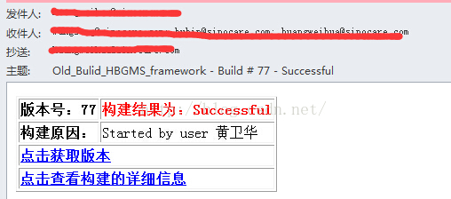

# Jenkins自编邮件模板

来源:[测试蜗牛，一步一个脚印](http://blog.csdn.net/hwhua1986/article/details/47975209)

```
\<table border='1'>  
    <tr>  
        <td><b>版本号：${BUILD_NUMBER}</b></td>  
        <td><font size="3" color="red"><b>构建结果为：${BUILD_STATUS}</b></td>  
    </tr>  
    <tr>  
        <td><font size="3" color="black"><b>构建原因：<b></td>  
        <td> ${CAUSE}</td>  
    </tr>  
    <tr>  
        <td colspan="2"><font size="3" color="black"><b><a href="http://192.168.**.**:8018/Bulid_HBGMS_framework/Build_${BUILD_NUMBER}_framework/">点击获取版本</a></b></td>  
    </tr>  
    <tr>  
        <td colspan="2"><font size="3" color="black"><b><a href="$BUILD_URL">点击查看构建的详细信息</a></b></td>  
    </tr>
</table>  
```

上面的邮件模板，拷贝到content里面即可，效果如下：


