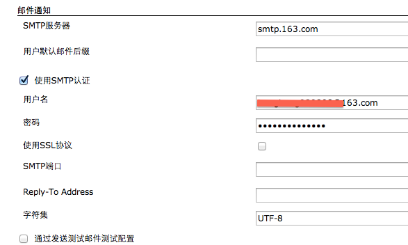
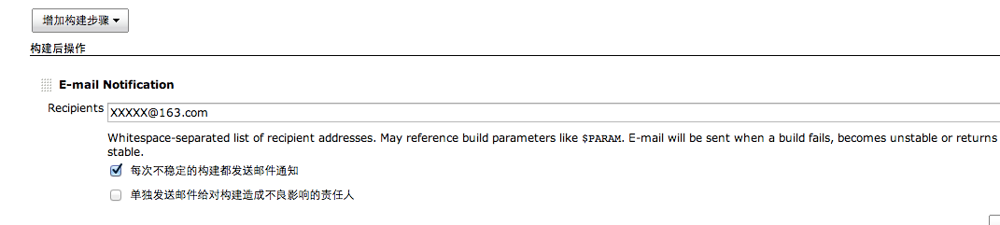
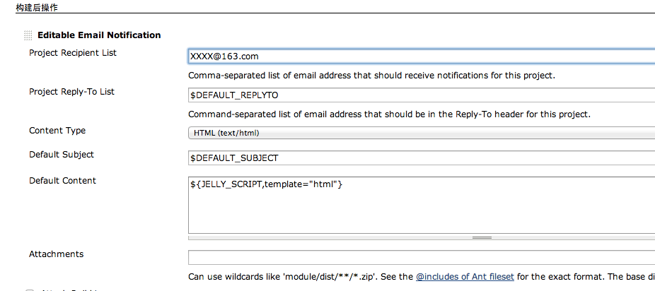
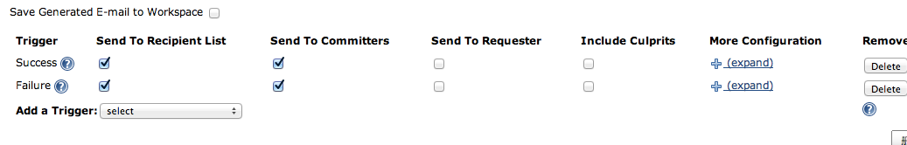

# Jenkins 邮件配置 (使用 Jenkins Email Extension Plugin)

来源:[H@H@](http://www.cnblogs.com/GGHHLL/p/jenkins.html)

本文主要对 jenkins 的邮件通知进行介绍，

* jenkins 内置的邮件功能
* 使用插件扩展的邮件功能

## 1. 先介绍下 基本的Jenkins 邮件服务器 配置

### 1）system config 页面 （以公用的163邮件服务器为例）：

可以勾选 “通过发送测试邮件配置”  测试此配置能否连通， 如果收到以下邮件，恭喜

> This is test email #1 sent from Jenkins

### 2）下面接着对构建的job 添加邮件发送的步骤，

 这样每次build后都会发送邮件给这个接收者， 到这里你会发现，只能发给 固定的对象，且格式单一（txt）

 

 ====好了，现在进入主题====

## 2.  使用插件 “Email Extersion Plugin”进行扩展

它可根据构建的结果，发送构建报告，给当前的committer （用git做代码管理）

### 1) 该插件支持jenkins 1.5以上的版本，至少我的 1.486是不支持的啦。所以果断升级吧。。

插件的安装此处略 ，若您可选插件的页卡的列表是空的，先去高级页面检查更新下。

### 2）插件用于job配置页面，添加构建后步骤“Editable Email Notification”

上面的配置 给出了 该工程的默认接收列表，当然抄送的话 直接 可以这么写 cc:xxxx@163.com

对于内容，你也许注意到了 这里调用了个 ‘[html.jelly](https://github.com/jenkinsci/email-ext-plugin/blob/master/src/main/resources/hudson/plugins/emailext/templates/html.jelly)’ 的模板，这是插件内置的，直接用即可。（支持git每次变更的记录，mvn 及junit 等编译的结果报告）

当然也可以自己写 jelly文件， 确保放置 jenkins/home/email-template下 以供jenkins调用。  

### 3）至此你也许会问 这不还是用的固定的接收列表嘛 (⊙_⊙) ，别着急 看到右下角的高级选项没， 继续配置，

我设置了 build成功和失败都发给 默认的接收者和当前提交代码的家伙，而send to requester 是指手动触发构建时当前登陆jenkins的用户。

ps：

1.如果有人 git commit时候没有进行global的name和email设置，将不会发送到正确的邮箱（jenkins将按各自的机器名作为域名地址发送到错误的邮箱）

2.当然还可在jenkins 管理用户中 个别设置 邮箱。不过对于团队较多的话，你就苦了。 所以还是有必要请大家提交前进行实名设置。 

