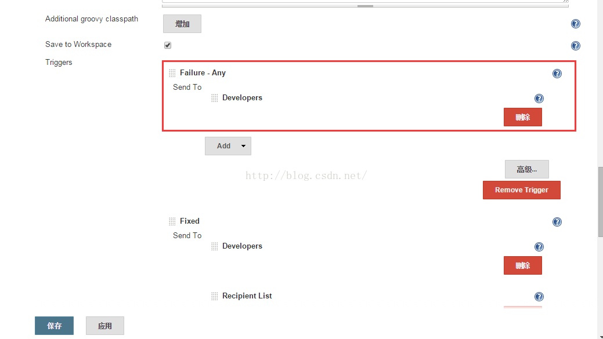
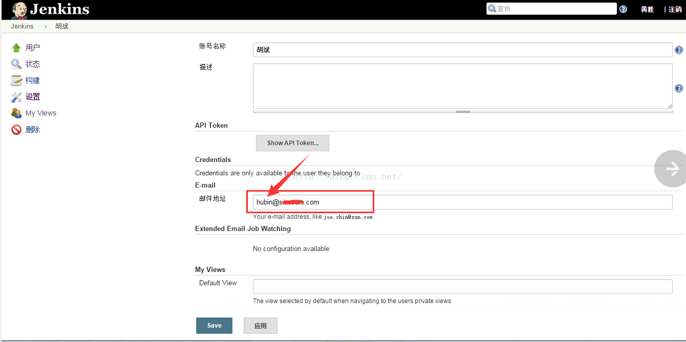
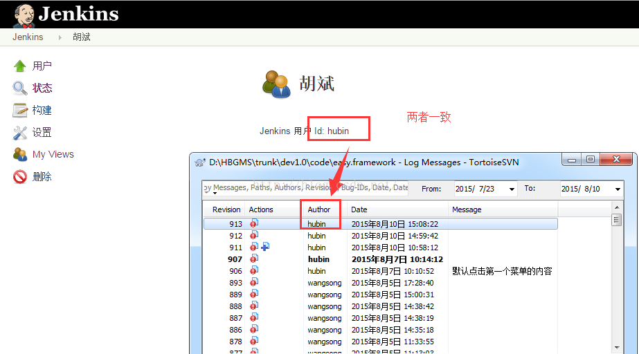
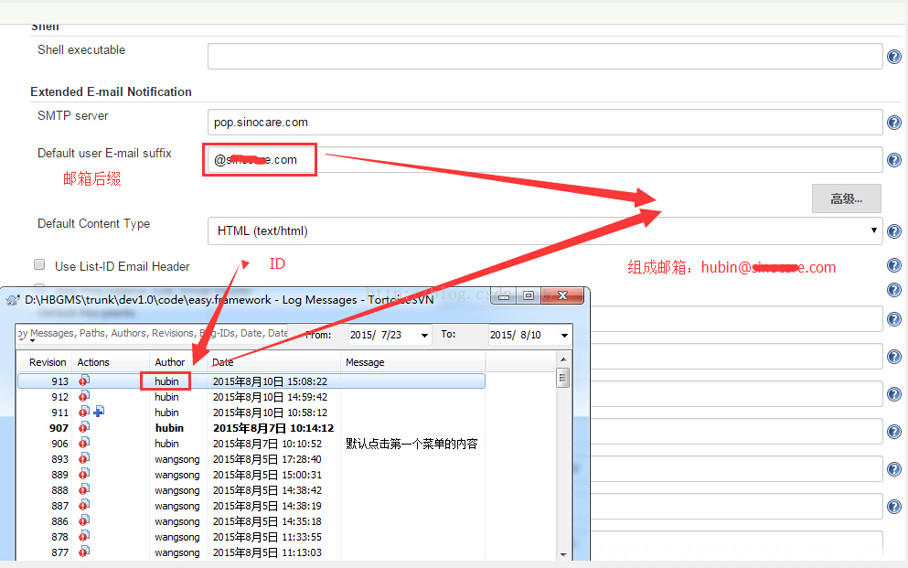
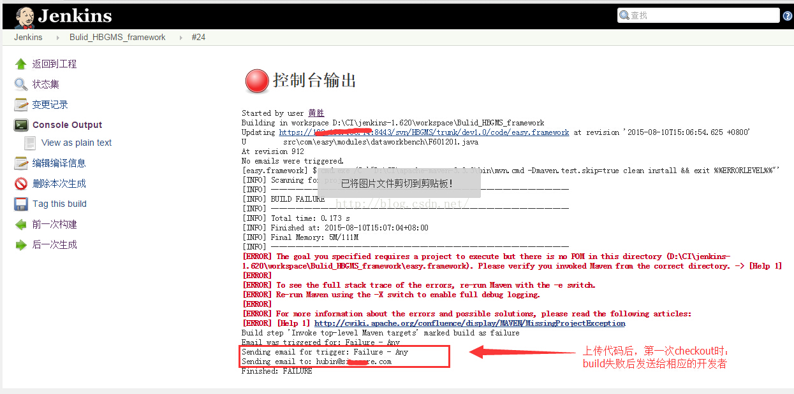

# Jenkins里邮件触发器配置Send to Developers

来源:[测试蜗牛，一步一个脚印](http://blog.csdn.net/hwhua1986/article/details/47975257)

## 邮件触发类型介绍（Triggers）
By default, the onlytrigger configured is the "Failure" trigger.  To add moretriggers, select one from the dropdown, and it will be added to the list. Once you have added a trigger, you have several options.  If you click "?"(question mark) next to a trigger, it will tell you what conditions must be metfor it to send an email.

* **Send to Recipient List（邮件发送给全局邮件列表配置的所有邮件地址）** - Check this checkbox if you would like to have the email sent to the "Global Recipient List" configured above.
* **Send to Developers（发送给开发，谁check in就发送给谁）** - Check this checkbox to send the email to anyone whochecked in code for the last build.  The plugin willgenerate an email address based on the committer's id and an appended "default email suffix" from Jenkins's global configuration page.  For instance, if a change was committed by someone with an id "first.last", and the default email suffix is "@somewhere.com", then an email will be sent to first.last@somewhere.com
* **Include Culprits（发送给所有提交代码的人，直到最后build成功）** - If this is checked AND Send To Developers is checked, emails will include everyone who committed since the last successful build.
* **More Configuration（更多设置）** - Configure properties at a per-trigger level.
* **Recipient List（邮件接收者）** - A comma（逗号） (and whitespace) separated list of email address that should receive this email if it is triggered.  This list is appended to the "Global Recipient List" above.
* **Subject（指定项目名称）** - Specify the subject line of the selected email.
* **Content（指定邮箱内容）** - Specify the body of the selected email.
* **Remove** - Click the delete button next to an email trigger to remove it from the configured triggers list.

Send to Developers（发送给开发，谁check in就发送给谁）配置介绍：

备注：

1、构建job中添加配置触发器

2、用户邮箱的配置，该开发者必须有自己的jenkins账户以及配置了邮箱

在Jenkins里面增加开发者账号

并且svn的账号和jenkins的ID保持一致

邮箱的合成：

* 从系统管理里面查看邮箱SMTP Server的后缀
* 从svn里面查看账号
* 最后合成的邮箱就是为：hubin@**.com

3、开发者上传了代码后，本机器第一次checkout，第二次就无法获取到最新代码更新者。

