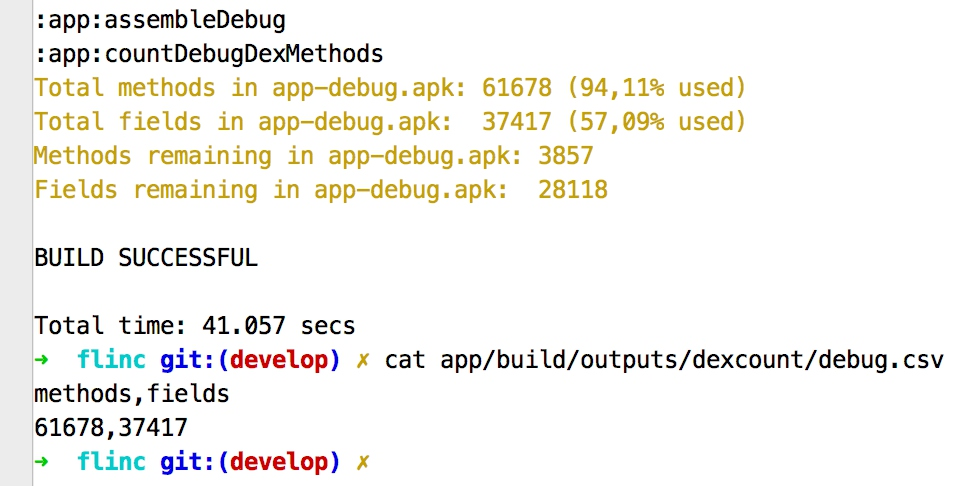
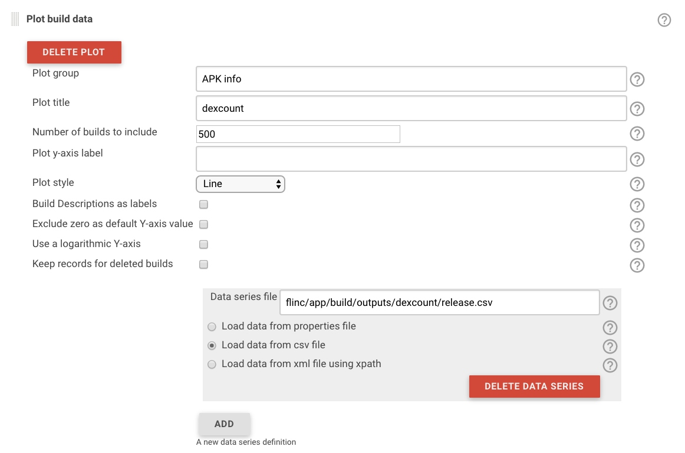
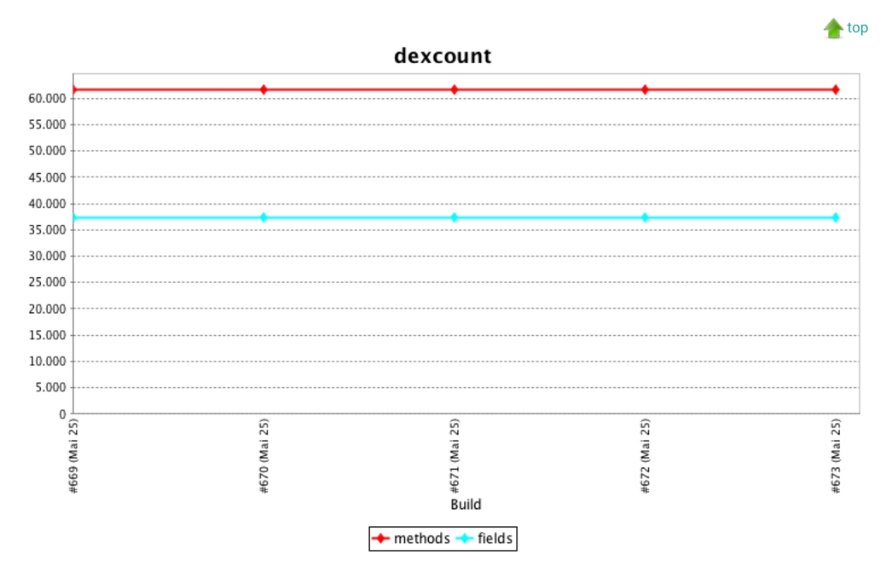
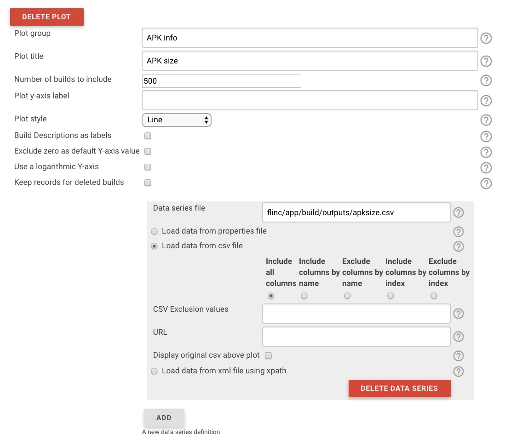

# Jenkins 集成 APK size 与 dexcount 趋势图

来源:[http://www.jianshu.com/p/c5c8528841eb#rd](http://www.jianshu.com/p/c5c8528841eb#rd)

[TOC]

> **声明：本文也在我的微信公众号 Android程序员(AndroidTrending) 发布。**
> 原文链接：[Android APK size + dexcount charts on Jenkins](https://medium.com/@mreichelt/android-apk-size-dexcount-charts-on-jenkins-ae518e961818)<br/>
> 原文作者：[Marc Reichelt](https://medium.com/@mreichelt)<br/>
> 译文出自：[汤涛的简书](http://www.jianshu.com/users/8397d05ad09f)<br/>
> 译者：汤涛<br/>
> 状态：完成<br/>
>
> 最近在 Android Weekly 上看到的一篇文章，感觉有些帮助，文章不长，就顺手翻译了一下。Jenkins 这个持续集成工具，我们一直在用，感觉不错，用好它能帮助我们解决很多问题，极大提高团队开发效率。

我们在 [flinc](https://flinc.org/) 为持续集成投入了大量的精力。为了改善 APK size 与 dex 中的方法/字段数，首先必须测量它。当我在 [Twitter 上提出这个问题](https://twitter.com/mreichelt/status/734776381872177152)时，有人告诉了我 [dexcount-gradle-plugin](https://github.com/KeepSafe/dexcount-gradle-plugin)，它使用起来非常容易：

top-level build.gradle

```
buildscript {
    repositories {
        jcenter()
    }

    dependencies {
        // other dependencies go here...
        classpath 'com.getkeepsafe.dexcount:dexcount-gradle-plugin:0.5.2'
    }
}
```

app/build.gradle

```
android {
    // your android block goes here
}
apply plugin: 'com.getkeepsafe.dexcount'
```

现在，如果编译你的工程，这个插件将会在每次 build 时，输出 dex 方法数与字段数。



以上已经非常有帮助了 :-)
如果你不用 Jenkins 的话，可以不用继续往下看了。

- - - - ----

接下来，让我们看看 Plot 这个 Jenkins 插件。给 Jenkins 安装 [Plot 插件](https://wiki.jenkins-ci.org/display/JENKINS/Plot+Plugin)，并为你的 build 配置它。



注意根据你的工程调整 CSV 文件路径，debug 与 release build 各有不同的文件名。如果准备就绪，在你的 build 任务里点击 Plots（注意应该先跑 1~2 次 build 任务），应该可以看到一个漂亮的图表。来看看我们现在有什么了？



现在让我们来看看 APK size，打开 Jenkins build 配置，在 build 的最后，加一小段脚本。

```
OUTFILE=flinc/app/build/outputs/apksize.csv
echo filesize > $OUTFILE
# yep, that's for Mac. Use "stat -c %s" instead on Linux
stat -f%z flinc/app/build/outputs/apk/app-release.apk >> $OUTFILE
```

同时添加新的 plot 变量：'Add Plot' 按钮 （ 不是 'Add' 按钮，这个也会被添加到同样的图表中）。注意我在 group 字段里，填写了与之前一样的 'APK info'。



让我们来看看最终效果吧：


超赞！

特别提示：为了更轻松地创建 plots, 你可以简单创建一个 free-style 类型的 Jenkins 任务，将指定的 .csv 文件复制到其 workspace, 并开始测试，分分钟就可以搞定。

希望这篇文章会帮助你更容易地跟踪各种优化的改进效果，包括：[APK 瘦身](https://www.youtube.com/watch?v=xctGIB81D2w)，[开启混淆](https://developer.android.com/studio/build/shrink-code.html)，[压缩图片](https://www.youtube.com/watch?v=r_LpCi6DQME)或者使用[矢量图片](https://medium.com/@chrisbanes/appcompat-v23-2-age-of-the-vectors-91cbafa87c88#.tdtw0u1mz)等。祝你玩得愉快！
