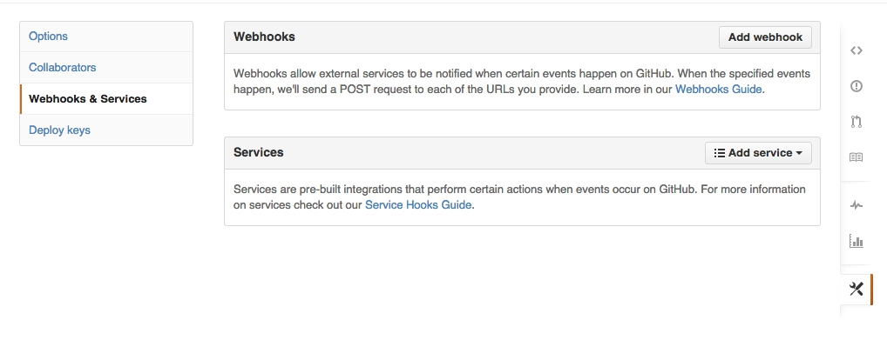

# Mac配置Jenkins

来源:[http://www.cnblogs.com/tangbinblog/p/3949078.html](http://www.cnblogs.com/tangbinblog/p/3949078.html)

[TOC]

## 关于 Jenkins

Jenkins 是一个开源软件项目，旨在提供一个开放易用的软件平台，使持续集成变成可能。

安装 Jenkins 并配置，
[http://linjunpop.logdown.com/posts/162202-set-up-jenkins-server-on-the-mac-mini-to-run-ios-tests](http://linjunpop.logdown.com/posts/162202-set-up-jenkins-server-on-the-mac-mini-to-run-ios-tests)

大致步骤也就是  安装Jenkins  创建job 根据配置的github 仓库地址，

然后jenkins 会在网站根目录下【jenkins 就是java 编写的网站应用程序，跨平台】 创建工作区，拉一份代码。调用你配置的build 脚本 构建项目。

里面提到了 **github pull request build **功能，其中涉及到 hooks 概念。 hooks 简单理解就是 回调或切面编程。如果你在一个有域名的机器上部署 jenkins 。那么你可以通过设置 在 github 对应仓库的

webhooks 对应地址 大致是这样的 ``http://你的域名：端口/github-webhook/  ``

github 在某个事件发生时【push pull delete】发送post 请求到你的jenkins 。jenkins 解析，然后调用你配置好的处理脚本或其他的什么操作。

这里有篇文章可以参考：[http://www.fancycoding.com/automatic-deploy-task-using-github-hooks/](http://www.fancycoding.com/automatic-deploy-task-using-github-hooks/)

 它仅仅是个平台 开源功能丰富。像这种构建也可以在服务器创建代码仓库，定期执行脚本，上传ipa 包，或其他操作。

 详细jenkins 入门参考：[http://www.cnblogs.com/ppinfo/p/3224643.html#_Toc357079428](http://www.cnblogs.com/ppinfo/p/3224643.html#_Toc357079428)