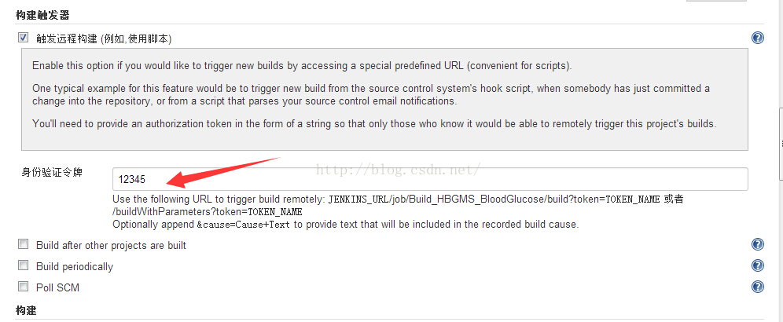

# jenkins 如何做到触发远程构建

来源:[测试蜗牛，一步一个脚印](http://blog.csdn.net/hwhua1986/article/details/48028581)

搭建好了jenkins环境，并且创建好了Job后，如何远程触发构建而不需要登录Jenkins管理系统。

很简单的几步就能搞定。步骤如下

1、选择“触发远程构建”->输入口令牌“123456”，如下图

2、组合url地址

jenkins地址/job/job名称/build??token=口令&cause=书写构建原因 ，如下是我的地址：

http://192.168.100.**:8080/job/Bulid_HBGMS_framework/build?token=123456&cause=书写构建原因 

3、发送构建请求，在浏览器中访问url

http://192.168.100.**:8080/job/Bulid_HBGMS_framework/build?token=123456&cause=书写构建原因 
如果不需要构建原因，则不需要cause，如下：

http://192.168.100.**:8080/job/Bulid_HBGMS_framework/build?token=123456

4、请求后浏览器不会有反应，后台收到请求开始构建。
