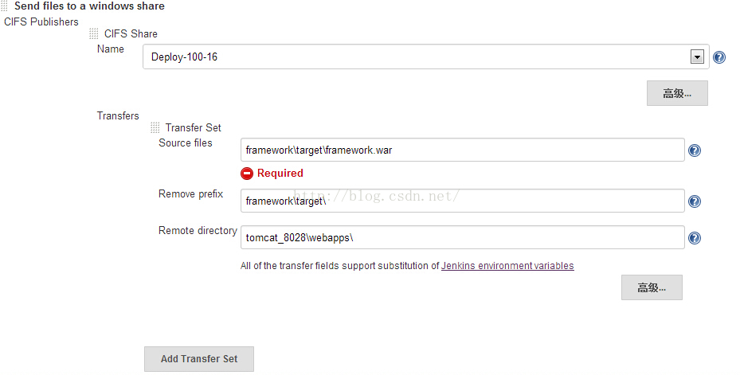
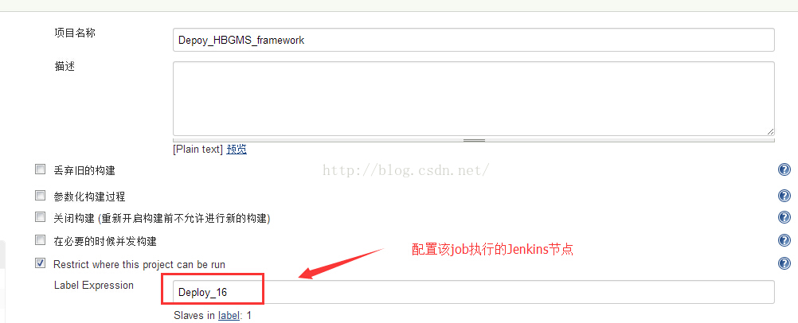
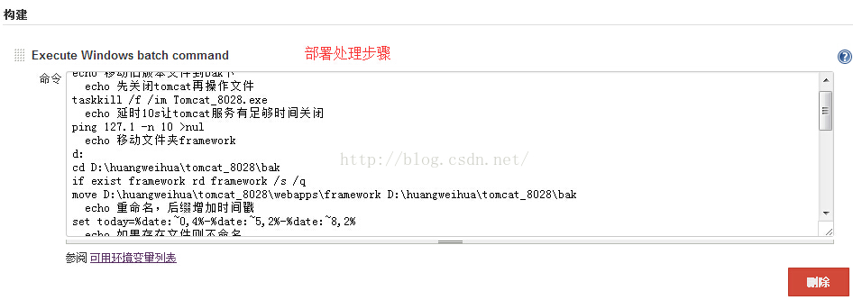

# jenkins里面使用批处理命令进行自动部署

来源：[测试蜗牛，一步一个脚印](http://blog.csdn.net/hwhua1986/article/details/47974047)

说明：

> 自动构建Job在服务器1上<br/>
> 自动部署Job在服务器2上<br/>
> 版本部署服务器在服务器2上<br/>


1、自动构建Job（服务器1）使用批处理命令，拷贝构建包到发布目录，用以从邮件的超级链接中获取版本包

```
@echo off

echo 包重命名

d:

cd D:\CI\jenkins-1.620\workspace\Old_Bulid_HBGMS_framework\framework\target\

rename framework-1.0-SNAPSHOT.war framework.war


echo 拷贝版本包到版本下载目录

ehco 拷贝

xcopy D:\CI\jenkins-1.620\workspace\Old_Bulid_HBGMS_framework\framework\target\framework.war 
	"D:\CI\jenkins-1.620\workspace\Build_History\Old_Bulid_HBGMS_framework\Build_%BUILD_NUMBER%_framework\" /y

echo 拷贝结束


echo 将构建包拷贝到deploy的目录下

  echo 先清空deploy下面的版本包

d:

cd D:\CI\jenkins-1.620\workspace\Old_Depoy_HBGMS_framework

if exist framework rd framework /s /q
  echo 拷贝到deploy目录下
xcopy D:\CI\jenkins-1.620\workspace\Old_Bulid_HBGMS_framework\framework
	\target\framework.war D:\CI\jenkins-1.620\workspace
	\Old_Depoy_HBGMS_framework\framework\ /y

echo 拷贝结束
```

2、自动构建Job（服务器1）使用Send files to a windows share（需要安装插件CIFS Publishers）把版本包拷贝到版本部署服务器（服务器2）



3、自动部署job（服务器2）里面使用批处理命令进行老版本包的备份、配置文件替换、tomcat服务重启






```
@echo off
echo 包重命名
d:
cd D:\CI\jenkins-1.620\workspace\Old_Bulid_HBGMS_framework\framework\target\
rename framework-1.0-SNAPSHOT.war framework.war


echo 拷贝版本包到版本下载目录
  ehco 拷贝
xcopy D:\CI\jenkins-1.620\workspace\Old_Bulid_HBGMS_framework\framework\target\framework.war 
"D:\CI\jenkins-1.620\workspace\Build_History
	\Old_Bulid_HBGMS_framework\Build_%BUILD_NUMBER%_framework\" /y
echo 拷贝结束


echo 将构建包拷贝到deploy的目录下
  echo 先清空deploy下面的版本包
d:
cd D:\CI\jenkins-1.620\workspace\Old_Depoy_HBGMS_framework
if exist framework rd framework /s /q
  echo 拷贝到deploy目录下
xcopy D:\CI\jenkins-1.620\workspace\Old_Bulid_HBGMS_framework\framework
	\target\framework.war D:\CI\jenkins-1.620\workspace
		\Old_Depoy_HBGMS_framework\framework\ /y
echo 拷贝结束
```
