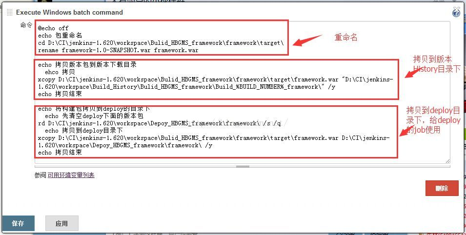
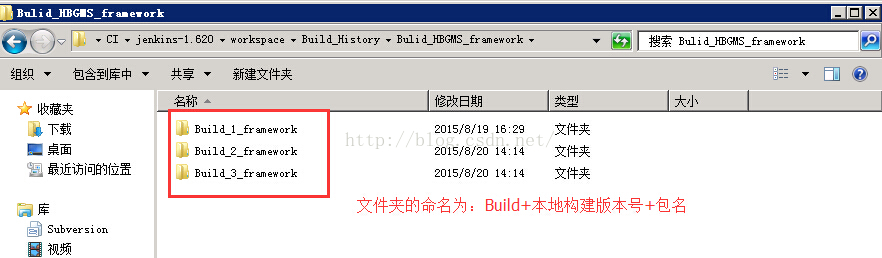
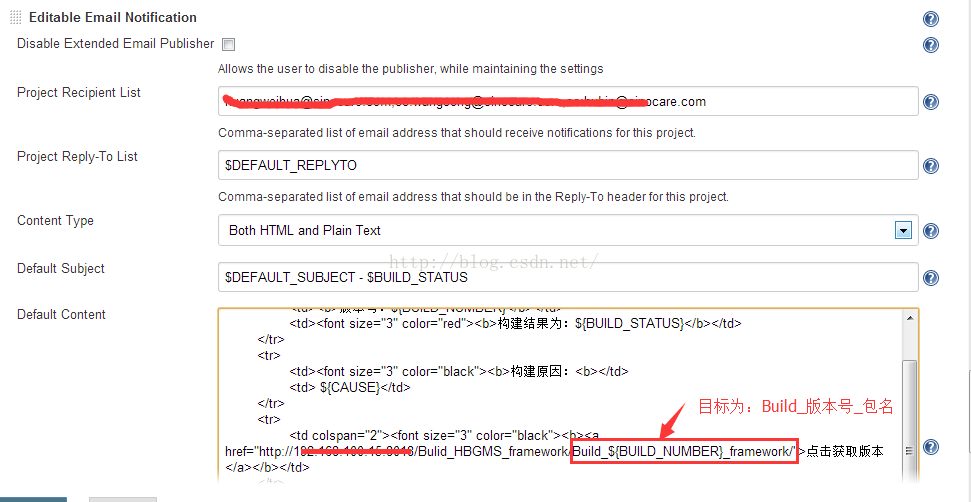
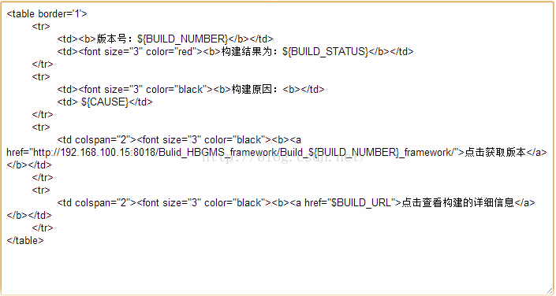

#  如何在Jenkins发送的构建邮件中提供版本包的下载

来源:[测试蜗牛，一步一个脚印](http://blog.csdn.net/hwhua1986/article/details/47807097)

1、首先每次构建都将版本包放到一个目录下存储下来，如使用批处理命令将Maven打包的war包拷贝到History文件夹下存储。

在Job中增加批处理命令：

History目录结构如下：

2、将文件夹Build_History文件夹发布

  参考文章《如何发布版本包远程下载》。我使用的是IIS站点发布功能。

3、在邮件中增加版本地址超级链接

邮件的代码为如下：

