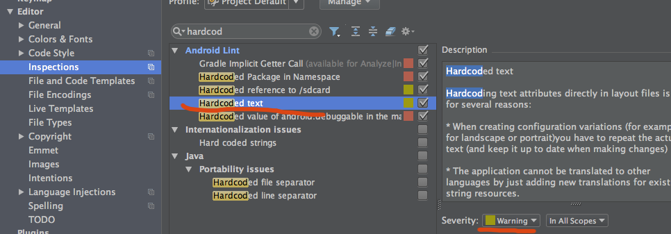
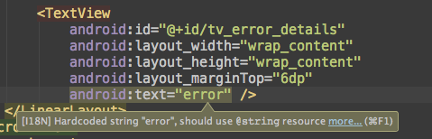
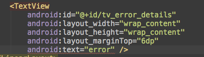
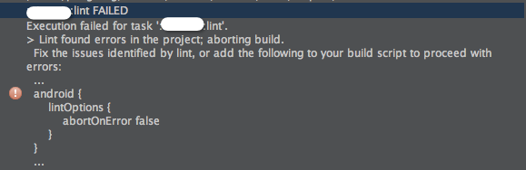
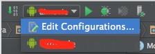
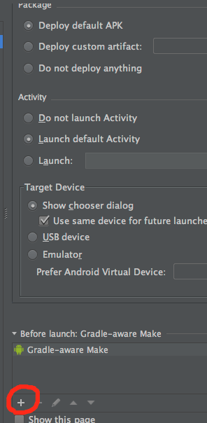
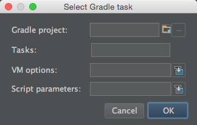

# AndroidStudio & lint 代码检查设置

来源:[简书:楚云之南](http://www.jianshu.com/p/ba1ce1c1ae39)


*AndroidStuido*作为google官方推荐的Android开发IDE，提供了一整套强大的静态代码分析工具，使用它们可以很好地帮助我们进行更加规范的开发。从一个常见的场景入手吧。

几乎所有的开发团队的代码规范里面都有这么一条：不允许在布局文件中进行`hardcode`，原因参加见：[stackoverflow](http://stackoverflow.com/questions/8743349/hardcoded-string-row-three-should-use-string-resource)

为了达到上面的目的，我们可以通过设置AS的`code inspections`来设置静态代码检查的规则,找到hardcode的配置：



可以看到默认的`hardcode`配置的`severity`是警告，所以我们在xml中直接写字符串时，将光标放到去可以看到警告提示：



但是这个提示也太弱了吧，我们将'severity'提升到error试试：



**注意，提升这个地方的等级不会对代码和其他静态分析工具如lint产生影响，也不会对运行产生影响，它的作用域仅仅是IDE展示**

同样的，我们还可以设置很多其他的IDE静态代码检查，通过改变其severity达到更直观提示的作用，可以让开发者有一个直观的认识，哪些代码是合法但不合规的。如果有人不按照这个约束进行开发，那么代码中到处都是红色的错误(额，希望他不是个处女座..)。如果说通过IDE的code inspections是进行自律的话(实际上这个配置也是个人的行为)，那么Android提供的另外一个静态代码工具lint就是一种对别人的约束了。

lint是Android提供的一个静态代码检查的工具，我们可以在gradle的构建task中加入link检查。具体的使用请移步到goole文档。link能够检查的东西很多，参考 [所有check issue](http://tools.android.com/tips/lint-checks)。

还是上面的场景，如果我的需求是代码中存在hardcode,那么所有人的代码都编译不通过(现实中不可能这么变态)。

lint工具可以通过一个xml文件来配置，它可以用来修改某些check issue是否忽略(典型的例子是第三方库里面存在问题)，同时可以修改某些issue的默认等级。

**HardcodedText**的默认等级是警告，我们升级成error，并在配置文件中增加

```
lintOptions {
	lintConfig file("lint.xml")
	abortOnError true
}
```

，这样在我们构建项目的时候如果发生错误，将直接中断构建。



需要注意的是，点击AS上面的绿色的运行按钮是不会触发lint检查的，如果你想每次点击运行都进行lint检查，可以如下设置：





添加 run gradle task



task填lint即可，这样在点击AS上的运行时，会自动执行lint，不过这样会导致每次运行时都会变慢。