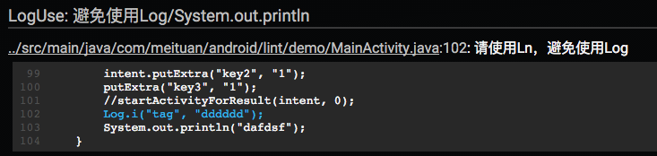
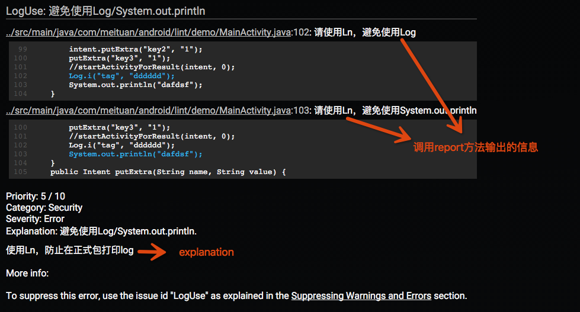

# Android自定义Lint实践

来源:[tech.meituan.com](http://tech.meituan.com/android_custom_lint.html)

## 概述
Android Lint是Google提供给Android开发者的静态代码检查工具。使用Lint对Android工程代码进行扫描和检查，可以发现代码潜在的问题，提醒程序员及早修正。

为保证代码质量，美团在开发流程中加入了代码检查，如果代码检测到问题，则无法合并到正式分支中，这些检查中就包括Lint。

## 为什么需要自定义
我们在实际使用Lint中遇到了以下问题：

* 原生Lint无法满足我们团队特有的需求，例如：编码规范。
* 原生Lint存在一些检测缺陷或者缺少一些我们认为有必要的检测。

基于上面的考虑，我们开始调研并开发自定义Lint。

## 自定义Lint入门

在介绍美团的实践之前，先用一个小例子，来看看如何进行自定义Lint。

### 示例介绍

开发中我们希望开发者使用RoboGuice的Ln替代`Log/System.out.println`。

[Ln](https://github.com/roboguice/roboguice/wiki/Logging-via-Ln)相比于Log有以下优势：

* 对于正式发布包来说，debug和verbose的日志会自动不显示。
* 拥有更多的有用信息，包括应用程序名字、日志的文件和行信息、时间戳、线程等。
* 由于使用了可变参数，禁用后日志的性能比Log高。因为最冗长的日志往往都是debug或verbose日志，这可以稍微提高一些性能。
* 可以覆盖日志的写入位置和格式。

这里我们以此为例，让Lint检查代码中Log/System.out.println的调用，提醒开发者使用Ln。

### 创建Java工程，配置Gradle

```
apply plugin: 'java'

dependencies {
    compile fileTree(dir: 'libs', include: ['*.jar'])
    compile 'com.android.tools.lint:lint-api:24.5.0'
    compile 'com.android.tools.lint:lint-checks:24.5.0'
}
```

注：

* **lint-api:** 官方给出的API，API并不是最终版，官方提醒随时有可能会更改API接口。
* **lint-checks：**已有的检查。

### 创建Detector

Detector负责扫描代码，发现问题并报告。

```
/**
 * 避免使用Log / System.out.println ,提醒使用Ln
 *
 * RoboGuice's Ln logger is similar to Log, but has the following advantages:
 *     - Debug and verbose logging are automatically disabled for release builds.
 *     - Your app name, file and line of the log message, time stamp, thread, and other useful information is automatically logged for you. (Some of this information is disabled for release builds to improve performance).
 *     - Performance of disabled logging is faster than Log due to the use of the varargs. Since your most expensive logging will often be debug or verbose logging, this can lead to a minor performance win.
 *     - You can override where the logs are written to and the format of the logging.
 * 
 * https://github.com/roboguice/roboguice/wiki/Logging-via-Ln
 *
 * Created by chentong on 18/9/15.
 */
public class LogDetector extends Detector implements Detector.JavaScanner{

    public static final Issue ISSUE = Issue.create(
            "LogUse",
            "避免使用Log/System.out.println",
            "使用Ln，防止在正式包打印log",
            Category.SECURITY, 5, Severity.ERROR,
            new Implementation(LogDetector.class, Scope.JAVA_FILE_SCOPE));

    @Override
    public List<Class<? extends Node>> getApplicableNodeTypes() {
        return Collections.<Class<? extends Node>>singletonList(MethodInvocation.class);
    }

    @Override
    public AstVisitor createJavaVisitor(final JavaContext context) {
        return new ForwardingAstVisitor() {
            @Override
            public boolean visitMethodInvocation(MethodInvocation node) {

                if (node.toString().startsWith("System.out.println")) {
                    context.report(ISSUE, node, context.getLocation(node),
                                       "请使用Ln，避免使用System.out.println");
                    return true;
                }

                JavaParser.ResolvedNode resolve = context.resolve(node);
                if (resolve instanceof JavaParser.ResolvedMethod) {
                    JavaParser.ResolvedMethod method = (JavaParser.ResolvedMethod) resolve;
                    // 方法所在的类校验
                    JavaParser.ResolvedClass containingClass = method.getContainingClass();
                    if (containingClass.matches("android.util.Log")) {
                        context.report(ISSUE, node, context.getLocation(node),
                                       "请使用Ln，避免使用Log");
                        return true;
                    }
                }
                return super.visitMethodInvocation(node);
            }
        };
    }
}
```

可以看到这个Detector继承Detector类，然后实现Scanner接口。

自定义Detector可以实现一个或多个Scanner接口,选择实现哪种接口取决于你想要的扫描范围

* Detector.XmlScanner
* Detector.JavaScanner
* Detector.ClassScanner
* Detector.BinaryResourceScanner
* Detector.ResourceFolderScanner
* Detector.GradleScanner
* Detector.OtherFileScanner

这里因为我们是要针对Java代码扫描，所以选择使用JavaScanner。

代码中getApplicableNodeTypes方法决定了什么样的类型能够被检测到。这里我们想看Log以及println的方法调用，选取MethodInvocation。对应的，我们在createJavaVisitor创建一个ForwardingAstVisitor通过visitMethodInvocation方法来接收被检测到的Node。

可以看到getApplicableNodeTypes返回值是一个List，也就是说可以同时检测多种类型的节点来帮助精确定位到代码，对应的ForwardingAstVisitor接受返回值进行逻辑判断就可以了。

可以看到JavaScanner中还有其他很多方法，getApplicableMethodNames（指定方法名）、visitMethod（接收检测到的方法），这种对于直接找寻方法名的场景会更方便。当然这种场景我们用最基础的方式也可以完成，只是比较繁琐。

### 那么其他Scanner如何去写呢？

可以去查看各接口中的方法去实现，一般都是有这两种对应：什么样的类型需要返回、接收发现的类型。

这里插一句，Lint是如何实现Java扫描分析的呢？Lint使用了[Lombok](https://github.com/tnorbye/lombok.ast)做抽象语法树的分析。所以在我们告诉它需要什么类型后，它就会把相应的Node返回给我们。

回到示例，当接收到返回的Node之后需要进行判断，如果调用方法是System.out.println或者属于android.util.Log类，则调用context.report上报。

```
context.report(ISSUE, node, context.getLocation(node), "请使用Ln，避免使用Log");
```

* 第一个参数是Issue，这个之后会讲到；
* 第二个参数是当前节点；
* 第三个参数location会返回当前的位置信息，便于在报告中显示定位；

最后的字符串用来为警告添加解释。对应报告中的位置如下图：



这里还需要说明report会自动处理被suppress(suppressLint)/ignore(tools:ignore)的警告。所以发现问题直接调用report就可以，不用担心其他问题。

### Issue

Issue由Detector发现并报告，是Android程序代码可能存在的bug。

```
public static final Issue ISSUE = Issue.create(
        "LogUse",
        "避免使用Log/System.out.println",
        "使用Ln，防止在正式包打印log",
        Category.SECURITY, 5, Severity.ERROR,
        new Implementation(LogDetector.class, Scope.JAVA_FILE_SCOPE));
```

声明为final class，由静态工厂方法创建。对应参数解释如下：

* id : 唯一值，应该能简短描述当前问题。利用Java注解或者XML属性进行屏蔽时，使用的就是这个id。
* summary : 简短的总结，通常5-6个字符，描述问题而不是修复措施。
* explanation : 完整的问题解释和修复建议。
* category : 问题类别。详见下文详述部分。
* priority : 优先级。1-10的数字，10为最重要/最严重。
* severity : 严重级别：Fatal, Error, Warning, Informational, Ignore。
* Implementation : 为Issue和Detector提供映射关系，Detector就是当前Detector。声明扫描检测的范围Scope，Scope用来描述Detector需要分析时需要考虑的文件集，包括：Resource文件或目录、Java文件、Class文件。

### 与Lint HTML报告对应关系




### Category详述

系统现在已有的类别如下：

* Lint
* Correctness (incl. Messages)
* Security
* Performance
* Usability (incl. Icons, Typography)
* Accessibility
* Internationalization
* Bi-directional text

#### 自定义Category

```
public class MTCategory {
    public static final Category NAMING_CONVENTION = Category.create("命名规范", 101);
}
```

### 使用

```
public static final Issue ISSUE = Issue.create(
        "IntentExtraKey",
        "intent extra key 命名不规范",
        "请在接受此参数中的Activity中定义一个按照EXTRA_<name>格式命名的常量",
        MTCategory.NAMING_CONVENTION , 5, Severity.ERROR,
        new Implementation(IntentExtraKeyDetector.class, Scope.JAVA_FILE_SCOPE));
```

### IssueRegistry

提供需要被检测的Issue列表

```
public class MTIssueRegistry extends IssueRegistry {
    @Override
    public synchronized List<Issue> getIssues() {
        System.out.println("==== MT lint start ====");
        return Arrays.asList(
                DuplicatedActivityIntentFilterDetector.ISSUE,
                //IntentExtraKeyDetector.ISSUE,
                //FragmentArgumentsKeyDetector.ISSUE,
                LogDetector.ISSUE,
                PrivateModeDetector.ISSUE,
                WebViewSafeDetector.ON_RECEIVED_SSL_ERROR,
                WebViewSafeDetector.SET_SAVE_PASSWORD,
                WebViewSafeDetector.SET_ALLOW_FILE_ACCESS,
                WebViewSafeDetector.WEB_VIEW_USE,
                HashMapForJDK7Detector.ISSUE
        );
    }
}
```

在getIssues()方法中返回需要被检测的Issue List。

在build.grade中声明Lint-Registry属性

```
jar {
    manifest {
        attributes("Lint-Registry": "com.meituan.android.lint.core.MTIssueRegistry")
    }
}
```

至此，自定义Lint的编码部分就完成了。

之前提到自定义Lint是一个Java工程，那么打出的jar包如何使用呢？

## jar包使用
### Google方案

将jar拷贝到~/.android/lint中

```
$ mkdir ~/.android/lint/
$ cp customrule.jar ~/.android/lint/
```

缺点：针对所有工程，会影响同一台机器其他工程的Lint检查。即便触发工程时拷贝过去，执行完删除，但其他进程或线程使用`./gradlew lint`仍可能会受到影响。

### LinkedIn方案

LinkedIn提供了另一种思路 : 将jar放到一个aar中。这样我们就可以针对工程进行自定义Lint，lint.jar只对当前工程有效。

详细介绍请看LinkedIn博客： [Writing Custom Lint Checks with Gradle](https://engineering.linkedin.com/android/writing-custom-lint-checks-gradle)。

我们对此方案进行调研，得出以下结论：

#### 可行性

[AAR Format](http://tools.android.com/tech-docs/new-build-system/aar-format) 中写明可以有lint.jar。

从Google Groups adt-dev论坛讨论来看是官方目前的推荐方案，详见：[Specify custom lint JAR outside of lint tools settings directory](https://groups.google.com/forum/#!topic/adt-dev/seWAK5r1fjI)

测试后发现aar中有lint.jar ，最终APK中并不会引起包体积变化。

#### 缺点

官方plugin偶尔出bug，给人一种不太重视的感觉。

目前plugin的支持情况是：1.1.x正常，1.2.x不支持，1.3.x修复问题，1.5.x正常。

1.2.x Gradle plugin遇到的两个问题：

* [Issue 174808:custom lint in AAR doesn’t work](https://code.google.com/p/android/issues/detail?id=174808)
* [Issue 178699:lint.jar in AAR doesn’t work sometimes](https://code.google.com/p/android/issues/detail?id=178699)

经过对比，我们最终选择了LinkedIn的方案。

## 美团的实践

在确定方案后，我们为Lint增加了很多功能，包括编码规范和原生Lint增强。这里以HashMap检测为例，介绍一下美团Lint。

### 增强HashMap检测

Lint检测中有一项是Java性能检测，常见的就是：HashMap can be replaced with SparseArray。

```
public static void testHashMap() {
    HashMap<Integer, String> map1 = new HashMap<Integer, String>();
    map1.put(1, "name");
    HashMap<Integer, String> map2 = new HashMap<>();
    map2.put(1, "name");
    Map<Integer, String> map3 = new HashMap<>();
    map3.put(1, "name");
}
```

对于上述代码，原生Lint只能检测第一种情况，JDK 7泛型新写法还检测不到。

了解到这点之后，我们决定为HashMap提供增强检测。

分析源码后发现，HashMap检测是根据new HashMap处的泛型来判断是否符合条件。

于是我们想到，在发现new HashMap后去找前面的泛型，因为本身Java就是靠类型推断的，我们可以直接根据前面的泛型来确定是否使用SparseArray。当然，是不是HashMap还需要通过后面的new HashMap来判断，否则容易出现问题。

代码如下：

```
@Override
public List<Class<? extends Node>> getApplicableNodeTypes() {
    return Collections.<Class<? extends Node>>singletonList(ConstructorInvocation.class);
}

private static final String INTEGER = "Integer";                        //$NON-NLS-1$
private static final String BOOLEAN = "Boolean";                        //$NON-NLS-1$
private static final String BYTE = "Byte";                              //$NON-NLS-1$
private static final String LONG = "Long";                              //$NON-NLS-1$
private static final String HASH_MAP = "HashMap";                       //$NON-NLS-1$

@Override
public AstVisitor createJavaVisitor(@NonNull JavaContext context) {
    return new ForwardingAstVisitor() {

        @Override
        public boolean visitConstructorInvocation(ConstructorInvocation node) {
            TypeReference reference = node.astTypeReference();
            String typeName = reference.astParts().last().astIdentifier().astValue();
            // TODO: Should we handle factory method constructions of HashMaps as well,
            // e.g. via Guava? This is a bit trickier since we need to infer the type
            // arguments from the calling context.
            if (typeName.equals(HASH_MAP)) {
                checkHashMap(context, node, reference);
            }
            return super.visitConstructorInvocation(node);
        }
    };
}

/**
 * Checks whether the given constructor call and type reference refers
 * to a HashMap constructor call that is eligible for replacement by a
 * SparseArray call instead
 */
private void checkHashMap(JavaContext context, ConstructorInvocation node, TypeReference reference) {
    StrictListAccessor<TypeReference, TypeReference> types = reference.getTypeArguments();
    if (types == null || types.size() != 2) {
        /*
        JDK 7 新写法
        HashMap<Integer, String> map2 = new HashMap<>();
        map2.put(1, "name");
        Map<Integer, String> map3 = new HashMap<>();
        map3.put(1, "name");
         */

        Node variableDefinition = node.getParent().getParent();
        if (variableDefinition instanceof VariableDefinition) {
            TypeReference typeReference = ((VariableDefinition) variableDefinition).astTypeReference();
            checkCore(context, variableDefinition, typeReference);// 此方法即原HashMap检测逻辑
        }

    }
    // else --> lint本身已经检测
}
```

代码很简单，总体就是获取变量定义的地方，将泛型值传入原先的检测逻辑。

当然这里的增强也是有局限的，比如这个变量是成员变量，向前的推断就会有问题，这点我们还在持续的优化中。

总结一下实践过程中的技巧：

* 因为没有好的文档，我们更多地是要从源码的检测中学习，多看lint-checks。
* 需要的时候使用SdkConstants，充分利用LintUtils，Lint给我们提供了很多方便的工具。

### 为自定义Lint开发plugin

aar虽然很方便，但是在团队内部推广中我们遇到了以下问题：

* 配置繁琐，不易推广。每个库都需要自行配置lint.xml、lintOptions，并且compile aar。
* 不易统一。各库之间需要使用相同的配置，保证代码质量。但现在手动来回拷贝规则，且配置文件可以自己修改。

于是我们想到开发一个plugin，统一管理lint.xml和lintOptions，自动添加aar。

### 统一lint.xml

我们在plugin中内置lint.xml，执行前拷贝过去，执行完成后删除。

```
lintTask.doFirst {

    if (lintFile.exists()) {
        lintOldFile = project.file("lintOld.xml")
        lintFile.renameTo(lintOldFile)
    }
    def isLintXmlReady = copyLintXml(project, lintFile)

    if (!isLintXmlReady) {
        if (lintOldFile != null) {
            lintOldFile.renameTo(lintFile)
        }
        throw new GradleException("lint.xml不存在")
    }

}

project.gradle.taskGraph.afterTask { task, TaskState state ->
    if (task == lintTask) {
        lintFile.delete()
        if (lintOldFile != null) {
            lintOldFile.renameTo(lintFile)
        }
    }
}
```

### 统一lintOptions

Android plugin在1.3以后允许我们替换Lint Task的lintOptions:

```
def newOptions = new LintOptions()
newOptions.lintConfig = lintFile
newOptions.warningsAsErrors = true
newOptions.abortOnError = true
newOptions.htmlReport = true
//不放在build下，防止被clean掉
newOptions.htmlOutput = project.file("${project.projectDir}/lint-report/lint-report.html")
newOptions.xmlReport = false

lintTask.lintOptions = newOptions
```

### 自动添加最新aar
这里还涉及一个问题：当我们plugin开发完成提供给团队使用的时候，假设我们需要修改lint aar，那么团队的plugin就要统一升级。这点就比较繁琐。

考虑到plugin只是一个检查代码插件，它最需要的应该是实时更新。 我们引入了Gradle Dynamic Versions：

```
project.dependencies {
    compile 'com.meituan.android.lint:lint:latest.integration'
}

project.configurations.all {
    resolutionStrategy.cacheDynamicVersionsFor 0, 'seconds'
}
````

plugin开发完成，就可以提供给团队部署了。

当然为了团队更方便地接入检查，我们在检查流程中内置了脚本来自动添加plugin，这样团队就可以在不添加任何代码的情况下，实现自定义Lint检查。

## 参考文献
* Google. [Writing Custom Lint Rules](http://tools.android.com/tips/lint-custom-rules). Android Tools Project Site.
* Google. [Writing a Lint Check](http://tools.android.com/tips/lint/writing-a-lint-check). Android Tools Project Site.
* Prengemann M. [The Power of Custom Lint Checks](https://speakerdeck.com/winterdroid/the-power-of-custom-lint-checks). SpeakerDeck.
* Diermann A. [Custom Lint Rules](https://github.com/a11n/lint-workshop-slides). GitHub.
* Diermann A. [Android Lint API Reference Guide](https://github.com/a11n/android-lint). GitHub.
* Google. [Android Custom Lint Rules Sample Code](https://github.com/googlesamples/android-custom-lint-rules). GitHub.
* Cheng Yang. [Writing Custom Lint Checks with Gradle](https://engineering.linkedin.com/android/writing-custom-lint-checks-gradle). LinkedIn.

