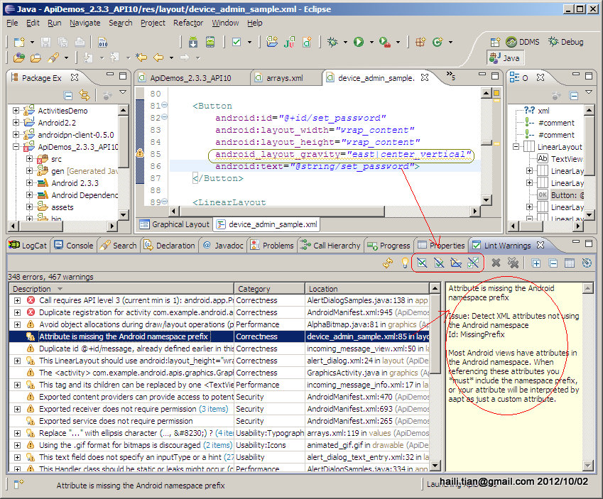
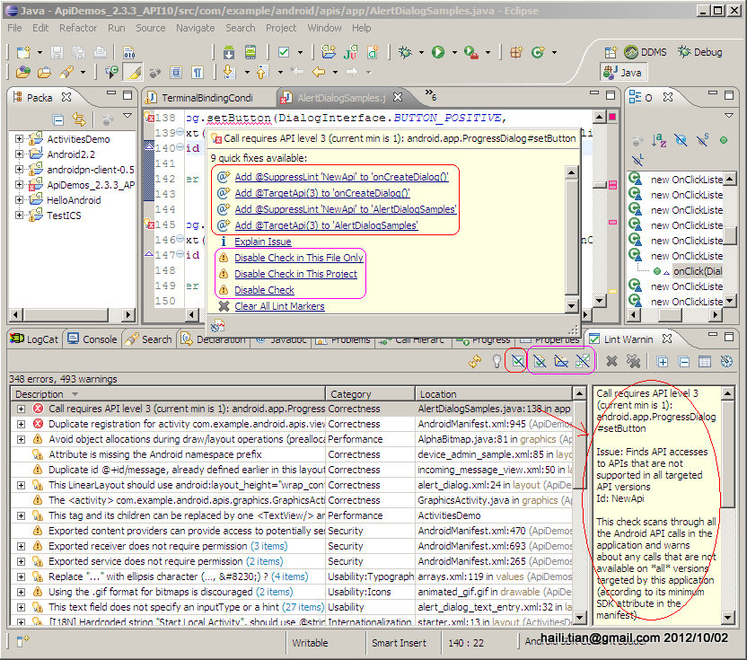

# 定制Android-Lint检查问题的现有规则

来源:[CSDN](http://blog.csdn.net/thl789/article/details/8036066)

对Android-Lint发现的问题，我们需要进一步的处理：是确实存在的我们自己的设计问题，要解决它；对无关紧要或者是我们特别设计的问题，要在Android-Lint中忽略掉。要解决的问题需要具体问题具体分析，本文主要讲解在Eclipse环境和命令行下，如何忽略掉Android-Lint中检查出的问题，并在此基础上，根据项目的需要定制Android-Lint检查问题的规则。

## Android-Lint相关的文章：
* [Android-Lint：查错与代码优化利器](http://blog.csdn.net/thl789/article/details/8037473)

Android-Lint的简述：Lint检查哪些问题；如何使用；有哪些选项；与其他系统集成。

* [定制Android-Lint检查问题的现有规则](http://blog.csdn.net/thl789/article/details/8036066)

对Android-Lint发现的问题进行处理。可定制项目中采用的规则。

* [Android-Lint检查问题列表](http://blog.csdn.net/thl789/article/details/8037333)

Android SDK Tools / ADT 20.0.3中所支持的默认检查的所有问题。

有[英文版本](http://blog.csdn.net/thl789/article/details/8037306)和[中文版本](http://blog.csdn.net/thl789/article/details/8037333)。[英文版本](http://blog.csdn.net/thl789/article/details/8037306)从Android-Lint中直接导出；[中文版本](http://blog.csdn.net/thl789/article/details/8037333)还不完整，对每一条的解释会逐步完善。
 
当然，最关键最权威的还是应该看官方网站：[http://tools.android.com/tips/lint](http://tools.android.com/tips/lint)

 
Android SDK自带的APIDemo用Android-Lint检查一下，也还报了很多的问题。

## 一、忽略XML文件中的问题
 
### 1.1 MissingPrefix问题
 
Layout的device_admin_sample.xml文件中定义了下面的Button

```
<Button  
    android:id="@+id/set_password"  
    android:layout_width="wrap_content"  
    android:layout_height="wrap_content"  
    android_layout_gravity="east|center_vertical"  
    android:text="@string/set_password">  
</Button>  
```

执行Android-Lint就会报MissingPrefix警告：



### 1.2 解决XML中的问题
 
可以在Lint Warnings View中解决（图中图标从左至右顺序）
 
#### Android-Lint ignore this Suppress this error with an annotation/attribute

点击该图标之后，直接更改了device_admin_sample.xml文件：

```
<Button  
    android:id="@+id/set_password"  
    android:layout_width="wrap_content"  
    android:layout_height="wrap_content"  
    android_layout_gravity="east|center_vertical"  
    android:text="@string/set_password"  
    tools:ignore="MissingPrefix" >  
</Button>  
```

XML文件中直接增加了tools:ignore="***MissingPrefix***"。

#### Android-Lint ignore file Ignore in this file

在本文件中忽略，而在别的文件中仍然出现。
 
#### Android-Lint ignore project Ignore in this project

当前项目中都忽略该Issue。

执行之后，在本项目根目录下创建了lint.xml的文件，内容为：

```
<?xml version="1.0"encoding="UTF-8"?>  
<lint>  
    <issue id="MissingPrefix"severity="ignore" />  
</lint> 
```

#### Android-Lint ignore all Always ignore

所有项目中都忽略。
 
* [TIPS#1]  Android-Lint ignore project Ignore in this project和 Android-Lint ignore all Always ignore操作，同执行Lint Warnings View中的最后一个Icon -- Android-Lint Options Options…，然后配置某一个项目或者全局设置中该Issue的Severity为ignore。
* [TIPS#2] Eclipse中的实现有BUG，有时设置了这些Ignore操作，即便立即执行检查也不一定生效，需要重启Eclipse。

## 二、解决Java代码中的问题
 
### 2.1 NewAPI问题  
 
APIDemo中指明了支持最低API-1，但是代码里却用了API-3的接口，执行Lint会报错：



### 2.2 解决问题
 
把光标放在报错代码处，会自动提示如何快速fix。

* 1.前面红色圆角框内是用Javaannotation方式解决（API-16之后才有）：@SuppressLint‘<IssueId>’或@TargetAPI(<api>)

* @SuppressLint ‘<IssueId>’用来忽略<IssueId>。适用范围在所调用的方法处或整个类中。
* @TargetAPI(<api>)用来指示API用给定的<api>，而不是项目中指定的。适用范围在所调用的方法处或整个类中。

* 2.后面粉红色圆角框内同[XML中解决方式—](http://blog.csdn.net/thl789/article/details/8036066#t2)—在Android-Lint ignore file本文件/ Android-Lint ignore project本项目/ Android-Lint ignore all全局范围内忽略检查。
 
## 三、命令行下解决问题
 
从上面Eclipse环境下的解决问题的方式知道，可以指定文件来定制Lint检查Issue的处理方式。

下面是一个lint.xml的例子：

```
<?xml version="1.0" encoding="UTF-8"?>  
<lint>  
    <!-- Disable the given check in thisproject -->  
    <issue id="IconMissingDensityFolder" severity="ignore" />  
   
    <!-- Ignore the ObsoleteLayoutParamissue in the given files -->  
    <issue id="ObsoleteLayoutParam">  
        <ignore path="res/layout/activation.xml" />  
        <ignore path="res/layout-xlarge/activation.xml" />  
    </issue>  
   
    <!-- Ignore the UselessLeaf issue inthe given file -->  
    <issue id="UselessLeaf">  
        <ignore path="res/layout/main.xml" />  
    </issue>  
   
    <!-- Change the severity of hardcodedstrings to "error" -->  
    <issue id="HardcodedText" severity="error" />  
</lint>  
```

Lint.xml中关键是对issue（用id指定）的severity进行指定，并且可以指定该issue作用于指定的文件还是当前项目。
 
把lint.xml放在项目的根目录中，命令行执行lint时候，lint就会用lint.xml中的规则。

另外，执行lint时还可以用参数--config<fileName>指定一个全局的配置用于所有的项目。当项目中已有lint.xml，则对于某个issue而言，在lint.xml中没有对该issue特别定制的情况下，--config指定的文件<fileName>中的该issue的定制才起作用。

## 四、定制Lint检查的规则
 
Android-Lint有默认的检查和报错的规则，但通过上面的分析知道，可以在Eclipse或者命令行下改变这种规则，从而可以定制Lint检查的规则。

推荐定制的路线：

* 在Eclipse中基于现有的问题，逐个分析并解决，然后我们就能得到一个Eclipse自动生成的lint.xml这个定制文件；
* 然后这个lint.xml用于Eclipse和/或命令行下进行后续的检查；
* 后续发现的问题再进一步处理，逐步完善lint.xml这个定制文件。

当然，如果有足够的时间，完全也可以Review一遍Android-Lint已经支持的所有的Issue，对他们逐个进行定制。对这些Issue的 Review，也能加深我们对Android设计中问题解决和性能优化方法的理解。
 
<font color="#FF0000"><b>注意：这里教你如何忽略Lint发现的问题，但你千万不要上来就忽略，关键还是要解决这些发现的问题。即便是要忽略，也要确保你已经明白他们的含义，以及自己在做的操作（有时候，隐患恰恰被你给忽略过去了）！</b></font>

**特别地，一旦项目组决定采用Android-Lint，定制Lint规则要有对项目和团队负责的专人来定制执行。Lint的目的是尽量多的暴露问题，解决问题，而个人会有刻意隐藏/规避错误的倾向。所以，验收的时候，用大家讨论认可的Lint规则做统一的执行检查。**


