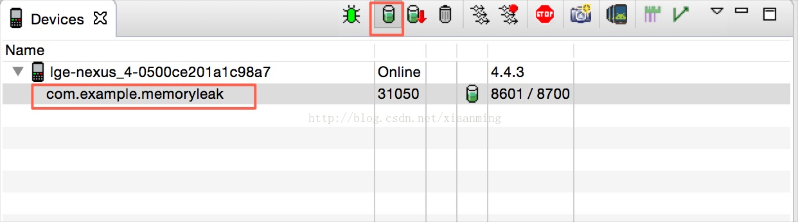
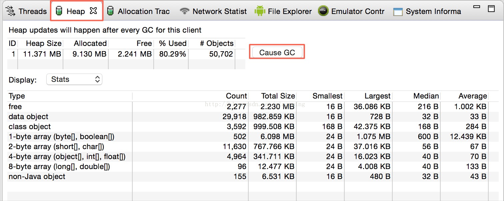
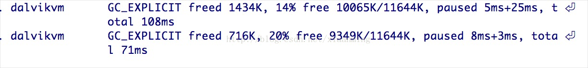
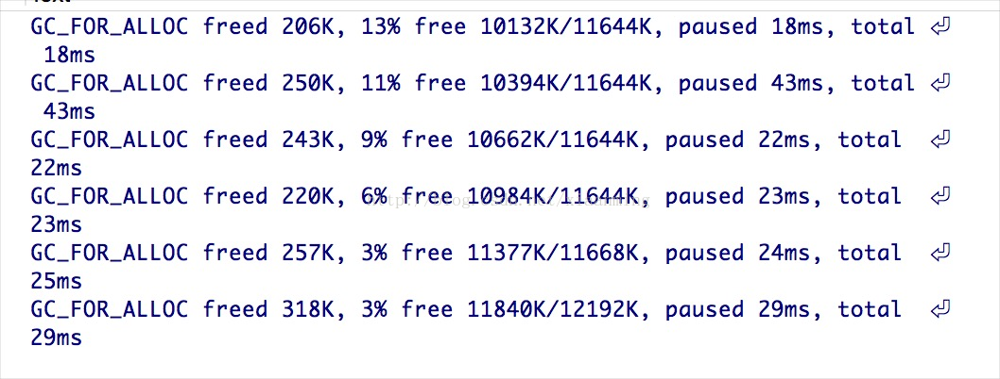
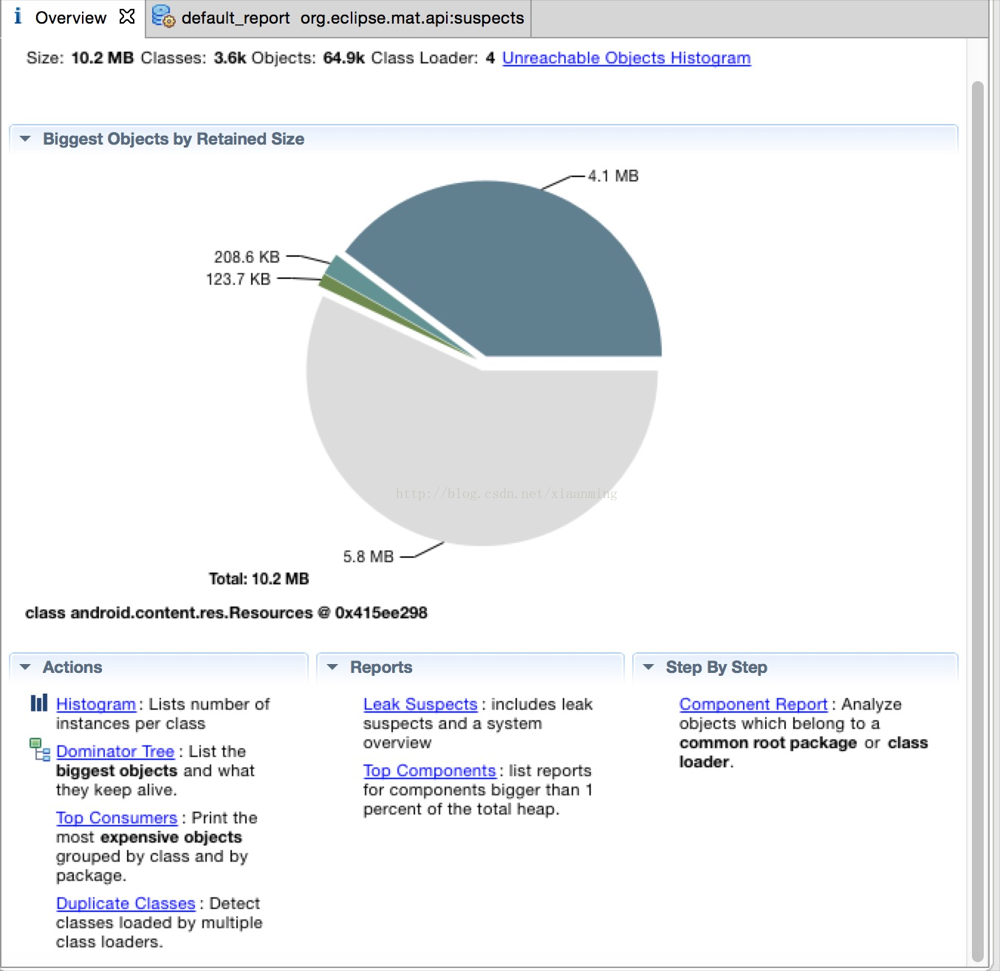
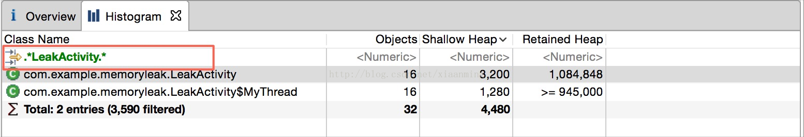
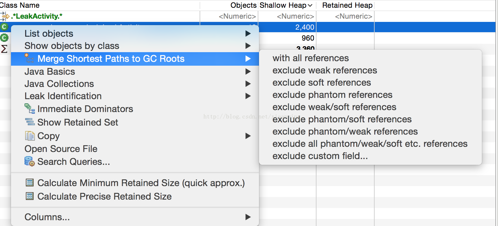
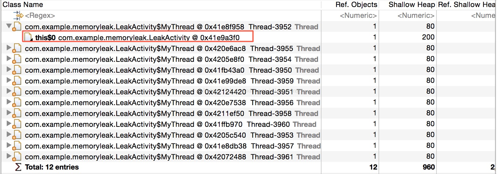

# Android 性能优化之使用MAT分析内存泄露问题

来源:[CSDN](http://blog.csdn.net/xiaanming/article/details/42396507)

我们平常在开发Android应用程序的时候，稍有不慎就有可能产生OOM，虽然JAVA有垃圾回收机，但也不能杜绝内存泄露，内存溢出等问题，随 着科技的进步，移动设备的内存也越来越大了，但由于Android设备的参差不齐，可能运行在这台设备好好的，运行在那台设备就报OOM，这些适配问题也 是比较蛋疼的，比如我们平常运行着一个应用程序，运行的好好的，突然到某个Activity就给你爆出一个OOM的错误，你可能会以为是这个 Activity导致的内存泄露，你会想到也有可能是内存有泄露吗？内存泄露就像一个定时炸弹，随时都有可能使我们的应用程序崩溃掉，所以作为一名 Android开发人员，还是需要有分析内存泄露的能力，说道这里我们还是要说下什么是内存泄露，内存泄露是指有个引用指向一个不再被使用的对象，导致该 对象不会被垃圾回收器回收。因此，垃圾回收器是无法回收内存泄露的对象。本文就使用DDMS(Dalvik Debug Monitor Server)和MAT(Memory Analyzer Tool)工具带大家来分析内存泄露问题。

## 工具的准备

DDMS是ADT自带的调试工具,有关DDMS的使用请参考[http://developer.android.com/tools/debugging/ddms.html](http://developer.android.com/tools/debugging/ddms.html)， 而MAT的就需要我们自行安装Eclipse插件，安装方法我就不多说了，下面给出一个在线安装的地址：`http://download.eclipse.org/mat/1.3/update-site/`，MAT可以检测到内存泄露，降低内存消耗，它有着非常强大的解析堆内存空间dump能力。

## 如何检测内存泄露

### 1.使用DDMS检测内存泄露

打开Devices视图,选择我们需要分析的应用程序进程，点击`Updata Heap`按钮



然后在打开DDMS, 选择Heap标签，然后点击`Cause GC`按钮，点击`Cause GC`是手动触发JAVA垃圾回收器，如下图



如 果我们要测试某个Activity是否发生内存泄露，我们可以反复进入和退出这个Activity, 再手动触发几次垃圾回收，观察上图中`data object`这一栏中的`Total Size`的大小是保持稳定还是有明显的变大趋势，如果有明显的变大趋势就说明这个Activity存在内存泄露的问题，我们就需要在具体分析。

### 2.使用Logcat检测内存泄露

当垃圾回收机在进行垃圾回收之后，会在Logcat中作相对于的输出，所以我们也可以通过这些信息来判断是否存在内存泄露问题



* 一，上面消息的第一个部分产生GC的原因，一共有四种类型
   * **GC_CONCURRENT** 当你的堆内存快被用完的时候，就会触发这个GC回收
   * **GC_FOR_MALLOC** 堆内存已经满了，同时又要试图分配新的内存，所以系统要回收内存
   * **GC_EXTERNAL_ALLOC** 在Android3.0 (Honeycomb)以前，释放通过外部内存（比如在2.3以前，产生的Bitmap对象存储在Native Memory中）时产生。Android3.0和更高版本中不再有这种类型的内存分配了。
   * **GC_EXPLICIT** 调用System.gc时产生，上图中就是点击Cause GC按钮手动触发垃圾回收器产生的log信息

* 二，freed 1413K表示GC释放了1434K的内存

* 三，20% free 9349K/11644K， 20%表示目前可分配内存占的比例，9349K表示当前活动对象所占内存，11644K表示Heap的大小

* 四，paused 8ms + 3ms， total 71ms,则表示触发GC应用暂停的时间和GC总共消耗的时间

有了这些log信息，我们就可以知道GC运行几次以后有没有成功释放出一些内存，如果分配出去的内存在持续增加，那么很明显存在内存泄露，如下存在内存泄露的Log信息



很明显Heap中空闲内存占总Heap的比例在缩小，Heap中活动对象所占的内存在增加。

## 内存泄露分析实战

下面是一个存在内存泄露的例子代码，这也是比较常见的一种内存泄露的方式，就是在Activity中写一些内部类，并且这些内部类具有生命周期过长的现象

```
package com.example.memoryleak;
 
import java.util.ArrayList;
import java.util.List;
 
import android.app.Activity;
import android.os.Bundle;
 
public class LeakActivity extends Activity {
    private List<String> list = new ArrayList<String>();
     
    @Override
    protected void onCreate(Bundle savedInstanceState) {
        super.onCreate(savedInstanceState);
         
        //模拟Activity一些其他的对象
        for(int i=0; i<10000;i++){
            list.add("Memory Leak!");
        }
         
        //开启线程
        new MyThread().start();
         
    }

    public class MyThread extends Thread{
 
        @Override
        public void run() {
            super.run();
             
            //模拟耗时操作
            try {
                Thread.sleep(10 * 60 * 1000);
            } catch (InterruptedException e) {
                e.printStackTrace();
            }    
        }        
    }
}
```

运行例子代码，选择`Devices`视图，点击上面`Updata Heap`标签，然后再旋转屏幕，多重复几次，然后点击`Dump HPROF file`, 之后Eclipse的MAT插件会自动帮我们打开，如下图



我们看到下面有**Histogram（直方图）他列举了每个对象的统计，Dominator Tree(支配树）提供了程序中最占内存的对象的排列**，这两个是我在排查内存泄露的时候用的最多的

### Histogram（直方图)

我们先来看Histogram, MAT最有用的工具之一，它可以列出任意一个类的实例数。它支持使用正则表达式来查找某个特定的类，还可以计算出该类所有 对象的保留堆最小值或者精确值, 我们可以通过正则表达式输入LeakActivity, 看到Histogram列出了与LeakActivity相关的类



我们可以看到LeakActivity,和MyThread内部类都存在16个对象，虽然LeakActivity和MyThread存在那么多对象，但是 到这里并不能让我们准确的判断这两个对象是否存在内存泄露问题，选中com.example.memoryleak.LeakActivity，点击右键，如下图



`Merge Shortest Paths to GC Roots`可以查看一个对象到`GC Roots`是否存在引用链相连接, 在JAVA中是通过可达性（Reachability Analysis)来判断对象是否存活，这个算法的基本思想是通过一系列的称谓`GC Roots`的对象作为起始点，从这些节点开始向下搜索，搜索所走得路径称为引用链，当一个对象到`GC Roots`没有任何引用链相连则该对象被判定为可以被回收的对象，反之不能被回收，我们可以选择`exclude all phantom/weak/soft etc.references`(排查虚引用/弱引用/软引用等）因为被虚引用/弱引用/软引用的对象可以直接被GC给回收.



可以看到LeakActivity存在GC Roots链，即存在内存泄露问题，可以看到LeakActivity被MyThread的this$0持有。

除了使用`Merge Shortest Paths to GC Roots`我们还可以使用

* `List object - With outgoing References` 显示选中对象持有那些对象

* `List object - With incoming References` 显示选中对象被那些外部对象所持有

* `Show object by class - With outgoing References` 显示选中对象持有哪些对象, 这些对象按类合并在一起排序

* `Show object by class - With incoming References` 显示选中对象被哪些外部对象持有, 这些对象按类合并在一起排序

### Dominator Tree(支配树）

它可以将所有对象按照Heap大小排序显示, 使用方法跟Histogram（直方图)差不多，在这里我就不做过多的介绍了


我们知道上面的例子代码中我们知道内部类会持有外部类的引用，如果内部类的生命周期过长，会导致外部类内存泄露，那么你会问，我们应该怎么写那不会出现内存 泄露的问题呢？既然内部类不行，我们就外部类或者static的内部类，如果我们需要用到外部类里面的一些东西，我们可以将外部类Weak Reference传递进去

```
package com.example.memoryleak;
 
import java.lang.ref.WeakReference;
import java.util.ArrayList;
import java.util.List;
 
import android.app.Activity;
import android.os.Bundle;
 
public class LeakActivity extends Activity {
    private List<String> list = new ArrayList<String>();
    
    @Override
    protected void onCreate(Bundle savedInstanceState) {
        super.onCreate(savedInstanceState);
         
        //模拟Activity一些其他的对象
        for(int i=0; i<10000;i++){
            list.add("Memory Leak!");
        }
         
        //开启线程
        new MyThread(this).start();
         
    }
     
    public static class MyThread extends Thread{
        private WeakReference<LeakActivity> mLeakActivityRef;
         
        public MyThread(LeakActivity activity){
            mLeakActivityRef = new WeakReference<LeakActivity>(activity);
        }
 
        @Override
        public void run() {
            super.run();
             
            //模拟耗时操作
            try {
                Thread.sleep(10 * 60 * 1000);
            } catch (InterruptedException e) {
                e.printStackTrace();
            }
             
            //如果需要使用LeakActivity，我们需要添加一个判断
            LeakActivity activity = mLeakActivityRef.get();
            if(activity != null){
                //do something
            }
             
        }        
    }
}
```

同理，Handler也存在同样的问题，比如下面的代码

```
package com.example.memoryleak;
 
import android.app.Activity;
import android.os.Bundle;
import android.os.Handler;
import android.os.Message;
 
public class LeakActivity extends Activity {
 
    @Override
    protected void onCreate(Bundle savedInstanceState) {
        super.onCreate(savedInstanceState);
         
        MyHandler handler = new MyHandler();
        handler.sendMessageDelayed(Message.obtain(), 10 * 60 * 1000);
    }
    
    public class MyHandler extends Handler{
 
        @Override
        public void handleMessage(Message msg) {
            super.handleMessage(msg);
        }
    }        
}
```

我们知道使用MyHandler发送消息的时候，Message会被加入到主线程的MessageQueue里面，而每条Message的target会 持有MyHandler对象，而MyHandler的this$0又会持有LeakActivity对象，所以我们在旋转屏幕的时候，由于每条Message被延迟了10分钟，所以必然会导致LeakActivity泄露,所以我们需要将代码进行修改下

```
package com.example.memoryleak;
 
import java.lang.ref.WeakReference;
 
import android.app.Activity;
import android.os.Bundle;
import android.os.Handler;
import android.os.Message;
 
public class LeakActivity extends Activity {
    MyHandler handler;
 
    @Override
    protected void onCreate(Bundle savedInstanceState) {
        super.onCreate(savedInstanceState);
         
        handler = new MyHandler(this);
        handler.sendMessageDelayed(Message.obtain(), 10 * 60 * 1000);
    }
     
	public static class MyHandler extends Handler{
        public WeakReference<LeakActivity> mLeakActivityRef;
         
        public MyHandler(LeakActivity leakActivity) {
            mLeakActivityRef = new WeakReference<LeakActivity>(leakActivity);
        }
 
        @Override
        public void handleMessage(Message msg) {
            super.handleMessage(msg);
             
            if(mLeakActivityRef.get() != null){
                //do something
            }
        }
    }
 
    @Override
    protected void onDestroy() {
        handler.removeCallbacksAndMessages(null);
        super.onDestroy();
    }        
}
```

上面的代码就能保证LeakActivity不会被泄露，注意我们在Activity的onDestory方法中使用了`handler.removeCallbacksAndMessages(null)`，这样子能保证LeakActivity退出的时候，每条Message的target  MyHandler也会被释放， 所以我们在使用非static的内部类的时候，要注意该内部类的生命周期是否比外部类要长，如果是的话我们可以使用上面的解决方法。

## 常见的内存泄露问题

* 1.上面两种情形

* 2.资源对象没有关闭，比如数据库操作中得Cursor,IO操作的对象

* 3.调用了registerReceiver注册广播后未调用unregisterReceiver()来取消

* 4.调用了`View.getViewTreeObserver().addOnXXXListener`,而没有调用`View.getViewTreeObserver().removeXXXListener`

* 5.Android 3.0以前，没有对不在使用的Bitmap调用`recycle()`,当然在Android 3.0以后就不需要了，更详细的请查看[http://blog.csdn.net/xiaanming/article/details/41084843](http://blog.csdn.net/xiaanming/article/details/41084843)

* 6.Context的泄露，比如我们在单例类中使用Context对象，如下

```
import android.content.Context;
 
public class Singleton {
    private Context context;
    private static Singleton mSingleton;
     
    private Singleton(Context context){
        this.context = context;
    }
     
    public static Singleton getInstance(Context context){
        if(mSingleton == null){
            synchronized (Singleton.class) {
                if(mSingleton == null){
                    mSingleton = new Singleton(context);
                }
            }
        }
         
        return mSingleton;
    }
 
}
```

假如我们在某个Activity中使用`Singleton.getInstance(this)`或者该实例，那么会造成该Activity一直被Singleton对象引用着，所以这时候我们应该使用`getApplicationContext()`来代替Activity的Context，`getApplicationContext()`获取的Context是一个全局的对象，所以这样就避免了内存泄露。相同的还有将Context成员设置为static也会导致内存泄露问题。


* 7.不要重写`finalize()`方法，我们有时候可能会在某个对象被回收前去释放一些资源，可能会在`finalize()`方法中去做，但是实现了`finalize`的对象，创建和回收的过程都更耗时。创建时，会新建一个额外的`Finalizer`对象指向新创建的对象。而回收时，至少需要经过两次GC，第一次GC检测到对象只有被Finalizer引用，将这个对象放入`Finalizer.ReferenceQueue`此时，因为`Finalizer`的引用，对象还无法被GC，`Finalizer$FinalizerThread`会不停的清理Queue的对象，remove掉当前元素，并执行对象的finalize方法，清理后对象没有任何引用，在下一次GC被回收，所以说该对象存活时间更久，导致内存泄露。


