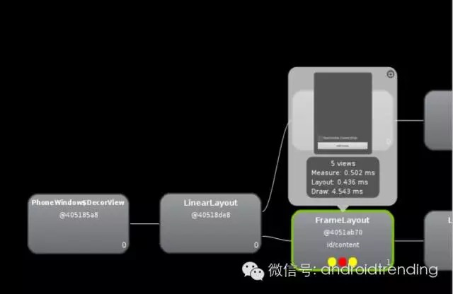
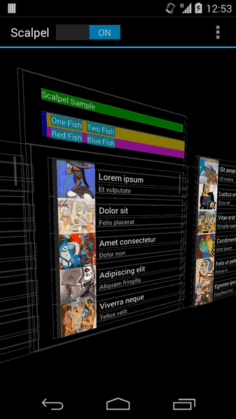
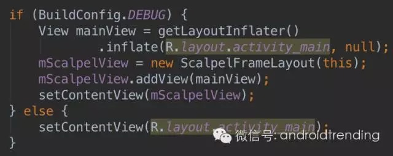

# Scalpel: Jake大神的第三把刀

来源:[微信公众号](http://mp.weixin.qq.com/s?__biz=MzA4MjU5NTY0NA==&mid=400871360&idx=1&sn=ed438babc92bcca912f0f097f46fcf70#rd)

Jake Wharton，Android开发领域传奇一般的存在，熟悉Android开发的同学应该都听说过，即便没有，也应该会经常用到他主导或参与贡献的开源项目，他在GitHub上开源了多个Android兼容性、依赖注入相关的知名项目，目前就职Square, 也参与贡献了Square公司开源的诸如Retrofit, okhttp等热门项目。

Jake大神喜欢以刀命名自己的项目，可能他觉得这能很好的表达它们作为开发利器的犀利程度，不过没准他也很喜欢中国武侠小说呢。

他最有名的两把刀，一把是Dagger, 匕首，一个依赖注入框架，用来解耦开发中各模块依赖的，最早由他开发与维护，后来转给Google维护；另一把是同样大名鼎鼎的ButterKnife，黄油刀，有了它，你再也不用写findViewById了，以后有机会给大家详细介绍它们。

今天的主角是它们不那么知名的小兄弟，Scalpel，这把非常酷炫实用的解剖刀。

* 大家在Android界面开发中可能会经常碰到这样的困扰：
* 新接手某个项目，它的界面布局复杂且乱，怎么快速了解清楚呢？
* 感觉界面布局层次太深，对性能有影响，应该是有不合理的地方，怎么看是哪里不对呢？
* 我写的这个控件怎么就是不出来？它跑哪去了？
* 这里的局部关系是怎样的？要怎么修改才可以实现设计效果呀？

是的，这时候就轮到我们的主角出场了。Scal... 啊不对，是Hierarchy Viewer，
Hierarchy Viewer是Android给我们提供的一款查看View Tree的小工具，通过它可以清晰的看到界面布局与层次细节，相当强大，大家应该都很熟悉它了，截张图大家感受下就好。

我们今天的主角Scalpel(终于轮到我出场了吗？！) 与Hierarchy Viewer有关，一句话介绍它：A surgical debugging tool to uncover the layers under your app，大家看张图就明白它能干嘛了。

是不是很酷？他其实就是实现了一个三维效果的界面布局层次展示，不需要手机连接开发设备，只需要简单几行代码将其集成到你的应用中，即可开启酷炫之旅，它提供的功能包括：

* 通过setLayerInteractionEnabled(boolean)可开启与关闭此功能。
* 通过setDrawViews(boolean)可控制是否绘制View, 也就是说它可以仅仅是个简单的布局线框图，也可以是色彩丰富的真实效果图。
* 通过setDrawIds(boolean)可控制是否显示各控件的Id, 你就能知道你自己正在调试的那个控件到底在哪了？
* 通过setChromeColor，setChromeShadowColor可自定义线框图的颜色，随你喜欢。

太小了看不清怎么办？布局太深了里面的怎么看？不用担心，它提供了强大的手势功能。

* 单点触摸：可以控制其旋转角度。
* 两指垂直滑动：可以放大或缩小。
* 两指水平滑动：可以调整布局层次之间的间距，清晰看到深层次的布局结构。

值得注意的是，它要求修改根布局来实现功能，如果担心对线上用户的影响，可以仅在Debug模式下将其嵌入，类似下面这样几行代码即可在你的复杂项目中将其引入：

其实从实用角度上来说，还是Hirearchy Viewer更强大，可为什么我们还需要Scalpel呢？除了不用找USB线连电脑外，最主要是因为它真的很酷啊，这就够了，不是吗？

如果喜欢这篇文章，记得点赞跟分享给你的好友哟。
如果你还想了解更多Android开发最佳实践、技术前沿、最好用的工具与服务，请长按下方二维码关注我们，我会继续保持精品。

[项目地址](https://github.com/JakeWharton/scalpel)

