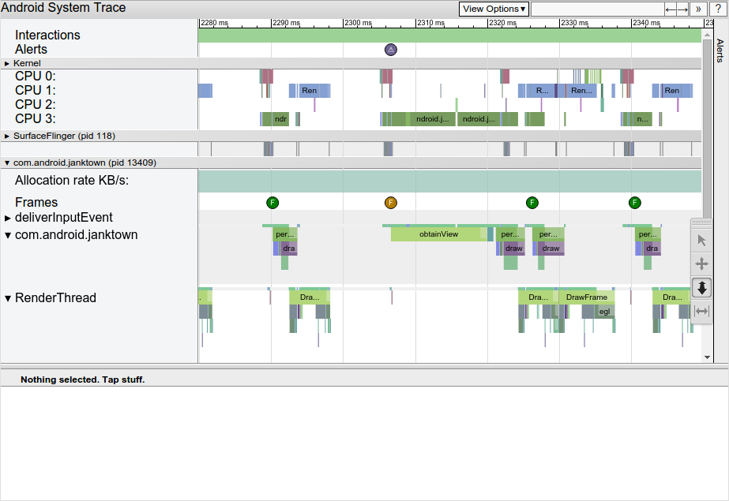
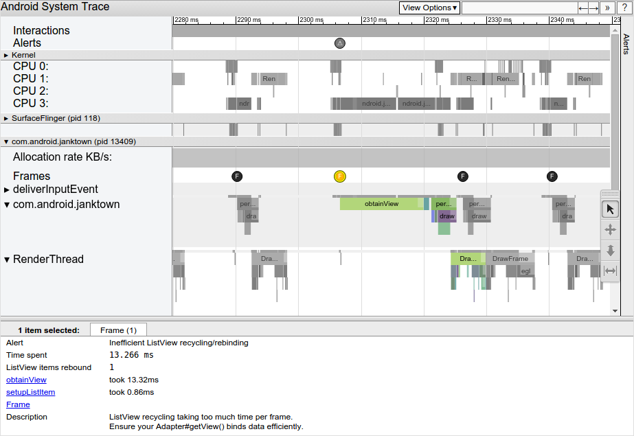
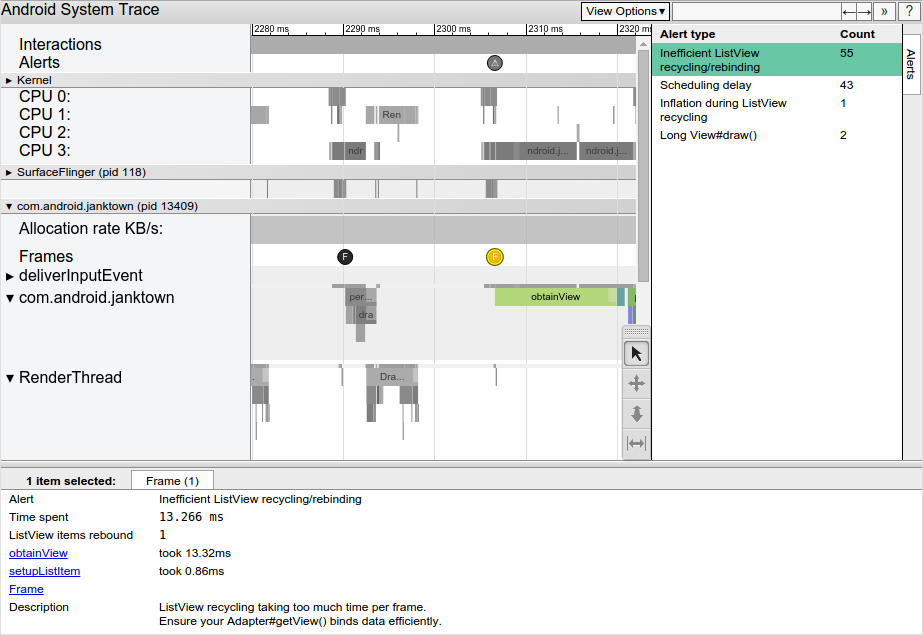

# 使用Systrace分析UI性能

来源:[www.devtf.cn](http://www.devtf.cn/?p=1117)

[origin]:http://developer.android.com/intl/zh-cn/tools/debugging/systrace.html
[origin-author]:http://developer.android.com//
[convert-author]:https://github.com/desmond1121
[systrace-command-line]:http://developer.android.com/intl/zh-cn/tools/help/systrace.html#options
[systrace-user-interface]:http://developer.android.com/intl/zh-cn/tools/help/systrace.html#gui
[systrace-options]:http://developer.android.com/intl/zh-cn/tools/debugging/systrace.html#options-4.3
[TraceView]:http://developer.android.com/intl/zh-cn/tools/debugging/debugging-tracing.html
[systrace-guide]:http://developer.android.com/intl/zh-cn/tools/help/systrace.html

> 原文链接 : [Analyzing UI Performance with Systrace][origin]
> 
> 原文作者 : [Android Developers][origin-author]
> 
> 译者 : [desmond1121][convert-author]

开发应用的时候，应该检查它是否有流畅的用户体验，即60fps的帧率。如果由于某种原因丢帧，我们首先要做的就是知道系统在做什么（造成丢帧的原因）。

Systrace允许你监视和跟踪Android系统的行为(trace)。它会告诉你系统都在哪些工作上花费时间、CPU周期都用在哪里，甚至你可以看到每个线程、进程在指定时间内都在干嘛。它同时还会突出观测到的问题，从垃圾回收到渲染内容都可能是问题对象，甚至提供给你建议的解决方案。本文章将介绍如何导出trace以及使用它来优化UI的办法。

## 总览

Systrace可以帮助你分析应用在不同Android系统上的运行情况。它将系统和应用的线程运行情况放置在同一条时间线上分析。你首先需要收集系统和应用的trace（后面会告诉你怎么做），之后Systrace会帮你生成一份细致、直观的报告，它展示了设备在你监测的这段时间内所发生的事情。


<center><i>图1. 连续滑动应用5秒的Trace，它并没有表现得很完美。</i></center>

图1展示了应用在滑动不流畅的时候生成的trace。默认缩放成全局显示，你可以放大到自己所关注的地方。横轴代表着时间线，事件记录按照进程分组，同一个进程内按线程进行纵向拆分，每个线程记录自己的工作。

在本例中，一共有三个组：Kernel, SurfaceFlinger, App，他们分别以包名为标识。每个应用进程都会包含其中所有线程的记录信号，你可以看到从InputEvent到RenderThread都有。

## 生成Trace

在获取trace之前需要做一些启动工作。首先，设备要求API>=16(Android 4.1)，之后通过正常的Debug流程（开启调试、连接工作环境、安装App）连接设备。由于需要记录磁盘活动和内核工作，你可能需要root权限。不过大部分时候你只要能够正常Debug即可。

Systrace 可以通过[命令行][systrace-command-line]或者[图形界面][systrace-user-interface]启动，本篇文章重点介绍通过命令行使用Systrace。

## 在Android 4.3及以上的系统中获取trace

在4.3以上的系统获取Trace步骤：

* 保证设备USB连接正常，并可以debug；
* 在命令行中设置选项，开启trace，比如：

```
$ cd android-sdk/platform-tools/systrace
$ python systrace.py --time=10 -o mynewtrace.html sched gfx view wm
```
 
在设备上做任何你想让trace记录的操作。

你可以通过[Systrace选项][systrace-options]来了解更多命令行选项。

## 在Android 4.2及以下的系统中获取trace
在4.2及以下的系统中高效地使用Systrace的话，你需要在配置的时候显式指定要trace的进程种类。一共有这两类种类：

* 普通系统进程，比如图形、声音、输入等。（通过tags设置，具体在[Systrace命令行][systrace-command-line]中有介绍）
* 底层系统进程，比如CPU、内核、文件系统活动。（通过options设置，具体在[Systrace命令行][systrace-command-line]中有介绍）

你可以通过以下命令行操作来设置tags：

* 使用 --set-tags选项:

```
$ cd android-sdk/platform-tools/systrace
$ python systrace.py --set-tags=gfx,view,wm
```
 
* 重启adb shell来trace这些进程：

```
$ adb shell stop
$ adb shell start
```
 
你也可以通过手机上的图形界面设置tags：

* 1、在设备上进入设置> 开发者选项 > 监控 > 启用跟踪（部分手机上没有这个选项）；
* 2、选择追踪进程类型，点击确认。

> 注意: 在图形界面中设置tag时adb shell不用重新启动。

在配置完tags后，你可以开始收集操作信息了。

如何在当前设置下启动trace：

* 保证设备的usb连接正常，并且可以正常debug；
* 使用低系统等级的命令行选项开启trace，比如：
> $ python systrace.py --cpu-freq --cpu-load --time=10 -o mytracefile.html
* 在设备上做任何你想让trace记录的操作。

你可以通过[Systrace选项][systrace-options]来了解更多命令行选项。

## 分析trace报告
在你获取trace之后你可以在网页浏览器中打开它。这部分内容告诉你怎么通过trace去分析和解决UI性能。

### 监视帧数
每个应用都有一行专门显示frame，每一帧就显示为一个绿色的圆圈。不过也有例外，当显示为黄色或者红色的时候，它的渲染时间超过了16.6ms（即达不到60fps的水准）。’w’键可以放大，看看这一帧的渲染过程中系统到底做了什么。

> 提示：你可以按右上角的’?’按钮来查看界面使用帮助。



<center><i>图2. Systrace显示长渲染时间的帧</i></center>

单击该帧可以高亮它，这时候跟该帧有关的内容会被突出显示。在5.0及以上的系统中，显示工作被拆分成UI线程和Render线程两部分；在5.0以下的系统中，所有的显示工作在UI线程中执行。

点击单个Frame下面的组件可以看他们所花费的时间。每个事件（比如`performTraversals`）都会在你选中的时候显示出它们调用了哪些方法及所用的时间。

### 调查警告事件
Systrace会自动分析事件，它会将任何它认为性能有问题的东西都高亮警告，并提示你要怎么去优化。



<center><i>图3. 选择一个被高亮帧，它会显示出检测到的问题（回收ListView消耗时间太长）。</i></center>

在你选择类似图三中的问题帧之后，它就会提示你检测出的问题。在这个例子中，它被警告的主要原因是ListView的回收和重新绑定花费太多时间。在Systrace中也会提供一些对应链接，它们会提供更多解释。

如果你想知道UI线程怎么会花费这么多时间的话，你可以使用[TraceView][TraceView]，它会告诉你都是哪些函数在消耗时间。

你可以通过右侧的’Alert’选项卡来查看整个trace过程中发生的所有问题，并进行快速定位。



<center><i>图4. 点击Alert选项卡。</i></center>

你可以将Alert面板中的问题视为需要处理的bug，很有可能每一次微小的优化能够去除整个应用中的警告！

## 应用级别调试
Systrace并不会追踪应用的所有工作，所以你可以在有需求的情况下自己添加要追踪的代码部分。在Android 4.3及以上的代码中，你可以通过`Trace`类来实现这个功能。它能够让你在任何时候跟踪应用的一举一动。在你获取trace的过程中，`Trace.beginSection()`与`Trace.endSection()`之间代码工作会一直被追踪。

下面这部分代码展示了使用Trace的例子，在整个方法中含有两个Trace块。

```
public void ProcessPeople() {
    Trace.beginSection("ProcessPeople");
    try {
        Trace.beginSection("Processing Jane");
        try {
           // 待追踪的代码
        } finally {
            Trace.endSection(); // 结束 "Processing Jane"
        }
 
        Trace.beginSection("Processing John");
        try {
            // 待追踪的代码
        } finally {
            Trace.endSection(); // 结束 "Processing John"
        }
    } finally {
        Trace.endSection(); // 结束 "ProcessPeople"
    }
}
```

> 注意：在Trace是被嵌套在另一个Trace中的时候，`endSection()`方法只会结束理它最近的一个`beginSection(String)`。即在一个Trace的过程中是无法中断其他Trace的。所以你要保证`endSection()`与`beginSection(String)`调用次数匹配。
>
> 注意：Trace的begin与end必须在同一线程之中执行！

当你使用应用级别追踪的时候，你必须通过`-a`或者`-app=`来显式地指定应用包名。可以通过[Systrace指南][systrace-guide]查看更多关于它的信息。

你在评估应用的时候应该开启应用级别跟踪，即使当你没有手动添加`Trace`信号。因为很多库函数里面是有添加`Trace`信号的（比如`RecyclerView`），它们往往能够提供很多信息。