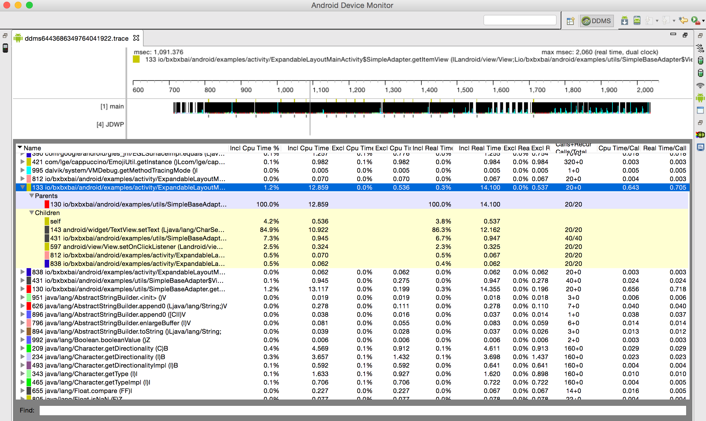
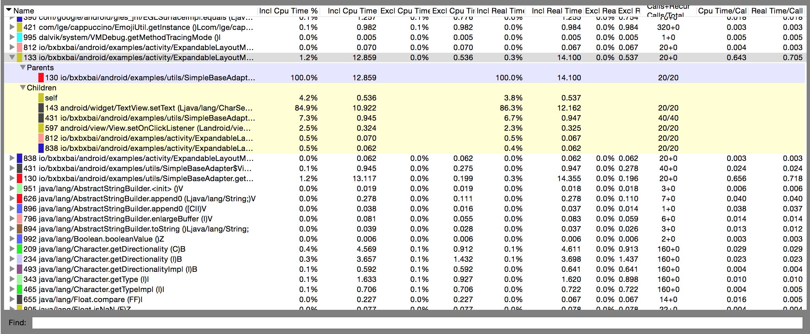
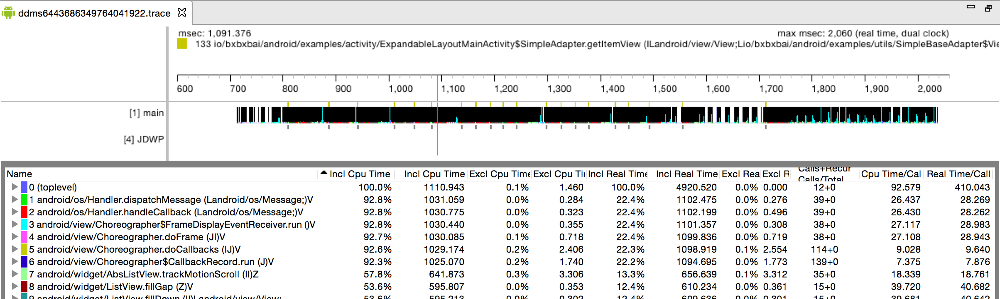
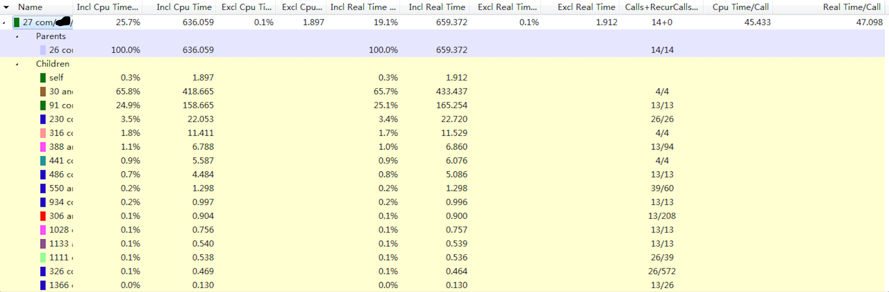
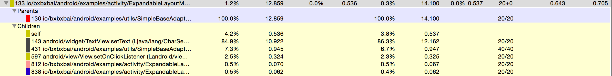
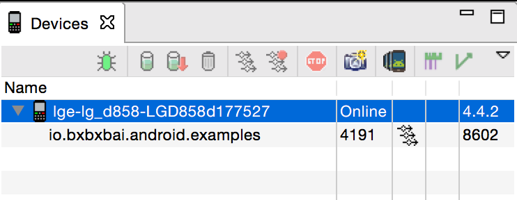

# 正确使用Android性能分析工具——TraceView
来源:[http://bxbxbai.github.io/2014/10/25/use-trace-view/](http://bxbxbai.github.io/2014/10/25/use-trace-view/)

## 前面唠叨

最近公司app中有些列表在滑动的时候会有卡顿现象，我就开始着手解决这些问题，解决问题之前首先要分析列表滑动的性能瓶颈在什么地方。因为之前不会正确使用TraceView这个工具，主要是看不懂TraceView界面下方数据指标的值代表什么意思…以前我用[StopWatch](http://bxbxbai.github.io/2014/08/01/the-stopwatch-class/)类来分析性能，现在觉得弱爆了…不过有些地方[StopWatch](http://bxbxbai.github.io/2014/08/01/the-stopwatch-class/)工具类还是很简单好用的~

网上可以找了很多博客来介绍这个工具的使用方法，很多都是讲解了一些一些就会的方法，讲一个大概，包括StackOverFlow上我也没有找到很好的讲解TraceView各个数据指标代码什么意思的回答

因为我要解决列表滑动的卡顿问题，就必须要找到导致卡顿现象的原因，我就在StackOverFlow上找着别人零散的回答慢慢琢磨这个工具的使用方法。现在我学会了，至少能看懂每个指标什么意思，最后发现这个工具实在太强大了！！！

## TraceView界面

现来看一下整个界面的图，整个界面包括上下两部分，上面是你测试的进程中每个线程的执行情况，每个线程占一行；下面是每个方法执行的各个指标的值

上面一部分是你测试进程的中每个线程运行的时间线，下图中可以可以看到，主要只有一个main线程在执行，因为我滑动了一下列表，main线程（UI线程）正在进行绘制View呢~~

然后我点击了序号为133的一个方法`io.bxbxbai.android.examples.activity.ExpandableLayoutMainActivity$SimpleAdapter.getItemView`，就会出现两部分数据：

* Parents
* Children

Parents表示调用133这个方法的父方法，可以看到序号为130。Children表示方法133调用的其他方法，可以看到有好几个方法。



## 如何使用TraceView

因为这次我主要是分析列表滑动卡顿问题，我就讲讲我是怎么使用这个工具的，并且我是怎么分析的。

使用TraceView主要有两种方式：

* 最简单的方式就是直接打开DDMS，选择一个进程，然后按上面的**“Start Method Profiling”**按钮，等红色小点变成黑色以后就表示TraceView已经开始工作了。然后我就可以滑动一下列表（现在手机上的操作肯定会很卡，因为Android系统在检测Dalvik虚拟机中每个Java方法的调用，这是我猜测的）。操作最好不要超过5s，因为最好是进行小范围的性能测试。然后再按一下刚才按的按钮，等一会就会出现上面这幅图，然后就可以开始分析了。

* 第2种方式就是使用`android.os.Debug.startMethodTracing();`和`android.os.Debug.stopMethodTracing();`方法，当运行了这段代码的时候，就会有一个trace文件在`/sdcard`目录中生成，也可以调用`startMethodTracing(String traceName)`设置trace文件的文件名，最后你可以使用`adb pull /sdcard/test.trace /tmp`命令将trace文件复制到你的电脑中，然后用DDMS工具打开就会出现第一幅图了

第一种方式相对来说是一种简单，但是测试的范围很宽泛，第二中方式相对来说精确一点，不过我个人喜欢使用第一种，因为简单，而且它是检测你的某一个操作。因为第二中更适合检测某一个方法的性能，其实也没有那种好，看使用的场景和喜好了。。。

## 看懂TraceView中的指标



其实我今年7月份就已经开始使用TraceView工具了，但是当时不懂其中每个指标的含义，就没注意到它强大的地方。看不懂界面下方表格中的指标，这些数据其实一点意义都没有。

网上包括Android官网也没有对TraceView工具的使用有详细的说明文档，这点确实比较蛋疼。

### 纵轴

TraceView界面下方表格中纵轴就是每个方法，包括了JDK的，Android SDK的，也有native方法的，当然最重要的就是app中你自己写的方法，有些Android系统的方法执行时间很长，那么有很大的可能就是你app中调用这些方法过多导致的。

**每个方法前面都有一个数字，可能是全部方法按照Incl CPU Time 时间的排序序号（后面会讲到）**

点一个方法后可以看到有两部分，一个是Parents，另一个是Children。

* Parent表示调用这个方法的方法，可以叫做父方法

* Children表示这个方法中调用的其他方法，可以叫做子方法

### 横轴



横轴上是很多指标，这些指标表示什么意思真的困扰了我很长一段时间。。。

能够很衡量一个方法性能的指标应该只有时间了吧？ 一个方法肯定就是执行时间越短约好咯~~

#### 1. Incl Cpu Time

define **inclusive** ： 全包括的

上图中可以看到`0（toplevel）` 的**Incl Cpu Time** 占了100%的时间，这个不是说100%的时间都是它在执行，请看下面代码：

```
public void top() {
    a();
    b();
    c();
    d();
}
```
Incl Cpu Time表示方法top执行的总时间，假如说方法top的执行时间为10ms，方法a执行了1ms，方法b执行了2ms，方法c执行了3ms，方法d执行了4ms（这里是为了举个栗子，实际情况中方法a、b、c、d的执行总时间肯定比方法top的执行总时间要小一点）。

而且调用方法top的方法的执行时间是100ms，那么：

```
Incl Cpu Time
top		10%
a	10%
b	20%
c	30%
d	40%
```

从上面图中可以看到：

**toplevel**的 **Incl Cpu Time** 是1110.943，而`io.bxbxbai.android.examples.activity.ExpandableLayoutMainActivity$SimpleAdapter.getItemView`方法的**Incl Cpu Time**为12.859，说明后者的**Incl Cpu Time % **约为1.2%

**这个指标表示 这个方法以及这个方法的子方法（比如top方法中的a、b、c、d方法）一共执行的时间**

#### 2. Excl Cpu Time

理解了Incl Cpu Time以后就可以很好理解Excl Cpu Time了，还是上面top方法的栗子：

方法top 的 Incl Cpu Time 减去 方法a、b、c、d的Incl Cpu Time 的时间就是方法top的Excl Cpu Time 了

#### 3. Incl Real Time

这个感觉和Incl Cpu Time 差不多，第7条会讲到。

#### 4. Excl Real Time

同上

#### 5. Calls + Recur Calls / Total

这个指标非常重要！

**它表示这个方法执行的次数，这个指标中有两个值，一个Call表示这个方法调用的次数，Recur Call表示递归调用次数**，看下图：



我选中了一个方法，可以看到这个方法的**Calls + Recur Calls** 值是14 + 0，表示这个方法调用了14次，但是没有递归调用

从Children这一块来看，很多方法调用都是13的倍数，说明父方法中有一个判断，但是这不是重点，有些Child方法调用Calls为26，这说明了这些方法被调用了两遍，是不是可能存在重复调用的情况？这些都是可能可以优化性能的地方。

#### 6. Cpu Time / Call

**重点来了！！！！！！！！！！**



这个指标应该说是最重要的，从上图可以看到，133这个方法的调用次数为20次，而它的Incl Cpu Time为12.859ms，那么133方法每一次执行的时间是0.643ms（133这个方法是`SimpleAdapter`的`getItemView`方法）

对于一个`adapter`的`getView`方法来说0.643ms是非常快的（因为这个adapter中只有一个TextView，我为了测试用的）

如果`getView`方法执行时间很长，那么必然导致列表滑动的时候产生卡顿现象，可以在`getView`方法的Children方法列表中找到耗时最长的方法，分析出现问题的原因：

* 是因为有过多的计算？
* 还是因为有读取SD卡的操作？
* 还是因为adapter中View太复杂了？
* 还是因为需要有很多判断，设置View的显示还是隐藏
* 还是因为其他原因…

#### 7. Real Time / Call

**Real Time** 和 **Cpu Time** 我现在还不太明白它们的区别，我的理解应该是:

* Cpu Time 应该是某个方法占用CPU的时间
* Real Time 应该是这个方法的实际运行时间

为什么它们会有区别呢？可能是因为CPU的上下文切换、阻塞、GC等原因方法的实际执行时间要比Cpu Time 要稍微长一点。

## 总结

TraceView是一个非常强大的性能分析工具，因为Android 官网对这个工具的使用介绍文档很少，而且一些中文博客中写的也都是抄来抄去，没有讲到底怎么使用。

最近我在做这方面的性能分析，就慢慢琢磨了这么工具的使用，发现非常强大，写下来总结一下。

Android的性能分析工具还有很多，比如：

* Eclipse Memory Analyzer Tool 来分析Android app的内存使用
* Dump UI Hierarchy for UI Atomator，分析UI层级
* systrace
* 其他

下图这一条工具栏中有很多性能分析工具~~~

