# 如何更好地利用Pmd、Findbugs和CheckStyle分析结果

来源:[http://www.importnew.com/11119.html](http://www.importnew.com/11119.html)

本文由 [ImportNew](http://www.importnew.com/) - []miracle1919](http://www.importnew.com/author/miracle1919) 翻译自 [javadepend](http://javadepend.wordpress.com/2013/11/25/exploit-better-the-results-of-pmd-findbugs-and-checkstyle/)。欢迎加入[翻译小组](http://group.jobbole.com/category/feedback/trans-team/)。转载请见文末要求。

这里列出了很多Java静态分析工具，每一种工具关注一个特定的能发挥自己特长的领域，我们可以列举一下：

**Pmd**它是一个基于静态规则集的Java源码分析器，它可以识别出潜在的如下问题：

* 可能的bug——空的try/catch/finally/switch块。
* 无用代码(Dead code)：无用的本地变量，方法参数和私有方法。
* 空的if/while语句。
* 过度复杂的表达式——不必要的if语句，本来可以用while循环但是却用了for循环。
* 可优化的代码：浪费性能的String/StringBuffer的使用。

**FindBugs**它用来查找Java代码中存在的bug。它使用静态分析方法标识出Java程序中上百种潜在的不同类型的错误。

**Checkstyle**它定义了一系列可用的模块，每一个模块提供了严格程度(强制的，可选的…)可配置的检查规则。规则可以触发通知(notification)，警告(warning)和错误(error)。

现在有很多查看这些工具的处理结果的方式：

* **XML格式**：这些工具都可以产生XML文件，这些XML文件能用来产生HTML报表或者是被别的工具用来浏览分析的结果。
* **HTML格式**：HTML格式是最受欢迎的产生报表和团队间分享的的方式，你也可以用xsl表格创建你自己的报表。
* **IDE插件**：几乎所有叫得上名字的IDE都给这些工具提供了插件，这使得发现源码中存在的所有问题几乎变成可能。

代码质量工具的一个问题是，它们有时候会给开发者提示很多不是错误的错误-也叫做假阳性(false positives)。当这种情况发生的时候，开发者可以学着忽略工具的输出信息，或者是把这些输出全部抛弃掉。

为了更好的利用这些工具的输出结果，给开发者一个更有用的视图，最好是有一种只关注我们想要的东西的方式。本文中，我们将找出其他有趣的方式来更好的利用所有这些有名的Java静态分析工具的输出结果，然后可以像查询数据库那样查询这些结果。

## JArchitect和CQLinq

JArchitect是另一个静态分析工具，它弥补了其他工具(的不足)，它是使用一种基于Linq(CQLinq)的代码查询语言像查询数据库那样来查询代码。

JArchitect3的以前版本，只能查询从JArchitect提取出来的分析数据，但是从JArchitect4开始，可以把许多其他静态分析工具的输出结果包含进来，然后使用CQLinq做查询。

让我们以PDT核心([Eclipse](http://res.importnew.com/eclipse)的Php插件)的源码为例来说明如何在JArchitect中利用好这些静态工具的分析结果。

在查询分析结果以前，要遵守以下几个步骤：

* 第一步：

用PMD，CPD，FindBugs和CheckStyle分析项目工程，生成包含分析结果的XML文件。

* 第二步：

用JArchitect分析项目工程。

* 第三步：

在JArchitect点击菜单“插件(Plugins)”->“导入插件结果文件(Import Plugins Result Files)”把所有的XML文件导入到JArchitect中。

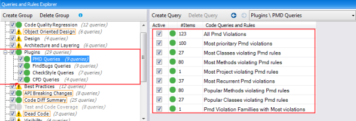

JArchitect默认给这些工具提供了许多有用的查询，并且这些查询都是可以很简单的进行定制的。

让我们来看一些CQLinq的查询：

### 获取的所有的问题(issue)：

获取所有问题的请求很简单，但是没什么用处，因为如何利用23272个问题的分析结果确实是一个很大的挑战。

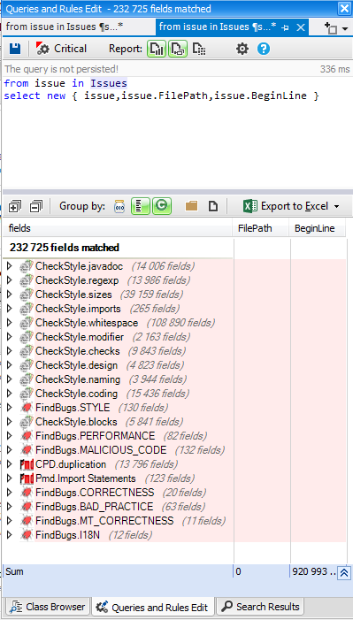

为了更好的利用这些工具的分析结果，我们可以用CQLinq来做过滤，然后只关注那些我们想要关注的东西。

### 根据所使用的检查工具发请求

我们可以修改第一个请求，然后添加一个查询工具的criteria。

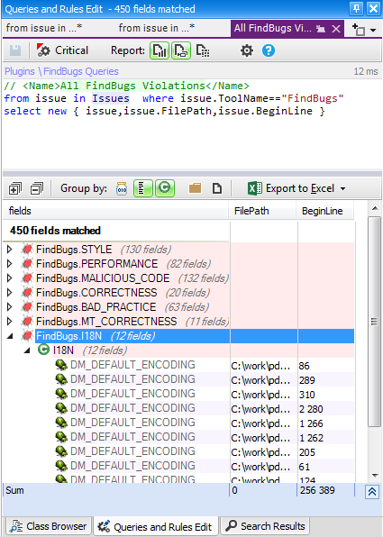

### 据规则集发请求

我们也可以根据问题的规则集做过滤：

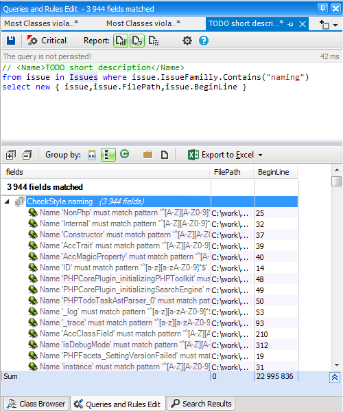

### 根据优先级发请求

也可以根据优先级做过滤：

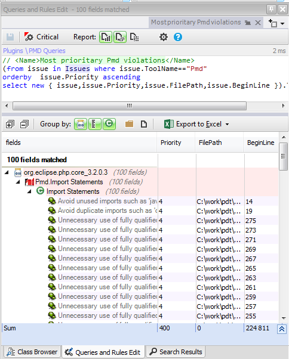

### 出现次数最多的问题

知道哪些问题是被这些工具报告次数最多的是很有用的。

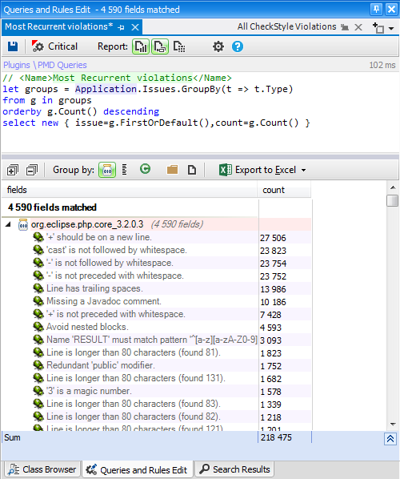

### 出现问题最多的类

知道哪些类包含了最多的问题是很有用的。

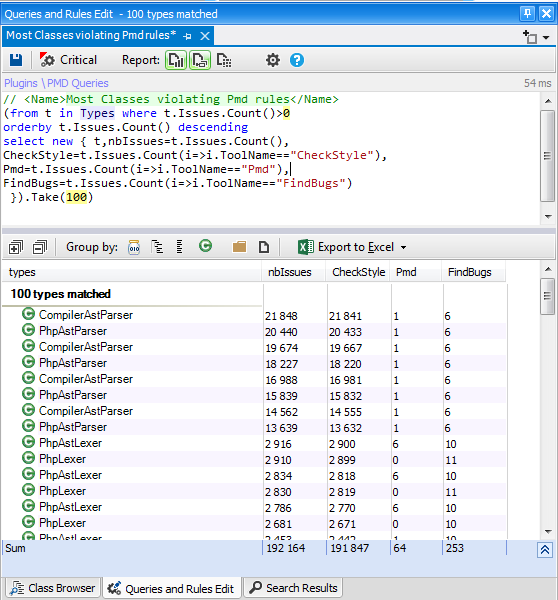

上图可以看出来，CheckStyle报告的上千个问题中有很多是可以忽略的。

前面的查询很有用，但是，它并没有给我们一个精确的类质量的信息，因为要考虑的另一个有用的维度就是代码行数(NBLinesOfCode)。一般来说代码行数多的类会包含更多的问题，基于这个考虑，我们可以修改之前的请求来计算出问题数目和代码行数(NBLinesOfCode)的比率。

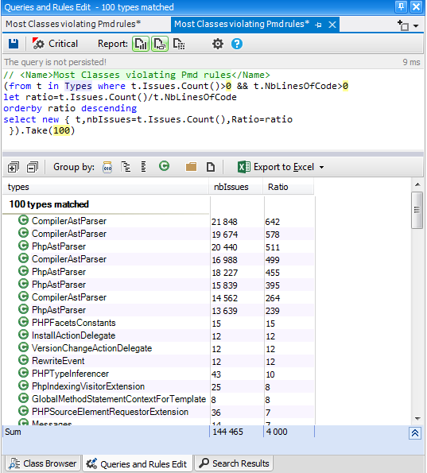

上面的查询结果看上去很奇怪，前8个类的问题数和代码行数比率超过了200，也就是说一行代码有超过200个问题。

为了解释这种行为，我们看下CompilerAstParser的一些代码：

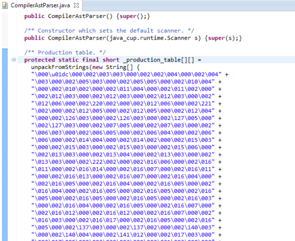

代码行数(NBLinesOfCode)指的是语句的数目而不是代码的物理行数，CompilerAstParser这个类声明了很多数组，每一个都包含了几千个物理行，但是，每一个数组都被认为是一个语句。

就像前面展示的出现次数最多的问题那样，每一个数组都把”+应该在一个新行上”这个规则违反了上千次。或许最好是应该把这样的规则从CheckStyle的配置文件中删掉。

### 出问题最多的方法

当静态警察工具报告了问题以后，定位解决问题的优先级是很有用的，尤其是当包含bug的时候。

bug可能存在于某一个特定的方法中，但是，知道还有多少方法也受这个bug的影响是非常有用的。知道了出问题最多的这个方法做好事尽快把它解决掉。

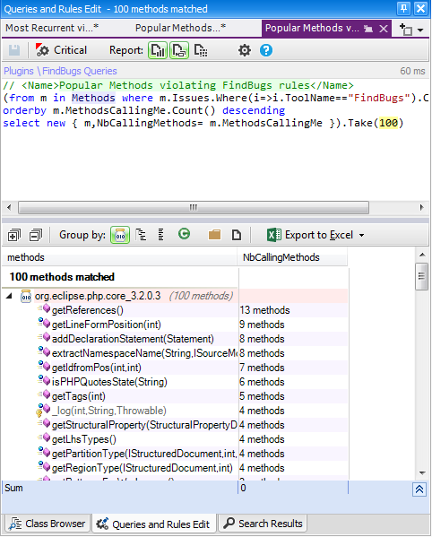

使用CQLinq，我们可以把这些工具的结果和JArchitect的结果结合起来创建出更复杂的查询，然后把这些检查规则添加到构建过程中去。

### 问题的趋势

工程中有问题并不是异常情况，我们甚至可以说是正常的，但是，我们要检查工程的质量趋势。如果随着工程的更新和演化问题数目增加了，将会是一个很坏的指标。

JArchitect提供了趋势监控特性来创建趋势图。趋势图是根据分析时间记录的特定维度上的值创建出来的。默认有50多个趋势维度，也可以很简单定制趋势维度。

下面给Pmd问题创建一个趋势维度：

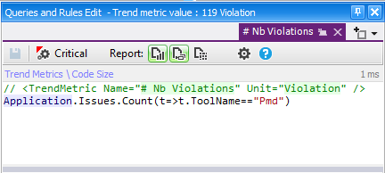

然后，你就可以很简单的创建趋势图在趋势维度上做监控，然后把它添加到JArchitect的操作面板中。

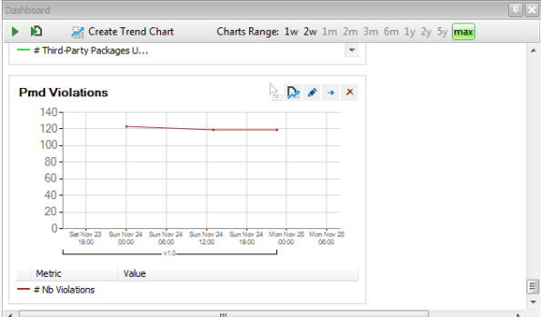

有了这个趋势图，我们就可以监视Pmd问题的进化，然后发现这个维度的问题随版本进化的原因。

### 定制JArchitect报表

JArchitect可以在列出了CQLinq查询的HTML报表中追加额外的报表区。

在CQLinq查询浏览面板中，一个特定的CQLinq组是用橙色的的边框包围的。

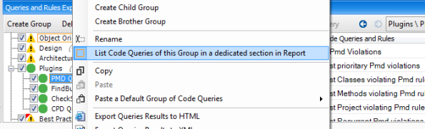

也可以把Pmd趋势图添加到报表中：

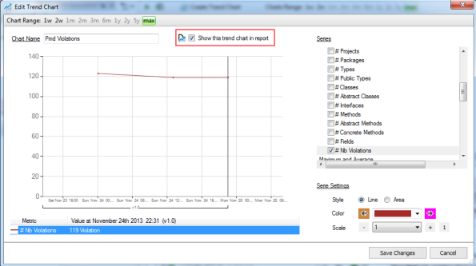

在HTML报表中，这些被添加进来的区域可以通过菜单访问：

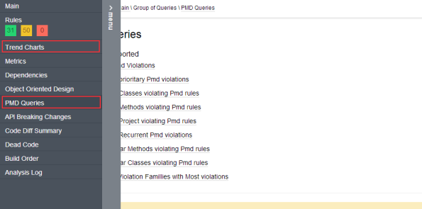

这是被添加进Pmd查询报表中的页面：

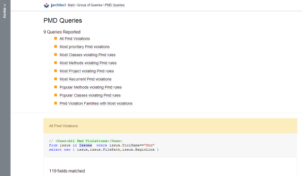

## 结论

JArchitect 4 对其他的静态分析工具是开放的，你也可以很简单的像本文说的那样把你自己的工具做成它的插件。这样你就可以使用JArchitect的所有的功能来更好的利用那些有名的java静态分析工具的分析结果。

