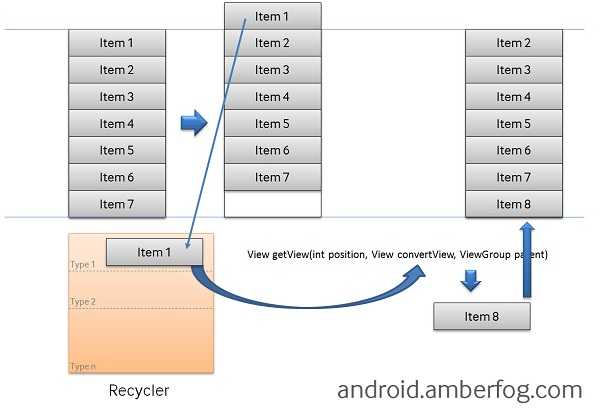
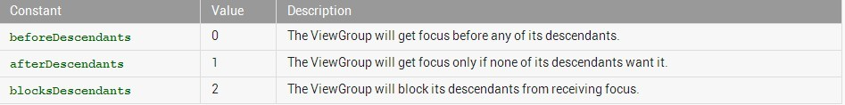

# Android开发的那些坑和小技巧

来源:[cnblogs](http://www.cnblogs.com/lao-liang/p/4941653.html)

## 1、android:clipToPadding
意思是控件的绘制区域是否在padding里面。默认为true。如果你设置了此属性值为false，就能实现一个在布局上事半功陪的效果。先看一个效果图。


上图中的ListView顶部默认有一个间距，向上滑动后，间距消失，如下图所示。


如果使用margin或padding，都不能实现这个效果。加一个headerView又显得大材小用，而且过于麻烦。此处的clipToPadding配合paddingTop效果就刚刚好。

同样，还有另外一个属性也很神奇：android:clipChildren，具体请参考：[【Android】神奇的android:clipChildren属性](神奇的android:clipChildren属性.md)

## 2、match_parent和wrap_content
按理说这两个属性一目了然，一个是填充布局空间适应父控件，一个是适应自身内容大小。但如果在列表如ListView中，用错了问题就大了。ListView中的getView方法需要计算列表条目，那就必然需要确定ListView的高度，onMesure才能做测量。如果指定了wrap_content，就等于告诉系统，如果我有一万个条目，你都帮我计算显示出来，然后系统按照你的要求就new了一万个对象出来。那你不悲剧了？先看一个图。



假设现在ListView有8条数据，match_parent需要new出7个对象，而wrap_content则需要8个。这里涉及到View的重用，就不多探讨了。所以这两个属性的设置将决定getView的调用次数。

由此再延伸出另外一个问题：**getView被多次调用**。

什么叫多次调用？比如position=0它可能调用了几次。看似很诡异吧。GridView和ListView都有可能出现，说不定这个祸首就是wrap_content。说到底是View的布局出现了问题。如果嵌套的View过于复杂，解决方案可以是通过代码测量列表所需要的高度，或者在getView中使用一个小技巧：`parent.getChildCount == position`

```
@Override
public View getView(int position, View convertView, ViewGroup parent) {
    if (parent.getChildCount() == position) {
       // does things here
    }
        
    return convertView;
}
```

## 3、IllegalArgumentException: pointerIndex out of range
出现这个Bug的场景还是很无语的。一开始我用ViewPager + PhotoView(一个开源控件)显示图片，在多点触控放大缩小时就出现了这个问题。一开始我怀疑是PhotoView的bug，找了半天无果。要命的是不知如何try，老是crash。后来才知道是android遗留下来的bug，源码里没对pointer index做检查。改源码重新编译不太可能吧。明知有exception，又不能从根本上解决，如果不让它crash，那就只能try-catch了。解决办法是：自定义一个ViewPager并继承ViewPager。请看以下代码：

```
/**
 * 自定义封装android.support.v4.view.ViewPager，重写onInterceptTouchEvent事件，捕获系统级别异常
 */
public class CustomViewPager extends ViewPager {

    public CustomViewPager(Context context) {
        this(context, null);
    }

    public CustomViewPager(Context context, AttributeSet attrs) {
        super(context, attrs);
    }

    @Override
    public boolean onInterceptTouchEvent(MotionEvent ev) {
        try {
            return super.onInterceptTouchEvent(ev);
        } catch (IllegalArgumentException e) {
            LogUtil.e(e);
        } catch (ArrayIndexOutOfBoundsException e) {
            LogUtil.e(e);
        }
        return false;
    }
}
```

把用到ViewPager的布局文件，替换成CustomViewPager就OK了。

## 4、ListView中item点击事件无响应
listView的Item点击事件突然无响应，问题一般是在listView中加入了button、checkbox等控件后出现的。这个问题是聚焦冲突造成的。在android里面，点击屏幕之后，点击事件会根据你的布局来进行分配的，当你的listView里面增加了button之后，点击事件第一优先分配给你listView里面的button。所以你的点击Item就失效了，这个时候你就要根据你的需求，是给你的item的最外层layout设置点击事件，还是给你的某个布局元素添加点击事件了。

解决办法：在ListView的根控件中设置（若根控件是LinearLayout, 则在LinearLayout中加入以下属性设置）`descendantFocusability`属性。

```
android:descendantFocusability="blocksDescendants"
```

官方文档也是这样说明。



## 5、getSupportFragmentManager()和getChildFragmentManager() 

有一个需求，Fragment需要嵌套3个Fragment。基本上可以想到用ViewPager实现。开始代码是这样写的：
```
mViewPager.setAdapter(new CustomizeFragmentPagerAdapter(
	getActivity().getSupportFragmentManager()
		, subFragmentList));
```

导致的问题是嵌套的Fragment有时会莫名其妙不显示。开始根本不知道问题出现在哪，当你不知道问题的原因时，去解决这个问题显然比较麻烦。经过一次又一次的寻寻觅觅，终于在stackoverflow上看到了同样的提问。说是用getChildFragmentManager()就可以了。真是这么神奇！

```
mViewPager.setAdapter(new CustomizeFragmentPagerAdapter(
``getChildFragmentManager, subFragmentList));
```

让我们看一下这两个有什么区别。首先是getSupportFragmentManager（或者getFragmentManager）的说明：

> Return the FragmentManager for interacting with fragments associated with this fragment's activity.

然后是getChildFragmentManager：

> Return a private FragmentManager for placing and managing Fragments inside of this Fragment.
Basically, the difference is that Fragment's now have their own internal FragmentManager that can handle Fragments. The child FragmentManager is the one that handles Fragments contained within only the Fragment that it was added to. The other FragmentManager is contained within the entire Activity.

已经说得比较明白了。

## 6、ScrollView嵌套ListView
这样的设计是不是很奇怪？两个同样会滚动的View居然放到了一起，而且还是嵌套的关系。曾经有一个这样的需求：界面一共有4个区域部分，分别是公司基本信息（logo、名称、法人、地址）、公司简介、公司荣誉、公司口碑列表。每部分内容都需要根据内容自适应高度，不能写死。鄙人首先想到的也是外部用一个ScrollView包围起来。然后把这4部分分别用4个自定义控件封装起来。基本信息和公司简介比较简单，荣誉需要用到RecyclerView和TextView的组合，RecyclerView（当然，用GridView也可以，3列多行的显示）存放荣誉图片，TextView显示荣誉名称。最后一部分口碑列表当然是ListView了。这时候，问题就出来了。需要解决ListView放到ScrollView中的滑动问题和RecyclerView的显示问题（如果RecyclerView的高度没法计算，你是看不到内容的）。

当然，网上已经有类似的提问和解决方案了。

给一个网址：

[四种方案解决ScrollView嵌套ListView问题](http://bbs.anzhuo.cn/thread-982250-1-1.html)

ListView的情况还比较好解决，优雅的做法无非写一个类继承ListView，然后重写onMeasure方法。

```
@Override 
protected void onMeasure(int widthMeasureSpec, int heightMeasureSpec) {
    int expandSpec = MeasureSpec.makeMeasureSpec(Integer.MAX_VALUE >> 2, MeasureSpec.AT_MOST);
    super.onMeasure(widthMeasureSpec, expandSpec);
}
```

ListView可以重写onMeasure解决，RecyclerView重写这个方法是行不通的。

说到底其实计算高度嘛。有两种方式，一种是动态计算RecycleView，然后设置setLayoutParams；另外一种跟ListView的解决方式类似，定义一个类继承LinearLayoutManager或GridLayoutManager（注意：可不是继承RecyclerView），重写onMeasure方法（此方法比较麻烦，此处不表，下次写一篇文章再作介绍）。

动态计算高度如下：

```
int heightPx = DensityUtil.dip2px(getActivity(), (imageHeight + imageRowHeight) * lines);
MarginLayoutParams mParams = new MarginLayoutParams(LayoutParams.MATCH_PARENT, heightPx);
mParams.setMargins(0, 0, 0, 0);
LinearLayout.LayoutParams lParams = new LinearLayout.LayoutParams(mParams);
honorImageRecyclerView.setLayoutParams(lParams);
```

思路是这样的：服务端返回荣誉图片后，由于是3列显示的方式，只需要计算需要显示几行，然后给定行间距和图片的高度，再设置setLayoutParams就行了。

```
int lines = (int) Math.ceil(totalImages / 3d);
```

至此，这个奇怪的需求得到了解决。

可是在滑动的时候，感觉出现卡顿的现象。聪明的你肯定想到是滑动冲突了。应该是ScrollView的滑动干扰到了ListView的滑动。怎么办呢？能不能禁掉ScrollView的滑动？

百度一下，你肯定能搜索到答案的。先上代码：

```
/**
 * @author Leo
 * 
 *         Created in 2015-9-12
 *         拦截ScrollView滑动事件
 */
public class CustomScrollView extends ScrollView {
    
    private int downY;
    private int touchSlop;
    
    public CustomScrollView(Context context) {
        this(context, null);
    }
    
    public CustomScrollView(Context context, AttributeSet attrs) {
        this(context, attrs, 0);
    }
    
    public CustomScrollView(Context context, AttributeSet attrs, int defStyleAttr) {
        super(context, attrs, defStyleAttr);
        touchSlop = ViewConfiguration.get(context).getScaledTouchSlop();
    }
    
    @Override
    public boolean onInterceptTouchEvent(MotionEvent e) {
        int action = e.getAction();
        switch (action) {
        case MotionEvent.ACTION_DOWN:
            downY = (int) e.getRawY();
            break;
        case MotionEvent.ACTION_MOVE:
            int moveY = (int) e.getRawY();
            if (Math.abs(moveY - downY) > touchSlop) {
                return true;
            }
        }
        return super.onInterceptTouchEvent(e);
    }
}
```

只要理解了getScaledTouchSlop()这个方法就好办了。这个方法的注释是：Distance in pixels a touch can wander before we think the user is scrolling。说这是一个距离，表示滑动的时候，手的移动要大于这个距离才开始移动控件，如果小于此距离就不触发移动。

看似很完美了。

但是还有另外一个问题：我每次加载这个界面花的时间太长了，每次由其它界面启动这个界面时，都要卡上1~2秒，而且因手机性能时间不等。并不是由于网络请求，取数据由子线程做，跟UI线程毫无关系。这样的体验自己看了都很不爽。

几天过去了，还是那样。马上要给老板演示了。这样的体验要被骂十次呀。

难道跟ScrollView的嵌套有关？

好吧，那我重构代码。不用ScrollView了。直接用一个ListView，然后add一个headerView存放其它内容。因为控件封装得还算好，没改多少布局就OK了，一运行，流畅顺滑，一切迎刃而解！

本来就是这么简单的问题，为什么非得用ScrollView嵌套呢？

stackoverflow早就告诉你了，不要这样嵌套！不要这样嵌套！不要这样嵌套！重要的事情说三遍。

[ListView inside ScrollView is not scrolling on Android](http://stackoverflow.com/questions/6210895/listview-inside-scrollview-is-not-scrolling-on-android)

当然，从android 5.0 Lollipop开始提供了一种新的API支持嵌入滑动，此时，让像这样的需求也能很好实现。

此处给一个网址，大家有兴趣自行了解，此处不再讨论。

[Android NestedScrolling 实战](http://www.race604.com/android-nested-scrolling/)

## 7、EmojiconTextView的setText(null)
这是开源表情库com.rockerhieu.emojicon中的TextView加强版。相信很多人用到过这个开源工具包。TextView用setText(null)完全没问题。但EmojiconTextView setText(null)后就悲剧了，直接crash，显示的是null pointer。开始我怀疑时这个view没初始化，但并不是。那就调试一下呗。

```
@Override
public void setText(CharSequence text, BufferType type) {
    SpannableStringBuilder builder = new SpannableStringBuilder(text);
    EmojiconHandler.addEmojis(getContext(), builder, mEmojiconSize);
    super.setText(builder, type);
}
````

EmojiconTextView中的setText看来没什么问题。点SpannableStringBuilder进去看看，源码原来是这样的：

```
/**
 * Create a new SpannableStringBuilder containing a copy of the
 * specified text, including its spans if any.
 */
public SpannableStringBuilder(CharSequence text) {
    this(text, 0, text.length());
}
````

好吧。问题已经找到了，text.length()，不空指针才怪。

```
text = text == null ? "" : text;
SpannableStringBuilder builder = new SpannableStringBuilder(text);
```

加一行判断就行了。

8、cursor.close()
一般来说，database的开和关不太会忘记，但游标的使用可能并不会引起太多重视，尤其是游标的随意使用。比如用ContentResolver结合Cursor查询SD卡中图片，很容易写出以下的代码：

```
Cursor cursor = contentResolver.query(uri, null, MediaStore.Images.Media.MIME_TYPE + "=? or "
                        + MediaStore.Images.Media.MIME_TYPE + "=?", new String[] { "image/jpeg", "image/png" },
                        MediaStore.Images.Media.DATE_MODIFIED);
while (cursor.moveToNext()) {
    // TODO     
}
```

cursor都不做非空判断，而且往往在关闭游标的时候不注意有可能异常抛出。

以前在项目中，经常出现由于游标没及时关闭或关闭出异常没处理好导致其它的问题产生，而且问题看起来非常的诡异，不好解决。后来，我把整个项目中有关游标的使用重构一遍，后来就再没发生过类似的问题。

原则很简单，所有Cursor的声明为：

```
Cursor cursor = null;
```

且放在try-catch外面；需要用到cursor，先做非空判断。然后在方法的最后用一个工具类处理游标的关闭。

```
/**
 * @author Leo
 * 
 *         Created in 2015-9-15
 */
public class IOUtil {
    
    private IOUtil() {
    }
    
    public static void closeQuietly(Closeable closeable) {
        if (closeable != null) {
            try {
                closeable.close();
            } catch (Throwable e) {
            }
        }
    }
    
    public static void closeQuietly(Cursor cursor) {
        if (cursor != null) {
            try {
                cursor.close();
            } catch (Throwable e) {
            }
        }
    }
}
```

我想，这样就没必要在每个地方都try-catch-finally了。

## 9、java.lang.String cannot be converted to JSONObject
解析服务端返回的JSON字符串时，居然抛出了这个异常。调试没发现任何问题，看起来是正常的JSON格式。后来发现居然是JSON串多了BOM（Byte Order Mark）。服务端的代码由PHP实现，有时开发为了修改方便，直接用windows记事本打开保存，引入了人眼看不到的问题。其实就是多了"\ufeff"这个玩意，客户端代码过滤一下就行了。

```
// in case: Value of type java.lang.String cannot be converted to JSONObject
// Remove the BOM header
if (jsonStr != null) {
    jsonStr = jsonStr.trim();
    if (jsonStr.startsWith("\ufeff")) {
        jsonStr = jsonStr.substring(1);
    }
}
```

## 10、Shape round rect too large to be rendered into a texture

圆形矩形太大？

一开始我发现一个acitivity中的scrollView滑动一顿一顿的，而实际上没有嵌套任何的列表控件如ListView、GridView，包含的无非是一些TextView、ImagView等。看了下Eclipse中log输出，发现出现了这个warn级别的提示。难道是我在外层嵌套了这个圆形矩形？我在很多地方都用了呀，为何就这个界面出现问题了？

后来才发现，这个圆形矩形包含的内容太多了，已经超出了手机的高度，而且可以滑好几页。

> StackOverFlow上有人说：The easiest solution is to get rid of the rounded corners. If you remove the rounded corners and use a simple rectangle, the hardware renderer will no longer create a single large texture for the background layer, and won't run into the texture size limit any more.

也有建议：`to draw onto the canvas`.

具体链接：[How Do Solve Shape round rect too large to be rendered into a texture](http://stackoverflow.com/questions/14519025/how-do-solve-shape-round-rect-too-large-to-be-rendered-into-a-texture-in-android)

我试了下自定义控件LinearLayout，通过canvas进行draw，没能解决。去掉radius属性确实可行，可我想保留怎么办？

还有一个解决办法，通过在androidManifest.xml中禁用硬件加速，为了控制粒度，我只在此activity中禁用此功能。

```
<activity android:hardwareAccelerated="false" />
```

先想到这么多，以后再补充。

## 参考：

* [android:clipToPadding和android:clipChildren](http://www.alloyteam.com/2014/10/androidcliptopadding-he-androidclipchildren/)

* [HowTo: ListView, Adapter, getView and different list items’ layouts in one ListView](http://android.amberfog.com/?p=296)

* [android ListView 在初始化时多次调用getView()原因分析](http://www.cnblogs.com/linjzong/p/3494090.html)

* [java.lang.IllegalArgumentException: pointerIndex out of range Exception - dispatchTouchEvent](http://stackoverflow.com/questions/16459196/java-lang-illegalargumentexception-pointerindex-out-of-range-exception-dispat)

* [What is difference between getSupportFragmentManager() and getChildFragmentManager()?](http://stackoverflow.com/questions/14740445/what-is-difference-between-getsupportfragmentmanager-and-getchildfragmentmanag)


