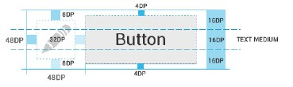

#  使用android.view.TouchDelegate扩大View的触摸点击区域

来源:[CSDN](http://blog.csdn.net/tongcpp/article/details/23450975)

Android4.0设计规定的有效可触摸的UI元素标准是48dp，转化为一个物理尺寸约为9毫米。7~10毫米，这是一个用户手指能准确并且舒适触摸的区域。

如下图所示，你的UI元素可能小于48dp，图标仅有32dp，按钮仅有40dp，但是他们的实际可操作焦点区域最好都应达到48dp的大小。



为使小的UI区域获得良好的触摸交互，根据View的特性，目前碰到了两种情况：

* 1.如ImageView，设置其padding值，可触摸区域将向外扩展；
* 2.如Button，设置其padding值，可触摸区域不变，其内内容显示区域向内压缩；

情况1的控件，可直接设置其padding值达到目的，如 `android:padding="10dp"`,情况2的控件，可使用`TouchDelegate`动态修改其触摸区域，达到扩大点击范围的效果

```

/**
 * 扩大View的触摸和点击响应范围,最大不超过其父View范围
 * 
 * @param view
 * @param top
 * @param bottom
 * @param left
 * @param right
 */
public static void expandViewTouchDelegate(final View view, final int top,
		final int bottom, final int left, final int right) {

	((View) view.getParent()).post(new Runnable() {
		@Override
		public void run() {
			Rect bounds = new Rect();
			view.setEnabled(true);
			view.getHitRect(bounds);

			bounds.top -= top;
			bounds.bottom += bottom;
			bounds.left -= left;
			bounds.right += right;

			TouchDelegate touchDelegate = new TouchDelegate(bounds, view);

			if (View.class.isInstance(view.getParent())) {
				((View) view.getParent()).setTouchDelegate(touchDelegate);
			}
		}
	});
}
```

采取此种方法的两点注意：

* 1、若View的自定义触摸范围超出Parent的大小，则超出的那部分无效。
* 2、一个Parent只能设置一个View的TouchDelegate，设置多个时只有最后设置的生效。

若需要恢复该View的触摸范围：

```
/**
 * 还原View的触摸和点击响应范围,最小不小于View自身范围
 * 
 * @param view
 */
public static void restoreViewTouchDelegate(final View view) {

	((View) view.getParent()).post(new Runnable() {
		@Override
		public void run() {
			Rect bounds = new Rect();
			bounds.setEmpty();
			TouchDelegate touchDelegate = new TouchDelegate(bounds, view);

			if (View.class.isInstance(view.getParent())) {
				((View) view.getParent()).setTouchDelegate(touchDelegate);
			}
		}
	});
}
```

使用TouchDelegate扩大View的触摸响应范围是一种比较灵活的方法，有时可与设置padding的方式结合使用。

## 更新

======

后期实际开发中发现，使用post runnable的方式去设置Delegate区域大小的原因是，如该View师在Activity的OnCreate()或Fragment的OnCreateView()中绘制，此时UI界面尚未开始绘制，无法获得正确的坐标；

若将此法应用在ListView的getView()中绘制每个ItemView时，则Delegate的设置将部分失效，原因是ListView的绘制较特殊，可能无法获取到部分还未绘制出的View的正确坐标。解决方案具体可参考以下参考阅读所列。

## 参考阅读：

通过自定义View的方式，及某些其他情况的处理：

* 1.《Android使用TouchDelegate增加View的触摸范围》 [http://blog.csdn.net/sgwhp/article/details/10963383](http://blog.csdn.net/sgwhp/article/details/10963383)
* 2.《ListView Tips & Tricks #5: Enlarged Touchable Areas》 [http://cyrilmottier.com/2012/02/16/listview-tips-tricks-5-enlarged-touchable-areas/](http://cyrilmottier.com/2012/02/16/listview-tips-tricks-5-enlarged-touchable-areas/)
* 3.《Extend touchable areas #Android》 [https://plus.google.com/u/0/+JulienDodokal/posts/8zoV3RQvReS](https://plus.google.com/u/0/+JulienDodokal/posts/8zoV3RQvReS)
