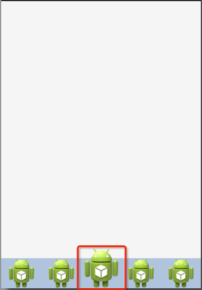

# 神奇的android:clipChildren属性
来源:[cnblogs](http://www.cnblogs.com/over140/p/3508335.html)

## 前言

前几天有在微博上推荐过一个博客，看他文章时发现了这个属性。有些属性不常用，但需要的时候非常有用，于是做了个例子，正好项目用到，与大家分享一下。

## 声明

欢迎转载，请注明出处！

博客园：http://www.cnblogs.com/

农民伯伯： http://www.cnblogs.com/over140/

## 正文

### 一、效果图



看到这个图时你可以先想想如果是你，你怎么实现这个效果。马上想到用RelativeLayout？NO,NO,NO,,,

### 二、实现代码

```
<?xml version="1.0" encoding="utf-8"?>
<LinearLayout xmlns:android="http://schemas.android.com/apk/res/android"
    android:layout_width="match_parent"
    android:layout_height="match_parent"
    android:clipChildren="false"
    android:orientation="vertical" >

    <android.support.v4.view.ViewPager
        android:id="@+id/view_pager"
        android:layout_width="match_parent"
        android:layout_height="0dip"
        android:layout_weight="1.0" />

    <LinearLayout
        android:layout_width="match_parent"
        android:layout_height="48dip"
        android:background="#B0C4DE"
        android:orientation="horizontal" >

        <ImageView
            android:layout_width="0dip"
            android:layout_height="fill_parent"
            android:layout_weight="1.0"
            android:scaleType="fitCenter"
            android:src="@drawable/ic_launcher" />

        <ImageView
            android:layout_width="0dip"
            android:layout_height="fill_parent"
            android:layout_weight="1.0"
            android:scaleType="fitCenter"
            android:src="@drawable/ic_launcher" />

        <ImageView
             android:layout_width="0dip"
            android:layout_height="64dip"
            android:layout_gravity="bottom"
            android:layout_weight="1.0"
            android:scaleType="fitCenter"
            android:src="@drawable/ic_launcher" />

        <ImageView
            android:layout_width="0dip"
            android:layout_height="fill_parent"
            android:layout_weight="1.0"
            android:scaleType="fitCenter"
            android:src="@drawable/ic_launcher" />

        <ImageView
            android:layout_width="0dip"
            android:layout_height="fill_parent"
            android:layout_weight="1.0"
            android:scaleType="fitCenter"
            android:src="@drawable/ic_launcher" />
    </LinearLayout>

</LinearLayout>
```

代码说明：

* 1、只需在根节点设置android:clipChildren为false即可，默认为true

* 2、可以通过android:layout_gravity控制超出的部分如何显示。

* 3、android:clipChildren的意思：是否限制子View在其范围内

### 三、 其他

在做动画的时候非常有用（听说的，，，回头写例子试试看）