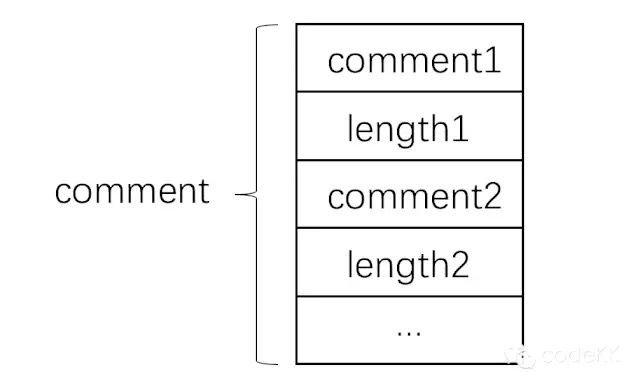

# 一种为 Apk 动态写入信息的方案

来源:[微信公众号](http://mp.weixin.qq.com/s?__biz=MzAxNjI3MDkzOQ==&mid=405919721&idx=1&sn=fdad21c0bc74d90e66443d488e8cdc8f#rd)

这篇文章来自天猫无线-基础业务团队童鞋的投稿。

他们之前投稿过一篇《Android App 安全的 HTTPS 通信》，建议大家到历史记录看看。

## 1. 背景

我们在日常使用应用可能会遇到以下场景。 

* 场景1： 用户浏览 H5 页面时，通过该页面下载链接下载安装 App，启动会来到首页而不是用户之前浏览的 H5 页面，造成使用场景的割裂。

* 场景2： 用户通过二维码把一个页面分享出去，没有装猫客的用户如果直接安装启动后，无法回到分享的页面。

如果用户在当前页面下载了应用，安装之后直接跳转到刚才浏览的界面，不仅可以将这一部分流量引回客户端，还可以让用户获得完整的用户体验。下面提出一种方案来满足这个业务需求。

## 2. 原理
Android 使用的 Apk 包的压缩方式是 zip，与 zip 有相同的文件结构，在 zip 文件的末尾有一个 Central Directory Record 区域，其末尾包含一个 File comment 区域，可以存放一些数据，所以 File comment 是 zip 文件一部分，如果可以正确的修改这个部分，就可以在不破坏压缩包、不用重新打包的的前提下快速的给 Apk 文件写入自己想要的数据。

comment 是在 Central Directory Record 末尾储存的，可以将数据直接写在这里，下表是 header 末尾的结构。

<center>End of central directory record(EOCD)</center>

|Offset|Bytes|Description|
|:--|:--|:--|
|0|4|End of central directory signature=0x06054b50|
|4|2|Number of this disk|
|6|2|Disk where central directory starts|
|8|2|Number of central directory records on this disk|
|10|2|Total number of central directory records|
|12|4|Size of central dirctory(bytes)|
|16|4|Offset of start of central directory,relative to start of archive|
|20|2|Comment length(n)|
|22|n|Comment|

从表中可以看到定义 comment 长度的字段位于 comment 之前，当我们从文件最后开始读取时，由于 comment 数据是不确定的，我们无法知道它的长度，从而也无法从 zip 中直接获取 Comment length。

这里我们需要自定义 comment，在自定义 comment 内容的后面添加一个区域储存 comment 的长度，结构如下图。



## 3. 实现

### 1 服务端将数据写入 Apk 的 comment
这一部分可以在本地或服务端进行，需要定义一个长度为 2 的 byte[] 来储存 comment 的长度，直接使用 Java 的 api 就可以把 comment 和 comment 的长度写到 Apk 的末尾，代码如下：

```
public static void writeApk(File file, String comment) {
   ZipFile zipFile = null;
   ByteArrayOutputStream outputStream = null;
   RandomAccessFile accessFile = null;
   try {
       zipFile = new ZipFile(file);
       String zipComment = zipFile.getComment();
       if (zipComment != null) {
           return;
       }

       byte[] byteComment = comment.getBytes();
       outputStream = new ByteArrayOutputStream();

       outputStream.write(byteComment);
       outputStream.write(short2Stream((short) byteComment.length));

       byte[] data = outputStream.toByteArray();

       accessFile = new RandomAccessFile(file, "rw");
       accessFile.seek(file.length() - 2);
       accessFile.write(short2Stream((short) data.length));
       accessFile.write(data);
   } catch (IOException e) {
       e.printStackTrace();
   } finally {
       try {
           if (zipFile != null) {
               zipFile.close();
           }
           if (outputStream != null) {
               outputStream.close();
           }
           if (accessFile != null) {
               accessFile.close();
           }
       } catch (Exception e) {

       }

   }}
```

### 2 Apk 中读取 comment 数据
首先获取 Apk 的路径，通过`context`中的`getPackageCodePath()`方法就可以获取，代码如下：

```
public static String getPackagePath(Context context) {
   if (context != null) {
       return context.getPackageCodePath();
   }
   return null;
}
```

获取 Apk 路径之后就可以读取`comment`的内容了，这里不能直接使用 ZipFile中的`getComment()`方法直接获取 comment，因为这个方法是 Java7 中的方法，在 android4.4 之前是不支持 Java7 的，所以我们需要自己去读取 Apk 文件中的 comment。

首先根据之前自定义的结构，先读取写在最后的 comment 的长度，根据这个长度，才可以获取真正 comment 的内容，代码如下：

```
public static String readApk(File file) {
   byte[] bytes = null;
   try {
       RandomAccessFile accessFile = new RandomAccessFile(file, "r");
       long index = accessFile.length();

       bytes = new byte[2];
       index = index - bytes.length;
       accessFile.seek(index);
       accessFile.readFully(bytes);

       int contentLength = stream2Short(bytes, 0);

       bytes = new byte[contentLength];
       index = index - bytes.length;
       accessFile.seek(index);
       accessFile.readFully(bytes);

       return new String(bytes, "utf-8");
   } catch (FileNotFoundException e) {
       e.printStackTrace();
   } catch (IOException e) {
       e.printStackTrace();
   }
   return null;
}
```
   
这里的`stream2Short()`和`short2Stream()`参考了`MultiChannelPackageTool`中的方法。

## 4. 测试

在生成 Apk 后，调用下面的代码写入我们想要的数据，

```
File file = new File("/Users/zhaolin/app-debug.apk");writeApk(file, "test comment");
```

安装这个 Apk 之后运行，让 comment 显示在屏幕上，运行结果如下。


运行结果符合预期，安装包也没有被破坏，可以正常安装。

## 5. 结论
通过修改 comment 将数据传递给 App 的方案是可行的，由于是修改 Apk 自有的数据，并不会对 Apk 造成破坏，修改后可以正常安装。

这种方案不用重新打包 Apk，并且在服务端只是写文件的操作，效率很高，可以适用于动态生成 Apk 的场景。

可以通过这个方案进行 H5 到 App 的引流，用户操作不会产生割裂感，保证用户体验的统一。
## 6. 参考

https://github.com/mcxiaoke/packer-ng-plugin
https://github.com/seven456/MultiChannelPackageTool

以上两个开源项目都是利用同样的原理实现 Android 快速打渠道包

关于渠道包美团有个类似的 hack 方式，通过添加固定规则文件名的空文件，避免重新签名，从而实现一分钟打近千个渠道包。可回复 30 查看《国内四个不错的技术团体博客》中介绍
