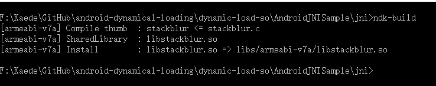
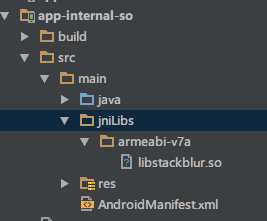
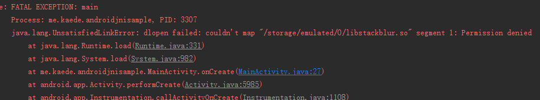
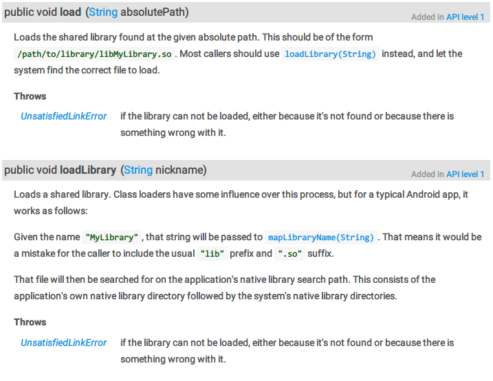

# Android动态加载补充 加载SD卡中的SO库

来源:[segmentfault.com](http://segmentfault.com/a/1190000004062899)

## JNI与NDK

Android中JNI的使用其实就包含了动态加载，APP运行时动态加载`.so`库并通过JNI调用其封装好的方法。后者一般是使用NDK工具从C/C++代码编译而成，运行在Native层，效率会比执行在虚拟机的Java代码高很多，所以Android中经常通过动态加载`.so`库来完成一些对性能比较有需求的工作（比如T9搜索、或者Bitmap的解码、图片高斯模糊处理等）。此外，由于`.so`库是由C++编译而来的，只能被反编译成汇编代码，相比Smali更难被破解，因此`.so`库也可以被用于安全领域。

与我们常说的基于ClassLoader的动态加载不同，SO库的加载是使用System类的（由此可见对SO库的支持也是Android的基础功能），所以这里这是作为补充说明。不过，如果使用ClassLoader加载SD卡里插件APK，而插件APK里面包含有SO库，这就涉及到了对插件APK里的SO库的加载，所以我们也要知道如何加载SD卡里面的SO库。

## 一般的SO文件的使用姿势

以一个“图片高斯模糊”的功能为例，如果使用Java代码对图像Bitmap的每一个像素点进行计算，那整体耗时将会非常大，所以可以考虑使用JNI。（详细的JNI使用教程网络上有许多，这里不赘述）

这里推荐一个开源的高斯模糊项目 [Android StackBlur](https://github.com/kikoso/android-stackblur)

在命令行定位到Android.mk文件所在目录，运行NDK工具的`ndk-build`命令就能编译出我们需要SO库



再把SO库复制到Android Studio项目的jniLibs目录中



（Android Studio现在也支持直接编译SO库，但是有许多坑，这里我选择手动编译）

接着在Java中把SO库对应的模块加载进来

```
// load so file from internal directory
try {
	System.loadLibrary("stackblur");
	NativeBlurProcess.isLoadLibraryOk.set(true);
	Log.i("MainActivity", "loadLibrary success!");
} catch (Throwable throwable) {
	Log.i("MainActivity", "loadLibrary error!" + throwable);
}
```

加载成功后就可以直接使用Native方法了

```
public class NativeBlurProcess {
    public static AtomicBoolean isLoadLibraryOk = new AtomicBoolean(false);
    //native method
    private static native void functionToBlur(Bitmap bitmapOut, int radius, int threadCount, int threadIndex, int round);
}
```

由此可见，在Android项目中，SO库的使用也是一种动态加载，在运行时把可执行文件加载进来。一般情况下，SO库都是打包在APK内部的，不允许修改。这种“动态加载”看起来不是我们熟悉的那种啊，貌似没什么卵用。不过，其实SO库也是可以存放在外部存储路径的。

## 如何把SO文件存放在外部存储

注意到上面加载SO库的时候我们用到了System类的“loadLibrary”方法，同时我们也发现System类还有一个“load”方法，看起来差不多啊，看看他们有什么区别吧！

```
/**
 * See {@link Runtime#load}.
 */
public static void load(String pathName) {
    Runtime.getRuntime().load(pathName, VMStack.getCallingClassLoader());
}

/**
 * See {@link Runtime#loadLibrary}.
 */
public static void loadLibrary(String libName) {
    Runtime.getRuntime().loadLibrary(libName, VMStack.getCallingClassLoader());
}
```

先看看loadLibrary，这里调用了Runtime的loadLibrary，进去一看，又是动态加载熟悉的ClassLoader了（这里也佐证了SO库的使用就是一种动态加载的说法）

```
public void loadLibrary(String nickname) {
    loadLibrary(nickname, VMStack.getCallingClassLoader());
}

/*
 * Searches for and loads the given shared library using the given ClassLoader.
 */
void loadLibrary(String libraryName, ClassLoader loader) {
    if (loader != null) {
        String filename = loader.findLibrary(libraryName);
        if (filename == null) {
            // It's not necessarily true that the ClassLoader used
            // System.mapLibraryName, but the default setup does, and it's
            // misleading to say we didn't find "libMyLibrary.so" when we
            // actually searched for "liblibMyLibrary.so.so".
            throw new UnsatisfiedLinkError(loader + " couldn't find \"" +
                                           System.mapLibraryName(libraryName) + "\"");
        }
        String error = doLoad(filename, loader);
        if (error != null) {
            throw new UnsatisfiedLinkError(error);
        }
        return;
    }
    ...
}
```

看样子就像是通过库名获取一个文件路径，再调用“doLoad”方法加载这个文件，先看看`loader.findLibrary(libraryName)`

```
protected String findLibrary(String libName) {
	return null;
}
```

ClassLoader只是一个抽象类，它的大部分工作都在BaseDexClassLoader类中实现，进去看看

```
public class BaseDexClassLoader extends ClassLoader {
    public String findLibrary(String name) {
        throw new RuntimeException("Stub!");
    }
}
```

不对啊，这里只是抛了一个`RuntimeException`异常，什么都没做啊！

其实这里有一个误区，也是刚开始开Android SDK源码的同学容易搞混的。Android SDK自带的源码其实只是给我们开发者参考的，基本只是一些常用的类，Google不会把整个Android系统的源码都放到这里来，因为整个项目非常大，ClassLoader类平时我们接触得少，所以它的具体实现的源码并没有打包进SDK里，如果需要，我们要到官方AOSP项目里面去看（顺便一提，整个AOSP5.1项目大小超过150GB，真的有需要的话推荐用一个移动硬盘存储）。

这里为了方便，我们可以直接看在线的代码 [BaseDexClassLoader.java](https://android.googlesource.com/platform/libcore-snapshot/+/ics-mr1/dalvik/src/main/java/dalvik/system/BaseDexClassLoader.java)

```
@Override
public String findLibrary(String name) {
	return pathList.findLibrary(name);
}
```

再看进去DexPathList类

```
/**
 * Finds the named native code library on any of the library
 * directories pointed at by this instance. This will find the
 * one in the earliest listed directory, ignoring any that are not
 * readable regular files.
 *
 * @return the complete path to the library or {@code null} if no
 * library was found
 */
public String findLibrary(String libraryName) {
    String fileName = System.mapLibraryName(libraryName);
    for (File directory : nativeLibraryDirectories) {
        File file = new File(directory, fileName);
        if (file.exists() && file.isFile() && file.canRead()) {
            return file.getPath();
        }
    }
    return null;
}
```

到这里已经明朗了，根据传进来的libName，扫描APK内部的nativeLibrary目录，获取并返回内部SO库文件的完整路径filename。再回到Runtime类，获取filename后调用了“doLoad”方法，看看

```
private String doLoad(String name, ClassLoader loader) {
    String ldLibraryPath = null;
    String dexPath = null;
    if (loader == null) {
        ldLibraryPath = System.getProperty("java.library.path");
    } else if (loader instanceof BaseDexClassLoader) {
        BaseDexClassLoader dexClassLoader = (BaseDexClassLoader) loader;
        ldLibraryPath = dexClassLoader.getLdLibraryPath();
    }
    synchronized (this) {
        return nativeLoad(name, loader, ldLibraryPath);
    }
}
```

到这里就彻底清楚了，调用Native方法“nativeLoad”，通过完整的SO库路径filename，把目标SO库加载进来。

说了半天还没有进入正题呢，不过我们可以想到，如果使用loadLibrary方法，到最后还是要找到目标SO库的完整路径，再把SO库加载进来，那我们能不能一开始就给出SO库的完整路径，然后直接加载进来？我们猜想load方法就是干这个的，看看。

```
void load(String absolutePath, ClassLoader loader) {
    if (absolutePath == null) {
        throw new NullPointerException("absolutePath == null");
    }
    String error = doLoad(absolutePath, loader);
    if (error != null) {
        throw new UnsatisfiedLinkError(error);
    }
}
```

我勒个去，一上来就直接来到doLoad方法了，这证明我们的猜想可能是正确的，那么在实际项目中测试看看吧！

我们先把SO放在Asset里，然后再复制到内部存储，再使用load方法把其加载进来。

```
public class MainActivity extends AppCompatActivity {
    @Override
    protected void onCreate(Bundle savedInstanceState) {
        super.onCreate(savedInstanceState);
        setContentView(R.layout.activity_main);

        File dir = this.getDir("jniLibs", Activity.MODE_PRIVATE);
        File distFile = new File(dir.getAbsolutePath() + File.separator + "libstackblur.so");

        if (copyFileFromAssets(this, "libstackblur.so", distFile.getAbsolutePath())){
            //使用load方法加载内部储存的SO库
            System.load(distFile.getAbsolutePath());
            NativeBlurProcess.isLoadLibraryOk.set(true);
        }
    }

    public void onDoBlur(View view){
        ImageView imageView = (ImageView) findViewById(R.id.iv_app);
        Bitmap bitmap = BitmapFactory.decodeResource(getResources(), android.R.drawable.sym_def_app_icon);
        Bitmap blur = NativeBlurProcess.blur(bitmap,20,false);
        imageView.setImageBitmap(blur);
    }


    public static boolean copyFileFromAssets(Context context, String fileName, String path) {
        boolean copyIsFinish = false;
        try {
            InputStream is = context.getAssets().open(fileName);
            File file = new File(path);
            file.createNewFile();
            FileOutputStream fos = new FileOutputStream(file);
            byte[] temp = new byte[1024];
            int i = 0;
            while ((i = is.read(temp)) > 0) {
                fos.write(temp, 0, i);
            }
            fos.close();
            is.close();
            copyIsFinish = true;
        } catch (IOException e) {
            e.printStackTrace();
            Log.e("MainActivity", "[copyFileFromAssets] IOException "+e.toString());
        }
        return copyIsFinish;
    }
}
```

点击onDoBlur按钮，果然加载成功了！


那能不能直接加载外部存储上面的SO库呢，把SO库拷贝到SD卡上面试试。



看起来是不可以的样子，Permission denied！

> java.lang.UnsatisfiedLinkError: dlopen failed: couldn't map "/storage/emulated/0/libstackblur.so" segment 1: Permission denied

看起来像是没有权限的样子，看看源码哪里抛出的异常吧

```
/*
 * Loads the given shared library using the given ClassLoader.
 */
void load(String absolutePath, ClassLoader loader) {
    if (absolutePath == null) {
        throw new NullPointerException("absolutePath == null");
    }
    String error = doLoad(absolutePath, loader);
    if (error != null) {
        // 这里抛出的异常
        throw new UnsatisfiedLinkError(error);
    }
}
```

应该是执行doLoad方法时出现了错误，但是上面也看过了，doLoad方法里调用了Native方法`nativeLoad`，那应该就是Native代码里出现的错误。平时我很少看到Native里面，上一次看的时候，是因为需要看看点九图NinePathDrawable的缩放控制信息chunk数组的具体作用是怎么样，费了好久才找到我想要的一小段代码。所以这里就暂时不跟进去了，有兴趣的同学可以告诉我关键代码的位置。

我在一个Google的开发者论坛上找到了一些答案

> The SD Card is mounted noexec, so I'm not sure this will work.

Moreover, using the SD Card as a storage location is a really bad idea, since any other application can modify/delete/corrupt it easily.
Try downloading the library to your application's data directory instead, and load it from here.

这也容易理解，SD卡等外部存储路径是一种可拆卸的（mounted）不可执行（noexec）的储存媒介，不能直接用来作为可执行文件的运行目录，使用前应该把可执行文件复制到APP内部存储再运行。

最后，我们也可以看看官方的API文档



看来load方法的用途和我们理解的一致，文档里说的shared library就是指SO库（shared object），至此，我们就可以把SO文件移动到外部存储了，或者从网络下载都行。


