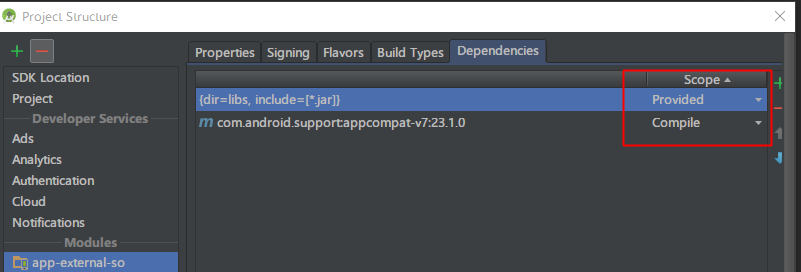

# Android动态加载进阶 代理Activity模式

来源:[segmentfault.com](http://segmentfault.com/a/1190000004062972)

## 技术背景

简单模式中，使用ClassLoader加载外部的Dex或Apk文件，可以加载一些本地APP不存在的类，从而执行一些新的代码逻辑。但是使用这种方法却不能直接启动插件里的Activity。

## 启动没有注册的Activity的两个主要问题

Activity等组件是需要在Manifest中注册后才能以标准Intent的方式启动的（如果有兴趣强烈推荐你了解下Activity生命周期实现的机制及源码），通过ClassLoader加载并实例化的Activity实例只是一个普通的Java对象，能调用对象的方法，但是它没有生命周期，而且Activity等系统组件是需要Android的上下文环境的（Context等资源），没有这些东西Activity根本无法工作。

使用插件APK里的Activity需要解决两个问题：

* 如何使插件APK里的Activity具有生命周期；
* 如何使插件APK里的Activity具有上下文环境（使用R资源）；

代理Activity模式为解决这两个问题提供了一种思路。

## 代理Activity模式

这种模式也是我们项目中，继“简单动态加载模式”之后，第二种投入实际生产项目的开发方式。

其主要特点是：主项目APK注册一个代理Activity（命名为ProxyActivity），ProxyActivity是一个普通的Activity，但只是一个空壳，自身并没有什么业务逻辑。每次打开插件APK里的某一个Activity的时候，都是在主项目里使用标准的方式启动ProxyActivity，再在ProxyActivity的生命周期里同步调用插件中的Activity实例的生命周期方法，从而执行插件APK的业务逻辑。

> ProxyActivity + 没注册的Activity = 标准的Activity

下面谈谈代理模式是怎么处理上面提到的两个问题的。

### 处理插件Activity的生命周期

目前还真的没什么办法能够处理这个问题，一个Activity的启动，如果不采用标准的Intent方式，没有经历过Android系统Framework层级的一系列初始化和注册过程，它的生命周期方法是不会被系统调用的（除非你能够修改Android系统的一些代码，而这已经是另一个领域的话题了，这里不展开）。

那把插件APK里所有Activity都注册到主项目的Manifest里，再以标准Intent方式启动。但是事先主项目并不知道插件Activity里会新增哪些Activity，如果每次有新加的Activity都需要升级主项目的版本，那不是本末倒置了，不如把插件的逻辑直接写到主项目里来得方便。

那就绕绕弯吧，生命周期不就是系统对Activity一些特定方法的调用嘛，那我们可以在主项目里创建一个ProxyActivity，再由它去代理调用插件Activity的生命周期方法（这也是代理模式叫法的由来）。用ProxyActivity（一个标准的Activity实例）的生命周期同步控制插件Activity（普通类的实例）的生命周期，同步的方式可以有下面两种：

* 在ProxyActivity生命周期里用反射调用插件Activity相应生命周期的方法，简单粗暴。
* 把插件Activity的生命周期抽象成接口，在ProxyActivity的生命周期里调用。另外，多了这一层接口，也方便主项目控制插件Activity。

这里补充说明下，Fragment自带生命周期，用Fragment来代替Activity开发可以省去大部分生命周期的控制工作，但是会使得界面跳转比较麻烦，而且Honeycomb以前没有Fragment，无法在API11以前的系统使用。

### 在插件Activity里使用R资源

使用代理的方式同步调用生命周期的做法容易理解，也没什么问题，但是要使用插件里面的res资源就有点麻烦了。简单的说，res里的每一个资源都会在R.java里生成一个对应的Integer类型的id，APP启动时会先把R.java注册到当前的上下文环境，我们在代码里以R文件的方式使用资源时正是通过使用这些id访问res资源，然而插件的R.java并没有注册到当前的上下文环境，所以插件的res资源也就无法通过id使用了。

这个问题困扰了我们很久，一开始的项目急于投入生产，所以我们索性抛开res资源，插件里需要用到的新资源都通过纯Java代码的方式创建（包括XML布局、动画、点九图等），蛋疼但有效。知道网上出现了解决这一个问题的有效方法（一开始貌似是在手机QQ项目中出现的，但是没有开源所以不清楚，在这里真的佩服这些对技术这么有追求的开发者）。

记得我们平时怎么使用res资源的吗，就是`getResources().getXXX(resid)`，看看`getResources()`

```
@Override
public Resources getResources() {
    if (mResources != null) {
        return mResources;
    }
    if (mOverrideConfiguration == null) {
        mResources = super.getResources();
        return mResources;
    } else {
        Context resc = createConfigurationContext(mOverrideConfiguration);
        mResources = resc.getResources();
        return mResources;
    }
}
```

看起来像是通过mResources实例获取res资源的，在找找mResources实例是怎么初始化的，看看上面的代码发现是使用了super类ContextThemeWrapper里的“getResources()”方法，看进去

```
Context mBase;
public ContextWrapper(Context base) {
	mBase = base;
}

@Override
public Resources getResources(){
	return mBase.getResources();
}
```

看样子又调用了Context的“getResources()”方法，看到这里，我们知道Context只是个抽象类，其实际工作都是在ContextImpl完成的，赶紧去ContextImpl里看看“getResources()”方法吧

```
@Override
public Resources getResources() {
	return mResources;
}
```

你TM在逗我么，还是没有mResources的创建过程啊！啊，不对，mResources是ContextImpl的成员变量，可能是在构造方法中创建的，赶紧去看看构造方法（这里只给出关键代码）。

```
resources = mResourcesManager.getTopLevelResources(packageInfo.getResDir(),
		packageInfo.getSplitResDirs(), packageInfo.getOverlayDirs(),
        packageInfo.getApplicationInfo().sharedLibraryFiles, displayId,
        overrideConfiguration, compatInfo);
mResources = resources;
```

看样子是在ResourcesManager的“getTopLevelResources”方法中创建的，看进去

```
Resources getTopLevelResources(String resDir, String[] splitResDirs,
        String[] overlayDirs, String[] libDirs, int displayId,
        Configuration overrideConfiguration, CompatibilityInfo compatInfo) {
    Resources r;
    AssetManager assets = new AssetManager();
    if (libDirs != null) {
        for (String libDir : libDirs) {
            if (libDir.endsWith(".apk")) {
                if (assets.addAssetPath(libDir) == 0) {
                    Log.w(TAG, "Asset path '" + libDir +
                            "' does not exist or contains no resources.");
                }
            }
        }
    }
    DisplayMetrics dm = getDisplayMetricsLocked(displayId);
    Configuration config ……;
    r = new Resources(assets, dm, config, compatInfo);
    return r;
}
```


看来这里是关键了，看样子就是通过这些代码从一个APK文件加载res资源并创建Resources实例，经过这些逻辑后就可以使用R文件访问资源了。具体过程是，获取一个AssetManager实例，使用其“addAssetPath”方法加载APK（里的资源），再使用DisplayMetrics、Configuration、CompatibilityInfo实例一起创建我们想要的Resources实例。

最终访问插件APK里res资源的关键代码如下

```
try {  
	AssetManager assetManager = AssetManager.class.newInstance();  
	Method addAssetPath = assetManager.getClass().getMethod("addAssetPath", String.class);  
	addAssetPath.invoke(assetManager, mDexPath);  
        mAssetManager = assetManager;  
} catch (Exception e) {  
	e.printStackTrace();  
}  
Resources superRes = super.getResources();  
mResources = new Resources(mAssetManager, superRes.getDisplayMetrics(),  
            superRes.getConfiguration());
```

注意，有的人担心从插件APK加载进来的res资源的ID可能与主项目里现有的资源ID冲突，其实这种方式加载进来的res资源并不是融入到主项目里面来，主项目里的res资源是保存在ContextImpl里面的Resources实例，整个项目共有，而新加进来的res资源是保存在新创建的Resources实例的，也就是说ProxyActivity其实有两套res资源，并不是把新的res资源和原有的res资源合并了（所以不怕R.id重复），对两个res资源的访问都需要用对应的Resources实例，这也是开发时要处理的问题。（其实应该有3套，Android系统会加载一套framework-res.apk资源，里面存放系统默认Theme等资源）

额外补充下，这里你可能注意到了我们采用了反射的方法调用AssetManager的`addAssetPath`方法，而在上面ResourcesManager中调用AssetManager的`addAssetPath`方法是直接调用的，不用反射啊，而且看看SDK里AssetManager的`addAssetPath`方法的源码（这里也能看到具体APK资源的提取过程是在Native里完成的），发现它也是public类型的，外部可以直接调用，为什么还要用反射呢？

```
/**
* Add an additional set of assets to the asset manager.  This can be
* either a directory or ZIP file.  Not for use by applications.  Returns
* the cookie of the added asset, or 0 on failure.
* {@hide}
*/
public final int addAssetPath(String path) {
	synchronized (this) {
		int res = addAssetPathNative(path);
		makeStringBlocks(mStringBlocks);
		return res;
	}
}
```

这里有个误区，SDK的源码只是给我们参考用的，APP实际上运行的代码逻辑在android.jar里面（位于`android-sdk\platforms\android-XX`），反编译android.jar并找到ResourcesManager类就可以发现这些接口都是对应用层隐藏的。

```
public final class AssetManager{
  AssetManager(){throw new RuntimeException("Stub!"); } 
  public void close() { throw new RuntimeException("Stub!"); } 
  public final InputStream open(String fileName) throws IOException { throw new RuntimeException("Stub!"); } 
  public final InputStream open(String fileName, int accessMode) throws IOException { throw new RuntimeException("Stub!"); } 
  public final AssetFileDescriptor openFd(String fileName) throws IOException { throw new RuntimeException("Stub!"); } 
  public final native String[] list(String paramString) throws IOException;

  public final AssetFileDescriptor openNonAssetFd(String fileName) throws IOException { throw new RuntimeException("Stub!"); } 
  public final AssetFileDescriptor openNonAssetFd(int cookie, String fileName) throws IOException { throw new RuntimeException("Stub!"); } 
  public final XmlResourceParser openXmlResourceParser(String fileName) throws IOException { throw new RuntimeException("Stub!"); } 
  public final XmlResourceParser openXmlResourceParser(int cookie, String fileName) throws IOException { throw new RuntimeException("Stub!"); } 
  protected void finalize() throws Throwable { throw new RuntimeException("Stub!");
  }
  public final native String[] getLocales();
}
```

到此，启动插件里的Activity的两大问题都有解决的方案了。


## 代理模式的具体项目 

* [dynamic-load-apk](https://github.com/singwhatiwanna/dynamic-load-apk)

上面只是分析了代理模式的关键技术点，如果运用到具体项目中去的话，除了两个关键的问题外，还有许多繁琐的细节需要处理，我们需要设计一个框架，规范插件APK项目的开发，也方便以后功能的扩展。这里，dynamic-load-apk向我们展示了许多优秀的处理方法，比如：

* 把Activity关键的生命周期方法抽象成DLPlugin接口，ProxyActivity通过DLPlugin代理调用插件Activity的生命周期；
* 设计一个基础的BasePluginActivity类，插件项目里使用这些基类进行开发，可以以接近常规Android开发的方式开发插件项目；
* 以类似的方式处理Service的问题；
* 处理了大量常见的兼容性问题（比如使用Theme资源时出现的问题）；
* 处理了插件项目里的so库的加载问题；
* 使用PluginPackage管理插件APK，从而可以方便地管理多个插件项目；

### 处理插件项目里的so库的加载

这里需要把插件APK里面的SO库文件解压释放出来，在根据当前设备CPU的型号选择对应的SO库，并使用System.load方法加载到当前内存中来，具体分析请参考[加载SD卡的SO库](3-加载SD卡的SO库.md)。

### 多插件APK的管理

动态加载一个插件APK需要三个对应的`DexClassLoader`、`AssetManager`、`Resources`实例，可以用组合的方式创建一个`PluginPackage`类存放这三个变量，再创建一个管理类`PluginManager`，用成员变量`HashMap<dexPath,pluginPackage>`的方式保存`PluginPackage`实例。

具体的代码请参考原项目的文档、源码以及Sample里面的示例代码，在这里感谢[singwhatiwanna](https://github.com/singwhatiwanna)的开源精神。

## 实际应用中可能要处理的问题

## 插件APK的管理后台

使用动态加载的目的，就是希望可以绕过APK的安装过程升级应用的功能，如果插件APK是打包在主项目内部的那动态加载纯粹是多次一举。更多的时候我们希望可以在线下载插件APK，并且在插件APK有新版本的时候，主项目要从服务器下载最新的插件替换本地已经存在的旧插件。为此，我们应该有一个管理后台，它大概有以下功能：

* 上传不同版本的插件APK，并向APP主项目提供插件APK信息查询功能和下载功能；
* 管理在线的插件APK，并能向不同版本号的APP主项目提供最合适的插件APK；
* 万一最新的插件APK出现紧急BUG，要提供旧版本回滚功能；
* 出于安全考虑应该对APP项目的请求信息做一些安全性校验；

## 插件APK合法性校验

加载外部的可执行代码，一个逃不开的问题就是要确保外部代码的安全性，我们可不希望加载一些来历不明的插件APK，因为这些插件有的时候能访问主项目的关键数据。

**最简单可靠的做法就是校验插件APK的MD5值，如果插件APK的MD5与我们服务器预置的数值不同，就认为插件被改动过，弃用。**

## 是热部署，还是插件化？

这一部分作为补充说明，如果不太熟悉动态加载的使用姿势，可能不是那么容易理解。

谈到动态加载的时候我们经常说到“热部署”和“插件化”这些名词，它们虽然都和动态加载有关，但是还是有一点区别，这个问题涉及到主项目与插件项目的交互方式。前面我们说到，动态加载方式，可以在“项目层级”做到代码分离，按道理我们希望是主项目和插件项目不要有任何交互行为，实际上也应该如此！这样做不仅能确保项目的安全性，也能简化开发工作，所以一般的做法是

### 只有在用户使用到的时候才加载插件

主项目还是像常规Android项目那样开发，只有用户使用插件APK的功能时才动态加载插件并运行，插件一旦运行后，与主项目没有任何交互逻辑，只有在主项目启动插件的时候才触发一次调用插件的行为。比如，我们的主项目里有几款推广的游戏，平时在用户使用主项目的功能时，可以先静默把游戏（其实就是一个插件APK）下载好，当用户点击游戏入口时，以动态加载的方式启动游戏，游戏只运行插件APK里的代码逻辑，结束后返回主项目界面。

### 一启动主项目就加载插件

另外一种完全相反的情形是，主项目只提供一个启动的入口，以及从服务器下载最新插件的更新逻辑，这两部分的代码都是长期保持不变的，应用一启动就动态加载插件，所有业务逻辑的代码都在插件里实现。比如现在一些游戏市场都要求开发者接入其SDK项目，如果SDK项目采用这种开发方式，先提供一个空壳的SDK给开发者，空壳SDK能从服务器下载最新的插件再运行插件里的逻辑，就能保证开发者开发的游戏每次启动的时候都能运行最新的代码逻辑，而不用让开发者在SDK有新版本的时候重新更换SDK并构建新的游戏APK。

### 让插件使用主项目的功能

明明，说了不要交互的，偏偏，Android开发者就是这么执着于技术。

有些时候，比如，主项目里有一个成熟的图片加载框架ImageLoader，而插件里也有一个ImageLoader。如果一个应用同时运行两套ImageLoader，那会有许多额外的性能开销，如果能让插件也用主项目的ImageLoader就好了。另外，如果在插件里需要用到用户登录功能，我们总不希望用户使用主项目时进行一次登录，进入插件时由来一次登录，如果能在插件里使用主项目的登录状态就好了。

因此，有些时候我们希望插件项目能调用主项目的功能。怎么处理好呢，由于插件项目与主项目是分开的，我们在开发插件的时候，怎么调用主项目的代码啊？这里需要稍微了解一下Android项目间的依赖方式。

想想一个普通的APK是怎么构建和运行的，Android SDK提供了许多系统类（如Activity、Fragment等，一般我们也喜欢在这里查看源码），我们的Android项目依赖Android SDK项目并使用这些类进行开发，那构建APK的时候会把这些类打包进来吗？不会，要是每个APK都打包一份，那得有多少冗余啊。所以Android项目至少有两种依赖的方式，一种构建时会把被依赖的项目（Library）的类打包进来，一种不会。

在Android Studio打开项目的Project Structure，找到具体Module的Dependencies选项卡



可以看到Library项目有个Scope属性，这里的Compile模式就是会把Library的类打包进来，而Provided模式就不会。

注意，使用Provided模式的Library只能是jar文件，而不能是一个Android Library项目，因为后者可能自带了一些res资源，这些资源无法一并塞进标准的jar文件里面。到这里我们明白，Android SDK的代码其实是打包进系统ROM（俗称Framework层级）里面的，我们开发Android项目的时候，只是以Provided模式引用android.jar，从这个角度也佐证了上面谈到的“为什么APP实际运行时AssetManager类的逻辑会与Android SDK里的源码不一样”。

现在好办了，如果要在插件里使用主项目的ImageLoader，我们可以把ImageLoader的相关代码抽离成一个Android Libary项目，主项目以Compile模式引用这个Libary，而插件项目以Provided模式引用这个Library（编译出来的jar），这样能实现两者之间的交互了，当然代价也是明显的。

* 我们应该只给插件开放一些必要的接口，不然会有安全性问题；
* 作为通用模块的Library应该保持不变（起码接口不变），不然主项目与插件项目的版本同步会复杂许多；
* 因为插件项目已经严重依赖主项目了，所以插件项目不能独立运行，因为缺少必要的环境；

最后我们再说说“热部署”和“插件化”的区别，一般我们**把独立运行的插件APK叫热部署**，而**需要依赖主项目的环境运行的插件APK叫做插件化**。

