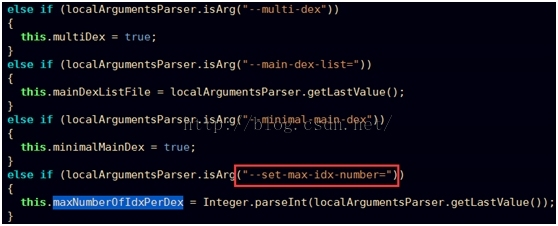
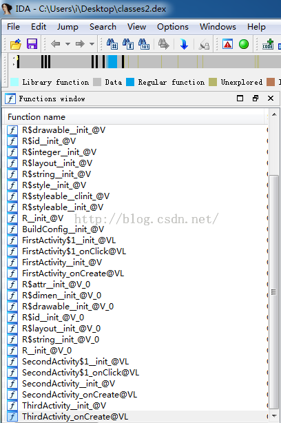
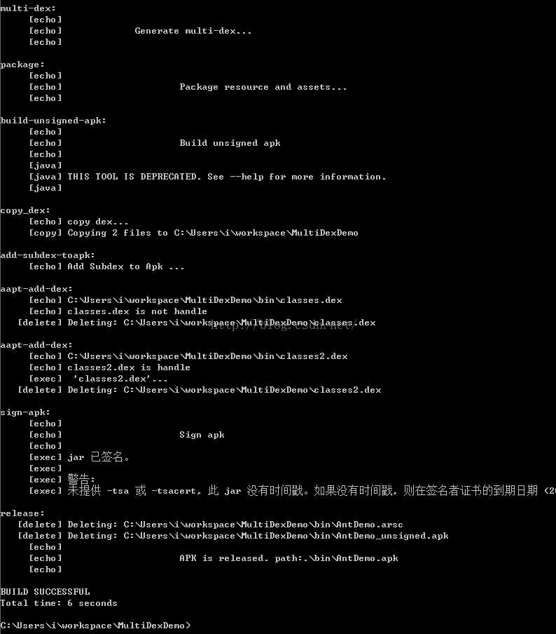

# Android关于Dex拆分(MultiDex)技术详解

来源:[Android关于Dex拆分(MultiDex)技术详解](http://blog.csdn.net/jiangwei0910410003/article/details/50799573)

## 一、前言

关于Android中的分包技术，已经不是什么新的技术了，网上也有很多解析了，但是他们都是给了理论上的知道和原理解析，并没有详细的案例说明，所以这里我们就来详细讲解一下Android中dex拆分技术的解析。在讲解之前，我们还是先来看一下为什么有这个技术的出现？google为什么提供这样的技术。

## 二、背景
在开发应用时，随着业务规模发展到一定程度，不断地加入新功能、添加新的类库，代码在急剧的膨胀，相应的apk包的大小也急剧增加， 那么终有一天，你会不幸遇到这个错误：

生成的apk在android 2.3或之前的机器上无法安装，提示：**INSTALL_FAILED_DEXOPT**

方法数量过多，编译时出错，提示：

> Conversion to Dalvik format failed:Unable to execute dex: method ID not in [0, 0xffff]: 65536

无法安装（Android 2.3 INSTALL_FAILED_DEXOPT）问题，是由dexopt的LinearAlloc限制引起的，在Android版本不同分别经历了4M/5M/8M/16M限制，目前主流4.2.x系统上可能都已到16M， 在Gingerbread或者以下系统LinearAllocHdr分配空间只有5M大小的， 高于Gingerbread的系统提升到了8M。Dalvik linearAlloc是一个固定大小的缓冲区。在应用的安装过程中，系统会运行一个名为dexopt的程序为该应用在当前机型中运行做准备。dexopt使用LinearAlloc来存储应用的方法信息。Android 2.2和2.3的缓冲区只有5MB，Android 4.x提高到了8MB或16MB。当方法数量过多导致超出缓冲区大小时，会造成dexopt崩溃。

超过最大方法数限制的问题，是由于DEX文件格式限制，一个DEX文件中method个数采用使用原生类型short来索引文件中的方法，也就是4个字节共计最多表达65536个method，field/class的个数也均有此限制。对于DEX文件，则是将工程所需全部class文件合并且压缩到一个DEX文件期间，也就是Android打包的DEX过程中， 单个DEX文件可被引用的方法总数（自己开发的代码以及所引用的Android框架、类库的代码）被限制为65536。

我们知道原因了，但是我们可以看到，google提供了一个方案：Multidex技术来解决这样的问题，为了兼容老版本SDK,但是我们想一下，是不是所有的项目都会用到这个技术呢？答案肯定不是的，这种问题不是所有的项目都会遇到的，只有当你的项目足够庞大，导致方法个数超出限制了，才会使用到这种技术。那么既然要用到，这里就还是要介绍一下，在介绍这篇文章之前，我们先要准备哪些知识点呢？

* 1、了解如何使用Ant脚本编译出一个apk包
* 2、了解编译一个apk包出来的整个流程和步骤
* 3、了解Android中的dx命令和aapt命令的用法
* 4、了解Android中动态加载机制

关于这些资料，我在之前的文章中有说道，不了解的同学可以转战：

Ant脚本编译一个apk包以及apk包打包的整个流程和步骤可以查看这篇文章：

[http://blog.csdn.net/jiangwei0910410003/article/details/50740026](http://blog.csdn.net/jiangwei0910410003/article/details/50740026)

关于Android中的动态加载机制不了解的同学可以查看这篇文章：

[http://blog.csdn.net/jiangwei0910410003/article/details/48104581](http://blog.csdn.net/jiangwei0910410003/article/details/48104581)

只有了解了这四个知识点，下面介绍的内容才能看的明白。所以这两篇文章希望能够仔细看一下。

## 三、技术原理
既然准备知识已经做完了，下面我们就来详细介绍一下拆包的技术原理，其实就是google提供个方案：

### 第一步：使用dx进行拆包

这里还有两个两类：一个是自动拆包，一个手动拆包

1、自动拆包

使用google在5.0+的SDK开始，dx命令就已经支持：--multi-dex 参数来直接自动分包


2、手动拆包

手动拆包其实就是为了解决低版本的SDK，不支持--mulit-dex参数这种情况，所以我们得想个办法，我们知道，android中有一个步骤就是使用dx命令将class文件变成dex，那么这里我们就可以这么做了，在dx命令执行前，先将javac编译之后的所有class文件进行分类，然后在对具体的分类使用dx来转化成dex文件，这样结果也是有多个dex了。这时候我们可能需要写一个额外的脚本去进行class分类了，具体分多少种dex，那就自己决定了。

上面就说完了拆包的两种方式，其实这两种方式各有优势和缺点，当然我们提倡的还是使用第一种方式，因为现在SDK已经是5.0+了，而且这种方式也是google所倡导的，而且也方便。

**关于上面的两种分包技术，有一个共同需要注意的地方：**

就是Android中在分包之后会有多个dex,但是系统默认会先找到classes.dex文件然后自动加载运行，所以这里就有一个问题，我们需要将一些初始化的重要类放到classes.dex中，不然运行就会报错或者闪退。

**那么这里就可以看到这两种分包技术的区别了：**

数的限制来进行分类成从dex,比如classes2.dex...classes3.dex...这里没有classes1.dex。需要注意这点。同时，subdex是不支持class的归类的，完全依靠dx自动分类，这个也是为什么叫做自动拆包的原因吧。


但是如果我们要是使用第二种拆包技术的话，就是很随意的操作了，因为本身分类就是我们自己操作的，所以想怎么分就怎么分，而且这里支持分多少个dex，哪些class归到哪个dex，都是可以做到的。灵活性比较好，但是这种方式有一个不好就是需要自己写脚本去归类，这时候就要非常小心，因为可能会遗漏一个class没有归入到具体的dex的话，运行就会报错，找不到这个类。

### 第二步：Dex的加载

在第一步中我们讲解完了拆包技术，如何将class拆分成多个dex。那么问题也就来了，上面我们也说到了，Android中在运行的时候默认只会加载classes.dex这个dex文件，我们也叫作主dex.那么拆分之后还有其他的dex怎么加载到系统运行呢？这时候google就提供了一个方案，使用DexClassLoader来进行动态加载，关于动态加载dex的话，这里不想讲解的太多了，因为我之前的很多文章都介绍了，具体可以参考这篇文章：[http://blog.csdn.net/jiangwei0910410003/article/details/48104581](http://blog.csdn.net/jiangwei0910410003/article/details/48104581)

所以我们只要获取到所有的dex，除了classes.dex之外。我们然后一一的将各个dex加载到系统中即可。那么这里有两个问题需要解决的：

1、如何获取所有的subdex呢？

这里我们可以这么做，在Application的attachContext方法中(因为这个方法的时机最早)，我们可以获取到程序的apk路径，然后使用ZipFile来解压apk文件，取到所有的subdex文件即可，具体的操作看后面的案例详解。

2、我们使用DexClassLoader来加载subdex之后，然后让系统知道？

这里我们使用反射的机制，来合并系统的PathClassLoader和DexClassLoader中的DexList变量值。这个技术也是google提供的。具体技术，也是到后面的案例中我们详细讲解。


## 四、案例分析

到这里我们就介绍完了，我们拆包的两个步骤：拆分dex和加载dex；下面来使用具体的案例来实践一下吧，这个也是网上现在很多介绍了dex拆分技术，但是就是没有具体案例的不好的地方，理论知识谁都知道，但是没有案例讲解的话，就不知道在实际的过程中会遇到什么问题，以及详细的操作步骤，所以这里必须用一个案例来详细介绍一下。

我们的案例采用ant脚本来编译，其实现在google推荐的是gradle来编译，因为这个已经集成到AndroidStudio中了，说句实话，我是因为gradle的语法不太熟，所以就没用gradle来讲解了，当然gradle语法和ant语法很想，如果有同学会gradle的话，可以使用gradle来进行操作一次，这里我不会太多的介绍ant脚本语法，而是介绍详细的命令使用。其实所有的编译脚本理论上就是对编译命令的优化已经加上一些功能罢了。好了，不多说，看案例：


这里的 main-dex-rule.txt 是我们后面需要用到的主dex包含的class文件清单，my.keystore是签名apk文件

下面我们先来看一下编译脚本build.xml

这里再次说明一下，这里不会全部解读，这个脚本是在我之前的一篇文章：

[http://blog.csdn.net/jiangwei0910410003/article/details/50740026](http://blog.csdn.net/jiangwei0910410003/article/details/50740026)

中的用到的脚本基础上修改的，所以一定要先看这篇文章呀~~

首先来看一下如何使用dx命令来自动拆分dex的：

```
<target   
    name="multi-dex"  
    depends="compile">  
    <echo>  
        Generate multi-dex...  
    </echo>  
    <exec  
        executable="${tools.dx}"  
        failonerror="true">  
            <arg value="--dex" />  
            <arg value="--multi-dex" />  
            <arg value="--set-max-idx-number=2000" />  
            <arg value="--main-dex-list" />  
            <arg value="${main-dex-rule}" />  
            <arg value="--minimal-main-dex" />  
            <arg value="--output=${bin}" />  
            <arg value="${bin}" />  
    </exec>  
</target>
```

这里的参数很简单：

参数说明：

--multi-dex：多 dex 打包的开关

--main-dex-list=<file>：参数是一个类列表的文件，在该文件中的类会被打包在第一个 dex 中
--minimal-main-dex：只有在--main-dex-list 文件中指定的类被打包在第一个 dex，其余的都在第二个 dex 文件中

因为后两个参数是 optional 参数，所以理论上只需给 dx 加上“--multi-dex”参数即可生成出 classes.dex、classes2.dex、classes3.dex等。

这里我们指定了--main-dex-list 参数，将指定的class合并到classes.dex中，看看main-dex-rule.txt的内容：


这里我们将程序的MyApplication类和入口Activity以及需要加载dex的这三个类合并到主dex中，因为这三个是初始化时机最早的，而且也是加载后面subdex类的重要类，所以必须放到主dex中。不然程序都运行不起来的。当然也要注意内部类的情况，也要进行添加的。

好了，我们运行build之后，发现有一个问题，就是我们只看到了一个dex，那就是classes.dex。为什么会这样呢？
再看 dx 的参数，main-dex-list 和 minimal-main-dex 只会影响到主 dex 中包含的文件，不会影响到从 dex 是否生成，所以应该是其他原因造成的。

查不到资料，分析源代码就是解决问题的不二法门。于是我把 dx.jar 反编译了一下，通过分析，找到了下面的几行关键代码：


显然，dx 进行多 dex 打包时，默认每个 dex 中方法数最大为65536。而查看当前应用 dex 的方法数，一共只有51392（方法数没超标，主要是 LinearAlloc 超标），没有达到65536，所以打包的时候只有一个 dex。

再继续分析代码，发现下面一段关键代码：


这说明 dx 有一个隐藏的参数：--set-max-idx-number，这个参数可以用于设置 dx 打包时每个 dex 最大的方法数，但是此参数并未在 dx 的 Usage 中列出（坑爹啊！）。



我们在 ant 脚本中把这个参数设置上，暂时设置每个 dex 的方法数最大为：2000，然后在编译：


好吧，这下出来了两个dex了，这里我可以发现，没有classes1.dex的，下标是从2开始的，这个需要注意的。
这里我们可以用IDA查看dex文件：

classes.dex：


classes2.dex：



看来是成功了，那么下面我们在继续看，现在有了两个dex文件，下面如何编译成apk文件呢？

我们之前知道这时候可以在使用apkbuilder命令将我们编译完的：resource.arsc，asset，dex文件打包成apk文件。

**但是这里遇到一个蛋疼问题来了:**

apkbuilder命令支持的参数中，只能包含一个dex文件，说白了就是只能打入一个dex文件。


这下蛋疼了，该怎么办呢？这里当时急需验证结果，先简单弄了一下，也算是一个小技巧，直接使用WinRar软件直接把subdex导进去：


然后在单独签名apk，运行，可以了，心情也是很好的，但是感觉这个不能自动化呀。太黑了，所以得想个办法，想到了ZipFile这个类，我们可以解压apk,然后将subdex添加进去，然后把这部分功能打包成一个可执行的jar,然后在build.xml中运行即可。这个也是个方法，但是还是感觉不好，有点繁琐。思前想后，最后找到了一个好办法，也是一个很重要的知识点，那就是使用aapt命令来进行操作，我们在之前可能知道aapt命令用来编译资源文件的，其实他还有一个重要的用途就是可以编辑apk文件：


可以看到，我们可以删除apk中的一个文件，或者是添加一个文件，好的，方法终于找到了，下面就直接操作吧，首先我们单独用命令来操作一下看看效果：


成功了，接下来我们在来看看apk文件：


尼玛，发现还不对，这里有一个坑，就是我们没看到classes2.dex，而看到了一个目录结构，哦，想想应该明白了，aapt命令在添加或者删除的时候，文件的路径必须明确，不能是绝对路径，而是相对路径，这个相对就要相对apk的跟目录，我们现在想把classes2.dex放到apk的根目录下面，那么就应该直接是classes2.dex，我们可以将dex和apk放到一个目录下面来进行操作：


这时候我们在来看一下apk文件：


好吧，成功了，所以这里我们需要注意的是subdex的路径。

下面我们继续来看build.xml脚本内容，看看在拆包成功之后，如何打包成apk中：

```
<!-- 拷贝文件到项目的根目录下面，因为我们的脚本是在根目录下面，这样在运行aapt的时候，可以直接操作dex文件了 -->  
<target name="copy_dex"  
    depends="build-unsigned-apk">  
    <echo message="copy dex..." />  
    <copy todir="${project-dir}">  
        <fileset dir="${bin}" >  
            <include name="classes*.dex" />  
        </fileset>  
    </copy>  
</target>  
  
<!-- 使用aapt命令添加dex文件-->  
<target name="aapt-add-dex">   
    <echo message="${dir.name}" />  
    <!-- 使用正则表达式获取classes的文件名-->  
    <propertyregex   
        property="dexfile"    
        input="${dir.name}"    
        regexp="classes(.*).dex"   
        select="\0"    
        casesensitive="false" />    
    <!-- 这里不需要添加classes.dex文件 -->  
    <if>    
        <equals arg1="${dexfile}" arg2="classes.dex"/>    
        <then>    
        <echo >${dexfile} is not handle</echo>    
        </then>    
    <else>    
        <echo>${dexfile} is handle</echo>  
    <exec  
        executable="${tools.aapt}"  
        failonerror="true" >  
        <arg value="add" />  
        <arg value="${unsigned-apk-path}" />  
        <arg value="${dexfile}" />  
    </exec>  
    </else>    
    </if>   
    <delete file="${project-dir}\${dexfile}" />   
</target>    
  
<!-- 循环遍历bin目录下的所有dex文件  -->  
<target name="add-subdex-toapk" depends="copy_dex">  
    <echo message="Add Subdex to Apk ..." />  
    <foreach target="aapt-add-dex" param="dir.name">   
        <path>   
            <fileset dir="${bin}" includes="classes*.dex"/>   
        </path>   
    </foreach>   
</target>   
```

这里的大体流程是这样的：

* 1、遍历bin目录下所有的dex文件
* 2、将dex文件先拷贝到项目的根目录下面，因为我们的脚本文件是在根目录下面，运行脚本的时候也是在根目录下面，所以需要把dex文件拷贝到这里，不然会发生上面说到的问题，不能使用绝对路径，而是相对路径来添加dex文件。
* 3、因为apk默认的话是包含了classes.dex文件，所以这里需要过滤classes.dex文件，对其他的dex文件进行aapt命令进行添加。

但是这里当时还遇到了一个问题，就是在ant脚本中如何使用循环，正则表达式，条件判断等标签：

具体标签不说了，主要说明一下如何使用这些标签？因为默认情况下，这些标签是不能用的，所以需要导入jar包？

```
<taskdef resource="net/sf/antcontrib/antlib.xml" />  
```

网上光说导入这个定义，但是还是报错的：


这时候我们还需要把：ant-contrib-1.0b3.jar 放到ant的lib目录下面，默认是没有这个jar的。关于这个jar，网上很多，自行下载即可


这时候我们就可以运行build.xml脚本了。

上面就介绍完了使用脚本拆包，以及如何将多个dex打包成apk.

下面来看一下代码如何实现：

代码中我们定义了四个Activity：


MainActivity是我们的入口Activity，SecondaryDexEx是动态加载的核心类

首先如何从apk中获取dex文件：

```
ZipFile apkFile = null;  
try {  
    apkFile = new ZipFile(appContext.getApplicationInfo().sourceDir);  
} catch (Exception e) {  
    Log.i("multidex", "create zipfile error:"+Log.getStackTraceString(e));  
    return;  
}  
  
Log.i("multidex", "zipfile:"+apkFile.getName());  
  
File filesDir = appContext.getDir("odex", Context.MODE_PRIVATE);  
Log.i("multidex", "filedir:"+filesDir.getAbsolutePath());  
for(int i = 0 ; i < SUB_DEX_NUM; i ++){  
    String possibleDexName = buildDexFullName(i);  
    Log.i("multidex", "proname:"+possibleDexName);  
    ZipEntry zipEntry = apkFile.getEntry(possibleDexName);  
    Log.i("multidex", "entry:"+zipEntry);  
    if(zipEntry == null) {  
        break;  
    }  
    msLoadedDexList.add(new LoadedDex(filesDir,possibleDexName,zipEntry));  
}  
```

**先得到应用apk的路径，使用ZipFile来解压apk,获取所有的dex文件，这里我们不需要处理classes.dex文件了，默认就会加载，所以这里进行过滤一下，还有就是subdex的下标都是从2开始的，没有classes1.dex。需要注意的。同时这里获取应用的apk文件是不需要任何权限限制的，类似于QQ中可以分享本地app给好友的功能一样。**

接下来我们获取到了所有的subdex之后，然后就可以动态加载了，需要把我们的dex加载到系统中，这里主要就是使用反射技术合并dexList即可。

```
/**
 * 这里需要注入DexClassLoader
 * 因为GDT内部点击广告是去下载App,是启动一个DownloadService去下载App
 * 所以这里需要这么做，不然会报异常
 * @param loader
 */
private static void inject(DexClassLoader loader, Context ctx){
	PathClassLoader pathLoader = (PathClassLoader) ctx.getClassLoader();
	try {
		Object dexElements = combineArray(
				getDexElements(getPathList(pathLoader)),
				getDexElements(getPathList(loader)));
		Object pathList = getPathList(pathLoader);
		setField(pathList, pathList.getClass(), "dexElements", dexElements);
	} catch (Exception e) {
		Log.i("multidex", "inject dexclassloader error:" + Log.getStackTraceString(e));
	}
}

private static Object getPathList(Object baseDexClassLoader)
		throws IllegalArgumentException, NoSuchFieldException, IllegalAccessException, ClassNotFoundException {
	return getField(baseDexClassLoader, Class.forName("dalvik.system.BaseDexClassLoader"), "pathList");
}

private static Object getField(Object obj, Class<?> cl, String field)
		throws NoSuchFieldException, IllegalArgumentException, IllegalAccessException {
	Field localField = cl.getDeclaredField(field);
	localField.setAccessible(true);
	return localField.get(obj);
}

private static Object getDexElements(Object paramObject)
		throws IllegalArgumentException, NoSuchFieldException, IllegalAccessException {
	return getField(paramObject, paramObject.getClass(), "dexElements");
}
private static void setField(Object obj, Class<?> cl, String field,
		Object value) throws NoSuchFieldException,
		IllegalArgumentException, IllegalAccessException {

	Field localField = cl.getDeclaredField(field);
	localField.setAccessible(true);
	localField.set(obj, value);
}

private static Object combineArray(Object arrayLhs, Object arrayRhs) {
	Class<?> localClass = arrayLhs.getClass().getComponentType();
	int i = Array.getLength(arrayLhs);
	int j = i + Array.getLength(arrayRhs);
	Object result = Array.newInstance(localClass, j);
	for (int k = 0; k < j; ++k) {
		if (k < i) {
			Array.set(result, k, Array.get(arrayLhs, k));
		} else {
			Array.set(result, k, Array.get(arrayRhs, k - i));
		}
	}
	return result;
}
```

在MyApplication中的attachBaseContext方法中调用loadSecondaryDex方法即可：


到这里我们介绍完了脚本和代码，下面就开跑一边脚本吧：ant release




跑完之后，我们看一下bin目录下多了一个成功的apk文件：


我们安装运行，结果如下：


看到了，我们首先启动的是MainActivity入口，然后我们依次点击btn进入不同的Activity。结果运行正常，同时我们也可以查看一下日志，获取dex和加载dex是正常的。


到这里我们的心情很激动，终于搞定了拆包，遇到一些问题，但是我们都解决了。哈哈~~

项目下载：[http://download.csdn.net/detail/jiangwei0910410003/9452599](http://download.csdn.net/detail/jiangwei0910410003/9452599)

## 五、梳理流程
下面我们来总结一下我们做的哪些工作：

* 1、首先我们使用脚本进行自动拆包，得到两个dex文件。
* 2、因为apkbuilder命令在打apk包的时候，只能包含一个dex文件，所以我们需要在使用aapt命令添加其他的subdex文件
* 3、得到应用程序的apk文件，然后得到所有的dex文件，在使用DexClassLoader进行subdex的加载。

但是关于我们之前说到的拆包的第二个技术，手动拆包这里就没有介绍了，其实很简单，就是在ant脚本中进行分类copy文件就好了，得到了多个dex之后，同样使用aapt命令添加到apk中就可以了。

## 六、知识点概要

学习到了哪些知识点：

* 1、更加深入的了解了ant脚本的语法
* 2、学习到了使用dx命令来进行自动拆包
* 3、复习了DexClassLoader的用法

## 七、遇到的错误

我们在这个过程中可能会遇到一些错误，最多的就是：ClassNotFound和NotDefClass这两个错误，这个处理很简单的，我们查看是哪个类，然后用IDA查看每个dex文件是否包含了这个类，如果没有，那说明没有将这个类归类进去

## 八、性能分析
在冷启动时因为需要加载多个DEX文件，如果DEX文件过大时，处理时间过长，很容易引发ANR（Application Not Responding）；

采用MultiDex方案的应用可能不能在低于Android 4.0 (API level 14) 机器上启动，这个主要是因为Dalvik linearAlloc的一个bug (Issue 22586);采用MultiDex方案的应用因为需要申请一个很大的内存，在运行时可能导致程序的崩溃，这个主要是因为Dalvik linearAlloc 的一个限制(Issue 78035). 这个限制在 Android 4.0 (API level 14)已经增加了, 应用也有可能在低于 Android 5.0 (API level 21)版本的机器上触发这个限制。

Dex分包后，如果是启动时同步加载，对应用的启动速度会有一定的影响，但是主要影响的是安装后首次启动。这是因为安装后首次启动时，Android系统会对加载的从dex做Dexopt并生成ODEX，而 Dexopt 是比较耗时的操作，所以对安装后首次启动速度影响较大。在非安装后首次启动时，应用只需加载 ODEX，这个过程速度很快，对启动速度影响不大。同时，从dex 的大小也直接影响启动速度，即从dex 越小则启动越快。

## 九、总结
关于Android中的拆包技术网上已经有很多案例和解释了，但是大部分都是理论知识，没有说到细节的，更没有什么demo。所以这篇文章就主要详细介绍了分包的技术点以及用一个demo来进行案例分析，更加深入的了解了拆包技术，本文中虽然用到了是ant脚本进行编译的，但是同样可以使用gradle来进行编译，只要理解了原理，其实都是命令在操作的，和脚本没有任何关系的。从此我们也不会在感觉拆包技术多不觉明历了。其实就是那么回事。


