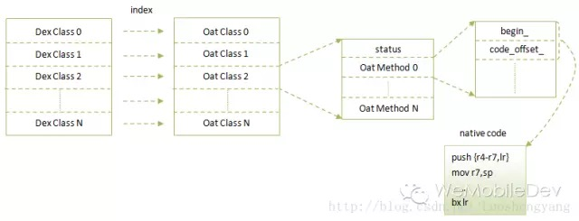
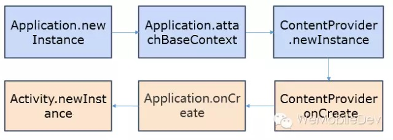
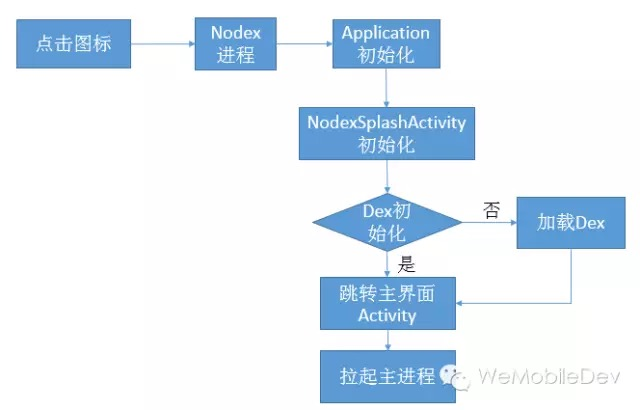
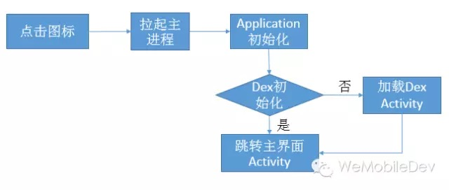
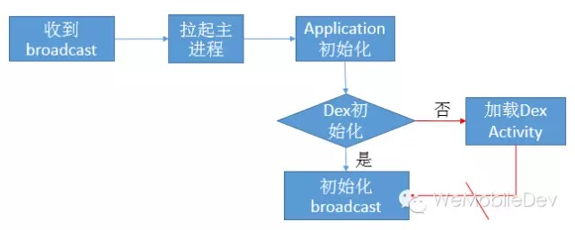
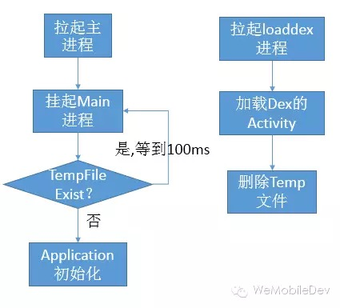

# Android拆分与加载Dex的多种方案对比

来源:[微信团队](http://mp.weixin.qq.com/s?__biz=MzAwNDY1ODY2OQ==&mid=207151651&idx=1&sn=9eab282711f4eb2b4daf2fbae5a5ca9a&3rd=MzA3MDU4NTYzMw==&scene=6#rd)


对于Android大型程序来说，64k方法数与线性内存的限制都是必须要考虑的问题。对于它们的原理与分析，可参考下面这篇文章：[預防 Android Dex 64k Method Size Limit](http://ingramchen.io/blog/2014/09/prevention-of-android-dex-64k-method-size-limit.html)。同时Android官方也推出了自己的解决方案，但却不能满足所有应用的需求。

事实上，解决64K方法限制的唯一方法是拆分多dex,不同方案的差异在于需指定哪些类必须在主dex，这与我们期待的效果以及加载方式相关。解决安装过程线性内存的方法是限制主dex的linearalloc大小，这里经验值为3355444(2.2以上，如何计算？)。对于运行过程的线性内存限制可参考Facebook。下面分别对我了解的几种分dex与加载dex的方案作简单的对比分析。

## Android官方方案
Android推出了官方的[multidex support library](http://developer.android.com/tools/building/multidex.html)。集成与使用的方法非常简单，下面从几方面简述：

### 1. Dex形式

我们只需指定multiDexEnabled，即可编译自动拆分多dex,拆分出来的dex以classes(..N).dex形式命名，与主dex同样放于安装包的根目录。

```
defaultConfig {
    ...
    // Enabling multidex support.
    multiDexEnabled true
}  
```
                                              
为什么要以`classes(..N).dex`，而不是我们常见的放于`assets`?这是为了5.0以上系统在安装过程中的art阶段就将所有的`classes(..N).dex`合并到一个单独的oat文件(5.0以下只能苦逼的启动时加载)。对于Art相关知识，可以参考[老罗的系列文章](http://blog.csdn.net/luoshengyang/article/details/39307813)。



上图即为一个oat文件的格式图。Android采取这种方式，明显也是为了擦之前的屁股。另一方面，**最新报告5.0以上已经占了超过9%**，这说明是非常有必要采用这种方式以减少首次启动的耗时。

### 2. Dex类分包的规则
我们只是指定了`multiDexEnabled`，那系统会将那些类放在主dex?其实它利用的是Android sdk build tool中的`mainDexClasses`脚本，这在版本21以上才会有。使用方法非常很简单：

```
mainDexClasses [--output <output file>] <application path>
```

该脚本要求输入一个文件组（包含编译后的目录或jar包），然后分析文件组中的类并写入到`--output`所指定的文件中。实现原理也不复杂，主要分为三步：

a. 环境检查，包括传入参数合法性检查，路径检查以及proguard环境检测等。
b. 使用`mainDexClasses.rules`规则，通过Proguard的shrink功能，裁剪无关类，生成一个tmp.jar包。
c. 通过生成的`tmp jar`包，调用`MainDexListBuilder`类生成主dex的文件列表。

这里只是简单的得到所有入口类(即rules中的Instrumentation、application、Activity、Annotation等等)的直接引入类。何为直接引用类？在init过程，会在校验阶段去resolve它各个方法、变量引用到的类，这些类统称为某个类的直接引用类。举个栗子：

```
public class MainActivity extends Activity {
    protected void onCreate(Bundle savedInstanceState) {
        DirectReferenceClass test = new DirectReferenceClass();
    }
}

public class DirectReferenceClass {
    public DirectReferenceClass() {
        InDirectReferenceClass test = new InDirectReferenceClass();
    }
}

public class InDirectReferenceClass {
    public InDirectReferenceClass() {

    }
}
```

上面有`MainActivity`、`DirectReferenceClass`、`InDirectReferenceClass`三个类，其中`DirectReferenceClass`是`MainActivity`的直接引用类，`InDirectReferenceClass`是`DirectReferenceClass`的直接引用类。而`InDirectReferenceClass`是`MainActivity`的间接引用类(即直接引用类的所有直接引用类)。

### 3. 加载Dex的方式

对于5.0以下的系统，我们需要在启动时手动加载其他的dex。而我们并没有要求得到所有的间接引用类，这是因为我们在`attachBaseContext`的时候，已将其他dex加载。例如：

```
public class HelloMultiDexApplication extends Application {
    @Override
    protected void attachBaseContext(Context base) {
        super.attachBaseContext(base);
        MultiDex.install(this);
    }
}
```

`attachBaseContext`究竟处于生命周期的哪一步？可看下图:



事实上，若我们在`attachBaseContext`中调用`Multidex.install`，我们只需引入`Application`的直接引用类即可，`mainDexClasses`将`Activity`、`ContentProvider`、`Service`等的直接引用类也引入，主要是满足需要在非`attachBaseContent`加载多dex的需求。另一方面，若存在以下代码，将出现`NoClassDefFoundError`错误。

````
public class HelloMultiDexApplication extends Application {
    @Override
    protected void attachBaseContext(Context base) {
        super.attachBaseContext(base);
        DirectReferenceClass test = new DirectReferenceClass();
        MultiDex.install(this);
    }
}
```

这是因为在实际运行过程中，`DirectReferenceClass`需要的`InDirectReferenceClass`并不一定在主dex。解决方法是手动将该类放于dx的`-main-dex-list`参数中：

```
afterEvaluate {
    tasks.matching {
        it.name.startsWith('dex')
    }.each { dx ->
        if (dx.additionalParameters == null) {
            dx.additionalParameters = []
        }
        dx.additionalParameters += '--multi-dex'
        dx.additionalParameters += "--main-dex-list=$projectDir/<filename>".toString()
    }
}
```

Android提供的方案，或者延伸为在`attachBaseContext`中同步加载dex的方案，它的好处是非常简单，所需的依赖集也非常少。但是它的缺点也非常明显，即若其他dex比较大，首次加载时会出现明显的黑屏，甚至会出现ANR。

## 微信/手Q加载方案

对于微信来说，我们一共有`111052`个方法。以线性内存`3355444`(限制5m,给系统预留部分)、方法数`64K`为限制，即当满足任意一个条件时，将拆分dex。由此微信将得到一个主dex,两个子dex，若微信采用Android方案，在首次启动时将长期无响应(没有出现黑屏时因为默认皮肤的原因)，这对处女座的我来说是无法接受的。应该如何去做？微信与手Q的方案是类似的，将首次加载放于地球中，并用线程去加载(但是5.0之前加载dex时还是会挂起主线程)。

### 1. Dex形式

暂时我们还是放于`assets`下，以`assets/secondary-program-dex-jars/secondary-N.dex.jar`命名。为什么不以`classes(..N).dex`？这是因为一来觉得以Android的推广速度，5.0用户增长应该是遥遥无期的，二来加载Dex的代码，传进去的是zip，在加载前我们需要验证MD5，确保所加载的Dex没有被篡改(Android官方没有验证，主要是只有root才能更改吧)。

```
 /**
 * Makes an array of dex/resource path elements, one per element of
 * the given array.
 */
private static Element[] makeDexElements(ArrayList<File> files, File optimizedDirectory,
                                         ArrayList<IOException> suppressedExceptions) { 
```
                                         
事实上，应该传进去的是dex也是应该可以的，这块在下一个版本将采用`classes(..N).dex`。但是如果我们使用了线程加载，并且弹出提示界面，对用户来说并不是无法接受。

### 2. Dex类分包的规则

分包规则即将所有`Application`、`ContentProvider`以及所有`export`的`Activity`、`Service`、`Receiver`的间接依赖集都必须放在主dex。对于微信现在来说，这部分大约有`41306`个方法，每次通过扫描`AndroidMifest`计算耗时大约为20s不到。怎么计算？可以参考`buck`或者`mainDexClasses`的做法。

```
public MainDexListBuilder(String rootJar, String pathString) throws IOException {   
       path = new Path(pathString);
       ClassReferenceListBuilder mainListBuilder=new ClassReferenceListBuilder(path);
```
       
### 3. 加载Dex的方式

加载逻辑这边主要判断是否已经`dexopt`，若已经`dexopt`，即放在`attachBaseContext`加载，反之放于地球中用线程加载。怎么判断？其实很低级，因为在微信中，若判断`revision`改变，即将`dex`以及`dexopt`目录清空。只需简单判断两个目录dex名称、数量是否与配置文件的一致。

```
(name md5 校验是否加载成功类)
secondary-1.dex.jar 63e5240eac9bdb5101fc35bd40a98679 secondary.dex01.Canary
secondary-2.dex.jar e7d2a4a181f579784a4286193feaf457 secondary.dex02.Canary 
```

总的来说，这种方案用户体验较好，缺点在于太过复杂，每次都需重新扫描依赖集，而且使用的是比较大的间接依赖集(要真正运行到，直接依赖集是不行的)。当前微信必要的依赖集已经41306个方法，说不定哪一天就爆了。

## FaceBook加载方案

那是否存在一种加载方式它的依赖集很小，但却不会像官方方案一样造成明显的卡顿？逆过不少app,发现`facebook`的思路还是挺不错的，下面作一个简单的说明：

### 1. Dex形式 
微信与`facebook`的`dex`形式是完全一致的，这是因为我们也是使用`facebook`开源工具`buck`编译的。但是我们做了一个自动生成`buck`脚本的工作，即开发人员无须关心`buck`脚本如何编写。

### 2. Dex类分包的规则
`facebook`将加载`Dex`的逻辑放于单独的`nodex`进程，这是一个非常简单、轻量级的进程。它没有任何的`ContentProvider`，只有有限的几个`Activity`、`Service`。

```
<activity android:exported="false"  android:process=":nodex"
 android:name="com.facebook.nodex.startup.splashscreen.NodexSplashActivity">
``` 
 
所以依赖集为`Application`、`NodexSplashActivity`的间接依赖集即可，而且这部分逻辑应该相对稳定，我们无须做动态扫描。这就实现了一个非常轻量级的依赖集方案。

### 3. 加载Dex的方式
加载dex逻辑也非常简单，由于`NodexSplashActivity`的`intent-filter`指定为`Main`与`LAUNCHER`。首先拉起`nodex`进程，然后初始化`NodexSplashActivityActivity`，若此时`Dex`已经初始化过，即直接跳转到主页面。



这种方式好处在于依赖集非常简单，同时首次加载`Dex`时也不会卡死。但是它的缺点也很明显，即每次启动主进程时，都需先启动`nodex`进程。尽管`nodex`进程逻辑非常简单，这也需`100ms`以上。若微信对启动时间非常敏感，很难会去采用这个方案。

## 测试加载方案
`Facebook`的缺陷在于多起一个`nodex`进程，那是否可以直接在主进程做这个操作？想到一种方案，通过简单测试应该可行，下面做简单说明：

### 1. Dex形式
`Dex`形式并不是重点，假定我们使用当前微信的Dex形式，即`assets/secondary-program-dex-jars/secondary-N.dex.jar`。

### 2. Dex类分包的规则
主`Dex`应该保证简单，即类似`Facebook`，只需要少量与Dex加载相关的类即可，并且这部分代码是相对稳定。我也无须去更改任何非加载相关的代码，即不会像微信/手Q方案，我们需要修改`BaseExportActivity`、`BaseExportServer`、`BaseExportBroadcast`等代码。

### 3. 加载Dex的方式
回到重点，我们应该通过什么加载方案去实现这样的分包规则。首先若是点击图标，我们的确无须再起一个进程，即下面是可行的：



但是问题就在于在`Application`初始化时，或是在`attachBaseContext`时，我们无法确保即将进入的是主界面`Activity`。可能系统要起的是某一个`Service`或`Receiver`，这种跳转方式是不行的。例如下图中的红色部分，我们无法知道将跳转到哪里：



能不能换种思路，即假设发现Dex没有初始化，在`attachBaseContext`的时候挂起主进程，然后起另外一个`loaddex`进程去加载`Dex`。等`loaddex`进程加载完后，我们再通知主进程继续往下走。


现在转化为两个问题：

a.通过何种方式挂起主进程？

b.挂住主进程过程中，是否会产生ANR？

进程同步可以使用`pthread_mutex_xxx`、 `pthread_cond_xxx`,但是`mutex`或`cond`要放于共享内存中，过于复杂。或者由于在主进程访问远端`Service`，也是同步的，这应该也是一种不错的方法。但是我最后测试时采用的是一个最简单的方法，即检测到没有加载`dex`时,会在`com.tencent.mm`下新建一个临时文件，每隔100ms去询问文件是否存在。而在`loaddex`结束后，即主动的删除该文件。



那会不会出现ANR呢？事实上是不会的，因为主进程已经不是前台进程了，经过测试，在`attachBaseContext`，无论将要启动的`Activity`、`Broadcast`还是`Service`，尽管卡住100s，也不会出现ANR(回想ANR的几个原因，按键消息、`Broadcast onReceiver`或者`Service`)。

总的来说，这种方式好处在于依赖集非常简单，同时它的集成方式也是非常简单，我们无须去修改与加载无关的代码。但是没有经过广泛的测试，欢迎交流或指正方案中的缺陷。


## 总结
对`dex`以及`art`研究过一段时间，不少细节还是要注意的。列一下微信现在的`ToDo List`：

1. 使用`classes(..N).dex`形式；
2. 论证第四种方案是否可行，想到一个问题就是如果起得是一个`Service`弹出界面，似乎有点唐突，但是这个可以通过判断当前`TopActivity`方式解决。 
...

以上都是个人的理解，可能有错误或纰漏的地方，欢迎大家指正与技术交流。
