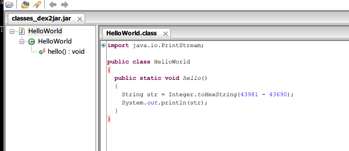
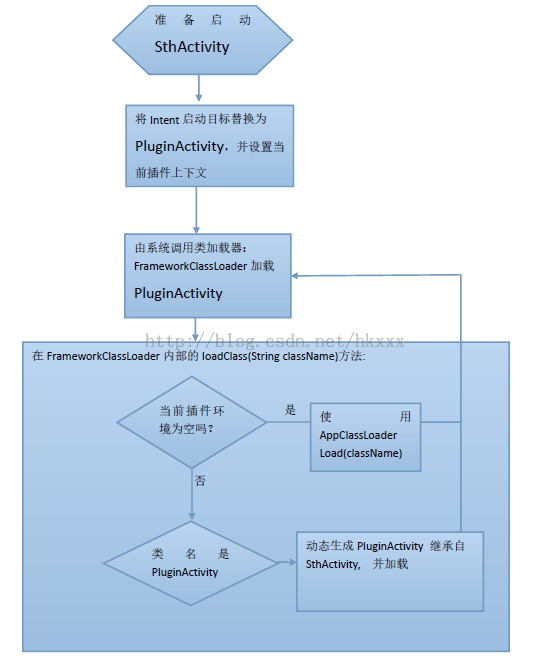

# Android动态加载黑科技 动态创建Activity模式

来源:[segmentfault.com](http://segmentfault.com/a/1190000004077469)

## 代理Activity模式的限制

还记得我们在代理Activity模式里谈到启动插件APK里的Activity的两个难题吗，由于插件里的Activity没在主项目的Manifest里面注册，所以无法经历系统Framework层级的一系列初始化过程，最终导致获得的Activity实例并没有生命周期和无法使用res资源。

使用代理Activity能够解决这两个问题，但是有一些限制


* 实际运行的Activity实例其实都是ProxyActivity，并不是真正想要启动的Activity；
* ProxyActivity只能指定一种LaunchMode，所以插件里的Activity无法自定义LaunchMode；
* 不支持静态注册的BroadcastReceiver；
* 往往不是所有的apk都可作为插件被加载，插件项目需要依赖特定的框架，还有需要遵循一定的"开发规范"；

特别是最后一个，无法直接把一个普通的APK作为插件使用。怎么避开这些限制呢？插件的Activity不是标准的Activity对象才会有这些限制，使其成为标准的Activity是解决问题的关键，而要使其成为标准的Activity，则需要在主项目里注册这些Activity。

总不能把插件APK所有的Activity都事先注册到主项目里面吧，想到代理模式需要注册一个代理的ProxyActivity，那么能不能在主项目里注册一个通用的Activity（比如TargetActivity）给插件里所有的Activity用呢？解决对策就是，在需要启动插件的某一个Activity（比如PlugActivity）的时候，动态创建一个TargetActivity，新创建的TargetActivity会继承PlugActivity的所有共有行为，而这个TargetActivity的包名与类名刚好与我们事先注册的TargetActivity一致，我们就能以标准的方式启动这个Activity。

## 动态创建Activity模式
[dexmaker]:https://github.com/crittercism/dexmaker
[asmdex]:http://asm.ow2.org/
运行时动态创建并编译一个Activity类，这种想法不是天方夜谭，动态创建类的工具有[dexmaker][dexmaker]和[asmdex][asmdex]，二者均能实现动态字节码操作，最大的区别是前者是创建dex文件，而后者是创建class文件。

### 使用dexmaker动态创建一个类

运行时创建一个编译好并能运行的类叫做“动态字节码操作（runtime bytecode manipulation）”，使用dexmaker工具能创建一个dex文件，之后我们再反编译这个dex看看创建出来的类是什么样子。

```
public class MainActivity extends AppCompatActivity {

    @Override
    protected void onCreate(Bundle savedInstanceState) {
        super.onCreate(savedInstanceState);
        setContentView(R.layout.activity_main);
    }

    public void onMakeDex(View view){
        try {
            DexMaker dexMaker = new DexMaker();
            // Generate a HelloWorld class.
            TypeId<?> helloWorld = TypeId.get("LHelloWorld;");
            dexMaker.declare(helloWorld, "HelloWorld.generated", Modifier.PUBLIC, TypeId.OBJECT);
            generateHelloMethod(dexMaker, helloWorld);
            // Create the dex file and load it.
            File outputDir = new File(Environment.getExternalStorageDirectory() + File.separator + "dexmaker");
            if (!outputDir.exists())outputDir.mkdir();
            ClassLoader loader = dexMaker.generateAndLoad(this.getClassLoader(), outputDir);
            Class<?> helloWorldClass = loader.loadClass("HelloWorld");
            // Execute our newly-generated code in-process.
            helloWorldClass.getMethod("hello").invoke(null);
        } catch (Exception e) {
            Log.e("MainActivity","[onMakeDex]",e);
        }
    }

    /**
     * Generates Dalvik bytecode equivalent to the following method.
     *    public static void hello() {
     *        int a = 0xabcd;
     *        int b = 0xaaaa;
     *        int c = a - b;
     *        String s = Integer.toHexString(c);
     *        System.out.println(s);
     *        return;
     *    }
     */
    private static void generateHelloMethod(DexMaker dexMaker, TypeId<?> declaringType) {
        // Lookup some types we'll need along the way.
        TypeId<System> systemType = TypeId.get(System.class);
        TypeId<PrintStream> printStreamType = TypeId.get(PrintStream.class);

        // Identify the 'hello()' method on declaringType.
        MethodId hello = declaringType.getMethod(TypeId.VOID, "hello");

        // Declare that method on the dexMaker. Use the returned Code instance
        // as a builder that we can append instructions to.
        Code code = dexMaker.declare(hello, Modifier.STATIC | Modifier.PUBLIC);

        // Declare all the locals we'll need up front. The API requires this.
        Local<Integer> a = code.newLocal(TypeId.INT);
        Local<Integer> b = code.newLocal(TypeId.INT);
        Local<Integer> c = code.newLocal(TypeId.INT);
        Local<String> s = code.newLocal(TypeId.STRING);
        Local<PrintStream> localSystemOut = code.newLocal(printStreamType);

        // int a = 0xabcd;
        code.loadConstant(a, 0xabcd);

        // int b = 0xaaaa;
        code.loadConstant(b, 0xaaaa);

        // int c = a - b;
        code.op(BinaryOp.SUBTRACT, c, a, b);

        // String s = Integer.toHexString(c);
        MethodId<Integer, String> toHexString
                = TypeId.get(Integer.class).getMethod(TypeId.STRING, "toHexString", TypeId.INT);
        code.invokeStatic(toHexString, s, c);

        // System.out.println(s);
        FieldId<System, PrintStream> systemOutField = systemType.getField(printStreamType, "out");
        code.sget(systemOutField, localSystemOut);
        MethodId<PrintStream, Void> printlnMethod = printStreamType.getMethod(
                TypeId.VOID, "println", TypeId.STRING);
        code.invokeVirtual(printlnMethod, null, localSystemOut, s);

        // return;
        code.returnVoid();
    }
    
}
```

运行后在SD卡的dexmaker目录下找到刚创建的文件“Generated1532509318.jar”，把里面的“classes.dex”解压出来，然后再用“dex2jar”工具转化成jar文件，最后再用“jd-gui”工具反编译jar的源码。



### 修改需要启动的目标Activity

接下来的问题是如何把需要启动的、在Manifest里面没有注册的PlugActivity换成有注册的TargetActivity。

在Android，虚拟机加载类的时候，是通过ClassLoader的loadClass方法，而loadClass方法并不是final类型的，这意味着我们可以创建自己的类去继承ClassLoader，以重载loadClass方法并改写类的加载逻辑，在需要加载PlugActivity的时候，偷偷把其换成TargetActivity。

大致思路如下

```
public class CJClassLoader extends ClassLoader{

@override
    public Class loadClass(String className){
      if(当前上下文插件不为空) {
        if( className 是 TargetActivity){
             找到当前实际要加载的原始PlugActivity，动态创建类（TargetActivity extends PlugActivity ）的dex文件
             return  从dex文件中加载的TargetActivity
        }else{
             return  使用对应的PluginClassLoader加载普通类
        }  
     }else{
         return super.loadClass() //使用原来的类加载方法
     }   
    } 
}
```

这样就能把启动插件里的PlugActivity变成启动动态创建的TargetActivity。

不过还有一个问题，主项目启动插件Activity的时候，我们可以替换Activity，但是如果在插件Activity（比如MainActivity）启动另一个Activity（SubActivity）的时候怎么办？插件时普通的第三方APK，我们无法更改里面跳转Activity的逻辑。其实，从主项目启动插件MainActivity的时候，其实启动的是我们动态创建的TargetActivity（extends MainActivity），而我们知道Activity启动另一个Activity的时候都是使用其“startActivityForResult”方法，所以我们可以在创建TargetActivity时，重写其“startActivityForResult”方法，让它在启动其他Activity的时候，也采用动态创建Activity的方式，这样就能解决问题。

## 动态创建Activity开源项目 
[android-pluginmgr]:https://github.com/houkx/android-pluginmgr/

这种脑洞大开的动态加载思路来自于houkx的开源项目[android-pluginmgr][android-pluginmgr]



`android-pluginmgr`项目中有三种`ClassLoader`，一是用于替换宿主APK的`Application`的`CJClassLoader`，二是用于加载插件APK的`PluginClassLoader`，再来是用于加载启动插件Activity时动态生成的`PlugActivity`的dex包的`DexClassLoader`（存放在Map集合`proxyActivityLoaderMap`里面）。其中`CJClassLoader`是`PluginClassLoader`的Parent，而`PluginClassLoader`又是第三种`DexClassLoader`的Parent。

`ClassLoader`类加载Class的时候，会先使用Parent的`ClassLoader`，但Parent不能完成加载工作时，才会调用Child的`ClassLoader`去完成工作。

> java.lang.ClassLoader

Loads classes and resources from a repository. One or more class loaders are installed at runtime. These are consulted whenever the runtime system needs a specific class that is not yet available in-memory. Typically, class loaders are grouped into a tree where child class loaders delegate all requests to parent class loaders. Only if the parent class loader cannot satisfy the request, the child class loader itself tries to handle it.

具体分析请参考[ClassLoader的工作机制](2-ClassLoader的工作机制.md)

所以每加载一个Activity的时候都会调用到最上级的CJClassLoader的loadClass方法，从而保证启动插件Activity的时候能顺利替换成PlugActivity。当然如何控制着三种ClassLoader的加载工作，也是pluginmgr项目的设计难度之一。

## 存在的问题

动态类创建的方式，使得注册一个通用的Activity就能给多给Activity使用，对这种做法存在的问题也是明显的

* 使用同一个注册的Activity，所以一些需要在Manifest注册的属性无法做到每个Activity都自定义配置；
* 插件中的权限，无法动态注册，插件需要的权限都得在宿主中注册，无法动态添加权限；
* 插件的Activity无法开启独立进程，因为这需要在Manifest里面注册；
* 动态字节码操作涉及到Hack开发，所以相比代理模式起来不稳定；

其中不稳定的问题出现在对Service的支持上，使用动态创建类的方式可以搞定Activity和Broadcast Receiver，但是使用类似的方式处理Service却不行，因为“ContextImpl.getApplicationContext” 期待得到一个非ContextWrapper的context，如果不是则继续下次循环，目前的Context实例都是wrapper，所以会进入死循环。

据houkx称他现在有另外的思路实现“启动为安装的普通第三方APK”的目的，而且不是基于动态类创建的原理，期待他的开源项目的更新。

## 代理Activity模式与动态创建Activity模式的区别

简单地说，最大的不同是代理模式使用了一个代理的Activity，而动态创建Activity模式使用了一个通用的Activity。

代理模式中，使用一个代理Activity去完成本应该由插件Activity完成的工作，这个代理Activity是一个标准的Android Activity组件，具有生命周期和上下文环境（ContextWrapper和ContextCompl），但是它自身只是一个空壳，并没有承担什么业务逻辑；而插件Activity其实只是一个普通的Java对象，它没有上下文环境，但是却能正常执行业务逻辑的代码。代理Activity和不同的插件Activity配合起来，就能完成不同的业务逻辑了。所以代理模式其实还是使用常规的Android开发技术，只是在处理插件资源的时候强制调用了系统的隐藏API，因此这种模式还是可以稳定工作和升级的。

动态创建Activity模式，被动态创建出来的Activity类是有在主项目里面注册的，它是一个标准的Activity，它有自己的Context和生命周期，不需要代理的Activity。

