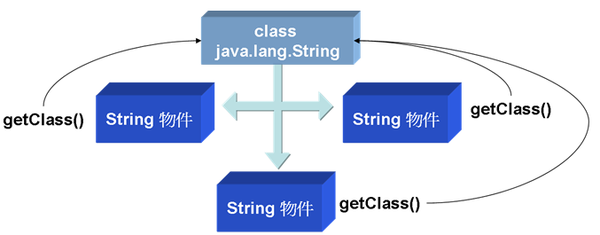
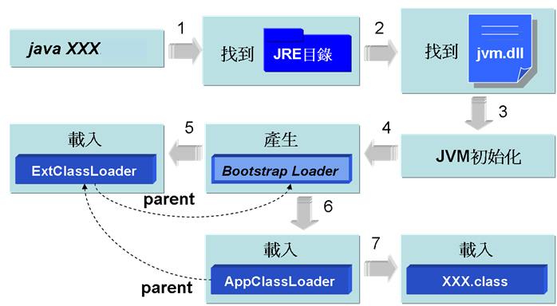
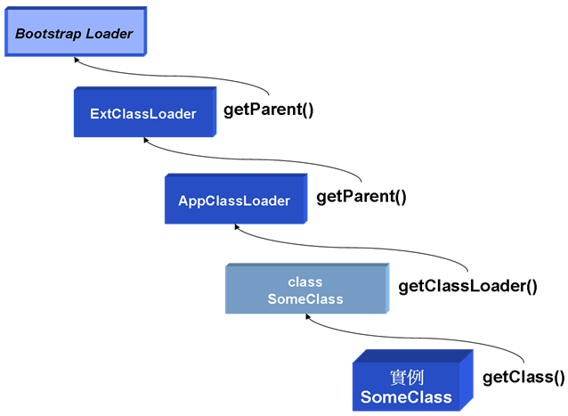
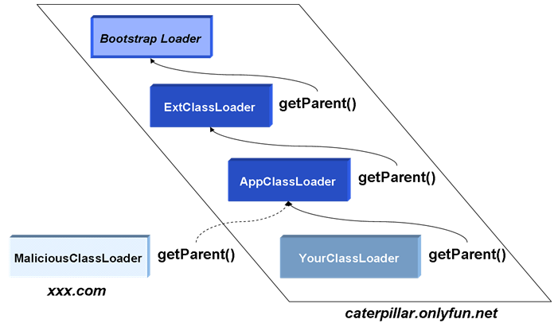

# 第 16 章 反射（Reflection）

来源:[https://github.com/JustinSDK/JavaSE6Tutorial/blob/master/docs/CH16.md](https://github.com/JustinSDK/JavaSE6Tutorial/blob/master/docs/CH16.md)

Java 提供的反射機制允許您於執行時期動態載入类、检查类信息、生成对象或操作生成的对象，要舉反射機制的一個應用實例，就是在整合式開發環境中所提供的方法提示或是类检查工具，另外像 JSP 中的 JavaBean 自動收集請求信息也使用到反射，而一些软件開發框架（Framework）也常見到反射機制的使用，以達到動態載入使用者自訂类的目的。

即使您暫時用不到反射機制，也建議您花時間看看這個章節，藉由對反射機制的認識，您可以瞭解 Java 中是如何載入类的，而且瞭解到每個被載入的类在 JVM 中，都以 Class 类的一個實例存在的事實。

--------------

## 16.1 类載入與检查

即使您拿到一個类並對它一無所知，但其實它本身就包括了許多信息，Java 在需要使用到某個类時才會將类載入，並在 JVM 中以一個 java.lang.Class 的實例存在，從 Class 實例開始，您可以獲得类的許多訊息。

### 16.1.1 簡介 Class 與类載入

Java 在真正需要使用一個类時才會加以載入，而不是在程序啟動時就載入所有的类，因為大多數的使用者都只使用到應用程序的部份資源，在需要某些功能時才載入某些資源，可以讓系統的資源運用更有效率（Java 本來就是為了資源有限的小型設備而設計的，這樣的考量是必然的）。

一個 java.lang.Class 对象代表了 Java 應用程序在運行時所載入的类或接口實例，也用來表達 enum（屬於类的一種）、 annotation（屬於接口的一種）、数组、原生型態（Primitive type）、void；Class 类沒有公開的（public）构造方法，Class 对象是由 JVM 自動產生，每當一個类被載入時，JVM 就自動為其生成一個 Class 对象。

您可以透過 Object 的 getClass() 方法來取得每一個对象對應的 Class 对象，或者是透過 "class" 常量（Class literal），在取得 Class 对象之後，您就可以操作 Class 对象上的一些公開方法來取得类的基本信息，範例 16.1 簡單的使用 getClass() 方法來取得 String 类的 Class 實例，並從中得到 String 的一些基本信息。

#### **範例 16.1  ClassDemo.java**

```
package onlyfun.caterpillar;
 
public class ClassDemo {
    public static void main(String[] args) {
        String name = "caterpillar";
        Class stringClass = name.getClass();
        System.out.println("类名稱：" + 
                    stringClass.getName()); 
        System.out.println("是否為接口：" + 
                    stringClass.isInterface()); 
        System.out.println("是否為基本型態：" + 
                    stringClass.isPrimitive()); 
        System.out.println("是否為数组对象：" + 
                    stringClass.isArray()); 
        System.out.println("父类名稱：" + 
                    stringClass.getSuperclass().getName());
    }
} 
```

執行結果：

```
类名稱：java.lang.String
是否為接口：false
是否為基本型態：false
是否為数组对象：false
父类名稱：java.lang.Object
```

您也可以直接使用以下的方式來取得 String 类的 Class 对象：

```
Class stringClass = String.class;
```
 
Java 在真正需要类時才會載入类，所謂「真正需要」通常指的是要使用指定的类生成对象時（或是使用者指定要載入类時，例如使用 Class.forName() 載入类，或是使用 ClassLoader 的 loadClass() 載入类，稍後都會說明）。使用类名稱來宣告參考名稱並不會導致类的載入，可以設計一個測試类的印證這個說法。

#### **範例 16.2  TestClass.java**

```
package onlyfun.caterpillar;

public class TestClass {
    static {
        System.out.println("类被載入");
    }
}
```

在範例中定義了一個靜態區塊，「預設」在类第一次被載入時會執行靜態區塊（說預設的原因，是因為可以設定載入类時不執行靜態區塊，使用 Class 生成对象時才執行靜態區塊，稍後會介紹），藉由在文字模式下顯示訊息，您可以瞭解类何時被載入，可以使用範例 16.3 來測試类載入時機。

#### **範例 16.3  LoadClassTest.java**
```
package onlyfun.caterpillar;

public class LoadClassTest {
    public static void main(String[] args) {
        TestClass test = null;
        System.out.println("宣告TestClass參考名稱");
        test = new TestClass();
        System.out.println("生成TestClass實例");
    }
}
```

執行結果：

```
宣告TestClass參考名稱
类被載入
生成TestClass實例
```

從執行結果中可以看出，宣告參考名稱並不導致 TestClass 类被載入，而是在使用 "new" 生成对象時才會載入类。

Class 的訊息是在編譯時期就被加入至 .class 檔案中，這是 Java 支援執行時期型別辨識（RTTI，Run-Time Type Information或Run-Time Type Identification）的一種方式，在編譯時期編譯器會先檢查對應的 .class 檔案，而執行時期JVM在使用某类時，會先檢查對應的 Class 对象是否已經載入，如果沒有載入，則會尋找對應的 .class 檔案並載入，一個类在 JVM 中只會有一個 Class 實例，每個类的實例都會記得自己是由哪個 Class 實例所生成，您可以使用 getClass() 或 .class 來取得 Class 實例。



圖 16.1 每個对象會記得生成它的 Class 實例

在 Java 中，数组也是一個对象，也有其對應的 Class 實例，這個对象是由具相同元素與維度的数组所共用，而基本型態像是 boolean, byte, char, short, int, long, float, double 以及關鍵字 void，也都有對應的 Class 对象，您可以用类常量（Class literal）來取得這些对象。

#### **範例 16.4  ClassDemo2.java**
```
package onlyfun.caterpillar;

public class ClassDemo2 { 
    public static void main(String[] args) { 
        System.out.println(boolean.class); 
        System.out.println(void.class); 

        int[] iarr = new int[10];
        System.out.println(iarr.getClass().toString());

        double[] darr = new double[10];
        System.out.println(darr.getClass().toString());
    } 
}
```

執行結果：

    boolean
    void
    class [I
    class [D

在 Java 中数组確實是以对象的形式存在，其對應的类是由 JVM 自動生成，當您使用 toString() 來顯示数组对象的描述時，[表示為数组型態，並加上一個型態代表字，範例中I表示是一個 int 数组，而 D 表示是一個 double 数组，16.2.4 還會對数组对象加以討論。

### 16.1.2 使用 Class.forName() 載入类

在一些應用中，您無法事先知道使用者將載入什麼类，而必須讓使用者指定类名稱以載入类，您可以使用 Class 的靜態 forName() 方法實現動態加載类，範例 16.5 是個簡單示範，可以讓您可以指定类名稱來獲得类的相關信息。

#### **範例 16.5  ForNameDemo.java**
```
package onlyfun.caterpillar;
 
public class ForNameDemo {
    public static void main(String[] args) { 
        try {
            Class c = Class.forName(args[0]);
            System.out.println("类名稱：" + 
                          c.getName()); 
            System.out.println("是否為接口：" + 
                             c.isInterface()); 
            System.out.println("是否為基本型態：" + 
                             c.isPrimitive()); 
            System.out.println("是否為数组：" + c.isArray()); 
            System.out.println("父类：" + 
                             c.getSuperclass().getName());
        }
        catch(ArrayIndexOutOfBoundsException e) {
            System.out.println("沒有指定类名稱");
        }
        catch(ClassNotFoundException e) {
            System.out.println("找不到指定的类");
        }
    }
} 
```

在指定类給 forName() 方法後，如果找不到指定的类，會丟出 ClassNotFoundException 例外，一個的執行結果如下：

    java onlyfun.caterpillar.ForNameDemo java.util.Scanner
    类名稱：java.util.Scanner
    是否為接口：false
    是否為基本型態：false
    是否為数组：false
    父类：java.lang.Object

Class 的靜態 forName() 方法有兩個版本，範例16.5所示範的是只指定类名稱的版本，而另一個版本可以讓您指定类名稱、載入类時是否執行靜態區塊、指定类載入器（Class loader）：

    static Class forName(String name, boolean initialize, ClassLoader loader)
    
之前曾經說過，預設上在載入类的時候，如果类中有定義靜態區塊則會執行它，您可以使用 forName() 的第二個版本，將 initialize 設定為 false，如此在載入类時並不會馬上執行靜態區塊，而會在使用类建立对象時才執行靜態區塊，為了印證，您可以先設計一個測試类。

#### **範例 16.6  TestClass2.java**
```
package onlyfun.caterpillar;

public class TestClass2 {
    static {
        System.out.println("[執行靜態區塊]");
    }
}
```

範例 16.6 中只定義了靜態區塊顯示一段訊息，以觀察靜態區塊何時被執行，您可以設計範例 16.7 使用第一個版本的 forName() 方法。

#### **範例 16.7  ForNameDemoV1.java**
```
package onlyfun.caterpillar;
 
public class ForNameDemoV1 {
    public static void main(String[] args) { 
        try {
            System.out.println("載入TestClass2");
            Class c = Class.forName("onlyfun.caterpillar.TestClass2");

            System.out.println("使用TestClass2宣告參考名稱");
            TestClass2 test = null;

            System.out.println("使用TestClass2建立对象");                        
            test = new TestClass2();
        }
        catch(ClassNotFoundException e) {
            System.out.println("找不到指定的类");
        }
    }
}
```

執行結果如下：

    載入TestClass2
    [執行靜態區塊]
    使用TestClass2宣告參考名稱
    使用TestClass2建立对象

從執行結果中可以看到，第一個版本的 forName() 方法在載入类之後，預設會馬上執行靜態區塊，來看看範例 16.8 中使用第二個版本的 forName() 方法會是如何。

#### **範例 16.8  ForNameDemoV2.java**
```
package onlyfun.caterpillar;
 
public class ForNameDemoV2 {
    public static void main(String[] args) { 
        try {
            System.out.println("載入TestClass2");
            Class c = Class.forName(
                         "onlyfun.caterpillar.TestClass2", 
                         false, // 載入类時不執行靜態方法
                         Thread.currentThread().getContextClassLoader());

            System.out.println("使用TestClass2宣告參考名稱");
            TestClass2 test = null;

            System.out.println("使用TestClass2建立对象");                        
            test = new TestClass2();
        }
        catch(ClassNotFoundException e) {
            System.out.println("找不到指定的类");
        }
    }
}
```

執行結果如下：

    載入TestClass2
    使用TestClass2宣告參考名稱
    使用TestClass2建立对象
    [執行靜態區塊]

由於使用第二個版本的 forName() 方法時，設定 initialize 為 false，所以載入类時並不會馬上執行靜態區塊，而會在使用类建立对象時才去執行靜態區塊，第二個版本的 forName() 方法會需要一個类載入器（Class loader），範例中所使用的是主執行緒的类載入器，16.1.4 還會詳細介紹 Java 中的类載入器機制。

### 16.1.3 從 Class 中獲取信息

Class 对象表示所載入的类，取得 Class 对象之後，您就可以取得與类相關聯的信息，像是包（package）（別忘了 package 也是类名稱的一部份）、构造方法、方法成員、資料成員等的訊息，而每一個訊息，也會有相應的类型態，例如包的對應型態是 java.lang.Package，构造方法的對應型態是 java.lang.reflect.Constructor，方法成員的對應型態是 java.lang.reflect.Method，資料成員的對應型態是 java.lang.reflect.Field 等。

來看個簡單的示範，範例 16.9 可以讓您取得所指定类上的包名稱。

#### **範例 16.9  ClassInfoDemo.java**
```
package onlyfun.caterpillar;
 
public class ClassInfoDemo {
    public static void main(String[] args) { 
        try {
            Class c = Class.forName(args[0]);
            Package p = c.getPackage();
            System.out.println(p.getName());
        }
        catch(ArrayIndexOutOfBoundsException e) {
            System.out.println("沒有指定类");
        }
        catch(ClassNotFoundException e) {
            System.out.println("找不到指定类");
        }
    }
}
```

執行結果：

    java onlyfun.caterpillar.ClassInfoDemo java.util.ArrayList
    java.util

您可以分別取回 Field、Constructor、Method等对象，分別代表資料成員、构造方法與方法成員，範例16.10 簡單的實作了取得类基本信息的程序。

#### **範例 16.10  SimpleClassViewer.java**
```
package onlyfun.caterpillar;

import java.lang.reflect.*;

public class SimpleClassViewer {
     public static void main(String[] args) { 
        try {
            Class c = Class.forName(args[0]);
            // 取得包代表对象
            Package p = c.getPackage();
            
            System.out.printf("package %s;%n", p.getName());
            
            // 取得型態修飾，像是class、interface
            int m = c.getModifiers();
            
            System.out.print(Modifier.toString(m) + " ");
            // 如果是接口
            if(Modifier.isInterface(m)) {
                System.out.print("interface ");
            }
            else {
                System.out.print("class ");
            }
            
            System.out.println(c.getName() + " {");

            // 取得宣告的資料成員代表对象
            Field[] fields = c.getDeclaredFields();
            for(Field field : fields) {
                // 顯示權限修飾，像是public、protected、private
                System.out.print("\t" + 
                    Modifier.toString(field.getModifiers()));
                // 顯示型態名稱
                System.out.print(" " + 
                    field.getType().getName() + " ");
                // 顯示資料成員名稱
                System.out.println(field.getName() + ";");
            }

            // 取得宣告的构造方法代表对象            
            Constructor[] constructors = 
                            c.getDeclaredConstructors();
            for(Constructor constructor : constructors) {
                // 顯示權限修飾，像是public、protected、private
                System.out.print("\t" + 
                     Modifier.toString(
                       constructor.getModifiers()));
                // 顯示构造方法名稱
                System.out.println(" " + 
                      constructor.getName() + "();");
            }
            // 取得宣告的方法成員代表对象             
            Method[] methods = c.getDeclaredMethods();
            for(Method method : methods) {
                // 顯示權限修飾，像是public、protected、private
                System.out.print("\t" + 
                     Modifier.toString(
                              method.getModifiers()));
                // 顯示返回值型態名稱
                System.out.print(" " + 
                     method.getReturnType().getName() + " ");
                // 顯示方法名稱
                System.out.println(method.getName() + "();");
            }
            System.out.println("}");
        }
        catch(ArrayIndexOutOfBoundsException e) {
            System.out.println("沒有指定类");
        }
        catch(ClassNotFoundException e) {
            System.out.println("找不到指定类");
        }
    }
}
```

執行結果：

    package java.util;
    public class java.util.ArrayList {
            private static final long serialVersionUID;
            private transient [Ljava.lang.Object; elementData;
            private int size;
            public java.util.ArrayList();
            public java.util.ArrayList();
            public java.util.ArrayList();
            public boolean add();
            public void add();
            public java.lang.Object clone();
            public void clear();
            public boolean contains();
            public int indexOf();
            略...
    }

一些类检查器的實作原理基本上就是範例 16.10 所示範的，當然還可以取得更多的信息，您可以參考 Class 的線上 API 文件得到更多的訊息。

### 16.1.4 簡介类載入器

Java 在需要使用类的時候，才會將类載入，Java 的类載入是由类載入器（Class loader）來達到的。

當您在文字模式下執行 java XXX 指令後，java 執行程序會嘗試找到 JRE 安裝的所在目錄，然後尋找 jvm.dll（預設是在JRE目錄下bin\client目錄中），接著啟動 JVM 並進行初始化動作，接著產生 Bootstrap Loader，Bootstrap Loader 會載入 Extended Loader，並設定 Extended Loader 的 parent 為 Bootstrap Loader，接著 Bootstrap Loader 會載入 System Loader，並將 System Loader 的 parent 設定為 Extended Loader。

Bootstrap Loader 通常由 C 撰寫而成；Extended Loader 是由 Java 所撰寫而成，實際是對應於 sun.misc.Launcher\$ExtClassLoader（Launcher 中的內部类）；System Loader 是由 Java 撰寫而成，實際對應於sun.misc. Launcher\$AppClassLoader（Launcher 中的內部类）。

圖 16.2 是 java 程序啟動與載入类的順序圖，也就是所謂的「类載入器階層架構」。



圖 16.2 Java 类載入器階層架構

Bootstrap Loader 會搜尋系統參數 sun.boot.class.path 中指定位置的类，預設是 JRE  classes 下之  檔案，或 lib 目錄下 .jar 檔案中（例如 rt.jar）的类並載入，您可以使用 System.getProperty("sun.boot.class.path") 陳述來顯示 sun.boot.class.path 中指定的路徑，例如在我的電腦中顯示的是以下的路徑：

    C:\Program Files\Java\jre1.5.0_03\lib\rt.jar;
    C:\Program Files\Java\jre1.5.0_03\lib\i18n.jar;
    C:\Program Files\Java\jre1.5.0_03\lib\sunrsasign.jar;
    C:\Program Files\Java\jre1.5.0_03\lib\jsse.jar;
    C:\Program Files\Java\jre1.5.0_03\lib\jce.jar;
    C:\Program Files\Java\jre1.5.0_03\lib\charsets.jar;
    C:\Program Files\Java\jre1.5.0_03\classes

Extended Loader（sun.misc.Launcher$ExtClassLoader）是由 Java 撰寫而成，會搜尋系統參數 java.ext.dirs 中指定位置的类，預設是 JRE 目錄下的 lib\ext\classes 目錄下的 .class 檔案，或 lib\ext 目錄下的 .jar 檔案中（例如 rt.jar）的类並載入，您可以使用 System.getProperty("java.ext.dirs") 陳述來顯示  中指定的路徑，例如在我的電腦中顯示的是以下的路徑：

    C:\Program Files\Java\jre1.5.0_03\lib\ext
    
System Loader（sun.misc.Launcher$AppClassLoader）是由 Java 撰寫而成，會搜尋系統參數 java.class.path 中指定位置的类，也就是 Classpath 所指定的路徑，預設是目前工作路徑下的 .class 檔案，您可以使用 System.getProperty("java.class.path") 陳述來顯示 java.class.path 中指定的路徑，在使用 java 執行程序時，您也可以加上 -cp 來覆蓋原有的 Classpath 設定，例如：

    java –cp ./classes SomeClass
    
Bootstrap Loader 會在 JVM 啟動之後產生，之後它會載入 Extended Loader 並將其 parent 設為 Bootstrap Loader，然後 Bootstrap Loader 再載入 System Loader 並將其 parent 設定為 ExtClassLoader，接著 System Loader 開始載入您指定的类，在載入类時，每個类載入器會先將載入类的任務交由其 parent，如果 parent 找不到，才由自己負責載入，所以在載入类時，會以 Bootstrap Loader→Extended Loader→System Loader 的順序來尋找类，如果都找不到，就會丟出 NoClassDefFoundError。

类載入器在 Java 中是以 java.lang.ClassLoader 型態存在，每一個类被載入後，都會有一個 Class 的實例來代表，而每個 Class 的實例都會記得自己是由哪個 ClassLoader 載入的，可以由 Class 的 getClassLoader() 取得載入該类的 ClassLoader，而從 ClassLoader 的 getParent() 方法可以取得自己的 parent，圖 16.3 顯示了一個自訂的 SomeClass 實例與 Class、ClassLoader 及各 parent 的關係。



圖 16.3 对象、Class、ClassLoader 與 parent 的關係

範例 16.11 示範了圖 16.3 的一個實際例子。

#### **範例 16.11  SomeClass.java**
```
package onlyfun.caterpillar;

public class SomeClass {
    public static void main(String[] args) {
        // 建立SomeClass實例
        SomeClass some = new SomeClass();
        // 取得SomeClass的Class實例
        Class c = some.getClass();
        // 取得ClassLoader
        ClassLoader loader = c.getClassLoader();
        System.out.println(loader);
        // 取得父ClassLoader
        System.out.println(loader.getParent());
        // 再取得父ClassLoader
        System.out.println(loader.getParent().getParent());
    }
} 
```

執行結果：

    sun.misc.Launcher$AppClassLoader@82ba41
    sun.misc.Launcher$ExtClassLoader@923e30
    null

onlyfun.caterpillar.SomeClass 是個自訂类，您在目前的工作目錄下執行程序，首先 AppClassLoader 會將載入类的任務交給 ExtClassLoader，而 ExtClassLoader 會將載入类的任務交給 Bootstrap Loader，由於 Bootstrap Loader 在它的路徑設定（sun.boot.class.path）下找不到类，所以由 ExtClassLoader 來試著尋找，而 ExtClassLoader 在它的路徑設定（java.ext.dirs）下也找不到类，所以由 AppClassLoader 來試著尋找，AppClassLoader 最後在 Classpath（java.class.path）設定下找到指定的类並載入。

在執行結果中可以看到，載入 SomeClass 的 ClassLoader 是 AppClassLoader，而 AppClassLoader 的 parent 是 ExtClassLoader，而 ExtClassLoader 的 parent 是 null，null 並不是表示 ExtClassLoader 沒有設定 parent，而是因為 Bootstrap Loader 通常由 C 所撰寫而成，在 Java 中並沒有一個實際的类來表示它，所以才會顯示為 null。

如果把 SomeClass 的 .class 檔案移至 JRE 目錄下的 lib\ext\classes下（由於設定了包，所以實際上 SomeClass.class 要放置在 JRE 目錄下的 lib\ext\classes\onlyfun\caterpillar下），並重新（於任何目錄下）執行程序，您會看到以下的訊息：

    sun.misc.Launcher$ExtClassLoader@923e30
    null
    Exception in thread "main" java.lang.NullPointerException
            at onlyfun.caterpillar.SomeClass.main(SomeClass.java:15)

由於 SomeClass 這次可以在 ExtClassLoader 的設定路徑下找到，所以會由 ExtClassLoader 來載入 SomeClass 类，而 ExtClassLoader 的 parent 顯示為 null，指的是它的 parent 是由 C 撰寫而成的 Bootstrap Loader，因為沒有實際的 Java 类而表示為 null，所以再由 null 上嘗試调用 getParent() 方法就會丟出 NullPointerException 例外。

如果再把 SomeClass 的 .class 檔案移至 JRE 目錄下的 classes 目錄下（由於設定了包，所以實際上 SomeClass.class 要放置在 JRE 目錄下的 classes/onlyfun/caterpillar下），並重新（於任何目錄下）執行程序，您會看到以下的訊息：

    null
    Exception in thread "main" java.lang.NullPointerException
            at onlyfun.caterpillar.SomeClass.main(SomeClass.java:13)

由於 SomeClass 這次可以在 Bootstrap Loader 的設定路徑下找到，所以會由 Bootstrap Loader 來載入 SomeClass 类，Bootstrap Loader 通常由 C 撰寫而成，在 Java 中沒有一個實際的类來表示，所以顯示為 null，因為表示為 null，所以再 由 null 上嘗試调用 getParent() 方法就會丟出 NullPointerException 例外。

取得 ClassLoader 的實例之後，您可以使用它的 loadClass() 方法來載入类，使用 loadClass() 方法載入別時，不會執行靜態區塊，靜態區塊的執行會等到真正使用类來建立實例時，例如您可以改寫範例 16.7 為範例 16.12。

#### **範例 16.12  ForNameDemoV3.java**
```
package onlyfun.caterpillar;
 
public class ForNameDemoV3 {
    public static void main(String[] args) { 
        try {
            System.out.println("載入TestClass2");
            ClassLoader loader = ForNameDemoV3.class.getClassLoader();
            Class c = loader.loadClass("onlyfun.caterpillar.TestClass2");

            System.out.println("使用TestClass2宣告參考名稱");
            TestClass2 test = null;

            System.out.println("使用TestClass2建立对象");
            test = new TestClass2();
        }
        catch(ClassNotFoundException e) {
            System.out.println("找不到指定的类");
        }
    }
}
```

從執行結果中可以看到，loadClass() 不會在載入类時執行靜態區塊，而會在使用类新建对象時才執行靜態區塊，結果如下所示：

    載入TestClass2
    使用TestClass2宣告參考名稱
    使用TestClass2建立对象
    [執行靜態區塊]
    
### 16.1.5 使用自己的 ClassLoader

ExtClassLoader 與 AppClassLoader 都是 java.net.URLClassLoader 的子类，您可以在使用 java 啟動程序時，使用以下的指令來指定 ExtClassLoader 的搜尋路徑：

    java -Djava.ext.dirs=c:\workspace\ YourClass
    
可以在使用 java 啟動程序時，使用 -classpath 或 -cp 來指定 AppClassLoader 的搜尋路徑，也就是設定 Classpath：

    java -classpath c:\workspace\ YourClass

ExtClassLoader 與 AppClassLoader 在程序啟動後會在虛擬機器中存在一份，您在程序運行過程中就無法再改變它的搜尋路徑，如果在程序運行過程中，打算動態決定從其它的路徑載入类，就要產生新的类載入器。

您可以使用 URLClassLoader 來產生新的类載入器，它需要 java.net.URL 作為其參數來指定类載入的搜尋路徑，例如：

    URL url = new URL("file:/d:/workspace/");
    ClassLoader urlClassLoader = 
                        new URLClassLoader(new URL[] {url});
    Class c = urlClassLoader.loadClass("SomeClass");
    
由於 ClassLoader 是 Java SE 的標準API之一，可以在 rt.jar 中找到，因而會由 Bootstrap Loader 來載入 ClassLoader 类，在新增了 ClassLoader 實例後，您可以使用它的 loadClass() 方法來指定要載入的类名稱，在新增 ClassLoader 時，會自動將新建的 ClassLoader 的 parent 設定為 AppClassLoader，並在每次載入类時，先委託 parent 代為搜尋，所以上例中搜尋 SomeClass 类時，會一路往上委託至 Bootstrap Loader 先開始搜尋，接著是 ExtClassLoader、AppClassLoader，如果都找不到，才使用新建的 ClassLoader 搜尋。

Java 的类載入器階層架構除了可以達到動態載入类目的之外，還有著安全上的考量，首先，因為每次尋找类時都是委託 parent 開始尋找，所以除非有人可以侵入您的電腦，置換掉標準 Java SE API 與您自己安裝的延伸包，否則是不可能藉由撰寫自己的类載入器來載入惡意类，以置換掉標準 Java SE API與您自己安裝的延伸包。

由於每次的类載入是由子 ClassLoader 委託父 ClassLoader 先嘗試載入，但父 lassLoader 看不到子 ClassLoader，所以同一階層的子 ClassLoader 不會被誤用，從而避免了載入錯誤类的可能性，例如在圖 16.4 中，您想從 YourClassLoader 來載入类的話，类載入器階層不會看到 MaliciousClassLoader。



圖 16.4 类載入器階層的安全設計

由同一個 ClassLoader 載入的类檔案，會只有一份Class實例，如果同一個类檔案是由兩個不同的ClassLoader 載入，則會有兩份不同的 Class 實例。注意這個說法，如果有兩個不同的 ClassLoader 搜尋同一個类，而在 parent 的 AppClassLoader 搜尋路徑中就可以找到指定类的話，則 Class 實例就只會有一個，因為兩個不同的 ClassLoader 都是在委託父 ClassLoader 時找到該类的，如果父 ClassLoader 找不到，而是由各自的 ClassLoader 搜尋到，則 Class 的實例會有兩份。

範例 16.13 是個簡單的示範，可用來測試載入路徑與Class實例是否為同一对象。

#### **範例 16.13  ClassLoaderDemo.java**
```
package onlyfun.caterpillar;

import java.net.MalformedURLException;
import java.net.URL;
import java.net.URLClassLoader;

public class ClassLoaderDemo {
    public static void main(String[] args) {
        try {
            // 測試路徑
            String classPath = args[0];
            // 測試类
            String className = args[1];

            URL url1 = new URL(classPath);
            // 建立ClassLoader
            ClassLoader loader1 = 
                      new URLClassLoader(new URL[] {url1});
            // 載入指定类
            Class c1 = loader1.loadClass(className);
            // 顯示类描述
            System.out.println(c1);
        
            URL url2 = new URL(classPath);
            ClassLoader loader2 = 
                      new URLClassLoader(new URL[] {url2});
            Class c2 = loader2.loadClass(className);
        
            System.out.println(c2);
        
            System.out.println("c1 與 c1 為同一實例？" 
                                     + (c1 == c2));
        }
        catch(ArrayIndexOutOfBoundsException e) {
            System.out.println("沒有指定类載入路徑與名稱");
        }
        catch(MalformedURLException e) {
            System.out.println("載入路徑錯誤");
        }
        catch(ClassNotFoundException e) {
            System.out.println("找不到指定的类");
        }
    }
}
```

您可以任意設計一個类，例如 TestClass，其中 classPath 可以輸入不為 ExtClassLoader 或 AppClassLoader 的搜尋路徑，例如 file:/d:/workspace/，這樣同一個类會分由兩個 ClassLoader 載入，結果會有兩份 Class 實例，則測試 c1 與 c2 是否為同一實例時，則結果會顯示 false，一個執行結果如下：

    java onlyfun.caterpillar.ClassLoaderDemo file:/d:/workspace/ TestClass
    class TestClass
    class TestClass
    c1 與 c1 為同一實例？false

如果您在執行程序時，以 -cp 將 file:/d:/workspace/ 加入為 Classpath 的一部份，由於兩個 ClassLoader 的 parent 都是 AppClassLoader，而 AppClassLoader 會在 Classpath 中找到指定的类，所以最後會只有一個指定的类之 Class 實例，則測試 c1 與 c2 是否為同一實例時，結果會顯示 true，一個執行結果如下：

    java -cp .;d:\workspace onlyfun.caterpillar.ClassLoaderDemo file:/d:/workspace/ TestClass
    class TestClass
    class TestClass
    c1 與 c1 為同一實例？true

使用 -cp 指定 Classpath 時，會覆蓋原有的 Classpath 定義，也就是連現行工作目錄的路徑也覆蓋了，由於我的 ClassLoaderDemo 类是在現行工作目錄下，所以使用 -cp 時，也包括了現行工作目錄，記得組合多個 Classpath 路徑時，可以使用「;」。

## 16.2 使用反射生成與操作对象

使用反射機制，您可以於執行時期動態載入类並生成对象，操作对象上的方法、改變类成員的值，甚至連私用（private）成員的值也可以改變。

### 16.2.1 生成对象

您可以使用 Class 的 newInstance() 方法來實例化一個对象，實例化的对象是以 Object 型態傳回，例如：

    Class c = Class.forName(className);
    Object obj = c.newInstance();
    
範例 16.14 是個簡單的示範，您可以動態載入實現了 List 接口的类。

#### **範例 16.14  NewInstanceDemo.java**
```
package onlyfun.caterpillar;

import java.util.*;

public class NewInstanceDemo {
    public static void main(String[] args) { 
        try {
            Class c = Class.forName(args[0]);
            List list = (List) c.newInstance();
            
            for(int i = 0; i < 5; i++) {
                list.add("element " + i);
            }
            
            for(Object o: list.toArray()) {
                System.out.println(o);
            }
        }
        catch(ClassNotFoundException e) {
            System.out.println("找不到指定的类");
        } catch (InstantiationException e) {
            e.printStackTrace();
        } catch (IllegalAccessException e) {
            e.printStackTrace();
        }
    }
}
```

執行結果：

    java onlyfun.caterpillar.NewInstanceDemo java.util.ArrayList
    element 0
    element 1
    element 2
    element 3
    element 4

實際上如果想要使用反射來動態載入类，通常是對对象的接口或類型都一無所知，也就無法像範例 16.14 中對 newInstance() 傳回的对象進行接口轉換動作，稍後會介紹如何以反射來调用方法以操作 newInstance() 所傳回的对象。

如果載入的类中具備無參數的构造方法，則可以無參數的 newInstance() 來建構一個不指定初始引數的对象，如果您要在動態載入及生成对象時指定对象的初始化引數，則要先指定參數型態、取得 Constructor 对象、使用 Constructor 的 newInstance() 並指定參數的接受值。

以一個例子來說明，首先定義一個 Student 類。

#### **範例 16.15  Student.java**
```
package onlyfun.caterpillar;

public class Student {
    private String name;
    private int score; 

    public Student() {
        name = "N/A"; 
    } 

    public Student(String name, int score) { 
        this.name = name; 
        this.score = score; 
    } 

    public void setName(String name) {
        this.name = name;
    }
    
    public void setScore(int score) {
        this.score = score;
    }

    public String getName() { 
        return name; 
    } 

    public int getScore() { 
        return score; 
    } 

    public String toString() {
        return name + ":" + score;
    }
} 
```

您可以用 Class.forName() 來載入 Student 类，並使用第二個有參數的构造方法來建構 Student 實例，如範例 16.16 所示。

#### **範例 16.16  NewInstanceDemo2.java**
```
package onlyfun.caterpillar;
 
import java.lang.reflect.Constructor;
import java.lang.reflect.InvocationTargetException;
 
public class NewInstanceDemo2 {
    public static void main(String[] args) {
        try {
            Class c = Class.forName(args[0]);
            
            // 指定參數型態
            Class[] params = new Class[2];
            // 第一個參數是String
            params[0] = String.class;
            // 第二個參數是int
            params[1] = Integer.TYPE;

            // 取得對應參數列的构造方法            
            Constructor constructor = 
                             c.getConstructor(params);
            
            // 指定引數內容
            Object[] argObjs = new Object[2];
            argObjs[0] = "caterpillar";
            argObjs[1] = new Integer(90);
            
            // 給定引數並實例化
            Object obj = constructor.newInstance(argObjs);
            // 调用toString()來觀看描述
            System.out.println(obj);
        } catch (ClassNotFoundException e) {
            System.out.println("找不到类");
        } catch (SecurityException e) {
            e.printStackTrace();
        } catch (NoSuchMethodException e) {
            System.out.println("沒有所指定的方法");
        } catch (IllegalArgumentException e) {
            e.printStackTrace();
        } catch (InstantiationException e) {
            e.printStackTrace();
        } catch (IllegalAccessException e) {
            e.printStackTrace();
        } catch (InvocationTargetException e) {
            e.printStackTrace();
        }
    }
}
```

注意在指定基本型態時，要使用對應的包裹类（Wrapper）並使用 .TYPE，例如指定 int 型態時，則使用 Integer.TYPE，如果要指定 Integer 型態的參數的話，才是使用 Integer.class，範例 16.16 會根據指定的引數调用對應的构造方法，載入 onlyfun.caterpillar.Student 的執行結果如下：

    java onlyfun.caterpillar.NewInstanceDemo2 onlyfun.caterpillar.Student
    caterpillar:90

### 16.2.2 调用方法

使用反射可以取回类上方法的对象代表，方法的对象代表是 java.lang.reflect.Method 的實例，您可以使用它的 invoke() 方法來動態调用指定的方法，例如调用範例 16.15 的 Student 类上之 setName() 等方法，這邊直接以範例 16.17 作為示範。

#### **範例 16.17  InvokeMethodDemo.java**
```
package onlyfun.caterpillar;

import java.lang.reflect.InvocationTargetException;
import java.lang.reflect.Method;

public class InvokeMethodDemo {
    public static void main(String[] args) {
        try {
            Class c = Class.forName(args[0]);
            // 使用無參數构造方法建立对象
            Object targetObj = c.newInstance();
            // 設定參數型態
            Class[] param1 = {String.class};
            // 根據參數型態取回方法对象
            Method setNameMethod = c.getMethod("setName", param1);
            // 設定引數值 
            Object[] argObjs1 = {"caterpillar"};
            // 給定引數调用指定对象之方法
            setNameMethod.invoke(targetObj, argObjs1);
            
            
            Class[] param2 = {Integer.TYPE};
            Method setScoreMethod = 
                     c.getMethod("setScore", param2);
            
            Object[] argObjs2 = {new Integer(90)};
            setScoreMethod.invoke(targetObj, argObjs2);
            // 顯示对象描述
            System.out.println(targetObj);
            
        } catch (ClassNotFoundException e) {
            System.out.println("找不到类");
        } catch (SecurityException e) {
            e.printStackTrace();
        } catch (NoSuchMethodException e) {
            System.out.println("沒有這個方法");
        } catch (IllegalArgumentException e) {
            e.printStackTrace();
        } catch (IllegalAccessException e) {
            e.printStackTrace();
        } catch (InvocationTargetException e) {
            e.printStackTrace();
        } catch (InstantiationException e) {
            e.printStackTrace();
        }
    }
}
```

範例 16.17 可以指定載入 Student 类並生成實例，接著可以動態调用 setName() 與 setScore() 方法，範例中參數型態與引數值的設定與範例 16.16 是類似的，由於调用 setName() 與 setScore() 所給定的引數是 "caterpillar" 與 90，所以執行的結果與範例 16.16 是相同的。

在很少的情況下，您會需要突破 Java 的存取限制來调用受保護的（protected）或私有（private）的方法（例如您拿到一個組件（Component），但您沒法修改它的原始碼來改變某個私有方法的權限，而您又一定要调用某個私有方法），這時候您可以使用反射機制來達到您的目的，一個存取私有方法的例子如下：

    Method privateMethod = 
                c.getDeclaredMethod("somePrivateMethod", new Class[0]);
    privateMethod.setAccessible(true);
    privateMethod.invoke(targetObj, argObjs);
    
使用反射來動態调用方法的實際例子之一是在 JavaBean 的設定，例如在 JSP/Servlet 中，可以根據使用者的請求名稱與 JavaBean 的屬性名稱自動比對，將字串請求值設定至指定的 JavaBean 上，並自動根據參數型態作型態轉換（詳細說明請見本章後網路索引）。範例 16.18 是個簡單的示範，您可以給 CommandUtil 工具类一個 Map 对象與类名稱，然後取得一個更新了值的實例，其中參數 Map 对象的「鍵」（Key）為要调用的 setter 方法名稱（不包括set開頭的名稱，例如 setName() 方法的話，只要給定鍵為 name 即可），而「值」（Value）為要設定給 setter 的引數。

#### **範例 16.18  CommandUtil.java**
```
package onlyfun.caterpillar;

import java.lang.reflect.Method;
import java.lang.reflect.Modifier;
import java.util.Map;

public class CommandUtil {
    // 給定Map对象及要產生的Bean类名稱
    // 可以取回已經設定完成的对象
    public static Object getCommand(Map requestMap, 
                                    String commandClass) 
                                      throws Exception {
        Class c = Class.forName(commandClass);
        Object o = c.newInstance();
    
        return updateCommand(requestMap, o);
    }

    // 使用reflection自動找出要更新的屬性
    public static Object updateCommand(
                           Map requestMap, 
                           Object command) 
                              throws Exception {
        Method[] methods = 
                   command.getClass().getDeclaredMethods();
    
        for(int i = 0; i < methods.length; i++) {
            // 略過private、protected成員
            // 且找出必須是set開頭的方法名稱
            if(!Modifier.isPrivate(methods[i].getModifiers()) &&
               !Modifier.isProtected(methods[i].getModifiers()) &&  
               methods[i].getName().startsWith("set")) {
                // 取得不包括set的名稱
                String name = methods[i].getName()
                                        .substring(3)
                                        .toLowerCase();
                // 如果setter名稱與鍵值相同
                // 调用對應的setter並設定值
                if(requestMap.containsKey(name)) {
                    String param = (String) requestMap.get(name);
                    Object[] values = findOutParamValues(
                                        param, methods[i]);
                    methods[i].invoke(command, values);
                }
            }
        }
        return command;  
    }
  
    // 轉換為對應型態的值
    private static Object[] findOutParamValues(
                     String param, Method method) {
        Class[] params = method.getParameterTypes();
        Object[] objs = new Object[params.length];
    
        for(int i = 0; i < params.length; i++) {
            if(params[i] == String.class) {
                objs[i] = param;
            }
            else if(params[i] == Short.TYPE) {
                short number = Short.parseShort(param);
                objs[i] = new Short(number);
            }
            else if(params[i] == Integer.TYPE) {
                int number = Integer.parseInt(param);
                objs[i] = new Integer(number);
            }
            else if(params[i] == Long.TYPE) {
                long number = Long.parseLong(param);
                objs[i] = new Long(number);
            }
            else if(params[i] == Float.TYPE) {
                float number = Float.parseFloat(param);
                objs[i] = new Float(number);
            }
            else if(params[i] == Double.TYPE) {
                double number = Double.parseDouble(param);
                objs[i] = new Double(number);
            }
            else if(params[i] == Boolean.TYPE) {
                boolean bool = Boolean.parseBoolean(param);
                objs[i] = new Boolean(bool);
            }
        }    
        return objs;
    }
}
```

CommandUtil 可以自動根據方法上的參數型態，將 Map 对象中的「值」对象轉換為屬性上的對應型態，目前它可以轉換基本型態與 String 型態的屬性，一個使用 CommandUtil 类的例子如範例 16.19 所示。

#### **範例 16.19  CommandUtilDemo.java**
```
package onlyfun.caterpillar;

import java.util.*;

public class CommandUtilDemo {
    public static void main(String[] args) throws Exception {
        Map<String, String> request = 
                  new HashMap<String, String>();
        request.put("name", "caterpillar");
        request.put("score", "90");
        Object obj = CommandUtil.getCommand(request, args[0]);
        System.out.println(obj);
    }
}
```

您可以使用範例 16.19 來載入 Student 类，使用 CommandUtil.getCommand() 方法可以返回一個設定好值的 Student 實例，雖然您設定給 request 的「值」是字串型態，但 CommandUtil 會使用反射機制來自動轉換為屬性上的對應型態，一個執行的範例如下所示：

    java onlyfun.caterpillar.CommandUtilDemo onlyfun.caterpillar.Student
    caterpillar:90
    
> **良葛格的話匣子** 不知道方法的名稱如何调用？其實範例 16.17 就給出了答案，透過規範方法的命名方式，之後就可以透用反射機制加上方法名稱的比對，以正確调用對應的方法。

### 16.2.3 修改成員值

儘管直接存取类的資料成員（Field）是不被鼓勵的，但您仍是可以直接存取公開的（public）資料成員，而您甚至也可以透過反射機制來存取私用資料成員，以一個實例來說明，首先撰寫個 TestedField 类。

#### **範例 16.20  TestField.java**
```
package onlyfun.caterpillar;

public class TestField {
    public int testInt;
    public String testString;
    
    public String toString() {
        return testInt + ":" + testString;
    }
}
```

範例 16.21 則利用反射機制動態載入类來存取資料成員。

#### **範例 16.21  AssignFieldDemo.java**
```
package onlyfun.caterpillar;
 
import java.lang.reflect.Field; 
 
public class AssignFieldDemo {
    public static void main(String[] args) {
        try {
            Class c = Class.forName(args[0]);
            Object targetObj = c.newInstance();
            
            Field testInt = c.getField("testInt");
            testInt.setInt(targetObj, 99);
            
            Field testString = c.getField("testString");
            testString.set(targetObj, "caterpillar");
            
            System.out.println(targetObj);
        } catch(ArrayIndexOutOfBoundsException e) {
            System.out.println("沒有指定类");
        } catch (ClassNotFoundException e) {
            System.out.println("找不到指定的类");
        } catch (SecurityException e) {
            e.printStackTrace();
        } catch (NoSuchFieldException e) {
            System.out.println("找不到指定的資料成員");
        } catch (InstantiationException e) {
            e.printStackTrace();
        } catch (IllegalAccessException e) {
            e.printStackTrace();
        }       
    }
}
```

您可以載入 TestField 类來看看執行的結果，如下所示：

    java onlyfun.caterpillar.AssignFieldDemo onlyfun.caterpillar.TestField
    99:caterpillar

如果有必要的話，您也可以透過反射機制來存取私有的資料成員，例如：

    Field privateField = c.getDeclaredField("privateField"); 
    privateField.setAccessible(true);
    privateField.setInt(targetObj, 99);

### 16.2.4 再看数组对象

在 Java 中数组也是一個对象，也會有一個 Class 實例來表示它，範例 16.22 顯示幾個基本型態以及 String 数组的类名稱描述。

## **範例 16.22  ArrayDemo.java**
```
package onlyfun.caterpillar;

public class ArrayDemo {
    public static void main(String[] args) {
        short[] sArr = new short[5];
        int[] iArr = new int[5];
        long[] lArr = new long[5];
        float[] fArr = new float[5];
        double[] dArr = new double[5];
        byte[] bArr = new byte[5];
        boolean[] zArr = new boolean[5];
        String[] strArr = new String[5];

        System.out.println("short 数组类：" + sArr.getClass());
        System.out.println("int 数组类：" + iArr.getClass());
        System.out.println("long 数组类：" + lArr.getClass());
        System.out.println("float 数组类：" + fArr.getClass());
        System.out.println("double 数组类：" + dArr.getClass());
        System.out.println("byte 数组类：" + bArr.getClass());
        System.out.println("boolean 数组类：" + zArr.getClass());
        System.out.println("String 数组类：" + strArr.getClass());
    }
}
```

使用 toString() 來顯示数组对象的类名稱描述時，會以 "class [" 作為開始，之後跟隨著一個型態表示字元，執行結果如下所示：

    short 数组类：class [S
    int 数组类：class [I
    long 数组类：class [J
    float 数组类：class [F
    double 数组类：class [D
    byte 数组类：class [B
    boolean 数组类：class [Z
    String 数组类：class [Ljava.lang.String;

要使用反射機制動態生成数组的話，可以使用 java.lang.reflect.Array 來協助，範例 16.23 簡單的示範了如何生成 String 数组。

#### **範例 16.23  NewArrayDemo.java**
```
package onlyfun.caterpillar;

import java.lang.reflect.Array;
 
public class NewArrayDemo {
    public static void main(String[] args) {
        Class c = String.class;
        Object objArr = Array.newInstance(c, 5);
        
        for(int i = 0; i < 5; i++) {
            Array.set(objArr, i, i+"");
        }
        
        for(int i = 0; i < 5; i++) {
            System.out.print(Array.get(objArr, i) + " ");
        }
        System.out.println();

        String[] strs = (String[]) objArr;
        for(String s : strs) {
            System.out.print(s + " ");
        }
    }
}
```

Array.newInstance() 的第一個參數是指定元素型態，而第二個參數是用來指定数组長度，執行結果如下：

    0 1 2 3 4
    0 1 2 3 4

Array.newInstance() 還有另一個版本，可用於建立二維数组，只要用一個表示二維数组的兩個維度長度的 int 数组，傳遞給第二個參數，範例 16.24 是個簡單示範。

#### **範例 16.24  NewArrayDemo2.java**
```
package onlyfun.caterpillar;
 
import java.lang.reflect.Array;
 
public class NewArrayDemo2 {
    public static void main(String[] args) {
        Class c = String.class;
        
        // 打算建立一個3*4数组
        int[] dim = new int[]{3, 4};
        Object objArr = Array.newInstance(c, dim);
        
        for(int i = 0; i < 3; i++) {
            Object row = Array.get(objArr, i);
            for(int j = 0; j < 4; j++) {
                Array.set(row, j, "" + (i+1)*(j+1));
            }
        }
        
        for(int i = 0; i < 3; i++) {
            Object row = Array.get(objArr, i);
            for(int j = 0; j < 4; j++) {
                System.out.print(Array.get(row, j) + " ");
            }
            System.out.println();
        }
    }
}
```

執行結果如下：

    1 2 3 4
    2 4 6 8
    3 6 9 12

如果想要得知数组元素的型態，可以在取得数组的 Class 實例之後，使用 Class 實例的 getComponentType() 方法，所取回的是元素的 Class 實例，例如：

    int[] iArr = new int[5];
    System.out.println(iArr.getClass().getComponentType());

### 16.2.5 Proxy 类

Java 在 J2SE 1.3 之後加入 java.lang.reflect.Proxy 类，可協助您實現動態代理功能，舉個實際應用的例子，假設今天您打算開發一個 HelloSpeaker 类，當中有一個 hello() 方法，而您想要在這個 hello() 调用前後加上記錄（log）的功能，但又不想將記錄的功能寫到 HelloSpeaker 类中，這時您可以使用 Proxy 类來實現動態代理。
要實現動態代理，首先要定義所要代理的接口，範例 16.25 為定義了有 hello() 方法的 IHello 接口。

#### **範例 16.25 IHello.java**
```
package onlyfun.caterpillar;

public interface IHello {
    public void hello(String name);
}
```

您的 HelloSpeaker 类實現了 IHello 接口，如範例 16.26 所示。

#### **範例 16.26  HelloSpeaker.java**
```
package onlyfun.caterpillar;

public class HelloSpeaker implements IHello { 
    public void hello(String name) { 
        System.out.println("Hello, " + name); 
    } 
}
```

您可以實作一個處理記錄（log）的處理者（Handler），讓處理者在调用 hello() 方法的前後進行記錄的動作，一個處理者必須實現 java.lang.reflect.InvocationHandler 接口，InvocationHandler 有一個 invoke() 方法必須實現，範例 16.27 是個簡單的實現。

#### **範例 16.27  LogHandler.java**
```
package onlyfun.caterpillar;

import java.util.logging.*; 
import java.lang.reflect.*; 

public class LogHandler implements InvocationHandler { 
    private Logger logger = 
               Logger.getLogger(this.getClass().getName()); 
    private Object delegate; 

    // 綁定要代理的对象
    public Object bind(Object delegate) { 
        this.delegate = delegate;
        // 建立並傳回代理对象
        return Proxy.newProxyInstance(
                 delegate.getClass().getClassLoader(),
                 // 要被代理的接口
                 delegate.getClass().getInterfaces(), 
                 this); 
    }

    // 代理要调用的方法，並在其前後增加行為
    public Object invoke(Object proxy, 
                         Method method, 
                         Object[] args) throws Throwable {
        Object result = null; 
        try { 
            logger.log(Level.INFO, 
                         "method starts..." + method.getName()); 
            result = method.invoke(delegate, args); 
            logger.log(Level.INFO, 
                         "method ends..." + method.getName()); 
        } catch (Exception e){ 
            logger.log(Level.INFO, e.toString()); 
        } 
        return result; 
    } 
}
```

主要的概念是使用 Proxy.newProxyInstance() 方法建立一個代理对象，建立代理对象時必須告知所要代理的操作接口，之後您可以操作所建立的代理对象，在每次操作時會调用 InvocationHandler 的 invoke() 方法，invoke() 方法會傳入被代理对象的方法名稱與執行引數，實際上要執行的方法交由 method.invoke()，您在 method.invoke() 前後加上記錄動作，method.invoke() 傳回的对象是實際方法執行過後的回傳結果，先從範例 16.28 來看看一個執行的例子。

#### **範例 16.28  ProxyDemo.java**
```
package onlyfun.caterpillar;

public class ProxyDemo {
    public static void main(String[] args) {
        LogHandler handler  = new LogHandler(); 
        IHello speaker = new HelloSpeaker();

        // 代理speaker的对象
        IHello speakerProxy = 
                 (IHello) handler.bind(speaker);

        speakerProxy.hello("Justin");        
    }
}
```

執行結果如下：

    2005/6/4 上午 09:39:11 onlyfun.caterpillar.LogHandler invoke
    信息: method starts...hello
    Hello, Justin
    2005/6/4 上午 09:39:11 onlyfun.caterpillar.LogHandler invoke
    信息: method ends...hello

透過代理機制，在不將記錄動作寫入為 HelloSpeaker 类程序碼的情況下，您可以為其加入記錄的功能，這並不是什麼魔法，只不過是在 hello() 方法前後由代理对象 speakerProxy 先執行記錄功能而已，而真正執行 hello() 方法時才使用 speaker 对象。

> **良葛格的話匣子** 這邊的例子是「Proxy 模式」的實現，您可以進一步參考：
> 
> - [Proxy 模式（一）](http://openhome.cc/Gossip/DesignPattern/ProxyPattern.htm)
> - [Proxy 模式（二）](http://openhome.cc/Gossip/DesignPattern/ProxyPattern2.htm)

## 16.3 接下來的主題

每一個章節的內容由淺至深，初學者該掌握的深度要到哪呢？在這個章節中，對於初學者我建議至少掌握以下幾點內容：

- 瞭解 Class 實例與类的關係
- 會使用 Class.forName() 載入类並獲得类信息
- 會使用 Class 建立實例
- 會使用反射機制调用对象上的方法

下一個章節要來介紹 J2SE 5.0 中新增的 Annotation 功能，Annotation 是 J2SE 5.0 對 metadata 的支援，metadata 簡單的說就是「資料的資料」（Data about data），您可以使用 Annotation 對程序碼作出一些說明，以利一些程序碼分析工具來使用這些信息。


