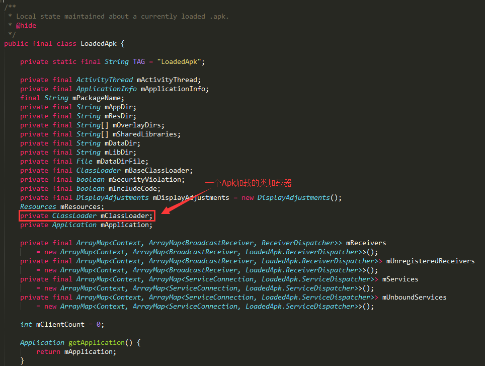
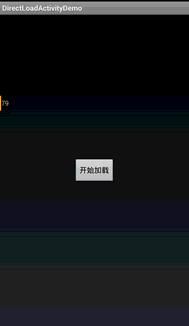
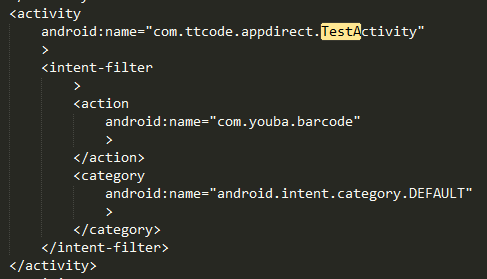

# Android中插件开发篇之----动态加载Activity(免安装运行程序)

来源:[尼古拉斯](http://blog.csdn.net/jiangwei0910410003/article/details/48104455)

## 一、前言

又到周末了，时间过的很快，今天我们来看一下Android中插件开发篇的最后一篇文章的内容：动态加载Activity(免安装运行程序)，在上一篇文章中说道了，如何动态加载资源(应用换肤原理解析)，没看过的同学，可以转战：
[http://blog.csdn.net/jiangwei0910410003/article/details/47679843](http://blog.csdn.net/jiangwei0910410003/article/details/47679843)

当然，今天说道的内容还这这篇文章有关系。关于动态加载Activity的内容，网上也是有很多文章介绍了。但是他们可能大部分都是介绍通过代理的方式去实现的，所以今天我要说的加载会有两种方式：

* 1、使用反射机制修改类加载器
* 2、使用代理的方式

这两种方式都有各自的优缺点，我会在后面的文章详细解说。

## 二、技术介绍

1、第一种方式：使用反射机制修改类加载器来实现动态加载Activity

首先来看一个例子：360安全卫士


在主界面有一个添加更多工具的菜单，点进去之后，可以看到有很多功能选项。我们添加一个手机防盗的功能：有一个进度条开始添加。那么我们如何知道他是使用动态加载的呢？我们可以去查看他的数据文件目录：


我们可以看到有两个目录，比较见名知意：

> app_plugins_v3<br/>
> app_plugins_v3_odex

<font color="#0000FF">第一个目录是存放需要动态加载的功能插件，第二个目录是存放加载之后释放的dex目录。</font>

上面分析了360的动态加载Activity功能，下面我们就来实现以下这个功能吧：

不过我们还得了解一下Android中的类加载器的相关知识，这里就不做介绍了：我在这篇文章中详细介绍了类加载器：
[http://blog.csdn.net/jiangwei0910410003/article/details/41384667](http://blog.csdn.net/jiangwei0910410003/article/details/41384667)

我们知道PathClassLoader是一个应用的默认加载器(而且他只能加载data/app/xxx.apk的文件)，但是我们加载插件一般使用DexClassLoader加载器，所以这里就有问题了，其实如果对于开始的时候，每个人都会认为很简单，很容易想到使用DexClassLoader来加载Activity获取到class对象，在使用Intent启动，这个很简单呀？但是实际上并不是想象的这么简单。<font color="#FF00000">原因很简单，因为Android中的四大组件都有一个特点就是他们有自己的启动流程和生命周期，我们使用DexClassLoader加载进来的Activity是不会涉及到任何启动流程和生命周期的概念，说白了，他就是一个普普通通的类。所以启动肯定会出错。</font>

所以我们知道了问题所在，解决起来也就简单了，但是我们这里还有两种思路去解决这个问题：

<font color="#FF00000">1) 第一个思路： 替换LoadedApk中的mClassLoader</font>

<font color="#0000FF">我们只要让加载进来的Activity有启动流程和生命周期就OK了，所以这里我们需要看一下一个Activity的启动过程。当然这里不会详细介绍一个Activity启动过程的，因为那个太复杂了，而且我也说不清楚，我们知道我们可以将我们使用的DexClassLoader加载器绑定到系统加载Activity的类加载器上就可以了，这个是我们的思路。也是最重要的突破点。下面我们就来通过源码看看如何找到加载Activity的类加载器。</font>

加载Activity的时候，有一个很重要的类：LoadedApk.java，这个类是负责加载一个Apk程序的，我们可以看一下他的源码：



我们可以看到他内部有一个mClassLoader变量，他就是负责加载一个Apk程序的，那么我们只要获取到这个类加载器就可以了。他不是static的，所以我们还得获取一个LoadedApk对象。我们在去看一下另外一个类：ActivityThread.java的源码


这里我们可以看到ActivityThread类中有一个自己的static对象，然后还有一个ArrayMap存放Apk包名和LoadedApk映射关系的数据结构，那么我们分析清楚了，下面就来通过反射来获取mClassLoader对象吧。

**友情提示：**这里可能有些同学会困惑，怎么能够找到这个mClassLoader呢。我在这里因为是为了讲解内容，所以反过来找这个东西了，其实正常情况下，我们在找关于一个Apk或者是Activity的相关信息的时候，特别是启动流程的时候，我们肯定会去找：ActivityThread.java这个类，这个类是很重要很重要的，也是关键的突破口，它内部其实有很多信息的，所以，我们应该先去找这个ActivityThread,然后从这个类中发现信息，然后会找到了LoadedApk这个类。关于ActivityThread这个类，为何如此重要，我们可以在看看他的源码：


他有这个方法？这个方法看到很熟悉呀？他不是Java程序运行的入口main方法吗？是的，没错，**所有的app程序的执行入口就是这里，所以以后有人问你Android中程序运行的入口是哪里？不要再说是Application的onCreate方法了，其实是ActivityThread中的main方法。**

好的，回到主干上来，我们现在开始编写代码来实现反射获取mClassLoader类，然后将其替换成我们的DexClassLoader类，不多说了，看一下Demo工程结构：

> PluginActivity1 ==》插件工程<br/>
> DynamicActivityForClassLoader ==》宿主工程

其中PluginActivity1工程很简单啦，就一个Activiity:

```
package com.example.dynamicactivityapk;  
  
import android.app.Activity;  
import android.os.Bundle;  
import android.view.View;  
import android.view.View.OnClickListener;  
import android.widget.Toast;  
  
public class MainActivity extends Activity {  
      
    private static View parentView;  
  
    @Override  
    protected void onCreate(Bundle savedInstanceState) {  
        super.onCreate(savedInstanceState);  
        if(parentView == null){  
            setContentView(R.layout.activity_main);  
        }else{  
            setContentView(parentView);  
        }  
          
        findViewById(R.id.btn).setOnClickListener(new OnClickListener(){  
  
            @Override  
            public void onClick(View arg0) {  
                Toast.makeText(getApplicationContext(), "I came from 插件~~", Toast.LENGTH_LONG).show();  
            }});  
          
    }  
      
    public static void setLayoutView(View view){  
        parentView = view;  
    }  
  
}
```

我们看到其实这里有一个问题，为何要定义一个setLayoutView的方法，这个我们后面会说道。

我们编译这个工程，得到PluginActivity1.apk程序：


下面来看一下宿主工程

宿主工程其实最大的功能就是加载上面的PluginActivity1.apk，然后启动内部的MainActivity就可以了，这里的核心代码就是如何通过反射替换系统的mClassLoader类：

```
@SuppressLint("NewApi")  
private void loadApkClassLoader(DexClassLoader dLoader){  
    try{  
  
        String filesDir = this.getCacheDir().getAbsolutePath();  
        String libPath = filesDir + File.separator +"PluginActivity1.apk";  
  
        // 配置动态加载环境  
        Object currentActivityThread = RefInvoke.invokeStaticMethod(  
                "android.app.ActivityThread", "currentActivityThread",  
                new Class[] {}, new Object[] {});//获取主线程对象  
        String packageName = this.getPackageName();//当前apk的包名  
        ArrayMap mPackages = (ArrayMap) RefInvoke.getFieldOjbect(  
                "android.app.ActivityThread", currentActivityThread,  
                "mPackages");  
        WeakReference wr = (WeakReference) mPackages.get(packageName);  
        RefInvoke.setFieldOjbect("android.app.LoadedApk", "mClassLoader",  
                wr.get(), dLoader);  
  
        Log.i("demo", "classloader:"+dLoader);  
  
    }catch(Exception e){  
        Log.i("demo", "load apk classloader error:"+Log.getStackTraceString(e));  
    } 
}
```

这里有一个参数就是需要替换的DexClassLoader的，从外部传递过来，然后进行替换。我们看看外部定义的DexClassLoader类：

```
String filesDir = this.getCacheDir().getAbsolutePath();  
String libPath = filesDir + File.separator +"PluginActivity1.apk";  
Log.i("inject", "fileexist:"+new File(libPath).exists());  
  
//loadResources(libPath);  
  
DexClassLoader loader = new DexClassLoader(libPath, filesDir,filesDir, getClassLoader());
```

<font color="#FF0000">
这里，需要注意的是，DexClassLoader的最后一个参数，是DexClassLoader的parent，这里需要设置成PathClassLoader类，因为我们上面虽然说是替换PathClassLoader为DexClassLoader。但是PathClassLoader是系统本身默认的类加载器(也就是mClassLoader变量的值，我们如果单独的将DexClassLoader设置为mClassLoader的值的话，就会出错的)，所以一定要讲DexClassLoader的父加载器设置成PathClassLoader，因为类加载器是符合双亲委派机制的。
</font>

下面我们来运行一下这个程序，首先我们将PluginActivity1.apk放到宿主工程的data/data/cache目录下：


运行程序，点击加载：


**运行发现失败，说是插件中的那个MainActivity没有在AndroidManifest.xml中声明？不对呀，我们在插件工程中明明声明了呀，为何他还是提示没有声明呢？**


哎，其实仔细想想原因很简单的，因为DexClassLoader加载插件Apk，不会将其xml中的内容加载进来，所以在插件中声明是没有任何用途的，必须在宿主工程中声明：

```
<activity   
    android:name="com.example.dynamicactivityapk.MainActivity">  
</activity>  
```

我们在运行程序：


我们点击按钮，看效果啦。果然可以加载成功了啦啦啦。很开心了。

不过这里还是需要注意两个问题：

<font color="#0000FF">
1>、因为要加载插件中的资源，所以需要调用loadResources方法<br/>
2>、在测试的过程中，发现插件工程中setContentView方法没有效果了。所以就在插件工程中定义一个static的方法，用来提前设置视图的。
</font>

**2) 第二思路：合并PathClassLoader和DexClassLoader中的dexElements数组**

好了，这里就介绍了一个如何使用反射机制来动态加载一个Activity了，但是到这里还没有结束呢？因为还要介绍另外一种方式来设置类加载器。

我们首先来看一下PathClassLoader和DexClassLoader类加载器的父类BaseDexClassloader的源码：

**(这里需要注意的是PathClassLoader和DexClassLoader类的父加载器是BootClassLoader,他们的父类是BaseDexClassLoader)**


这里有一个DexPathList对象，在来看一下DexPathList.java源码：


首先看一下这个类的描述，还有一个Elements数组，我们看到这个变量他是专门存放加载的dex文件的路径的，系统默认的类加载器是PathClassLoader，本身一个程序加载之后会释放一个dex出来，这时候会将dex路径放到里面，当然DexClassLoader也是一样的，那么我们会想到，我们是否可以将DexClassLoader中的dexElements和PathClassLoader中的dexElements进行合并，然后在设置给PathClassLoader中呢？这也是一个思路。我们来看代码：

```
/** 
 * 以下是一种方式实现的 
 * @param loader 
 */  
private void inject(DexClassLoader loader){  
    PathClassLoader pathLoader = (PathClassLoader) getClassLoader();  
  
    try {  
        Object dexElements = combineArray(  
                getDexElements(getPathList(pathLoader)),  
                getDexElements(getPathList(loader)));  
        Object pathList = getPathList(pathLoader);  
        setField(pathList, pathList.getClass(), "dexElements", dexElements);  
    } catch (IllegalArgumentException e) {  
        e.printStackTrace();  
    } catch (NoSuchFieldException e) {  
        e.printStackTrace();  
    } catch (IllegalAccessException e) {  
        e.printStackTrace();  
    } catch (ClassNotFoundException e) {  
        e.printStackTrace();  
    }  
}  
  
private static Object getPathList(Object baseDexClassLoader)  
        throws IllegalArgumentException, NoSuchFieldException, IllegalAccessException, ClassNotFoundException {  
    ClassLoader bc = (ClassLoader)baseDexClassLoader;  
    return getField(baseDexClassLoader, Class.forName("dalvik.system.BaseDexClassLoader"), "pathList");  
}  
  
private static Object getField(Object obj, Class<?> cl, String field)  
        throws NoSuchFieldException, IllegalArgumentException, IllegalAccessException {  
    Field localField = cl.getDeclaredField(field);  
    localField.setAccessible(true);  
    return localField.get(obj);  
}  
  
private static Object getDexElements(Object paramObject)  
        throws IllegalArgumentException, NoSuchFieldException, IllegalAccessException {  
    return getField(paramObject, paramObject.getClass(), "dexElements");  
}  
private static void setField(Object obj, Class<?> cl, String field,  
        Object value) throws NoSuchFieldException,  
        IllegalArgumentException, IllegalAccessException {  
  
    Field localField = cl.getDeclaredField(field);  
    localField.setAccessible(true);  
    localField.set(obj, value);  
}  
  
private static Object combineArray(Object arrayLhs, Object arrayRhs) {  
    Class<?> localClass = arrayLhs.getClass().getComponentType();  
    int i = Array.getLength(arrayLhs);  
    int j = i + Array.getLength(arrayRhs);  
    Object result = Array.newInstance(localClass, j);  
    for (int k = 0; k < j; ++k) {  
        if (k < i) {  
            Array.set(result, k, Array.get(arrayLhs, k));  
        } else {  
            Array.set(result, k, Array.get(arrayRhs, k - i));  
        }  
    }  
    return result;  
}
```

我们在运行宿主程序，发现发现也是可以的，这里就不演示了，效果都是一样的。
这里总结一下：

我们在使用反射机制来动态加载Activity的时候，有两个思路：

<font color="#FF0000">
1>、替换LoadApk类中的mClassLoader变量的值，将我们动态加载类DexClassLoader设置为mClassLoader的值<br/>
2>、合并系统默认加载器PathClassLoader和动态加载器DexClassLoader中的dexElements数组
这两个的思路原理都是一样的：就是让我们动态加载进来的Activity能够具备正常的启动流程和生命周期。
</font>

项目下载地址：[http://download.csdn.net/detail/jiangwei0910410003/9063377](http://download.csdn.net/detail/jiangwei0910410003/9063377)

2、第二种方式来动态加载Activity：静态代理的方式

首先我们也是先来看一个例子：23Code

这个应用的功能就是实时的展示一些开源的UI控件。他是在线下载，然后动态加载进行展示的：


我们看到，点击运行Demo的时候，他会去下载apk,我们看看他的数据目录结构：


这里我们看到了，他把下载之后的apk都用每个插件的功能包名存起来的。

好了，上面分析了23Code的加载机制，我们来看看如何使用代理的方式来动态加载Activity

先来看看原理：


所以说，这种方式来加载Activity的话，其实真正意义上每个插件的Activity都不再是想方式一中的那样，没有生命周期，没有启动流程了，他们就是一个普通的Activity类，然后将其生命周期的所有任务都交给代理Activity去执行就可以了。

下面我们来看一下项目工程：

1、DynamicActivityForProxy ==》宿主工程

2、PluginActivity2 ==》插件工程

看一下插件工程

BaseActivity.java

```
package com.example.dynamicactivity;  
  
import com.example.dynamicactivity.R;  
  
import android.app.Activity;  
import android.os.Bundle;  
import android.view.View;  
import android.view.View.OnClickListener;  
import android.widget.Toast;  
  
public class BaseActivity extends Activity {  
    protected Activity mProxyActivity;  
  
    public void setProxy(Activity proxyActivity) {   
        mProxyActivity = proxyActivity;  
    }  
  
    @Override  
    protected void onCreate(Bundle savedInstanceState) {  
    }  
  
    @Override  
    public void setContentView(int layoutResID) {   
        if (mProxyActivity != null && mProxyActivity instanceof Activity) {  
            mProxyActivity.setContentView(layoutResID);  
            mProxyActivity.findViewById(R.id.btn).setOnClickListener(  
                    new OnClickListener() {  
                        @Override  
                        public void onClick(View v) {  
                            Toast.makeText(mProxyActivity, "我是插件，你是谁!",Toast.LENGTH_LONG).show();  
                        }  
                    });  
        }  
    }  
  
}
```

这里会重写setContentView的方法，同时有一个setProxy方法。

在来看一下MainActivity.java

```
package com.example.dynamicactivity;  
  
import com.example.dynamicactivity.R;  
  
import android.os.Bundle;  
import android.util.Log;  
  
public class MainActivity extends BaseActivity {  
      
    @Override  
    protected void onCreate(Bundle savedInstanceState) {  
        super.onCreate(savedInstanceState);  
        setContentView(R.layout.activity_main);  
    }  
  
    @Override  
    protected void onDestroy() {  
        //这里需要注意的是，不能调用super.onDestroy的方法了，不然报错，原因也很简单，这个Activity实质上不是真正的Activity了，没有生命周期的概念了，调用super的方法肯定报错  
        Log.i("demo", "onDestory");  
    }  
  
    @Override  
    protected void onPause() {  
        Log.i("demo", "onPause");  
    }  
  
    @Override  
    protected void onResume() {  
        Log.i("demo", "onResume");  
    }  
  
    @Override  
    protected void onStart() {  
        Log.i("demo", "onStart");  
    }  
  
    @Override  
    protected void onStop() {  
        Log.i("demo", "onStop");  
    }   
}
```

这里打印一下生命周期中的每个方法，待会需要验证。

注意：这里的生命周期方法不能再调用super.XXX方法了，否则会报错的，原因很简单啦。插件Activity不在是真正意义上的Activity了，就是一个空壳的Activity。所以调用的话，肯定会出错

运行插件工程，得到一个PluginActivity2.apk

下面来看一下宿主工程：

首先我们来看一下重要的代理对象ProxyActiviity

```
package com.example.dynamic.activity;  
  
import java.io.File;  
import java.lang.reflect.Constructor;  
import java.lang.reflect.Method;  
import java.util.HashMap;  
  
import android.annotation.SuppressLint;  
import android.app.Activity;  
import android.os.Bundle;  
import android.util.Log;  
import dalvik.system.DexClassLoader;  
  
public class ProxyActivity extends BaseActivity {  
      
    private Object pluginActivity;  
    private Class<?> pluginClass;  
      
    private HashMap<String, Method> methodMap = new HashMap<String,Method>();  
  
    @SuppressLint("NewApi")  
    @Override  
    protected void onCreate(Bundle savedInstanceState) {  
        super.onCreate(savedInstanceState);  
        try {  
            DexClassLoader loader = initClassLoader();  
              
            //动态加载插件Activity  
            pluginClass = loader.loadClass("com.example.dynamicactivity.MainActivity");  
            Constructor<?> localConstructor = pluginClass.getConstructor(new Class[] {});  
            pluginActivity = localConstructor.newInstance(new Object[] {});  
  
            //将代理对象设置给插件Activity  
            Method setProxy = pluginClass.getMethod("setProxy",new Class[] { Activity.class });   
            setProxy.setAccessible(true);  
            setProxy.invoke(pluginActivity, new Object[] { this });  
              
            initMethodMap();  
  
            //调用它的onCreate方法  
            Method onCreate = pluginClass.getDeclaredMethod("onCreate",  
                    new Class[] { Bundle.class });  
            onCreate.setAccessible(true);  
            onCreate.invoke(pluginActivity, new Object[] { new Bundle() });  
              
        } catch (Exception e) {  
            Log.i("demo", "load activity error:"+Log.getStackTraceString(e));  
        }  
    }  
      
    /** 
     * 存储每个生命周期的方法 
     */  
    private void initMethodMap(){  
        methodMap.put("onPause", null);  
        methodMap.put("onResume", null);  
        methodMap.put("onStart", null);  
        methodMap.put("onStop", null);  
        methodMap.put("onDestroy", null);  
          
        for(String key : methodMap.keySet()){  
            try{  
                Method method = pluginClass.getDeclaredMethod(key);  
                method.setAccessible(true);  
                methodMap.put(key, method);  
            }catch(Exception e){  
                Log.i("demo", "get method error:"+Log.getStackTraceString(e));  
            }  
        }  
          
    }  
      
    @SuppressLint("NewApi")  
    private DexClassLoader initClassLoader(){  
        String filesDir = this.getCacheDir().getAbsolutePath();  
        String libPath = filesDir + File.separator +"PluginActivity2.apk";  
        Log.i("inject", "fileexist:"+new File(libPath).exists());  
        loadResources(libPath);  
        DexClassLoader loader = new DexClassLoader(libPath, filesDir,null , getClass().getClassLoader());  
        return loader;  
    }  
      
    @Override  
    protected void onDestroy() {  
        super.onDestroy();  
        Log.i("demo", "proxy onDestroy");  
        try{  
            methodMap.get("onDestroy").invoke(pluginActivity, new Object[]{});  
        }catch(Exception e){  
            Log.i("demo", "run destroy error:"+Log.getStackTraceString(e));  
        }  
    }  
  
    @Override  
    protected void onPause() {  
        super.onPause();  
        Log.i("demo", "proxy onPause");  
        try{  
            methodMap.get("onPause").invoke(pluginActivity, new Object[]{});  
        }catch(Exception e){  
            Log.i("demo", "run pause error:"+Log.getStackTraceString(e));  
        }  
    }  
  
    @Override  
    protected void onResume() {  
        super.onResume();  
        Log.i("demo", "proxy onResume");  
        try{  
            methodMap.get("onResume").invoke(pluginActivity, new Object[]{});  
        }catch(Exception e){  
            Log.i("demo", "run resume error:"+Log.getStackTraceString(e));  
        }  
    }  
  
    @Override  
    protected void onStart() {  
        super.onStart();  
        Log.i("demo", "proxy onStart");  
        try{  
            methodMap.get("onStart").invoke(pluginActivity, new Object[]{});  
        }catch(Exception e){  
            Log.i("demo", "run start error:"+Log.getStackTraceString(e));  
        }  
    }  
  
    @Override  
    protected void onStop() {  
        super.onStop();  
        Log.i("demo", "proxy onStop");  
        try{  
            methodMap.get("onStop").invoke(pluginActivity, new Object[]{});  
        }catch(Exception e){  
            Log.i("demo", "run stop error:"+Log.getStackTraceString(e));  
        }  
    }  
  
}
```

这里主要就是：

1、加载插件Activity<br/>
2、使用反射将代理对象设置给插件Activity<br/>
3、测试插件Activity中的生命周期方法<br/>

运行程序，我们将上面的PluginActivity2.apk放到宿主程序的cache目录下


运行：



也是成功了，看到效果啦啦，同时我们打印一下Log日志：


插件Activity的每个生命周期的方法也是都执行了。

到这里我们就讲解完了使用代理的方式来实现动态加载Activity。这种方式其实还是很简单的。

项目下载地址：[http://download.csdn.net/detail/jiangwei0910410003/9063483](http://download.csdn.net/detail/jiangwei0910410003/9063483)

总算是讲完了，累死了，两种方式各有千秋，各有各的好处。

## 三、案例分析

上面讲解的两种方式的时候，介绍了两个例子：一个是360卫士，一个是23Code

为什么要用这两个例子呢？原因下载说明一下啦：

1、首先来看一下360卫士，我们打开它的一个辅助功能：

使用：`adb shell dumpsys activity top`


我们再来看一下他的AndroidManifest.xml内容：


我们可以看到，他在宿主工程中声明了，而且我们会看到有很多个辅助功能都声明了。所以我们断定他使用的是第一种方式去实现动态加载的，所以我们可以看到这种方式有一个不好就是：需要在宿主工程中声明很多个插件Activity。

2、在来看一下23Code应用

运行一个例子之后，我们看到他的Activity是TestActivity


我们再去切换另外一个例子运行之后，也是发现还是这个TestActivity。看看他的AndroidManifest.xml



那么我们断定，这个TestActivity就是一个代理的Activity,他使用的是第二种方式来实现动态加载的。
现在知道为何我开始的时候为什么用这两个例子来说明了吧。

## 四、两种方式的比较
**第一种方式：使用反射机制来实现**

优点：可以不用太多的关心插件中的Activity的生命周期方法，因为他加载进来之后就是一个真正意义上的Activity了<br/>
缺点：需要在宿主工程中进行声明，如果插件中的Activity多的话，那么就不灵活了。

**第二种方式：使用代理机制来实现**

优点：不需要在宿主工程中进行声明太多的Activity了，只需要有一个代理Activity的声明就可以了，很灵活<br/>
缺点：需要管理手动的去管理插件中Activity的生命周期方法，难度复杂。

## 五、存在的问题

我们看到上面讲到的两种方式去动态加载Activity,其实两种方式都还存在很多问题：

1、其他组件的动态加载问题(服务，广播，ContentProvier)<br/>
2、跨进程访问的问题

## 六、总结
这篇文章讲完之后，那么插件开发篇的三部曲就算结束了，Android中的插件开发也算是有一个好的总结了，也是讲解了现在主流市场中加载的原理和机制。当然我们在真正的使用过程中还会存在很多问题，当然这个就需要我们自己去探索和解决了。

(PS：两种方式的项目下载地址都在上面给出了，如果在运行的过程中有什么问题的话，请留言。能帮就尽量帮助解决一下~~)