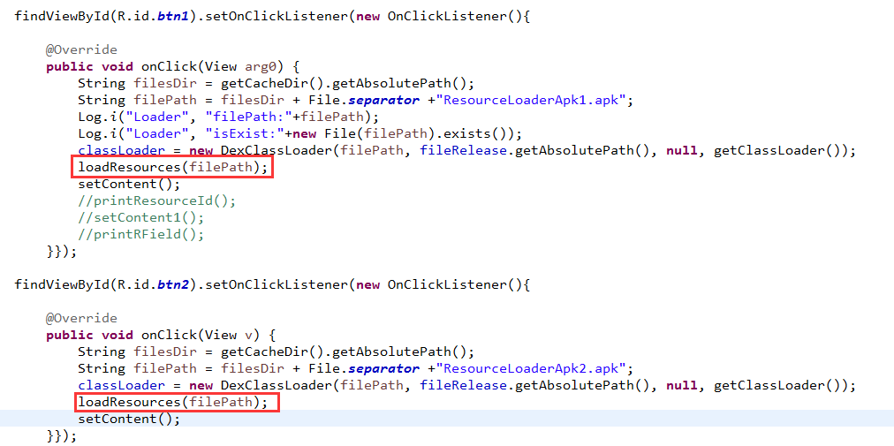

# Android中插件开发篇之----应用换肤原理解析

来源:[尼古拉斯](http://blog.csdn.net/jiangwei0910410003/article/details/47679843)

## 一、前言

今天又到周末了，感觉时间过的很快呀.又要写blog了。那么今天就来看看应用的换肤原理解析。在之前的一篇博客中我说道了Android中的插件开发篇的基础：类加载器的相关知识。没看过的同学可以转战：

[http://blog.csdn.net/jiangwei0910410003/article/details/41384667](http://blog.csdn.net/jiangwei0910410003/article/details/41384667)

## 二、原理介绍

现在市场上有很多应用都有换肤的功能，就是能够提供给用户一些皮肤包，然后下载，替换。而且有些皮肤是要收费的。对于这个功能的话，其实没有什么技术难度的，但是他包含了一个现阶段很火的一个技术：动态加载

好了，既然说到了动态加载，那么如果有不熟悉的同学，可以转战看另外的一篇blog了：

[http://blog.csdn.net/jiangwei0910410003/article/details/17679823](http://blog.csdn.net/jiangwei0910410003/article/details/17679823)

我们先来看一个市场上的一个app具有的换肤功能的例子：QQ空间

**点击我的空间=>个性化=>原创主题=>选择下载主题**


下载主题，然后可以替换了。接下来我们看看这个主题包放到哪了？因为既然下载肯定是存放起来了。

两个地方可以放：一个是SD卡，一个是应用的数据目录

我们先来看看应用的目录(配置好了adb命令)：

### 第一步：得到QQ空间的的包名：

打开QQ空间app,不要退出。然后执行命令：`adb shell dumpsys activity top`


这个命令还是很有用的吧，能够快速的得到一个应用的包名

我们看到QQ空间的包名：com.qzone

### 第二步：进入QQ应用的目录，查看对应的资源


我们在他的shared_prefs中找到了theme.xml文件，查看该文件，就可以找到了对应皮肤的位置：

**/data/user/0/com.qzone/files/cache/qz_external_resource/theme_res/38**

我们进入到这个目录：


看到上面红色圈起来的地方的目录结构和文件名是不是很眼熟.对，这个就是我们把一个正常的apk解压之后得到的东西。那么我们可以断定，QQ空间的皮肤包其实就是一个apk,然后动态加载apk，取到对应的资源然后替换。

## 三、如何设计一个换肤插件
好了，既然上面我们解读了QQ空间的换肤功能，也知道了它的大体的原理了，下面我们来自己动手制作我们自己的主题包。

关于动态加载的相关技术这里就不详细介绍了，看我的前面提到的两个相关文章的介绍。

我们这里需要建立三个工程：

```
宿主程序(主程序)：ResourceLoader
主题包1的工程：ResourceLoaderApk1
主题包2的工程：ResourceLoaderApk2
```

在宿主程序中我们需要编写动态加载的代码：

下面来看一下具体代码：

MainActivity.java

```
package com.example.resourceloader;  
  
import java.io.File;  
import java.lang.reflect.Field;  
import java.lang.reflect.Method;  
  
import android.annotation.SuppressLint;  
import android.content.Context;  
import android.graphics.drawable.Drawable;  
import android.os.Bundle;  
import android.util.Log;  
import android.view.View;  
import android.view.View.OnClickListener;  
import android.widget.ImageView;  
import android.widget.LinearLayout;  
import android.widget.TextView;  
  
public class MainActivity extends BaseActivity {  
      
    /** 
     * 需要替换主题的控件 
     * 这里就列举三个：TextView,ImageView,LinearLayout 
     */  
    private TextView textV;  
    private ImageView imgV;  
    private LinearLayout layout;  
      
    @Override  
    protected void onCreate(Bundle savedInstanceState) {  
        super.onCreate(savedInstanceState);  
        setContentView(R.layout.activity_main);  
          
        textV = (TextView)findViewById(R.id.text);  
        imgV = (ImageView)findViewById(R.id.imageview);  
        layout = (LinearLayout)findViewById(R.id.layout);  
          
        findViewById(R.id.btn1).setOnClickListener(new OnClickListener(){  
  
            @Override  
            public void onClick(View arg0) {  
                String filesDir = getCacheDir().getAbsolutePath();  
                String filePath = filesDir + File.separator +"apk1.apk";  
                Log.i("Loader", "filePath:"+filePath);  
                Log.i("Loader", "isExist:"+new File(filePath).exists());  
                //loadResources(filePath);  
                //setContent();  
                //printResourceId();  
                setContent1();  
                //printRField();  
            }});  
          
        findViewById(R.id.btn2).setOnClickListener(new OnClickListener(){  
  
            @Override  
            public void onClick(View v) {  
                String filesDir = getCacheDir().getAbsolutePath();  
                String filePath = filesDir + File.separator +"apk2.apk";  
                //loadResources(filePath);  
                setContent();  
            }});  
    }  
      
    /** 
     * 动态加载主题包中的资源，然后替换每个控件 
     */  
    @SuppressLint("NewApi")  
    private void setContent(){  
        try{  
            Class clazz = classLoader.loadClass("com.example.resourceloaderapk.UIUtil");  
            Method method = clazz.getMethod("getTextString", Context.class);  
            String str = (String)method.invoke(null, this);  
            textV.setText(str);  
            method = clazz.getMethod("getImageDrawable", Context.class);  
            Drawable drawable = (Drawable)method.invoke(null, this);  
            imgV.setBackground(drawable);  
            method = clazz.getMethod("getLayout", Context.class);  
            View view = (View)method.invoke(null, this);  
            layout.addView(view);  
        }catch(Exception e){  
            Log.i("Loader", "error:"+Log.getStackTraceString(e));  
        }  
    }  
      
    /** 
     * 另外的一种方式获取 
     */  
    private void setContent1(){  
        int stringId = getTextStringId();  
        int drawableId = getImgDrawableId();  
        int layoutId = getLayoutId();  
        Log.i("Loader", "stringId:"+stringId+",drawableId:"+drawableId+",layoutId:"+layoutId);  
    }  
      
    @SuppressLint("NewApi")  
    private int getTextStringId(){  
        try{  
            Class clazz = classLoader.loadClass("com.example.resourceloaderapk1.R$string");  
            Field field = clazz.getField("app_name");  
            int resId = (int)field.get(null);  
            return resId;  
        }catch(Exception e){  
            Log.i("Loader", "error:"+Log.getStackTraceString(e));  
        }  
        return 0;  
    }  
      
    @SuppressLint("NewApi")  
    private int getImgDrawableId(){  
        try{  
            Class clazz = classLoader.loadClass("com.example.resourceloaderapk1.R$drawable");  
            Field field = clazz.getField("ic_launcher");  
            int resId = (int)field.get(null);  
            return resId;  
        }catch(Exception e){  
            Log.i("Loader", "error:"+Log.getStackTraceString(e));  
        }  
        return 0;  
    }  
      
    @SuppressLint("NewApi")  
    private int getLayoutId(){  
        try{  
            Class clazz = classLoader.loadClass("com.example.resourceloaderapk1.R$layout");  
            Field field = clazz.getField("activity_main");  
            int resId = (int)field.get(null);  
            return resId;  
        }catch(Exception e){  
            Log.i("Loader", "error:"+Log.getStackTraceString(e));  
        }  
        return 0;  
    }  
      
    @SuppressLint("NewApi")  
    private void printResourceId(){  
        try{  
            Class clazz = classLoader.loadClass("com.example.resourceloaderapk.UIUtil");  
            Method method = clazz.getMethod("getTextStringId", null);  
            Object obj = method.invoke(null, null);  
            Log.i("Loader", "stringId:"+obj);  
            Log.i("Loader", "newId:"+R.string.app_name);  
            method = clazz.getMethod("getImageDrawableId", null);  
            obj = method.invoke(null, null);  
            Log.i("Loader", "drawableId:"+obj);  
            Log.i("Loader", "newId:"+R.drawable.ic_launcher);  
            method = clazz.getMethod("getLayoutId", null);  
            obj = method.invoke(null, null);  
            Log.i("Loader", "layoutId:"+obj);  
            Log.i("Loader", "newId:"+R.layout.activity_main);  
        }catch(Exception e){  
            Log.i("Loader", "error:"+Log.getStackTraceString(e));  
        }  
    }  
      
    private void printRField(){  
        Class clazz = R.id.class;  
        Field[] fields = clazz.getFields();  
        for(Field field : fields){  
            Log.i("Loader", "fields:"+field);  
        }  
        Class clazzs = R.layout.class;  
        Field[] fieldss = clazzs.getFields();  
        for(Field field : fieldss){  
            Log.i("Loader", "fieldss:"+field);  
        }  
    }  
      
} 
```

这里的代码没有大的难度，**就是我们使用DexClassLoader类加载每个主题的apk包，然后用反射的方法调用apk包中的方法来获取资源。**

下面来看一下主题包工程代码：

UIUtil.java

```
package com.example.resourceloaderapk;  
  
import android.content.Context;  
import android.graphics.drawable.Drawable;  
import android.view.LayoutInflater;  
import android.view.View;  
  
import com.example.resourceloaderapk1.R;  
  
public class UIUtil {  
      
    public static String getTextString(Context ctx){  
        return ctx.getResources().getString(R.string.app_name);  
    }  
      
    public static Drawable getImageDrawable(Context ctx){  
        return ctx.getResources().getDrawable(R.drawable.ic_launcher);  
    }  
      
    public static View getLayout(Context ctx){  
        return LayoutInflater.from(ctx).inflate(R.layout.activity_main, null);  
    }  
      
    public static int getTextStringId(){  
        return R.string.app_name;  
    }  
      
    public static int getImageDrawableId(){  
        return R.drawable.ic_launcher;  
    }  
      
    public static int getLayoutId(){  
        return R.layout.activity_main;  
    }  
  
}
```

**这个类就是提供给外部的获取资源的方法，我们在宿主程序中也就是反射这个方法来获取资源的，这个方法中我们提供了两种方式获取资源：一种是直接返回资源的内容，还有一种是返回一个资源的Id。**

关于主题包2的工程这里就不介绍了，代码是一样的，只是资源不一样。

我们运行两个主题包，得到两个apk

```
ResourceLoaderApk1.apk
ResourceLoaderApk2.apk
```

这时候我们使用adb push命令，将这两个apk放到宿主程序的cache目录下。


**温馨提示：**

**这里不能将需要加载的apk放到非宿主程序的沙盒目录外，不然会加载失败，抛出异常。关于程序的沙盒目录概念其实很好理解：就是/data/data/xxx.xxx/目录，就是这个目录是这个程序所独有的，其他没有共享权限的app是不能访问的(当然除了获取root权限外),这个其实也很好理解为何要这么做，Google也是为了安全，自己需要加载的apk/dex/jar就应当被保护起来。**


当然这里不一定要放到cache目录下，只要是沙盒目录下都可以，新建一个目录也是可以的。不过一般都是使用cache目录。

项目地址：[http://download.csdn.net/detail/jiangwei0910410003/9008423](http://download.csdn.net/detail/jiangwei0910410003/9008423)

这时候我们运行宿主程序：


两个btn，可以加载不同的主题内容，但是问题来啦。。点击之后发现没有效果，捕获异常，我们打印log看看：`adb logcat -s Loader`


他说找不到资源异常，我们来分析一下。

我们在主题1工程中，调用的是主题1apk中的资源R.string.xxx

但是我们知道获取资源的时候是用Resource类来得到的，对于一个程序来说一个Context只会持有一个Resource对象，但是我们加载apk的时候，主题apk没有得到对应的Context。因为动态加载不想正常的运行一个程序，每个程序都有一个全局的Context变量，但是加载出来的话是没有的。那有人就说了：在代码里面我们用反射的方式去获取的时候不是将宿主的Context变量传递过去了吗？


对，看上去是没有任何问题，但是这里其实还是那个问题：就是宿主的Context如何能加载插件apk中的资源，我们知道一个app的工程的资源文件都会隐射到R文件中，而这个R文件的包名则是这个应用的包名，一个包名一般对应一个Context。那么我们现在即使将宿主的Context传递过去，也是对应宿主的包名，也就是找到宿主工程的R文件，所以还是找不到对应的资源。其实我们要解决的问题就是将插件apk中资源添加到宿主apk中。这时候就需要用一种方式了，采用反射的机制：

通过调用AssetManager中的addAssetPath方法，我们可以将一个apk中的资源加载到Resources中，由于addAssetPath是隐藏api我们无法直接调用，所以只能通过反射，下面是它的声明，通过注释我们可以看出，传递的路径可以是zip文件也可以是一个资源目录，而apk就是一个zip，所以直接将apk的路径传给它，资源就加载到AssetManager中了，然后再通过AssetManager来创建一个新的Resources对象，这个对象就是我们可以使用的apk中的资源了。

我们看一下代码：

```
protected void loadResources(String dexPath) {    
        try {    
            AssetManager assetManager = AssetManager.class.newInstance();    
            Method addAssetPath = assetManager.getClass().getMethod("addAssetPath", String.class);    
            addAssetPath.invoke(assetManager, dexPath);    
            mAssetManager = assetManager;    
        } catch (Exception e) {    
            e.printStackTrace();    
        }    
        Resources superRes = super.getResources();    
        superRes.getDisplayMetrics();    
        superRes.getConfiguration();    
        mResources = new Resources(mAssetManager, superRes.getDisplayMetrics(),superRes.getConfiguration());    
        mTheme = mResources.newTheme();    
        mTheme.setTo(super.getTheme());  
    } 
```

参数就是需要加载资源的包的路径。

当然我们还需要重写Context的三个方法：

```
@Override    
public AssetManager getAssets() {    
    return mAssetManager == null ? super.getAssets() : mAssetManager;    
}    
  
@Override    
public Resources getResources() {    
    return mResources == null ? super.getResources() : mResources;    
}    
  
@Override    
public Theme getTheme() {    
    return mTheme == null ? super.getTheme() : mTheme;    
}
```

重写的这三个方法就是让系统获取我们加载apk包之后的变量即可

这里，我们把代码在修改一下：在宿主工程中添加一个BaseActivity类：

BaseActivity.java

```
package com.example.resourceloader;  
  
import java.io.File;  
import java.lang.reflect.Method;  
  
import android.app.Activity;  
import android.content.res.AssetManager;  
import android.content.res.Resources;  
import android.content.res.Resources.Theme;  
import android.os.Bundle;  
import dalvik.system.DexClassLoader;  
  
public class BaseActivity extends Activity{  
      
    protected AssetManager mAssetManager;//资源管理器    
    protected Resources mResources;//资源    
    protected Theme mTheme;//主题    
      
      
    @Override  
    protected void onCreate(Bundle savedInstanceState) {  
        super.onCreate(savedInstanceState);  
    }  
      
    protected void loadResources(String dexPath) {    
        try {    
            AssetManager assetManager = AssetManager.class.newInstance();    
            Method addAssetPath = assetManager.getClass().getMethod("addAssetPath", String.class);    
            addAssetPath.invoke(assetManager, dexPath);    
            mAssetManager = assetManager;    
        } catch (Exception e) {    
            e.printStackTrace();    
        }    
        Resources superRes = super.getResources();    
        superRes.getDisplayMetrics();    
        superRes.getConfiguration();    
        mResources = new Resources(mAssetManager, superRes.getDisplayMetrics(),superRes.getConfiguration());    
        mTheme = mResources.newTheme();    
        mTheme.setTo(super.getTheme());  
    }    
      
    @Override    
    public AssetManager getAssets() {    
        return mAssetManager == null ? super.getAssets() : mAssetManager;    
    }    
      
    @Override    
    public Resources getResources() {    
        return mResources == null ? super.getResources() : mResources;    
    }    
      
    @Override    
    public Theme getTheme() {    
        return mTheme == null ? super.getTheme() : mTheme;    
    }   
  
}
```

在MainActivity中调用loadResource方法：



这时候我们在运行宿主程序：


点击主题1：我们发现文字变成了：ResourceLoaderApk；因为这里的图片都是用的机器人所以看上去没变化，看到底下的LinearLayout加载了主题包中的布局xml内容。

点击主题2：效果同上，只是内容是主题包2apk中的。

好了。到这里我们就完美的开发了我们自己的换肤功能。但是有的同学可能认为，这哪是换肤的功能，没看到效果呢？我这个例子不是完完全全的开发一个换肤的工程。只是介绍原理呢。不过真的换肤也没有难度的，我们需要解决一些问题：

<font color="#FF0000">
1、对于需要替换主题的控件需要统一定义一下。<br/>
2、对于每个主题包的工程中的对外接口要统一(或者是要符合一定规范)，比如这个例子中主题包中必须有一个：

`com.example.resourceloaderapk.UIUtil`类，而且这个类中必须有三个方法：getTextString,getImageDrawable，getLayout所以这就是一个规范，当然我这里的规范设计的不是很好，正确的做法是在提供一个接口，然后每个主题包工程必须实现这个接口，然后主题包工程和宿主工程都包含这个接口，这样就能够很灵活了。<br/>
3、一般主题包apk是从网上下载下来的，所以我们需要事前设置要几个默认的主题包在本地，如果从网上下载下来的主题包出现问题了，我们去加载默认的主题。这样就不会出现任何异常情况。<br/>
</font>

## 四、问题总结

其实这篇文章我们看到了上面我们其实就是解决一个问题，就是如何加载主题包apk中的资源。其实这个问题有人还有一种想法，就是我们将需要的资源全部打包(可以是任何压缩包的格式)，从网上下载下来之后，解压文件，通过流的方式读取每个资源文件到工程中，其实这种方式是可行的，但是效率上有很大的问题(反正我是没有尝试过)。所以这里的这种方式很方便而且高效。

## 五、实际用途

本文说到的这个技术现在市面上主要的作用就是：

1、在线替换主题(皮肤)，语言包等

2、减小主apk的包大小，将不是很重要的资源打包成apk放到服务端。

## 六、总结

这篇文章主要介绍了应用换肤的原理，核心技术就是：如何加载插件Apk中的资源。后续还会技术讲解Android中插件的用途：免安装运行程序，制作中。。。
