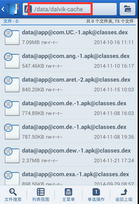
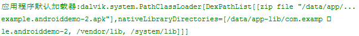
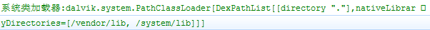
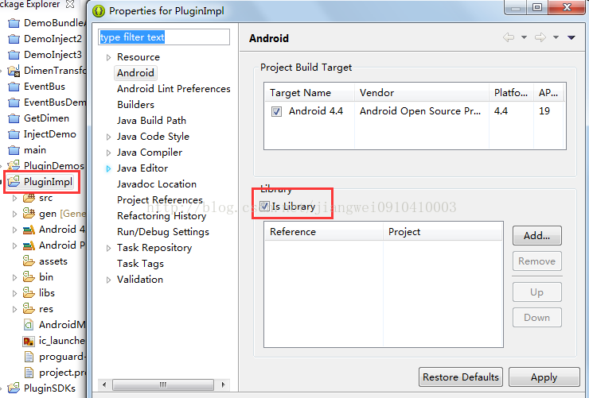
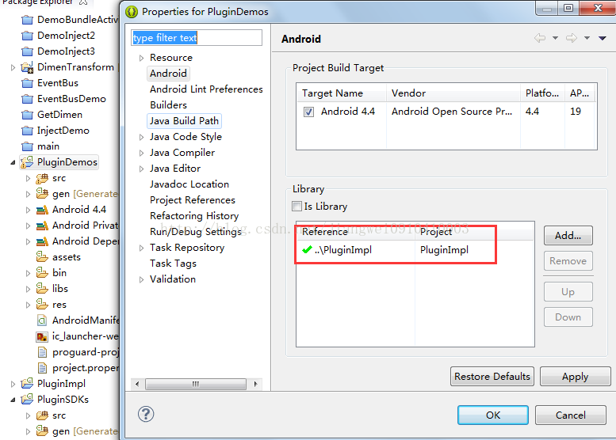
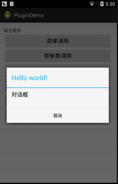
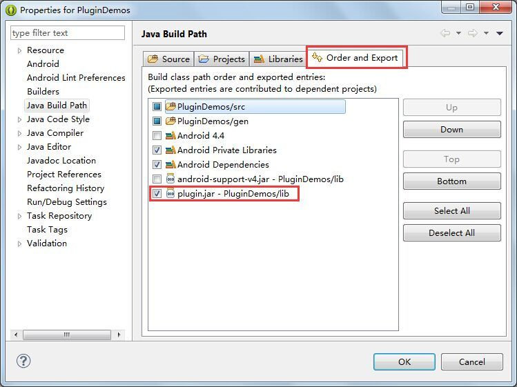
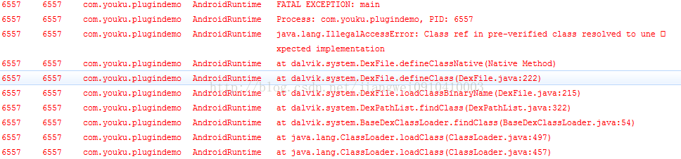

# Android中插件开发篇之----类加载器

来源:[尼古拉斯](http://blog.csdn.net/jiangwei0910410003/article/details/41384667)

## 前言
关于插件，已经在各大平台上出现过很多，eclipse插件、chrome插件、3dmax插件，所有这些插件大概都为了在一个主程序中实现比较通用的功能，把业务相关或者让可以让用户自定义扩展的功能不附加在主程序中，主程序可在运行时安装和卸载。在Android如何实现插件也已经被广泛传播，实现的原理都是实现一套插件接口，把插件实现编成apk或者dex，然后在运行时使用DexClassLoader动态加载进来，不过在这个开发过程中会遇到很多的问题，所以这一片就先不介绍如何开发插件，而是先解决一下开发过程中会遇到的问题，这里主要就是介绍DexClassLoader这个类使用的过程中出现的错误

## 导读
Java中的类加载器：[http://blog.csdn.net/jiangwei0910410003/article/details/17733153](http://blog.csdn.net/jiangwei0910410003/article/details/17733153)<br/>
Android中的动态加载机制：[http://blog.csdn.net/jiangwei0910410003/article/details/17679823](http://blog.csdn.net/jiangwei0910410003/article/details/17679823)<br/>
System.loadLibrary的执行过程：[http://blog.csdn.net/jiangwei0910410003/article/details/41490133](http://blog.csdn.net/jiangwei0910410003/article/details/41490133)<br/>

## 一、预备知识
### Android中的各种加载器介绍

插件开发的过程中DexClassLoader和PathClassLoader这两个类加载器了是很重要的，但是他们也是有区别的，而且我们也知道**PathClassLoader是Android应用中的默认加载器**。他们的区别是：

<font color="#0000FF">

DexClassLoader可以加载任何路径的apk/dex/jar

PathClassLoader只能加载/data/app中的apk，也就是已经安装到手机中的apk。这个也是PathClassLoader作为默认的类加载器的原因，因为一般程序都是安装了，在打开，这时候PathClassLoader就去加载指定的apk(解压成dex，然后在优化成odex)就可以了。
</font>

我们可以看一下他们的源码：

```
/* 
 * Copyright (C) 2008 The Android Open Source Project 
 * 
 * Licensed under the Apache License, Version 2.0 (the "License"); 
 * you may not use this file except in compliance with the License. 
 * You may obtain a copy of the License at 
 * 
 *      http://www.apache.org/licenses/LICENSE-2.0 
 * 
 * Unless required by applicable law or agreed to in writing, software 
 * distributed under the License is distributed on an "AS IS" BASIS, 
 * WITHOUT WARRANTIES OR CONDITIONS OF ANY KIND, either express or implied. 
 * See the License for the specific language governing permissions and 
 * limitations under the License. 
 */  
  
package dalvik.system;  
  
import java.io.File;  
import java.io.IOException;  
import java.net.MalformedURLException;  
import java.net.URL;  
import java.util.zip.ZipFile;  
  
/** 
 * Provides a simple {@link ClassLoader} implementation that operates on a 
 * list of jar/apk files with classes.dex entries.  The directory that 
 * holds the optimized form of the files is specified explicitly.  This 
 * can be used to execute code not installed as part of an application. 
 * 
 * The best place to put the optimized DEX files is in app-specific 
 * storage, so that removal of the app will automatically remove the 
 * optimized DEX files.  If other storage is used (e.g. /sdcard), the 
 * app may not have an opportunity to remove them. 
 */  
public class DexClassLoader extends ClassLoader {  
  
    private static final boolean VERBOSE_DEBUG = false;  
  
    /* constructor args, held for init */  
    private final String mRawDexPath;  
    private final String mRawLibPath;  
    private final String mDexOutputPath;  
  
    /* 
     * Parallel arrays for jar/apk files. 
     * 
     * (could stuff these into an object and have a single array; 
     * improves clarity but adds overhead) 
     */  
    private final File[] mFiles;         // source file Files, for rsrc URLs  
    private final ZipFile[] mZips;       // source zip files, with resources  
    private final DexFile[] mDexs;       // opened, prepped DEX files  
  
    /** 
     * Native library path. 
     */  
    private final String[] mLibPaths;  
  
    /** 
     * Creates a {@code DexClassLoader} that finds interpreted and native 
     * code.  Interpreted classes are found in a set of DEX files contained 
     * in Jar or APK files. 
     * 
     * The path lists are separated using the character specified by 
     * the "path.separator" system property, which defaults to ":". 
     * 
     * @param dexPath 
     *  the list of jar/apk files containing classes and resources 
     * @param dexOutputDir 
     *  directory where optimized DEX files should be written 
     * @param libPath 
     *  the list of directories containing native libraries; may be null 
     * @param parent 
     *  the parent class loader 
     */  
    public DexClassLoader(String dexPath, String dexOutputDir, String libPath,  
        ClassLoader parent) {  
  
        super(parent);  
......  
```

我们看到，他是继承了ClassLoader类的，ClassLoader是类加载器的鼻祖类。同时我们也会发现DexClassLoader只有一个构造函数，而且这个构造函数是：dexPath、dexOutDir、libPath、parent

<font color="#0000FF">
dexPath：是加载apk/dex/jar的路径<br/>
dexOutDir：是dex的输出路径(因为加载apk/jar的时候会解压除dex文件，这个路径就是保存dex文件的)<br/>
libPath：是加载的时候需要用到的lib库，这个一般不用<br/>
parent：给DexClassLoader指定父加载器
</font>

我们在来看一下PathClassLoader的源码

PathClassLoader.java

```
/* 
 * Copyright (C) 2007 The Android Open Source Project 
 * 
 * Licensed under the Apache License, Version 2.0 (the "License"); 
 * you may not use this file except in compliance with the License. 
 * You may obtain a copy of the License at 
 * 
 *      http://www.apache.org/licenses/LICENSE-2.0 
 * 
 * Unless required by applicable law or agreed to in writing, software 
 * distributed under the License is distributed on an "AS IS" BASIS, 
 * WITHOUT WARRANTIES OR CONDITIONS OF ANY KIND, either express or implied. 
 * See the License for the specific language governing permissions and 
 * limitations under the License. 
 */  
  
package dalvik.system;  
  
import java.io.ByteArrayOutputStream;  
import java.io.File;  
import java.io.FileNotFoundException;  
import java.io.IOException;  
import java.io.InputStream;  
import java.io.RandomAccessFile;  
import java.net.MalformedURLException;  
import java.net.URL;  
import java.util.ArrayList;  
import java.util.Enumeration;  
import java.util.List;  
import java.util.NoSuchElementException;  
import java.util.zip.ZipEntry;  
import java.util.zip.ZipFile;  
  
/** 
 * Provides a simple {@link ClassLoader} implementation that operates on a list 
 * of files and directories in the local file system, but does not attempt to 
 * load classes from the network. Android uses this class for its system class 
 * loader and for its application class loader(s). 
 */  
public class PathClassLoader extends ClassLoader {  
  
    private final String path;  
    private final String libPath;  
  
    /* 
     * Parallel arrays for jar/apk files. 
     * 
     * (could stuff these into an object and have a single array; 
     * improves clarity but adds overhead) 
     */  
    private final String[] mPaths;  
    private final File[] mFiles;  
    private final ZipFile[] mZips;  
    private final DexFile[] mDexs;  
  
    /** 
     * Native library path. 
     */  
    private final List<String> libraryPathElements;  
  
    /** 
     * Creates a {@code PathClassLoader} that operates on a given list of files 
     * and directories. This method is equivalent to calling 
     * {@link #PathClassLoader(String, String, ClassLoader)} with a 
     * {@code null} value for the second argument (see description there). 
     * 
     * @param path 
     *            the list of files and directories 
     * 
     * @param parent 
     *            the parent class loader 
     */  
    public PathClassLoader(String path, ClassLoader parent) {  
        this(path, null, parent);  
    }  
  
    /** 
     * Creates a {@code PathClassLoader} that operates on two given 
     * lists of files and directories. The entries of the first list 
     * should be one of the following: 
     * 
     * <ul> 
     * <li>Directories containing classes or resources. 
     * <li>JAR/ZIP/APK files, possibly containing a "classes.dex" file. 
     * <li>"classes.dex" files. 
     * </ul> 
     * 
     * The entries of the second list should be directories containing 
     * native library files. Both lists are separated using the 
     * character specified by the "path.separator" system property, 
     * which, on Android, defaults to ":". 
     * 
     * @param path 
     *            the list of files and directories containing classes and 
     *            resources 
     * 
     * @param libPath 
     *            the list of directories containing native libraries 
     * 
     * @param parent 
     *            the parent class loader 
     */  
    public PathClassLoader(String path, String libPath, ClassLoader parent) {  
        super(parent);  
....
```

看到了PathClassLoader类也是继承了ClassLoader的，但是他的构造函数和DexClassLoader有点区别就是，少了一个dexOutDir，这个原因也是很简单，因为PathClassLoader是加载/data/app中的apk，而这部分的apk都会解压释放dex到指定的目录：

```
/data/dalvik-cache
```



这个释放解压操作是系统做的。所以PathClassLoader可以不需要这个参数的。

上面看了他们两的区别，下面在来看一下Android中的各种类加载器分别加载哪些类：

```
package com.example.androiddemo;  
  
import android.app.Activity;  
import android.content.Context;  
import android.os.Bundle;  
import android.util.Log;  
import android.widget.ListView;  
  
public class MainActivity extends Activity {  
  
    @Override  
    protected void onCreate(Bundle savedInstanceState) {  
        super.onCreate(savedInstanceState);  
        setContentView(R.layout.activity_main);  
          
        Log.i("DEMO", "Context的类加载加载器:"+Context.class.getClassLoader());  
        Log.i("DEMO", "ListView的类加载器:"+ListView.class.getClassLoader());  
        Log.i("DEMO", "应用程序默认加载器:"+getClassLoader());  
        Log.i("DEMO", "系统类加载器:"+ClassLoader.getSystemClassLoader());  
        Log.i("DEMO", "系统类加载器和Context的类加载器是否相等:"+(Context.class.getClassLoader()==ClassLoader.getSystemClassLoader()));  
        Log.i("DEMO", "系统类加载器和应用程序默认加载器是否相等:"+(getClassLoader()==ClassLoader.getSystemClassLoader()));  
          
        Log.i("DEMO","打印应用程序默认加载器的委派机制:");  
        ClassLoader classLoader = getClassLoader();  
        while(classLoader != null){  
            Log.i("DEMO", "类加载器:"+classLoader);  
            classLoader = classLoader.getParent();  
        }  
          
        Log.i("DEMO","打印系统加载器的委派机制:");  
        classLoader = ClassLoader.getSystemClassLoader();  
        while(classLoader != null){  
            Log.i("DEMO", "类加载器:"+classLoader);  
            classLoader = classLoader.getParent();  
        }  
          
    }  
}  
```

运行结果：


依次来看一下

### 1) 系统类的加载器

```
Log.i("DEMO", "Context的类加载加载器:"+Context.class.getClassLoader());  
Log.i("DEMO", "ListView的类加载器:"+ListView.class.getClassLoader());  
```


### 2) 应用程序的默认加载器
```
Log.i("DEMO", "应用程序默认加载器:"+getClassLoader());  
```

运行结果：



默认类加载器是PathClassLoader，同时可以看到加载的apk路径，libPath(一般包括/vendor/lib和/system/lib)

### 3) 系统类加载器

```
Log.i("DEMO", "系统类加载器:"+ClassLoader.getSystemClassLoader());  
```

运行结果：



系统类加载器其实还是PathClassLoader，只是加载的apk路径不是/data/app/xxx.apk了，而是系统apk的路径：/system/app/xxx.apk

### 4) 默认加载器的委派机制关系

```
Log.i("DEMO","打印应用程序默认加载器的委派机制:");  
ClassLoader classLoader = getClassLoader();  
while(classLoader != null){  
    Log.i("DEMO", "类加载器:"+classLoader);  
    classLoader = classLoader.getParent();
}
```

打印结果：


默认加载器PathClassLoader的父亲是BootClassLoader

### 5) 系统加载器的委派机制关系

```
Log.i("DEMO","打印系统加载器的委派机制:");  
classLoader = ClassLoader.getSystemClassLoader();  
while(classLoader != null){  
    Log.i("DEMO", "类加载器:"+classLoader);  
    classLoader = classLoader.getParent();  
}
```

运行结果：


可以看到系统加载器的父亲也是BootClassLoader

## 二、分析遇到的问题的原因和解决办法
DexClassLoader加载原理和分析在实现插件时不同操作造成错误的原因分析

这里主要用了三个工程：

<font color="#0000FF">
PluginImpl：插件接口工程(只是接口的定义)<br/>
PluginSDK：插件工程(实现插件接口，定义具体的功能)<br/>
HostProject：宿主工程(需要引用插件接口工程，然后动态的加载插件工程)(例子项目中名字是PluginDemos)<br/>
</font>


### 第一、项目介绍

下面来看一下源代码：

1、PluginImpl工程：

1) IBean.java

```
package com.pluginsdk.interfaces;  
  
public abstract interface IBean{  
  public abstract String getName();  
  public abstract void setName(String paramString);  
}  
```

2) IDynamic.java

```
package com.pluginsdk.interfaces;  
  
import android.content.Context;  
  
public abstract interface IDynamic{  
  public abstract void methodWithCallBack(YKCallBack paramYKCallBack);  
  public abstract void showPluginWindow(Context paramContext);  
  public abstract void startPluginActivity(Context context,Class<?> cls);  
  public abstract String getStringForResId(Context context);  
}
```

其他的就不列举了。

2、PluginSDK工程：

1) Dynamic.java

```
/** 
 * Dynamic1.java 
 * com.youku.pluginsdk.imp 
 * 
 * Function： TODO  
 * 
 *   ver     date           author 
 * ────────────────────────────────── 
 *           2014-10-20         Administrator 
 * 
 * Copyright (c) 2014, TNT All Rights Reserved. 
*/  
  
package com.pluginsdk.imp;  
  
import android.app.AlertDialog;  
import android.app.AlertDialog.Builder;  
import android.app.Dialog;  
import android.content.Context;  
import android.content.DialogInterface;  
import android.content.Intent;  
  
import com.pluginsdk.bean.Bean;  
import com.pluginsdk.interfaces.IDynamic;  
import com.pluginsdk.interfaces.YKCallBack;  
import com.youku.pluginsdk.R;  
  
/** 
 * ClassName:Dynamic1 
 * 
 * @author   jiangwei 
 * @version   
 * @since    Ver 1.1 
 * @Date     2014-10-20     下午5:57:10 
 */  
public class Dynamic implements IDynamic{  
    /** 
 
     */  
    public void methodWithCallBack(YKCallBack callback) {  
        Bean bean = new Bean();  
        bean.setName("PLUGIN_SDK_USER");  
        callback.callback(bean);  
    }  
      
    public void showPluginWindow(Context context) {  
         AlertDialog.Builder builder = new Builder(context);  
          builder.setMessage("对话框");  
          builder.setTitle(R.string.hello_world);  
          builder.setNegativeButton("取消", new Dialog.OnClickListener() {  
               @Override  
               public void onClick(DialogInterface dialog, int which) {  
                   dialog.dismiss();  
               }  
              });  
          Dialog dialog = builder.create();//.show();  
          dialog.show();  
    }  
      
    public void startPluginActivity(Context context,Class<?> cls){  
        /** 
        *这里要注意几点: 
        *1、如果单纯的写一个MainActivity的话，在主工程中也有一个MainActivity，开启的Activity还是主工程中的MainActivity 
        *2、如果这里将MainActivity写成全名的话，还是有问题，会报找不到这个Activity的错误 
        */  
        Intent intent = new Intent(context,cls);  
        context.startActivity(intent);  
    }  
      
    public String getStringForResId(Context context){  
        return context.getResources().getString(R.string.hello_world);  
    }  
  
}
```

2) Bean.java

```
/** 
 * User.java 
 * com.youku.pluginsdk.bean 
 * 
 * Function： TODO  
 * 
 *   ver     date           author 
 * ────────────────────────────────── 
 *           2014-10-20         Administrator 
 * 
 * Copyright (c) 2014, TNT All Rights Reserved. 
*/  
  
package com.pluginsdk.bean;  
  
  
/** 
 * ClassName:User 
 * 
 * @author   jiangwei 
 * @version   
 * @since    Ver 1.1 
 * @Date     2014-10-20     下午1:35:16 
 */  
public class Bean implements com.pluginsdk.interfaces.IBean{  
  
    /** 
     * 
     */  
    private String name = "这是来自于插件工程中设置的初始化的名字";  
  
    public String getName() {  
        return name;  
    }  
  
    public void setName(String name) {  
        this.name = name;  
    }  
  
}
```

3、宿主工程HostProject

1) MainActivity.java

```
package com.plugindemo;  
import java.io.File;  
import java.lang.reflect.Method;  
  
import android.annotation.SuppressLint;  
import android.app.Activity;  
import android.content.Context;  
import android.content.res.AssetManager;  
import android.content.res.Resources;  
import android.content.res.Resources.Theme;  
import android.os.Bundle;  
import android.os.Environment;  
import android.util.Log;  
import android.view.View;  
import android.widget.Button;  
import android.widget.ListView;  
import android.widget.Toast;  
  
import com.pluginsdk.interfaces.IBean;  
import com.pluginsdk.interfaces.IDynamic;  
import com.pluginsdk.interfaces.YKCallBack;  
import com.youku.plugindemo.R;  
  
import dalvik.system.DexClassLoader;  
  
public class MainActivity extends Activity {  
    private AssetManager mAssetManager;//资源管理器  
    private Resources mResources;//资源  
    private Theme mTheme;//主题  
    private String apkFileName = "PluginSDKs.apk";  
    private String dexpath = null;//apk文件地址  
    private File fileRelease = null; //释放目录  
    private DexClassLoader classLoader = null;  
    @SuppressLint("NewApi")  
    @Override  
    protected void onCreate(Bundle savedInstanceState) {  
        super.onCreate(savedInstanceState);  
        setContentView(R.layout.activity_main);  
        dexpath =  Environment.getExternalStorageDirectory() + File.separator+apkFileName;  
        fileRelease = getDir("dex", 0);  
          
        /*初始化classloader 
         * dexpath dex文件地址 
         * fileRelease 文件释放地址  
         *  父classLoader 
         */  
          
        Log.d("DEMO", (getClassLoader()==ListView.class.getClassLoader())+"");  
        Log.d("DEMO",ListView.class.getClassLoader()+"");  
        Log.d("DEMO", Context.class.getClassLoader()+"");  
        Log.d("DEMO", Context.class.getClassLoader().getSystemClassLoader()+"");  
        Log.d("DEMO",Activity.class.getClassLoader()+"");  
        Log.d("DEMO", (Context.class.getClassLoader().getSystemClassLoader() == ClassLoader.getSystemClassLoader())+"");  
        Log.d("DEMO",ClassLoader.getSystemClassLoader()+"");  
          
        classLoader = new DexClassLoader(dexpath, fileRelease.getAbsolutePath(),null,getClassLoader());  
          
        Button btn_1 = (Button)findViewById(R.id.btn_1);  
        Button btn_2 = (Button)findViewById(R.id.btn_2);  
        Button btn_3 = (Button)findViewById(R.id.btn_3);  
        Button btn_4 = (Button)findViewById(R.id.btn_4);  
        Button btn_5 = (Button)findViewById(R.id.btn_5);  
        Button btn_6 = (Button)findViewById(R.id.btn_6);  
          
        btn_1.setOnClickListener(new View.OnClickListener() {//普通调用  反射的方式  
            @Override  
            public void onClick(View arg0) {  
                Class mLoadClassBean;  
                try {  
                    mLoadClassBean = classLoader.loadClass("com.pluginsdk.bean.Bean");  
                    Object beanObject = mLoadClassBean.newInstance();  
                    Log.d("DEMO", "ClassLoader:"+mLoadClassBean.getClassLoader());  
                    Log.d("DEMO", "ClassLoader:"+mLoadClassBean.getClassLoader().getParent());  
                    Method getNameMethod = mLoadClassBean.getMethod("getName");  
                    getNameMethod.setAccessible(true);  
                    String name = (String) getNameMethod.invoke(beanObject);  
                    Toast.makeText(MainActivity.this, name, Toast.LENGTH_SHORT).show();  
                } catch (Exception e) {  
                    Log.e("DEMO", "msg:"+e.getMessage());  
                }   
            }  
        });  
        btn_2.setOnClickListener(new View.OnClickListener() {//带参数调用  
            @Override  
            public void onClick(View arg0) {  
                Class mLoadClassBean;  
                try {  
                    mLoadClassBean = classLoader.loadClass("com.pluginsdk.bean.Bean");  
                    Object beanObject = mLoadClassBean.newInstance();  
                    //接口形式调用  
                    Log.d("DEMO", beanObject.getClass().getClassLoader()+"");  
                    Log.d("DEMO",IBean.class.getClassLoader()+"");  
                    Log.d("DEMO",ClassLoader.getSystemClassLoader()+"");  
                    IBean bean = (IBean)beanObject;  
                    bean.setName("宿主程序设置的新名字");  
                    Toast.makeText(MainActivity.this, bean.getName(), Toast.LENGTH_SHORT).show();  
                }catch (Exception e) {  
                    Log.e("DEMO", "msg:"+e.getMessage());  
                }  
                 
            }  
        });  
        btn_3.setOnClickListener(new View.OnClickListener() {//带回调函数的调用  
            @Override  
            public void onClick(View arg0) {  
                Class mLoadClassDynamic;  
                try {  
                    mLoadClassDynamic = classLoader.loadClass("com.pluginsdk.imp.Dynamic");  
                     Object dynamicObject = mLoadClassDynamic.newInstance();  
                      //接口形式调用  
                    IDynamic dynamic = (IDynamic)dynamicObject;  
                    //回调函数调用  
                    YKCallBack callback = new YKCallBack() {//回调接口的定义  
                        public void callback(IBean arg0) {  
                            Toast.makeText(MainActivity.this, arg0.getName(), Toast.LENGTH_SHORT).show();  
                        };  
                    };  
                    dynamic.methodWithCallBack(callback);  
                } catch (Exception e) {  
                    Log.e("DEMO", "msg:"+e.getMessage());  
                }  
                 
            }  
        });  
        btn_4.setOnClickListener(new View.OnClickListener() {//带资源文件的调用  
            @Override  
            public void onClick(View arg0) {  
                loadResources();  
                Class mLoadClassDynamic;  
                try {  
                    mLoadClassDynamic = classLoader.loadClass("com.pluginsdk.imp.Dynamic");  
                    Object dynamicObject = mLoadClassDynamic.newInstance();  
                    //接口形式调用  
                    IDynamic dynamic = (IDynamic)dynamicObject;  
                    dynamic.showPluginWindow(MainActivity.this);  
                } catch (Exception e) {  
                    Log.e("DEMO", "msg:"+e.getMessage());  
                }  
            }  
        });  
        btn_5.setOnClickListener(new View.OnClickListener() {//带资源文件的调用  
            @Override  
            public void onClick(View arg0) {  
                loadResources();  
                Class mLoadClassDynamic;  
                try {  
                    mLoadClassDynamic = classLoader.loadClass("com.pluginsdk.imp.Dynamic");  
                    Object dynamicObject = mLoadClassDynamic.newInstance();  
                    //接口形式调用  
                    IDynamic dynamic = (IDynamic)dynamicObject;  
                    dynamic.startPluginActivity(MainActivity.this,  
                            classLoader.loadClass("com.plugindemo.MainActivity"));  
                } catch (Exception e) {  
                    Log.e("DEMO", "msg:"+e.getMessage());  
                }  
            }  
        });  
        btn_6.setOnClickListener(new View.OnClickListener() {//带资源文件的调用  
            @Override  
            public void onClick(View arg0) {  
                loadResources();  
                Class mLoadClassDynamic;  
                try {  
                    mLoadClassDynamic = classLoader.loadClass("com.pluginsdk.imp.Dynamic");  
                    Object dynamicObject = mLoadClassDynamic.newInstance();  
                    //接口形式调用  
                    IDynamic dynamic = (IDynamic)dynamicObject;  
                    String content = dynamic.getStringForResId(MainActivity.this);  
                    Toast.makeText(getApplicationContext(), content+"", Toast.LENGTH_LONG).show();  
                } catch (Exception e) {  
                    Log.e("DEMO", "msg:"+e.getMessage());  
                }  
            }  
        });  
          
    }  
  
     protected void loadResources() {  
            try {  
                AssetManager assetManager = AssetManager.class.newInstance();  
                Method addAssetPath = assetManager.getClass().getMethod("addAssetPath", String.class);  
                addAssetPath.invoke(assetManager, dexpath);  
                mAssetManager = assetManager;  
            } catch (Exception e) {  
                e.printStackTrace();  
            }  
            Resources superRes = super.getResources();  
            superRes.getDisplayMetrics();  
            superRes.getConfiguration();  
            mResources = new Resources(mAssetManager, superRes.getDisplayMetrics(),superRes.getConfiguration());  
            mTheme = mResources.newTheme();  
            mTheme.setTo(super.getTheme());  
        }  
      
    @Override  
    public AssetManager getAssets() {  
        return mAssetManager == null ? super.getAssets() : mAssetManager;  
    }  
  
    @Override  
    public Resources getResources() {  
        return mResources == null ? super.getResources() : mResources;  
    }  
  
    @Override  
    public Theme getTheme() {  
        return mTheme == null ? super.getTheme() : mTheme;  
    }  
}
```

三个工程的下载地址：[http://download.csdn.net/detail/jiangwei0910410003/8188011](http://download.csdn.net/detail/jiangwei0910410003/8188011)

### 第二、项目引用关系

工程文件现在大致看完了，我们看一下他们的引用关系吧：

1、将接口工程PluginImpl设置成一个Library



2、插件工程PluginSDKs引用插件的jar

**注意是lib文件夹，不是libs**，这个是有区别的，后面会说道


3、HostProject项目引用PluginImpl这个library



项目引用完成之后，我们编译PluginSDKs项目，**生成PluginSDKs.apk放到手机的sdcard的根目录(因为我代码中是从这个目录进行加载apk的，当然这个目录是可以修改的)**，然后运行HostProject



看到效果了吧。运行成功，其实这个对话框是在插件中定义的，但是我们知道定义对话框是需要context变量的，所以这个变量就是通过参数从宿主工程中传递到插件工程即可，成功了就不能这么了事，因为我还没有说道我遇到的问题，下面就来看一下遇到的几个问题

## 三、问题分析

问题一：Could not find class...(找不到指定的类)


这个问题产生的操作：

插件工程PluginSDKs的引用方式不变，宿主工程PluginDemos的引用方式改变


在说这个原因之前先来了解一下Eclipse中引用工程的不同方式和区别：

**第一种：**最常用的将引用工程打成jar放到需要引用工程的libs下面(这里是将PluginImpl打成jar,放到HostProject工程的libs中)

这种方式是Eclipse推荐使用的，当我们在建立一个项目的时候也会自动产生这个文件夹，当我们将我们需要引用的工程打成jar，然后放到这个文件夹之后，Eclipse就自动导入了(这个功能是Eclipse3.7之后有的)。

**第二种：**和第一种的区别是，我们可以从新新建一个文件夹比如是lib,然后将引用的jar放到这个文件夹中，但是此时Eclipse是不会自动导入的，需要我们手动的导入(add build path...)，但是这个是一个区别，还有一个区别，也是到这个这个报错原因的区别，就是libs文件夹中的jar，在运行的时候是会将这个jar集成到程序中的，而我们新建的文件夹(名字非libs即可)，及时我们手动的导入，编译是没有问题的，但是运行的时候，是不会将jar集成到程序中。

**第三种：**和前两种的区别是不需要将引用工程打成jar，直接引用这个工程


这种方式其实效果和第一种差不多，唯一的区别就是不需要打成jar,但是运行的时候是不会将引用工程集成到程序中的。

**第四种：**和第三种的方式是一样的，也是不需要将引用工程打成jar,直接引用工程：


这个前提是需要设置PluginImpl项目为Library,同时引用的项目和被引用的项目必须在一个工作空间中，不然会报错，这种的效果和第二种是一样的，在运行的时候是会将引用工程集成到程序中的。

**第五种：**和第一种、第二种差不多，导入jar：


这里有很多种方式选择jar的位置，但是这些操作的效果和第一种是一样的，运行的时候是不会将引用的jar集成到程序中的。

总结上面的五种方式，我们可以看到，第二种和第四种的效果是一样的，也是最普遍的导入引用工程的方式，因为其他三种方式的话，其实在编译的时候是不会有问题的，但是在运行的时候会报错(找不到指定的类，可以依次尝试一下)，**不过这三种方式只要一步就可以和那两种方式实现的效果一样了**



只要设置导出的时候勾选上这个jar就可以了。那么其实这五种方式都是可以的，性质和效果是一样的。

说完了Eclipse中引用工程的各种方式以及区别之后，我们在回过头来看一下，上面遇到的问题：Could not find class...

其实这个问题就简单了，原因是：插件工程PluginSDKs使用的是lib文件夹导入的jar(这个jar是不会集成到程序中的)，而宿主工程PluginDemos的引用工程的方式也变成了lib文件夹(jar也是不会集成到程序中的)。那么程序运行的时候就会出现错误：

> Could not find class 'com.pluginsdk.interfaces.IBean' 

问题二：Class ref in pre-verified class resolved to unexpected implementation(相同的类加载了两次)



这个问题产生的操作：

插件工程PluginSDKs和宿主工程PluginDemos引用工程的方式都变成library(或者是都用libs文件夹导入jar)


这个错误的原因也是很多做插件的开发者第一次都会遇到的问题，其实这个问题的**本质是PluginImpl中的接口被加载了两次**，因为插件工程和宿主工程在运行的时候都会把PluginImpl集成到程序中。对于这个问题，我们来分析一下，首先对于宿主apk,他的类加载器是PathClassLoader(**这个对于每个应用来说是默认的加载器，原因很简单，PathClassLoader只能加载/data/app目录下的apk,就是已经安装的apk,一般我们的apk都是安装之后在运行，所以用这个加载器也是理所当然的**)。这个加载器开始加载插件接口工程(宿主工程中引入的PluginImpl)中的IBean。当使用DexClassLoader加载PluginSDKs.apk的时候，首先会让宿主apk的PathClassLoader加载器去加载，这个好多人有点迷糊了，为什么会先让PathClassLoader加载器去加载呢？

这个就是Java中的类加载机制的双亲委派机制：[http://blog.csdn.net/jiangwei0910410003/article/details/17733153](http://blog.csdn.net/jiangwei0910410003/article/details/17733153)

Android中的加载机制也是类似的，我们这里的代码设置了DexClassLoader的父加载器为当前类加载器(宿主apk的PathClassLoader),不行的话，可以打印一下getClassLoader()方法的返回结果看一下。

```
classLoader = new DexClassLoader(dexpath, fileRelease.getAbsolutePath(),null,getClassLoader());  
```

那么加载器就是一样的了(宿主apk的PathClassLoader)，那么就奇怪了，都是一个为什么还有错误呢？查看系统源码可以了解：
Resolve.c源码(这个是在虚拟机dalvik中的)：源码下载地址为：[http://blog.csdn.net/jiangwei0910410003/article/details/37988637](http://blog.csdn.net/jiangwei0910410003/article/details/37988637)

我们来看一下他的一个主要函数：

```
/* 
 * Find the class corresponding to "classIdx", which maps to a class name 
 * string.  It might be in the same DEX file as "referrer", in a different 
 * DEX file, generated by a class loader, or generated by the VM (e.g. 
 * array classes). 
 * 
 * Because the DexTypeId is associated with the referring class' DEX file, 
 * we may have to resolve the same class more than once if it's referred 
 * to from classes in multiple DEX files.  This is a necessary property for 
 * DEX files associated with different class loaders. 
 * 
 * We cache a copy of the lookup in the DexFile's "resolved class" table, 
 * so future references to "classIdx" are faster. 
 * 
 * Note that "referrer" may be in the process of being linked. 
 * 
 * Traditional VMs might do access checks here, but in Dalvik the class 
 * "constant pool" is shared between all classes in the DEX file.  We rely 
 * on the verifier to do the checks for us. 
 * 
 * Does not initialize the class. 
 * 
 * "fromUnverifiedConstant" should only be set if this call is the direct 
 * result of executing a "const-class" or "instance-of" instruction, which 
 * use class constants not resolved by the bytecode verifier. 
 * 
 * Returns NULL with an exception raised on failure. 
 */  
ClassObject* dvmResolveClass(const ClassObject* referrer, u4 classIdx,  
    bool fromUnverifiedConstant)  
{  
    DvmDex* pDvmDex = referrer->pDvmDex;  
    ClassObject* resClass;  
    const char* className;  
  
    /* 
     * Check the table first -- this gets called from the other "resolve" 
     * methods. 
     */  
    resClass = dvmDexGetResolvedClass(pDvmDex, classIdx);  
    if (resClass != NULL)  
        return resClass;  
  
    LOGVV("--- resolving class %u (referrer=%s cl=%p)\n",  
        classIdx, referrer->descriptor, referrer->classLoader);  
  
    /* 
     * Class hasn't been loaded yet, or is in the process of being loaded 
     * and initialized now.  Try to get a copy.  If we find one, put the 
     * pointer in the DexTypeId.  There isn't a race condition here -- 
     * 32-bit writes are guaranteed atomic on all target platforms.  Worst 
     * case we have two threads storing the same value. 
     * 
     * If this is an array class, we'll generate it here. 
     */  
    className = dexStringByTypeIdx(pDvmDex->pDexFile, classIdx);  
    if (className[0] != '\0' && className[1] == '\0') {  
        /* primitive type */  
        resClass = dvmFindPrimitiveClass(className[0]);  
    } else {  
        resClass = dvmFindClassNoInit(className, referrer->classLoader);  
    }  
  
    if (resClass != NULL) {  
        /* 
         * If the referrer was pre-verified, the resolved class must come 
         * from the same DEX or from a bootstrap class.  The pre-verifier 
         * makes assumptions that could be invalidated by a wacky class 
         * loader.  (See the notes at the top of oo/Class.c.) 
         * 
         * The verifier does *not* fail a class for using a const-class 
         * or instance-of instruction referring to an unresolveable class, 
         * because the result of the instruction is simply a Class object 
         * or boolean -- there's no need to resolve the class object during 
         * verification.  Instance field and virtual method accesses can 
         * break dangerously if we get the wrong class, but const-class and 
         * instance-of are only interesting at execution time.  So, if we 
         * we got here as part of executing one of the "unverified class" 
         * instructions, we skip the additional check. 
         * 
         * Ditto for class references from annotations and exception 
         * handler lists. 
         */  
        if (!fromUnverifiedConstant &&  
            IS_CLASS_FLAG_SET(referrer, CLASS_ISPREVERIFIED))  
        {  
            ClassObject* resClassCheck = resClass;  
            if (dvmIsArrayClass(resClassCheck))  
                resClassCheck = resClassCheck->elementClass;  
  
            if (referrer->pDvmDex != resClassCheck->pDvmDex &&  
                resClassCheck->classLoader != NULL)  
            {  
                LOGW("Class resolved by unexpected DEX:"  
                     " %s(%p):%p ref [%s] %s(%p):%p\n",  
                    referrer->descriptor, referrer->classLoader,  
                    referrer->pDvmDex,  
                    resClass->descriptor, resClassCheck->descriptor,  
                    resClassCheck->classLoader, resClassCheck->pDvmDex);  
                LOGW("(%s had used a different %s during pre-verification)\n",  
                    referrer->descriptor, resClass->descriptor);  
                dvmThrowException("Ljava/lang/IllegalAccessError;",  
                    "Class ref in pre-verified class resolved to unexpected "  
                    "implementation");  
                return NULL;  
            }  
        }  
  
        LOGVV("##### +ResolveClass(%s): referrer=%s dex=%p ldr=%p ref=%d\n",  
            resClass->descriptor, referrer->descriptor, referrer->pDvmDex,  
            referrer->classLoader, classIdx);  
  
        /* 
         * Add what we found to the list so we can skip the class search 
         * next time through. 
         * 
         * TODO: should we be doing this when fromUnverifiedConstant==true? 
         * (see comments at top of oo/Class.c) 
         */  
        dvmDexSetResolvedClass(pDvmDex, classIdx, resClass);  
    } else {  
        /* not found, exception should be raised */  
        LOGVV("Class not found: %s\n",  
            dexStringByTypeIdx(pDvmDex->pDexFile, classIdx));  
        assert(dvmCheckException(dvmThreadSelf()));  
    }  
  
    return resClass;  
}
```

我们看下面的判断可以得到，就是在这里抛出的异常，代码逻辑我们就不看了，因为太多的头文件相互引用，看起来很费劲，直接看一下函数的说明：


红色部分内容，他的意思是我们需要解决从不同的dex文件中加载相同的class,需要使用不同的类加载器。

说白了就是，同一个类加载器从不同的dex文件中加载相同的class。所以上面是同一个类加载器PathClassLoader去加载(宿主apk和插件apk)来自不同的dex中的相同的类IBean。所以我们在做动态加载的时候都说过：不要把接口的jar一起打包成jar/dex/apk

问题三：Connot be cast to....(类型转化异常)


这个问题产生的操作：

插件工程PluginSDKs和宿主工程都是用Library方式引用工程(或者是libs)，同时将上面的一行代码

```
classLoader = new DexClassLoader(dexpath, fileRelease.getAbsolutePath(),null,getClassLoader());  
```

修改成：

```
classLoader = new DexClassLoader(dexpath, fileRelease.getAbsolutePath(),null,ClassLoader.getSystemClassLoader());  
```

就是将DexClassLoader的父加载器修改了一下：我们知道getClassLoader()获取到的是应用的默认加载器PathClassLoader，而ClassLoader.getSystemClassLoader()是获取系统类加载器，这样修改之后会出现这样的错误的原因是：插件工程和宿主工程都集成了PluginImpl，所以DexClassLoader在加载Bean的时候，首先会让ClassLoader.getSystemClassLoader()类加载器(DexClassLoader的父加载器)去查找，因为Bean是实现了IBean接口，这时候ClassLoader.getSystemClassLoader就会从插件工程的apk中查找这个接口，结果没找到，没找到的话就让DexClassLoader去找，结果在PluginSDKs.apk中找到了，就加载进来，同时宿主工程中也集成了插件接口PluginImpl，他使用PathClassLoader去宿主工程中去查找，结果也是查找到了，也加载进来了，但是在进行类型转化的时候出现了错误：

```
IBean bean = (IBean)beanObject;  
```

原因说白了就是：同一个类，**用不同的类加载器进行加载产生出来的对象是不同的，不能进行相互赋值，负责就会出现转化异常**。

## 总结
上面就说到了一些开发插件的过程中会遇到的一些问题，当我们知道这些问题之后，解决方法自然就会有了，

1) 为了避免Could not find class...，我们必须要集成PluginImpl，方式是使用Library或者是libs文件夹导入jar
(这里要注意，因为我们运行的其实是宿主工程apk，所以宿主工程一定要集成PluginImpl，如果他不集成的话，即使插件工程apk集成了也还是没有效果的)

2) 为了避免Class ref in pre-verified class resolved to unexpected implementation，我们在宿主工程和插件工程中只能集成一份PluginImpl，在结合上面的错误避免方式，可以得到正确的方式：
一定是宿主工程集成PluginImpl，插件工程一定不能集成PluginImpl。

**(以后再制作插件的时候记住一句话就可以了，插件工程打包不能集成接口jar，宿主工程打包一定要集成接口jar)**

关于第三个问题，其实在开发的过程中一般不会碰到，这里说一下主要是为了马上介绍Android中的类加载器的相关只是来做铺垫的

(PS:问题都解决了，后续就要介绍插件的制作了~~)

