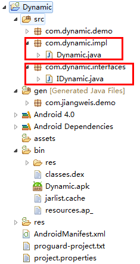
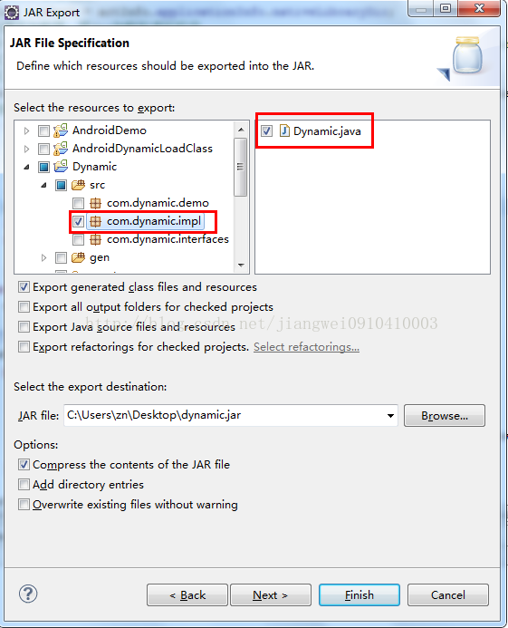
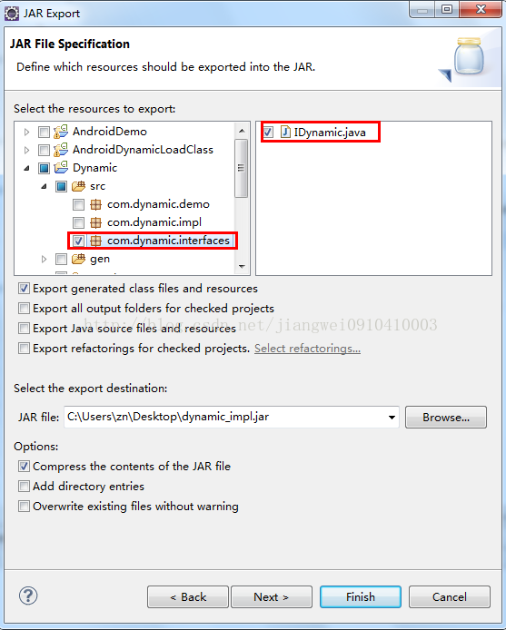
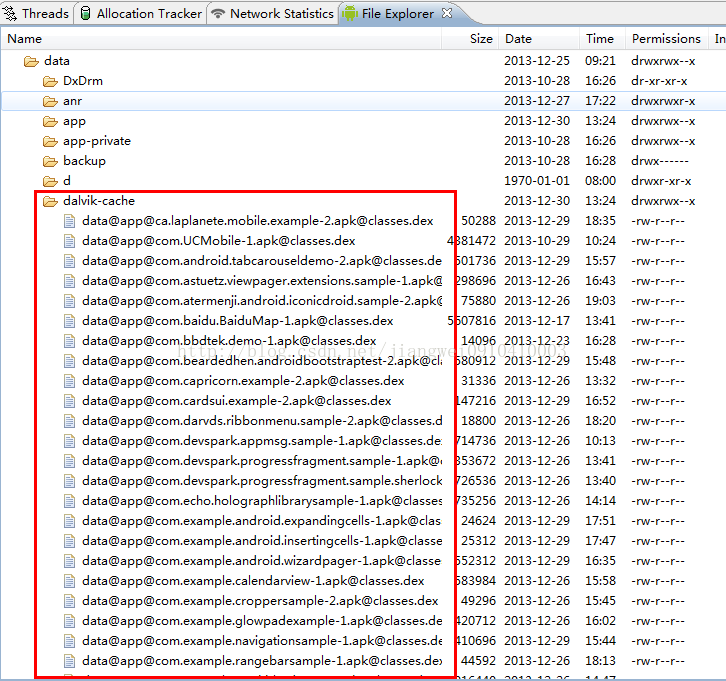
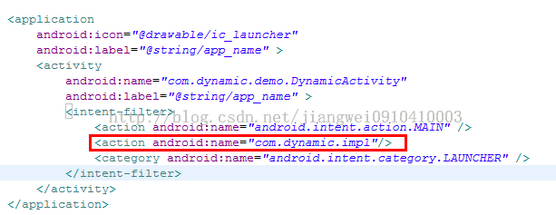
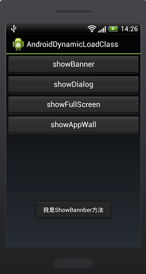

# Android中的动态加载机制

来源:[猿是一种能够改变世界的动物](http://blog.csdn.net/jiangwei0910410003/article/details/17679823)

在目前的软硬件环境下，Native App与Web App在用户体验上有着明显的优势，但在实际项目中有些会因为业务的频繁变更而频繁的升级客户端，造成较差的用户体验，而这也恰恰是Web App的优势。本文对网上Android动态加载jar的资料进行梳理和实践在这里与大家一起分享，试图改善频繁升级这一弊病。

Android应用开发在一般情况下，常规的开发方式和代码架构就能满足我们的普通需求。但是有些特殊问题，常常引发我们进一步的沉思。我们从沉思中产生顿悟，从而产生新的技术形式。

如何开发一个可以自定义控件的Android应用？就像eclipse一样，可以动态加载插件；如何让Android应用执行服务器上的不可预知的代码？如何对Android应用加密，而只在执行时自解密，从而防止被破解？……

熟悉Java技术的朋友，可能意识到，我们需要使用类加载器灵活的加载执行的类。这在Java里已经算是一项比较成熟的技术了，但是在Android中，我们大多数人都还非常陌生。

## 类加载机制

Dalvik虚拟机如同其他Java虚拟机一样，在运行程序时首先需要将对应的类加载到内存中。而在Java标准的虚拟机中，类加载可以从class文件中读取，也可以是其他形式的二进制流，因此，我们常常利用这一点，在程序运行时手动加载Class，从而达到代码动态加载执行的目的

然而Dalvik虚拟机毕竟不算是标准的Java虚拟机，因此在类加载机制上，它们有相同的地方，也有不同之处。我们必须区别对待

例如，在使用标准Java虚拟机时，我们经常自定义继承自ClassLoader的类加载器。然后通过defineClass方法来从一个二进制流中加载Class。然而，这在Android里是行不通的，大家就没必要走弯路了。参看源码我们知道，Android中ClassLoader的defineClass方法具体是调用VMClassLoader的defineClass本地静态方法。而这个本地方法除了抛出一个“UnsupportedOperationException”之外，什么都没做，甚至连返回值都为空

```
static void Dalvik_java_lang_VMClassLoader_defineClass(const u4* args
												,JValue* pResult){  
    Object* loader = (Object*) args[0];  
    StringObject* nameObj = (StringObject*) args[1];  
    const u1* data = (const u1*) args[2];  
    int offset = args[3];  
    int len = args[4];  
    Object* pd = (Object*) args[5];  
    char* name = NULL;  
    name = dvmCreateCstrFromString(nameObj);  
    LOGE("ERROR: defineClass(%p, %s, %p, %d, %d, %p)\n",
    					loader, name, data, offset, len, pd);  
    dvmThrowException("Ljava/lang/UnsupportedOperationException;",
    							"can't load this type of class file");  
    free(name);  
    RETURN_VOID();  
}  
```

## Dalvik虚拟机类加载机制

那如果在Dalvik虚拟机里，ClassLoader不好使，我们如何实现动态加载类呢？Android为我们从ClassLoader派生出了两个类：DexClassLoader和PathClassLoader。其中需要特别说明的是PathClassLoader中一段被注释掉的代码：

```
/* --this doesn't work in current version of Dalvik-- 
    if (data != null) { 
        System.out.println("--- Found class " + name 
            + " in zip[" + i + "] '" + mZips[i].getName() + "'"); 
        int dotIndex = name.lastIndexOf('.'); 
        if (dotIndex != -1) { 
            String packageName = name.substring(0, dotIndex); 
            synchronized (this) { 
                Package packageObj = getPackage(packageName); 
                if (packageObj == null) { 
                    definePackage(packageName, null, null, 
                            null, null, null, null, null); 
                } 
            } 
        } 
        return defineClass(name, data, 0, data.length); 
    } 
*/
```

这从另一方面佐证了defineClass函数在Dalvik虚拟机里确实是被阉割了。而在这两个继承自ClassLoader的类加载器，本质上是重载了ClassLoader的findClass方法。在执行loadClass时，我们可以参看ClassLoader部分源码：

```
protected Class<?> loadClass(String className, boolean resolve) 
										throws ClassNotFoundException {  
	Class<?> clazz = findLoadedClass(className);  
    if (clazz == null) {  
        try {  
            clazz = parent.loadClass(className, false);  
        } catch (ClassNotFoundException e) {  
            // Don't want to see this.  
        }  
        if (clazz == null) {  
            clazz = findClass(className);  
        }  
    }  
    return clazz;  
}
```

因此DexClassLoader和PathClassLoader都属于符合双亲委派模型的类加载器（因为它们没有重载loadClass方法）。也就是说，它们在加载一个类之前，回去检查自己以及自己以上的类加载器是否已经加载了这个类。如果已经加载过了，就会直接将之返回，而不会重复加载。

DexClassLoader和PathClassLoader其实都是通过DexFile这个类来实现类加载的。这里需要顺便提一下的是，Dalvik虚拟机识别的是dex文件，而不是class文件。因此，我们供类加载的文件也只能是dex文件，或者包含有dex文件的.apk或.jar文件。

也许有人想到，既然DexFile可以直接加载类，那么我们为什么还要使用ClassLoader的子类呢？DexFile在加载类时，具体是调用成员方法loadClass或者loadClassBinaryName。其中**loadClassBinaryName需要将包含包名的类名中的”.”转换为”/”**我们看一下loadClass代码就清楚了：

```
public Class loadClass(String name, ClassLoader loader) {  
        String slashName = name.replace('.', '/');  
        return loadClassBinaryName(slashName, loader);  
} 
```

在这段代码前有一段注释，截取关键一部分就是说：*If you are not calling this from a class loader, this is most likely not going to do what you want. Use {@link Class#forName(String)} instead.* 这就是我们需要使用ClassLoader子类的原因。至于它是如何验证是否是在ClassLoader中调用此方法的，我没有研究，大家如果有兴趣可以继续深入下去。

有一个细节，可能大家不容易注意到。PathClassLoader是通过构造函数new DexFile(path)来产生DexFile对象的；而DexClassLoader则是通过其静态方法loadDex（path, outpath, 0）得到DexFile对象。**这两者的区别在于DexClassLoader需要提供一个可写的outpath路径，用来释放.apk包或者.jar包中的dex文件。换个说法来说，就是PathClassLoader不能主动从zip包中释放出dex，因此只支持直接操作dex格式文件，或者已经安装的apk（因为已经安装的apk在cache中存在缓存的dex文件）。而DexClassLoader可以支持.apk、.jar和.dex文件，并且会在指定的outpath路径释放出dex文件。**

另外，PathClassLoader在加载类时调用的是DexFile的loadClassBinaryName，而DexClassLoader调用的是loadClass。因此，在使用PathClassLoader时类全名需要用”/”替换”.”

## 实际操作

使用到的工具都比较常规：javac、dx、eclipse等其中dx工具最好是指明`--no-strict`，因为class文件的路径可能不匹配

加载好类后，通常我们可以通过Java反射机制来使用这个类但是这样效率相对不高，而且老用反射代码也比较复杂凌乱。更好的做法是定义一个interface，并将这个interface写进容器端。待加载的类，继承自这个interface，并且有一个参数为空的构造函数，以使我们能够通过Class的newInstance方法产生对象然后将对象强制转换为interface对象，于是就可以直接调用成员方法了，下面是具体的实现步骤了:

### 第一步：



```
package com.dynamic.interfaces;  
import android.app.Activity;  
/** 
 * 动态加载类的接口 
 */  
public interface IDynamic {  
    /**初始化方法*/  
    public void init(Activity activity);  
    /**自定义方法*/  
    public void showBanner();  
    public void showDialog();  
    public void showFullScreen();  
    public void showAppWall();  
    /**销毁方法*/  
    public void destory();  
}
```

实现类代码如下：

```
package com.dynamic.impl;  
  
import android.app.Activity;  
import android.widget.Toast;  
  
import com.dynamic.interfaces.IDynamic;  
  
/** 
 * 动态类的实现 
 * 
 */  
public class Dynamic implements IDynamic{  
  
    private Activity mActivity;  
      
    @Override  
    public void init(Activity activity) {  
        mActivity = activity;  
    }  
      
    @Override  
    public void showBanner() {  
        Toast.makeText(mActivity, "我是ShowBannber方法", 1500).show();  
    }  
  
    @Override  
    public void showDialog() {  
        Toast.makeText(mActivity, "我是ShowDialog方法", 1500).show();  
    }  
  
    @Override  
    public void showFullScreen() {  
        Toast.makeText(mActivity, "我是ShowFullScreen方法", 1500).show();  
    }  
  
    @Override  
    public void showAppWall() {  
        Toast.makeText(mActivity, "我是ShowAppWall方法", 1500).show();  
    }  
  
    @Override  
    public void destory() {  
    }  
  
}
```

这样动态类就开发好了

### 第二步：

将上面开发好的动态类打包成.jar，这里要注意的是只打包实现类Dynamic.java，不打包接口类IDynamic.java，




然后将打包好的jar文件拷贝到android的安装目录中的platform-tools目录下，使用dx命令:(我的jar文件是dynamic.jar)

> dx --dex --output=dynamic_temp.jar dynamic.jar

这样就生成了dynamic_temp.jar，这个jar和dynamic.jar有什么区别呢？

其实这条命令主要做的工作是:首先将dynamic.jar编译成dynamic.dex文件(Android虚拟机认识的字节码文件)，然后再将dynamic.dex文件压缩成dynamic_temp.jar，当然你也可以压缩成.zip格式的，或者直接编译成.apk文件都可以的，这个后面会说到。

到这里还不算完事，因为你想想用什么来连接动态类和目标类呢？那就是动态类的接口了，所以这时候还要打个.jar包，这时候只需要打接口类IDynamic.java了



然后将这个.jar文件引用到目标类中，下面来看一下目标类的实现：

```
package com.jiangwei.demo;  
  
import java.io.File;  
import java.util.List;  
  
import android.app.Activity;  
import android.content.Intent;  
import android.content.pm.ActivityInfo;  
import android.content.pm.PackageManager;  
import android.content.pm.ResolveInfo;  
import android.os.Bundle;  
import android.os.Environment;  
import android.view.View;  
import android.widget.Button;  
import android.widget.Toast;  
  
import com.dynamic.interfaces.IDynamic;  
  
import dalvik.system.DexClassLoader;  
import dalvik.system.PathClassLoader;  
  
public class AndroidDynamicLoadClassActivity extends Activity {  
      
    //动态类加载接口  
    private IDynamic lib;  
      
    @Override  
    public void onCreate(Bundle savedInstanceState) {  
        super.onCreate(savedInstanceState);  
        setContentView(R.layout.main);  
        //初始化组件  
        Button showBannerBtn = (Button) findViewById(R.id.show_banner_btn);  
        Button showDialogBtn = (Button) findViewById(R.id.show_dialog_btn);  
        Button showFullScreenBtn = (Button) findViewById(
        										R.id.show_fullscreen_btn);  
        Button showAppWallBtn = (Button) findViewById(R.id.show_appwall_btn);  
        /**使用DexClassLoader方式加载类*/  
        //dex压缩文件的路径(可以是apk,jar,zip格式)  
        String dexPath = Environment.getExternalStorageDirectory().toString() 
        				+ File.separator + "Dynamic.apk";  
        //dex解压释放后的目录  
        //String dexOutputDir = getApplicationInfo().dataDir;  
        String dexOutputDirs = Environment.getExternalStorageDirectory()
        										.toString();  
        //定义DexClassLoader  
        //第一个参数：是dex压缩文件的路径  
        //第二个参数：是dex解压缩后存放的目录  
        //第三个参数：是C/C++依赖的本地库文件目录,可以为null  
        //第四个参数：是上一级的类加载器  
        DexClassLoader cl = new DexClassLoader(dexPath,dexOutputDirs
        										,null,getClassLoader());  
          
        /**使用PathClassLoader方法加载类*/  
        //创建一个意图，用来找到指定的apk：这里的"com.dynamic.impl
        // 是指定apk中在AndroidMainfest.xml文件中定义的
        // <action name="com.dynamic.impl"/>    
        Intent intent = new Intent("com.dynamic.impl", null);    
        //获得包管理器    
        PackageManager pm = getPackageManager();    
        List<ResolveInfo> resolveinfoes =  pm.queryIntentActivities(intent, 0);    
        //获得指定的activity的信息    
        ActivityInfo actInfo = resolveinfoes.get(0).activityInfo;    
        //获得apk的目录或者jar的目录    
        String apkPath = actInfo.applicationInfo.sourceDir;    
        //native代码的目录    
        String libPath = actInfo.applicationInfo.nativeLibraryDir;    
        //创建类加载器，把dex加载到虚拟机中    
        //第一个参数：是指定apk安装的路径，这个路径要注意只能是通过
        	// actInfo.applicationInfo.sourceDir来获取  
        //第二个参数：是C/C++依赖的本地库文件目录,可以为null  
        //第三个参数：是上一级的类加载器  
        PathClassLoader pcl = new PathClassLoader(apkPath,libPath
        										,this.getClassLoader());  
        //加载类  
        try {  
            //com.dynamic.impl.Dynamic是动态类名  
            //使用DexClassLoader加载类  
            //Class libProviderClazz = cl.loadClass("com.dynamic.impl.Dynamic");  
            //使用PathClassLoader加载类  
            Class libProviderClazz = pcl.loadClass("com.dynamic.impl.Dynamic");  
            lib = (IDynamic)libProviderClazz.newInstance();  
            if(lib != null){  
                lib.init(AndroidDynamicLoadClassActivity.this);  
            }  
        } catch (Exception exception) {  
            exception.printStackTrace();  
        }  
        /**下面分别调用动态类中的方法*/  
        showBannerBtn.setOnClickListener(new View.OnClickListener() {  
            public void onClick(View view) {  
               if(lib != null){  
                   lib.showBanner();  
               }else{  
                   Toast.makeText(getApplicationContext()
                   						, "类加载失败", 1500).show();  
               }  
            }  
        });  
        showDialogBtn.setOnClickListener(new View.OnClickListener() {  
            public void onClick(View view) {  
               if(lib != null){  
                   lib.showDialog();  
               }else{  
                   Toast.makeText(getApplicationContext()
                   						, "类加载失败", 1500).show();  
               }  
            }  
        });  
        showFullScreenBtn.setOnClickListener(new View.OnClickListener() {  
            public void onClick(View view) {  
               if(lib != null){  
                   lib.showFullScreen();  
               }else{  
                   Toast.makeText(getApplicationContext()
                   						, "类加载失败", 1500).show();  
               }  
            }  
        });  
        showAppWallBtn.setOnClickListener(new View.OnClickListener() {  
            public void onClick(View view) {  
               if(lib != null){  
                   lib.showAppWall();  
               }else{  
                   Toast.makeText(getApplicationContext()
                   						, "类加载失败", 1500).show();  
               }  
            }  
        });  
    }  
}
```

这里面定义了一个IDynamic接口变量，同时使用了DexClassLoader和PathClassLoader来加载类，这里面先来说一说DexClassLoader方式加载:


```
//定义DexClassLoader  
//第一个参数：是dex压缩文件的路径  
//第二个参数：是dex解压缩后存放的目录  
//第三个参数：是C/C++依赖的本地库文件目录,可以为null  
//第四个参数：是上一级的类加载器  
DexClassLoader cl = new DexClassLoader(dexPath,
						dexOutputDirs,null,getClassLoader());  
```

上面已经说了，DexClassLoader是继承ClassLoader类的，这里面的参数说明：

第一个参数是:dex压缩文件的路径:这个就是我们将上面编译后的dynamic_temp.jar存放的目录，当然也可以是.zip和.apk格式的

第二个参数是:dex解压后存放的目录:这个就是将.jar,.zip,.apk文件解压出的dex文件存放的目录，这个就和PathClassLoader方法有区别了，同时你也可以看到PathClassLoader方法中没有这个参数，这个也真是这两个类的区别:

> PathClassLoader不能主动从zip包中释放出dex，因此只支持直接操作dex格式文件，或者已经安装的apk（因为已经安装的apk在手机的data/dalvik目录中存在缓存的dex文件）。而DexClassLoader可以支持.apk、.jar和.dex文件，并且会在指定的outpath路径释放出dex文件。



然而我们可以通过DexClassLoader方法指定解压后的dex文件的存放目录，但是我们一般不这么做，因为这样做无疑的暴露了dex文件，所以我们一般不会将.jar/.zip/.apk压缩文件存放到用户可以察觉到的位置，同时解压dex的目录也是不能让用户看到的。

第三个参数和第四个参数用到的不是很多，所以这里就不做太多的解释了。

这里还要注意一点就是PathClassLoader方法的时候，第一个参数是dex存放的路径，这里传递的是:

```
//获得apk的目录或者jar的目录    
String apkPath = actInfo.applicationInfo.sourceDir;    
```

指定的apk安装路径,这个值只能这样获取，不然会加载类失败的

### 第三步：
运行目标类:

要做的工作是:

如果用的是DexClassLoader方式加载类:这时候需要将.jar或者.zip或者.apk文件放到指定的目录中，我这里为了方便就放到sd卡的根目录中

如果用的是PathClassLoader方法加载类:这时候需要先将Dynamic.apk安装到手机中，不然找不到这个activity，同时要注意的是:

```
// 创建一个意图，用来找到指定的apk：这里的"com.dynamic.impl"
// 是指定apk中在AndroidMainfest.xml文件中定义的<action name="com.dynamic.impl"/>    
Intent intent = new Intent("com.dynamic.impl", null); 
```

这里的com.dynamic.impl是一个action需要在指定的apk中定义，这个名称是动态apk和目标apk之间约定好的



运行结果



点击showBanner显示一个Toast，成功的运行了动态类中的代码！

其实更好的办法就是将动态的.jar.zip.apk文件从网络上获取，安全可靠，同时本地的目标项目不需要改动代码就可以执行不同的逻辑了

### 关于代码加密的一些设想

最初设想将dex文件加密，然后通过JNI将解密代码写在Native层。解密之后直接传上二进制流，再通过defineClass将类加载到内存中。

现在也可以这样做，但是由于不能直接使用defineClass，而必须传文件路径给dalvik虚拟机内核，因此解密后的文件需要写到磁盘上，增加了被破解的风险。

Dalvik虚拟机内核仅支持从dex文件加载类的方式是不灵活的，由于没有非常深入的研究内核，我不能确定是Dalvik虚拟机本身不支持还是Android在移植时将其阉割了。不过相信Dalvik或者是Android开源项目都正在向能够支持raw数据定义类方向努力。

我们可以在文档中看到Google说：Jar or APK file with "classes.dex". (May expand this to include "raw DEX" in the future.)；在Android的Dalvik源码中我们也能看到RawDexFile的身影（不过没有具体实现）

在RawDexFile出来之前，我们都只能使用这种存在一定风险的加密方式。需要注意释放的dex文件路径及权限管理，另外，在加载完毕类之后，除非出于其他目的否则应该马上删除临时的解密文件


