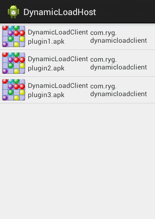
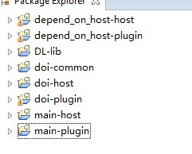

# APK动态加载框架（DL）解析

来源：[http://blog.csdn.net/singwhatiwanna/article/details/39937639](http://blog.csdn.net/singwhatiwanna/article/details/39937639)

转载请注明出处：[http://blog.csdn.net/singwhatiwanna/article/details/39937639](http://blog.csdn.net/singwhatiwanna/article/details/39937639) （来自singwhatiwanna的csdn博客）

## 前言

好久没有发布新的文章，这次打算发表一下我这几个月的一个核心研究成果：APK动态加载框架（DL）。这段时间我致力于github的开源贡献，开源了2个比较有用且有意义的项目，一个是PinnedHeaderExpandableListView，另一个是APK动态加载框架。具体可以参见我的github：https://github.com/singwhatiwanna

本次要介绍的是APK动态加载框架（DL），这个项目除了我以外，还有两个共同开发者：田啸（时之沙）,宋思宇。

为了更好地理解本文，你需要首先阅读Android apk动态加载机制的研究这一系列文章，分别为：

[Android apk动态加载机制的研究](http://blog.csdn.net/singwhatiwanna/article/details/22597587)<br/>
[Android apk动态加载机制的研究（二）：资源加载和activity生命周期管理](http://blog.csdn.net/singwhatiwanna/article/details/23387079)

另外，这个开源项目我起了个名字，叫做DL。本文中的DL均指APK动态加载框架。

## 项目地址

[https://github.com/singwhatiwanna/dynamic-load-apk](https://github.com/singwhatiwanna/dynamic-load-apk)，欢迎star和fork。

运行效果图:



## 意义

这里说说这个开源项目的意义。首先要说的是动态加载技术（或者说插件化）在技术驱动型的公司中扮演这相当重要的角色，当项目越来越庞大的时候，需要通过插件化来减轻应用的内存和cpu占用，还可以实现热插拔，即在不发布新版本的情况下更新某些模块。

我几个月前开始进行这项技术的研究，当时查询了很多资料，没有找到很好的开源。目前淘宝、微信等都有成熟的动态加载框架，包括apkplug，但是它们都是不开源的。还有github上有一个开源项目AndroidDynamicLoader，其思想是通过Fragment 以及 schema的方式实习的，这是一种可行的技术方案，但是还有限制太多，这意味这你的activity必须通过Fragment去实现，这在activity跳转和灵活性上有一定的不便，在实际的使用中会有一些很奇怪的bug不好解决，总之，这还是一种不是特别完备的动态加载技术。然后，我发现，目前针对动态加载这一块成熟的开源基本还是空白的，不管是国内还是国外。而在公司内部，动态加载作为一项核心技术，也不可能是初级开发人员所能够接触到的，于是，我决定做一个成熟点的开源，期待能填补这一块空白。

## DL功能介绍

DL支持很多特性，而这些特性使得插件的开发过程变得透明、高效。

* 1.plugin无需安装即可由宿主调起。
* 2.支持用R访问plugin资源
* 3.plugin支持Activity和FragmentActivity（未来还将支持其他组件）
* 4.基本无反射调用 
* 5.插件安装后仍可独立运行从而便于调试
* 6.支持3种plugin对host的调用模式：
   * （1）无调用（但仍然可以用反射调用）。
   * （2）部分调用，host可公开部分接口供plugin调用。 这前两种模式适用于plugin开发者无法获得host代码的情况。
    * （3）完全调用，plugin可以完全调用host内容。这种模式适用于plugin开发者能获得host代码的情况。
* 7.只需引入DL的一个jar包即可高效开发插件，DL的工作过程对开发者完全透明
* 8.支持android2.x版本

## 架构解析
如果大家阅读过本文头部提到的两篇文章，那么对DL的架构应该有大致的了解，本文就不再从头开始介绍了，而是从如下变更的几方面进行解析，这些优化使得DL的功能和之前比起来更加强大更加易用使用易于扩展。

* 1.DL对activity生命周期管理的改进
* 2.DL对类加载器的支持（DLClassLoader）
* 3.DL对宿主（host）和插件（plugin）通信的支持
* 4.DL对插件独立运行的支持
* 5.DL对activity随意跳转的支持（DLIntent）
* 6.DL对插件管理的支持（DLPluginManager）

其中5和6属于加强功能，目前正在dev分支上进行开发（本文暂不介绍），其他功能均在稳定版分支master上。

### DL对activity生命周期管理的改进

大家知道，DL最开始的时候采用反射去管理activity的生命周期，这样存在一些不便，比如反射代码写起来复杂，并且过多使用反射有一定的性能开销。针对这个问题，我们采用了接口机制，将activity的大部分生命周期方法提取出来作为一个接口（DLPlugin），然后通过代理activity（DLProxyActivity）去调用插件activity实现的生命周期方法，这样就完成了插件activity的生命周期管理，并且没有采用反射，当我们想增加一个新的生命周期方法的时候，只需要在接口中声明一下同时在代理activity中实现一下即可，下面看一下代码：

接口DLPlugin

```
public interface DLPlugin {  
  
    public void onStart();  
    public void onRestart();  
    public void onActivityResult(int requestCode, int resultCode, Intent data);  
    public void onResume();  
    public void onPause();  
    public void onStop();  
    public void onDestroy();  
    public void onCreate(Bundle savedInstanceState);  
    public void setProxy(Activity proxyActivity, String dexPath);  
    public void onSaveInstanceState(Bundle outState);  
    public void onNewIntent(Intent intent);  
    public void onRestoreInstanceState(Bundle savedInstanceState);  
    public boolean onTouchEvent(MotionEvent event);  
    public boolean onKeyUp(int keyCode, KeyEvent event);  
    public void onWindowAttributesChanged(LayoutParams params);  
    public void onWindowFocusChanged(boolean hasFocus);  
    public void onBackPressed();  
}  
```

在代理类DLProxyActivity中的实现

```
...  
    @Override  
    protected void onStart() {  
        mRemoteActivity.onStart();  
        super.onStart();  
    }  
  
    @Override  
    protected void onRestart() {  
        mRemoteActivity.onRestart();  
        super.onRestart();  
    }  
  
    @Override  
    protected void onResume() {  
        mRemoteActivity.onResume();  
        super.onResume();  
    }  
  
    @Override  
    protected void onPause() {  
        mRemoteActivity.onPause();  
        super.onPause();  
    }  
  
    @Override  
    protected void onStop() {  
        mRemoteActivity.onStop();  
        super.onStop();  
    }  
...  
```

说明：通过上述代码应该不难理解DL对activity生命周期的管理，其中mRemoteActivity就是DLPlugin的实现。

### DL对类加载器的支持

为了更好地对多插件进行支持，我们提供了一个DLClassoader类，专门去管理各个插件的DexClassoader，这样，同一个插件就可以采用同一个ClassLoader去加载类从而避免多个classloader加载同一个类时所引发的类型转换错误。

```
public class DLClassLoader extends DexClassLoader {  
    private static final String TAG = "DLClassLoader";  
  
    private static final HashMap<String, DLClassLoader> mPluginClassLoaders = new HashMap<String, DLClassLoader>();  
  
    protected DLClassLoader(String dexPath, String optimizedDirectory, String libraryPath, ClassLoader parent) {  
        super(dexPath, optimizedDirectory, libraryPath, parent);  
    }  
  
    /** 
     * return a available classloader which belongs to different apk 
     */  
    public static DLClassLoader getClassLoader(String dexPath, Context context, ClassLoader parentLoader) {  
        DLClassLoader dLClassLoader = mPluginClassLoaders.get(dexPath);  
        if (dLClassLoader != null)  
            return dLClassLoader;  
  
        File dexOutputDir = context.getDir("dex", Context.MODE_PRIVATE);  
        final String dexOutputPath = dexOutputDir.getAbsolutePath();  
        dLClassLoader = new DLClassLoader(dexPath, dexOutputPath, null, parentLoader);  
        mPluginClassLoaders.put(dexPath, dLClassLoader);  
  
        return dLClassLoader;  
    }  
}  
```

### DL对宿主（host）和插件（plugin）通信的支持
这一点很重要，因为往往宿主需要和插件进行各种通信，因此DL对宿主和插件的通信做了很好的支持，目前总共有3中模式，如下图所示：


下面分别介绍上述三种模式，针对上述三种模式，我们分别提供了3组例子，其中：

**1.depend_on_host：**插件完全依赖宿主的模式，适合于能够能到宿主的源代码的情况
其中host指宿主工程，plugin指插件工程

**2.depend_on_interface：**插件部分依赖宿主的模式，或者说插件依赖宿主提供的接口，适合能够拿到宿主的接口的情况,其中host指宿主工程，plugin指插件工程，common指接口工程

**3.main：**插件不依赖宿主的模式，这是DL推荐的模式
其中host指宿主工程，plugin指插件工程



**模式1：**这是DL推荐的模式，对应的工程目录为main。在这种模式下，宿主和插件不需要通信，两者是独立开发的，宿主引用DL的jar包（dl-lib.jar），插件也需要引用DL的jar包，但是不能放入到插件工程的libs目录下面，换句话说，就是插件编译的时候依赖jar包但是打包成apk的时候不要把jar包打进去，这是因为，dl-lib.jar已经在宿主工程中存在了，如果插件中也有这个jar包，就会发生类链接错误，原因很简单，内存中有两份一样的类，重复了。至于support-v4也是同样的道理。对于eclipse很简单，只需要在插件工程中创建一个目录，比如external-jars，然后把dl-lib.jar和support-v4.jar放进去，同时在.classpath中追加如下两句即可：

```
<classpathentry kind="lib" path="external-jars/dl-lib.jar"/>
<classpathentry kind="lib" path="external-jars/android-support-v4.jar"/>
```

这样，编译的时候就能够正常进行，但是打包的时候，就不会把上面两个jar包打入到插件apk中。

至于ant环境和gradle，解决办法不一样，具体方法后面再补上，但是思想都是一样的，即：插件apk中不要打入上述2个jar包。

**模式2：**插件部分依赖宿主的模式，或者说插件依赖宿主提供的接口，适合能够拿到宿主的接口的情况。在这种模式下，宿主放出一些接口并实现一些接口，然后给插件调用，这样插件就可以访问宿主的一些服务等

**模式3：**插件完全依赖宿主的模式，适合于能够能到宿主的源代码的情况。这种模式一般多用在公司内部，插件可以访问宿主的所有代码，但是，这样插件和宿主的耦合比较高，宿主一动，插件就必须动，比较麻烦

具体采用哪种方式，需要结合实际情况来选择，一般来说，如果是宿主和插件不是同一个公司开发，建议选择模式1和模式2；如果宿主和插件都在同一个公司开发，那么选择哪个都可以。从DL的实现出发，我们推荐采用模式1，真的需要通信的话采用模式2，尽量不要采用模式3.

### DL对插件独立运行的支持

为了便于调试，采用DL所开发的插件都可以独立运行，当然，这要分情况来说：<br/>
对于模式1，如果插件想独立运行，只需要把external-jars下的jar包拷贝一份到插件的libs目录下即可<br/>
对于模式2，只需要提供一个宿主接口的默认实现即可<br/>
对于模式3，只需要apk打包时把所引用的宿主代码打包进去即可，具体方式可以参看sample/depend_on_host目录。<br/>
在开发过程中，应该先开启插件的独立运行功能以便于调试，等功能开发完毕后再将其插件化。<br/>

### DLIntent和DLPluginManager

这两项都属于加强功能，目前正在dev分支进行code review，大家感兴趣可以去dev分支上查看，等验证通过即merge到稳定版master分支。<br/>
DLIntent：通过DLIntent来完成activity的无约束调起<br/>
DLPluginManager：对宿主的所有插件提供综合管理功能。<br/>

## 开发规范
目前DL已经达到了第一个稳定版，经过大量机型的验证，目前得出的结论是DL是可靠的（兼容到android2.x），可以用在实际的应用开发中。但是，我们知道，动态加载是一个技术壁垒，其很难达到一种完美的状态，毕竟，让一个apk不安装跑起来，这是多么不可思议的事情。因此，希望大家辩证地去看这个问题，下面列出我们目前还不支持的功能，或者说是一种开发规范吧，希望大家在开发过程中去遵守这个规范，这样才能让插件稳定地跑起来。

### DL 1.0开发规范：
* 1.目前不支持service
* 2.目前只支持动态注册广播
* 3.目前支持Activity和FragmentActivity，这也是常用的activity
* 4.目前不支持插件中的assets
* 5.调用Context的时候，请适当使用that，大部分常用api是不需要用that的，但是一些不常用api还是需要用that来访问。that是apk中activity的基类BaseActivity系列中的一个成员，它在apk安装运行的时候指向this，而在未安装的时候指向宿主程序中的代理activity，由于that的动态分配特性，通过that去调用activity的成员方法，在apk安装以后仍然可以正常运行。
* 6.慎重使用this，因为this指向的是当前对象，即apk中的activity，但是由于activity已经不是常规意义上的activity，所以this是没有意义的，但是，当this表示的不是Context对象的时候除外，比如this表示一个由activity实现的接口。

希望能够给大家带来一些帮助，希望大家多多支持！

本开源项目地址：[https://github.com/singwhatiwanna/dynamic-load-apk](https://github.com/singwhatiwanna/dynamic-load-apk)，欢迎大家star和fork。