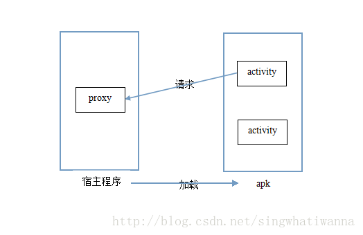
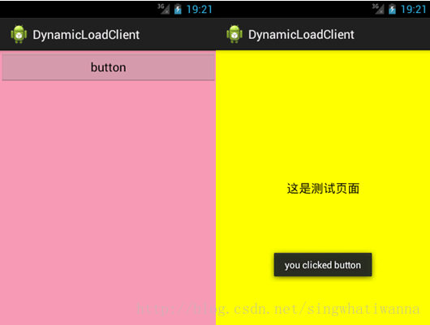
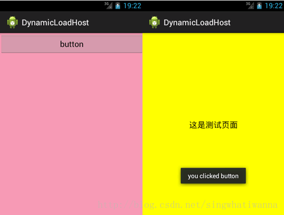

# Android apk动态加载机制的研究

来源:[singwhatiwanna的csdn博客](http://blog.csdn.net/singwhatiwanna/article/details/22597587)

转载请注明出处：[http://blog.csdn.net/singwhatiwanna/article/details/22597587](http://blog.csdn.net/singwhatiwanna/article/details/22597587) （来自singwhatiwanna的csdn博客）

## 背景

问题是这样的：我们知道，apk必须安装才能运行，如果不安装要是也能运行该多好啊，事实上，这不是完全不可能的，尽管它比较难实现。在理论层面上，我们可以通过一个宿主程序来运行一些未安装的apk，当然，实践层面上也能实现，不过这对未安装的apk有要求。我们的想法是这样的，首先要明白apk未安装是不能被直接调起来的，但是我们可以采用一个程序（称之为宿主程序）去动态加载apk文件并将其放在自己的进程中执行，本文要介绍的就是这么一种方法，同时这种方法还有很多问题，尤其是资源的访问。因为将apk加载到宿主程序中去执行，就无法通过宿主程序的Context去取到apk中的资源,比如图片、文本等，这是很好理解的，因为apk已经不存在上下文了，它执行时所采用的上下文是宿主程序的上下文，用别人的Context是无法得到自己的资源的，不过这个问题貌似可以这么解决：将apk中的资源解压到某个目录，然后通过文件去操作资源，这只是理论上可行，实际上还是会有很多的难点的。除了资源存取的问题，还有一个问题是activity的生命周期，因为apk被宿主程序加载执行后，它的activity其实就是一个普通的类，正常情况下，activity的生命周期是由系统来管理的，现在被宿主程序接管了以后，如何替代系统对apk中的activity的生命周期进行管理是有难度的，不过这个问题比资源的访问好解决一些，比如我们可以在宿主程序中模拟activity的生命周期并合适地调用apk中activity的生命周期方法。本文暂时不对这两个问题进行解决，因为很难，本文仅仅对apk的动态执行机制进行介绍，尽管如此，听起来还是有点小激动，不是吗?

## 工作原理
如下图所示，首先宿主程序会到文件系统比如sd卡去加载apk，然后通过一个叫做proxy的activity去执行apk中的activity。
关于动态加载apk，理论上可以用到的有DexClassLoader、PathClassLoader和URLClassLoader。

* DexClassLoader ：可以加载文件系统上的jar、dex、apk
* PathClassLoader ：可以加载/data/app目录下的apk，这也意味着，它只能加载已经安装的apk
* URLClassLoader ：可以加载java中的jar，但是由于dalvik不能直接识别jar，所以此方法在Android中无法使用，尽管还有这个类

关于jar、dex和apk，dex和apk是可以直接加载的，因为它们都是或者内部有dex文件，而原始的jar是不行的，必须转换成dalvik所能识别的字节码文件，转换工具可以使用*android sdk*中*platform-tools*目录下的dx

转换命令 ：`dx --dex --output=dest.jar src.jar`



## 示例

### 宿主程序的实现

1.主界面很简单，放了一个button，点击就会调起apk，我把apk直接放在了sd卡中，至于先把apk从网上下载到本地再加载其实是一个道理。

```
@Override  
public void onClick(View v) {  
    if (v == mOpenClient) {  
        Intent intent = new Intent(this, ProxyActivity.class);  
        intent.putExtra(ProxyActivity.EXTRA_DEX_PATH, 
        		"/mnt/sdcard/DynamicLoadHost/plugin.apk");  
        startActivity(intent);  
    }  
  
} 
```

点击button以后，proxy会被调起，然后加载apk并调起的任务就交给它了

2.代理activity的实现（proxy）

```
package com.ryg.dynamicloadhost;  
  
import java.lang.reflect.Constructor;  
import java.lang.reflect.Method;  
  
import dalvik.system.DexClassLoader;  
import android.annotation.SuppressLint;  
import android.app.Activity;  
import android.content.pm.PackageInfo;  
import android.os.Bundle;  
import android.util.Log;  
  
public class ProxyActivity extends Activity {  
  
    private static final String TAG = "ProxyActivity";  
  
    public static final String FROM = "extra.from";  
    public static final int FROM_EXTERNAL = 0;  
    public static final int FROM_INTERNAL = 1;  
  
    public static final String EXTRA_DEX_PATH = "extra.dex.path";  
    public static final String EXTRA_CLASS = "extra.class";  
  
    private String mClass;  
    private String mDexPath;  
  
    @Override  
    protected void onCreate(Bundle savedInstanceState) {  
        super.onCreate(savedInstanceState);  
        mDexPath = getIntent().getStringExtra(EXTRA_DEX_PATH);  
        mClass = getIntent().getStringExtra(EXTRA_CLASS);  
  
        Log.d(TAG, "mClass=" + mClass + " mDexPath=" + mDexPath);  
        if (mClass == null) {  
            launchTargetActivity();  
        } else {  
            launchTargetActivity(mClass);  
        }  
    }  
  
    @SuppressLint("NewApi")  
    protected void launchTargetActivity() {  
        PackageInfo packageInfo = getPackageManager().getPackageArchiveInfo(  
                mDexPath, 1);  
        if ((packageInfo.activities != null)  
                && (packageInfo.activities.length > 0)) {  
            String activityName = packageInfo.activities[0].name;  
            mClass = activityName;  
            launchTargetActivity(mClass);  
        }  
    }  
  
    @SuppressLint("NewApi")  
    protected void launchTargetActivity(final String className) {  
        Log.d(TAG, "start launchTargetActivity, className=" + className);  
        File dexOutputDir = this.getDir("dex", 0);  
        final String dexOutputPath = dexOutputDir.getAbsolutePath();  
        ClassLoader localClassLoader = ClassLoader.getSystemClassLoader();  
        DexClassLoader dexClassLoader = new DexClassLoader(mDexPath,  
                dexOutputPath, null, localClassLoader);  
        try {  
            Class<?> localClass = dexClassLoader.loadClass(className);  
            Constructor<?> localConstructor = localClass  
                    .getConstructor(new Class[] {});  
            Object instance = localConstructor.newInstance(new Object[] {});  
            Log.d(TAG, "instance = " + instance);  
  
            Method setProxy = localClass.getMethod("setProxy",  
                    new Class[] { Activity.class });  
            setProxy.setAccessible(true);  
            setProxy.invoke(instance, new Object[] { this });  
  
            Method onCreate = localClass.getDeclaredMethod("onCreate",  
                    new Class[] { Bundle.class });  
            onCreate.setAccessible(true);  
            Bundle bundle = new Bundle();  
            bundle.putInt(FROM, FROM_EXTERNAL);  
            onCreate.invoke(instance, new Object[] { bundle });  
        } catch (Exception e) {  
            e.printStackTrace();  
        }  
    }  
}  
```

说明：程序不难理解，思路是这样的：采用DexClassLoader去加载apk，然后如果没有指定class，就调起主activity，否则调起指定的class。activity被调起的过程是这样的：首先通过类加载器去加载apk中activity的类并创建一个新对象，然后通过反射去调用这个对象的setProxy方法和onCreate方法，setProxy方法的作用是将activity内部的执行全部交由宿主程序中的proxy（也是一个activity），onCreate方法是activity的入口，setProxy以后就调用onCreate方法，这个时候activity就被调起来了。

### 待执行apk的实现

1.为了让proxy全面接管apk中所有activity的执行，需要为activity定义一个基类BaseActivity，在基类中处理代理相关的事情，同时BaseActivity还对是否使用代理进行了判断，如果不使用代理，那么activity的逻辑仍然按照正常的方式执行，也就是说，这个apk既可以按照执行，也可以由宿主程序来执行。

```
package com.ryg.dynamicloadclient;  
  
import android.app.Activity;  
import android.content.Intent;  
import android.os.Bundle;  
import android.util.Log;  
import android.view.View;  
import android.view.ViewGroup.LayoutParams;  
  
public class BaseActivity extends Activity {  
  
    private static final String TAG = "Client-BaseActivity";  
  
    public static final String FROM = "extra.from";  
    public static final int FROM_EXTERNAL = 0;  
    public static final int FROM_INTERNAL = 1;  
    public static final String EXTRA_DEX_PATH = "extra.dex.path";  
    public static final String EXTRA_CLASS = "extra.class";  
  
    public static final String PROXY_VIEW_ACTION = "com.ryg.dynamicloadhost.VIEW";  
    public static final String DEX_PATH = "/mnt/sdcard/DynamicLoadHost/plugin.apk";  
  
    protected Activity mProxyActivity;  
    protected int mFrom = FROM_INTERNAL;  
  
    public void setProxy(Activity proxyActivity) {  
        Log.d(TAG, "setProxy: proxyActivity= " + proxyActivity);  
        mProxyActivity = proxyActivity;  
    }  
  
    @Override  
    protected void onCreate(Bundle savedInstanceState) {  
        if (savedInstanceState != null) {  
            mFrom = savedInstanceState.getInt(FROM, FROM_INTERNAL);  
        }  
        if (mFrom == FROM_INTERNAL) {  
            super.onCreate(savedInstanceState);  
            mProxyActivity = this;  
        }  
        Log.d(TAG, "onCreate: from= " + mFrom);  
    }  
  
    protected void startActivityByProxy(String className) {  
        if (mProxyActivity == this) {  
            Intent intent = new Intent();  
            intent.setClassName(this, className);  
            this.startActivity(intent);  
        } else {  
            Intent intent = new Intent(PROXY_VIEW_ACTION);  
            intent.putExtra(EXTRA_DEX_PATH, DEX_PATH);  
            intent.putExtra(EXTRA_CLASS, className);  
            mProxyActivity.startActivity(intent);  
        }  
    }  
  
    @Override  
    public void setContentView(View view) {  
        if (mProxyActivity == this) {  
            super.setContentView(view);  
        } else {  
            mProxyActivity.setContentView(view);  
        }  
    }  
  
    @Override  
    public void setContentView(View view, LayoutParams params) {  
        if (mProxyActivity == this) {  
            super.setContentView(view, params);  
        } else {  
            mProxyActivity.setContentView(view, params);  
        }  
    }  
  
    @Deprecated  
    @Override  
    public void setContentView(int layoutResID) {  
        if (mProxyActivity == this) {  
            super.setContentView(layoutResID);  
        } else {  
            mProxyActivity.setContentView(layoutResID);  
        }  
    }  
  
    @Override  
    public void addContentView(View view, LayoutParams params) {  
        if (mProxyActivity == this) {  
            super.addContentView(view, params);  
        } else {  
            mProxyActivity.addContentView(view, params);  
        }  
    }  
}  
```

说明：相信大家一看代码就明白了，其中setProxy方法的作用就是为了让宿主程序能够接管自己的执行，一旦被接管以后，其所有的执行均通过proxy，且Context也变成了宿主程序的Context，也许这么说比较形象：宿主程序其实就是个空壳，它只是把其它apk加载到自己的内部去执行，这也就更能理解为什么资源访问变得很困难，你会发现好像访问不到apk中的资源了，的确是这样的，但是目前我还没有很好的方法去解决。

2.入口activity的实现

```
public class MainActivity extends BaseActivity {  
  
    private static final String TAG = "Client-MainActivity";  
  
    @Override  
    protected void onCreate(Bundle savedInstanceState) {  
        super.onCreate(savedInstanceState);  
        initView(savedInstanceState);  
    }  
  
    private void initView(Bundle savedInstanceState) {  
        mProxyActivity.setContentView(generateContentView(mProxyActivity));  
    }  
  
    private View generateContentView(final Context context) {  
        LinearLayout layout = new LinearLayout(context);  
        layout.setLayoutParams(new LayoutParams(LayoutParams.MATCH_PARENT,  
                LayoutParams.MATCH_PARENT));  
        layout.setBackgroundColor(Color.parseColor("#F79AB5"));  
        Button button = new Button(context);  
        button.setText("button");  
        layout.addView(button, LayoutParams.MATCH_PARENT,  
                LayoutParams.WRAP_CONTENT);  
        button.setOnClickListener(new OnClickListener() {  
            @Override  
            public void onClick(View v) {  
                Toast.makeText(context, "you clicked button",  
                        Toast.LENGTH_SHORT).show();  
                startActivityByProxy("com.ryg.dynamicloadclient.TestActivity");  
            }  
        });  
        return layout;  
    }  
  
}  
```

说明：由于访问不到apk中的资源了，所以界面是代码写的，而不是写在xml中，因为xml读不到了，这也是个大问题。注意到主界面中有一个button，点击后跳到了另一个activity，这个时候是不能直接调用系统的startActivity方法的，而是必须通过宿主程序中的proxy来执行，原因很简单，首先apk本书没有Context，所以它无法调起activity，另外由于这个子activity是apk中的，通过宿主程序直接调用它也是不行的，因为它对宿主程序来说是不可见的，所以只能通过proxy来调用，是不是感觉很麻烦？但是，你还有更好的办法吗?

3.子activity的实现

```
package com.ryg.dynamicloadclient;  
  
import android.graphics.Color;  
import android.os.Bundle;  
import android.view.ViewGroup.LayoutParams;  
import android.widget.Button;  
  
public class TestActivity extends BaseActivity{  
  
    @Override  
    protected void onCreate(Bundle savedInstanceState) {  
        super.onCreate(savedInstanceState);  
        Button button = new Button(mProxyActivity);  
        button.setLayoutParams(new LayoutParams(LayoutParams.MATCH_PARENT,  
                LayoutParams.MATCH_PARENT));  
        button.setBackgroundColor(Color.YELLOW);  
        button.setText("这是测试页面");  
        setContentView(button);  
    }  
  
}
```

说明：代码很简单，不用介绍了，同理，界面还是用代码来写的。

### 运行效果

1.首先看apk安装时的运行效果



2.再看看未安装时被宿主程序执行的效果




说明：可以发现，安装和未安装，执行效果是一样的，差别在于：首先未安装的时候由于采用了反射，所以执行效率会略微降低，其次，应用的标题发生了改变，也就是说，尽管apk被执行了，但是它毕竟是在宿主程序里面执行的，所以它还是属于宿主程序的，因此apk未安装被执行时其标题不是自己的，不过这也可以间接证明，apk的确被宿主程序执行了，不信看标题。最后，我想说一下这么做的意义，这样做有利于实现模块化，同时还可以实现插件机制，但是问题还是很多的，最复杂的两个问题：资源的访问和activity生命周期的管理，期待大家有好的解决办法，欢迎交流。

代码下载：

[https://github.com/singwhatiwanna/dynamic-load-apk](https://github.com/singwhatiwanna/dynamic-load-apk)<br/>
[http://download.csdn.net/detail/singwhatiwanna/7121505](http://download.csdn.net/detail/singwhatiwanna/7121505)<br/>

