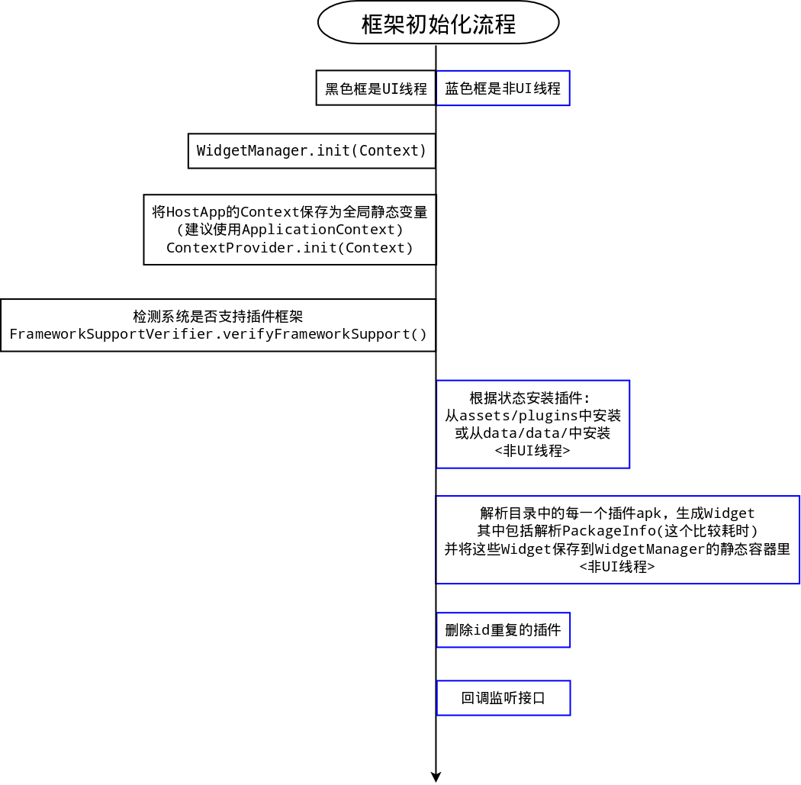
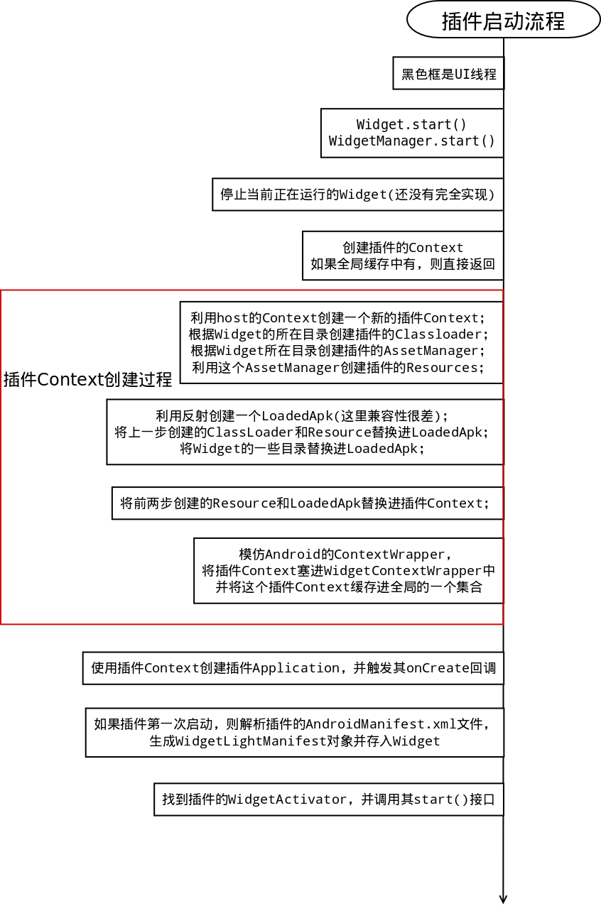
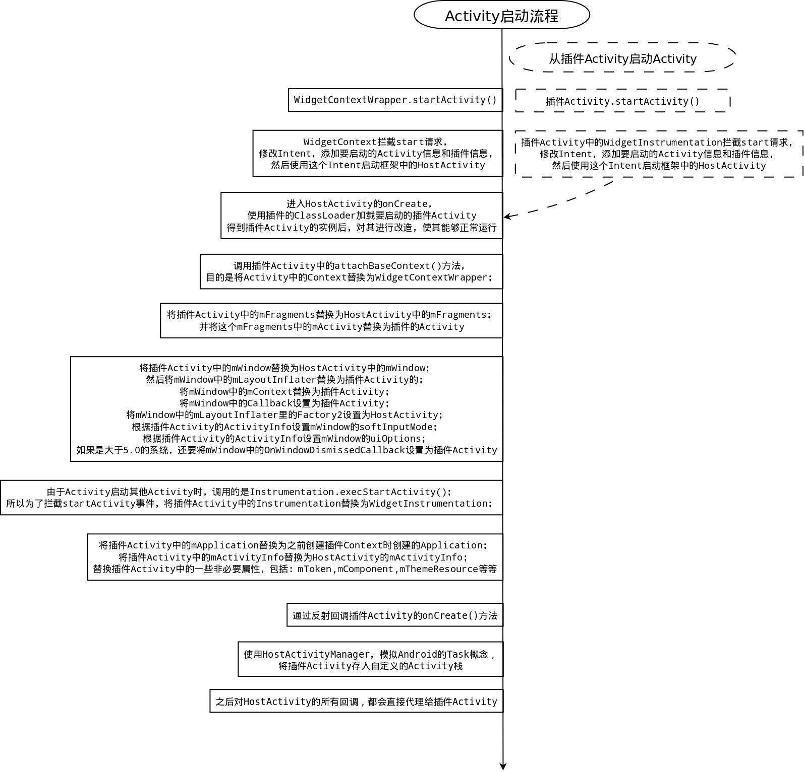
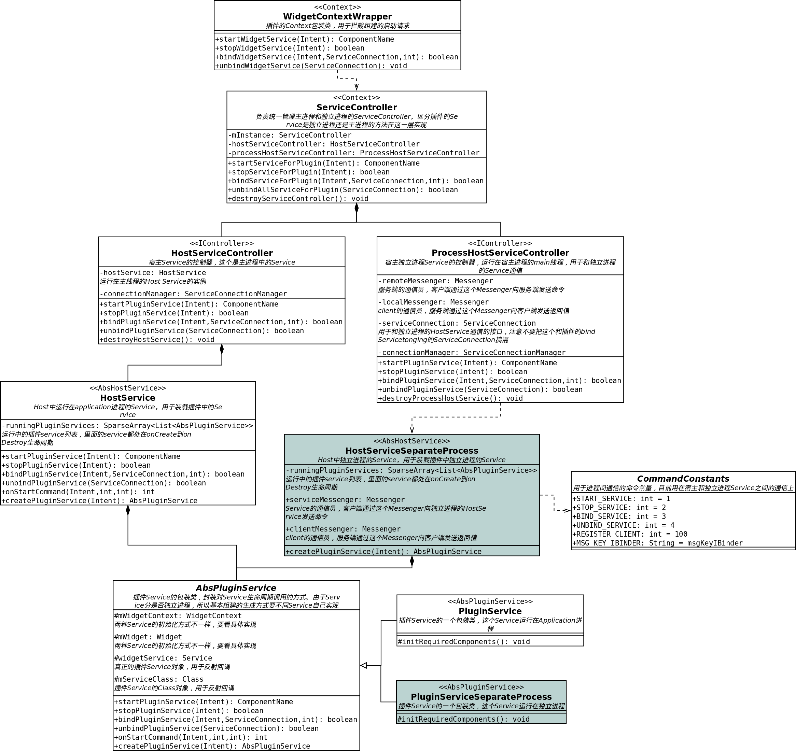
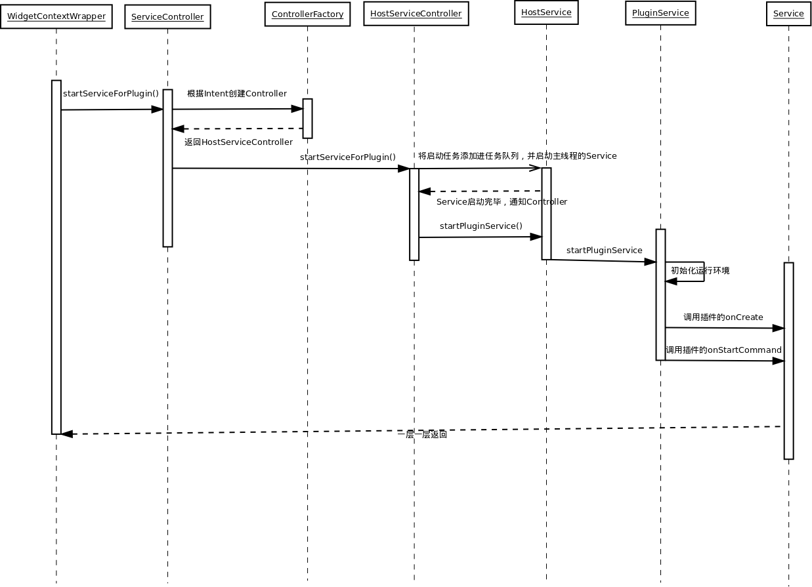
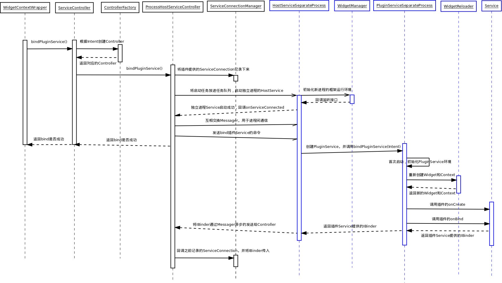

# Android插件化的一种实现

来源:[http://www.cnblogs.com/coding-way/p/4669591.html](http://www.cnblogs.com/coding-way/p/4669591.html)

Android的插件化已经是老生常谈的话题了，插件化的好处有很多：解除代码耦合，插件支持热插拔，静默升级，从根本上解决65K属性和方法的bug等等。

下面给大家介绍一下我们正在用的差价化框架。

本片主要以类图的方式向大家介绍插件话框架的实现。

下图是框架的初始化流程：

框架初始化后，就该启动插件了，下图是插件的启动流程：

这个步骤主要是初始化插件的运行环境，利用宿主的Context改造成插件的Context。

接下来是插件启动Activity的流程：

该步骤主要是用宿主的Activity包装插件的Activity。

通过上面的几个流程图，我们得知插件框架的基本原理如下：

* 利用DexClassLoader来实现动态加载插件中的class。
* 通过反射替换ContextImpl中的mResources，mPackageInfo，并替换插件Activity中的相关属性，来实现加载插件中的资源文件。
* 通过WidgetContext和WidgetInstrumentation来拦截startActivity的操作。
* 通过启动HostActivity来代替插件Activity，也就是说一个HostActivity对应一个插件Activity。

知道了启动插件Activity的原理后，我们思考下如何支持启动插件Service：

* 由于Android系统中同一个Service只会存在一个实例，这点与Activity不同，所以考虑用框架模拟Android系统来维护插件的Service。Service本质上分为两种，运行在独立进程和非独立进程的，所以宿主应用至少需要启动两个Service，用来装载插件的不同Service。

启动Service的实现方式和Activity有些不同，下面是框架管理Service的类图：

了解了框架支持Service的基本结构，我们看下启动插件非独立进程Service的流程：

启动独立进程插件Service要麻烦一些，请看流程图：

这个插件框架还有很多不足，我们还在继续完善。