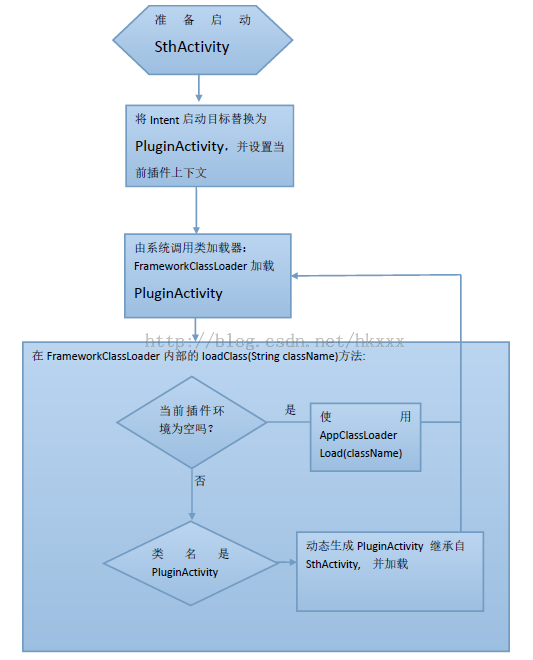
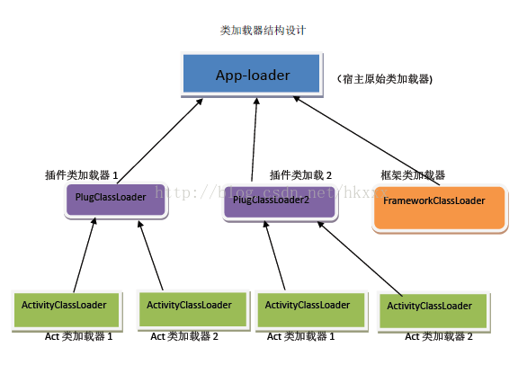

# 动态加载APK原理分享

来源:[http://blog.csdn.net/hkxxx/article/details/42194387](http://blog.csdn.net/hkxxx/article/details/42194387)

项目地址：[https://github.com/houkx/android-pluginmgr/](https://github.com/houkx/android-pluginmgr/) 欢迎star and fork

## (一) 综述
随着智能手机硬件性能的逐步提升，移动应用也做的越来越复杂，android平台上应用的apk包体积也越来越大，然后同类产品开始比拼谁的体积小，实现方案呢，然后很容易想到"插件化"，也就是说可以发布内核很小的产品，随着添加功能的需求而动态下载功能模块，促使插件化的另一个动机是App应用固有的问题，那就是很多组件需要注册，更新功能的话不能像Web应用那样可在用户无察觉的情况下通过升级服务器而方便升级，只能弹出个框让用户重新下载整个程序包，然后调取系统安装流程。
 
被加载的apk称之为插件，因为机制类似于生物学的"寄生"，加载了插件的应用也被称为宿主。

往往不是所有的apk都可作为插件被加载，往往需要遵循一定的"开发规范"，还需要插件项目引入某种api类库，业界通常都是这么做的。

这里介绍一种无须规范限制的动态加载解决方案，插件不需要依赖任何API，这也是本人突发异想，灵感所致。

## 二)功能介绍

特点：

* 插件为普通apk，无须依赖任何jar
* Activity生命周期由系统自己管理
* 使用简单，只需要了解一个类PluginManager的两个方法
* 启动Activity的效率高
* 不修改插件，被加载的插件仍然可以独立安装。

功能点:

* 可加载任意apk中的 Activity (包括子类 ActionBarActivity 、FragmentActivity)的派生类(不包括违反限制条件的Activity)
* 支持插件自定义Application
* 支持插件Apk中的Activity跳转到别的Activity(插件内部的或系统的,外部已安装apk的，甚至是别的插件中的),也没有任何限制
* 支持Activity设置主题(与系统的主题应用规则一样，如果Activity没指定Theme,但所在Application指定了Theme，则使用Application的Theme)
* 初步支持.so
* 支持插件使用 SharedPreference 或 SQLite数据库(尚未完善)


ps:第一个插件代码来自[https://github.com/viacheslavtitov/NDKBegining](https://github.com/viacheslavtitov/NDKBegining),作者是个老外，不过也比较粗心，要正常运行你需要在sd卡下创建目录:FFMPEG

第二个插件代码来自这篇博文:[http://blog.csdn.net/caihanyuan/article/details/7367351](http://blog.csdn.net/caihanyuan/article/details/7367351)

第三个插件代码来自大名鼎鼎的 PullToRefresh :
[https://github.com/johannilsson/android-pulltorefresh](https://github.com/johannilsson/android-pulltorefresh)

第6第7个插件代码是自测项目，分别测试ActionBarActivity和Activity基本加载和跳转

其他apk还没能正常加载，框架还在不断完善中，不过腾讯的开心消消乐可以帮助记录crashlog，这点真不错~

将要支持的特性:PackageManager service 等等，详情都列在开源项目[android-pluginmgr](https://github.com/houkx/android-pluginmgr/tree/experiment/android-pluginmgr)下的TODO文件中


ps:修正项目主页README描述的限制条件1，目前已经没有这个限制了，在插件中调用`context.getPackageName()`返回插件的清单文件中声明的包名

限制条件(永不支持的):

* 插件apk中不能假定自己已经安装，以及由此造成的影响，比如认为applicationInfo.dataDir==/data/data/packageName
* 不能依赖清单文件中的进程声明，被加载的apk以及里面的任何组件目前都在同一个进程管理。
* 插件中的权限，无法动态注册，插件中的权限都得在宿主中注册（暂无解决方案）

## (三) 实现
动态加载需要处理很多问题，虽然有很多问题，但是核心问题就是加载Activity，因为Activity是可见的，人们对可以看到的东西总是那么重视，视觉信息占人所处理信息的90%以上。

Activity如何调起来？资源的加载等等已经有大牛的文章介绍了，我本菜鸟，不再赘述。 

目前Activity的加载或许有很多处理方式，但是可以分为两种：一是自己new 二是系统new 。很多动态加载框架基于第一种方式。我这个方案基于第二种，既然要系统new，就要系统自己可以找到相应的Activity. 由于Activity需要在清单文件注册了才能使用，所以要注册Activity,但是如何注册呢？

我在网上看到有人用极端的方式：插件里的所有Activiy都在宿主里注册，既然宿主总要修改升级，何必要插件呢，这已经违背了动态加载的初衷:不修改框架而动态扩展功能更多的是这么做，注册一个Activity基类，供插件中的Activity继承，在这个基类里做动态加载的核心逻辑，这就要求插件必须依赖某种API类库。

我的方案通俗的说是这样，依赖倒转，不让插件依赖框架API,而是反过来，自动生成一个Activity类依赖(继承)插件中的Activity，这个自动生成的类就叫PluginActivity

并且声明在框架的清单文件中，如下: 

```
<activity name="androidx.pluginmgr.PluginActivity" /> 

```

聪明的读者会想,等一下，插件里面Activity可不止一个，你就注册一个？

是的，就一个，自动生成的Activity类名都是`androidx.pluginmgr.PluginActivity`，不过放在不同的文件中,最简单的映射，原始Activity类名.dex文件中存储对应的子类:`PluginActivity`

其实也是偷梁换柱了，如果你想启动插件里的Activity，如`com.test.MyPlugActivity`, 我就把启动目标修改为`androidx.pluginmgr.PluginActivity`类，然后从`com.test.MyPlugActivity.dex`文件中找到`public class androidx.pluginmgr.PluginActivity extends com.test.MyPlugActivity{....}`

以启动SthActivity为例:



好了，核心思想已经表达清楚了，下面介绍如何让系统按你说的路径去找类文件，这涉及到类加载器。自定义类加载器比较简单，继承`java.lang.ClassLoader`即可.

在我的开源项目源码中对应的类是`FrameworkClassLoader`, `PluginManager`初始化时就去修改`Application`的类加载器，替换为`FrameworkClassLoader`.

`FrameworkClassLoader`其实不干什么实际加载工作，只是分发任务:

```
public Class loadClass(String className){
	if(当前上下文插件不为空) {
		if( className 是 PluginActivity){
			// 找到当前实际要加载的原始 Activity
			return  // 使用插件对应的ActivityClassLoader从（自动生成的）
				// 原始Activity类名.dex 文件 加载PluginActivity
		}else{
			return  使用对应的 PluginClassLoader 加载普通类
		}  
	}else{
		return super.loadClass()//即委派给宿主Application的原始类加载器加载
	}   
} 
```

其中，`PluginClassLoader`是一个`DexClassLoader`, `parent`指向 `FrameworkClassLoader`,`ActivityClassLoader`也是一个`DexClassLoader`, parent 指向 `PluginClassLoader`
  
插图2（类加载器结构图）：



```
package androidx.pluginmgr;  
  
  
import android.util.Log;  
  
  
/** 
 * 框架类加载器（Application 的 classLoder被替换成此类的实例） 
 *  
 * 
 */  
class FrameworkClassLoader extends ClassLoader {  
    private String[] plugIdAndActname;//代表插件上下文  
  
  
    public FrameworkClassLoader(ClassLoader parent) {  
        super(parent);  
    }  
    //在外部或插件内部的 startActivity 时调用这个方法设置插件上下文  
    String newActivityClassName(String plugId, String actName) {  
        plugIdAndActname = new String[] { plugId, actName };  
        // targetClassName即宿主manifest配置的androidx.pluginmgr.PluginActivity
        return ActivityOverider.targetClassName;  
    }  
  
  
    protected Class<?> loadClass(String className, boolean resolv)  
            throws ClassNotFoundException {  
        Log.i("cl", "loadClass: " + className);  
        String[] plugIdAndActname = this.plugIdAndActname;  
        Log.i("cl", "plugIdAndActname = " + Arrays.toString(plugIdAndActname));  
        if (plugIdAndActname != null) {  
            String pluginId = plugIdAndActname[0];  
              
            PlugInfo plugin = PluginManager.getInstance().getPluginById(  
                    pluginId);  
            Log.i("cl", "plugin = " + plugin);  
            if (plugin != null) {  
                try {  
                    if (className.equals(ActivityOverider.targetClassName)) {  
                        String actClassName = plugIdAndActname[1];//被（继承）代理的Activity类名  
                        return plugin.getClassLoader().loadActivityClass(  
                                actClassName);// 加载动态生成的Activity类  
                    }else{  
                        return plugin.getClassLoader().loadClass(className);//加载普通类  
                    }  
                } catch (ClassNotFoundException e) {  
                    e.printStackTrace();  
                }  
            }  
        }  
          
        return super.loadClass(className, resolv);  
    }  
}  

```

到此为止，一个动态加载框架的核心雏形已经有了，但是还有许多细节待完善。

-------------------------------------------------------------------------------

附加：另外，关于动态生成类，对于davikvm环境，我所知道的工具有asmdex和dexmaker，我在项目中选用的是dexmaker

用什么不是重点，看生成的代码吧：(ActivityOverider 类负责与自动生成的Activity类交互)

```
package androidx.pluginmgr;

import android.content.ComponentName;
import android.content.Intent;
import android.content.ServiceConnection;
import android.content.res.AssetManager;
import android.content.res.Resources;
import android.os.Bundle;
import androidplugdemo.SthActivity;

public final class PluginActivity extends SthActivity {
    private static final String _pluginId = "activityTest_v1";
    private AssetManager mAssertManager;
    private Resources mResources;

    public boolean bindService(Intent paramIntent, 
    			ServiceConnection paramServiceConnection, int paramInt) {
        return ActivityOverider.overrideBindService(this, _pluginId, 
        						paramIntent, paramServiceConnection, paramInt);
    }

    public AssetManager getAssets() {
        AssetManager localAssetManager = this.mAssertManager;
        if (localAssetManager == null) {
            localAssetManager = super.getAssets();
        }
        return localAssetManager;
    }

    public Resources getResources() {
        Resources localResources = this.mResources;
        if (localResources == null) {
            localResources = super.getResources();
        }
        return localResources;
    }

    public void onBackPressed() {
        if (ActivityOverider.overrideOnbackPressed(this, _pluginId)) {
            super.onBackPressed();
        }
    }

    protected void onCreate(Bundle paramBundle) {
    
        String str = _pluginId;
        AssetManager localAssetManager = ActivityOverider.getAssetManager(str, this);
        this.mAssertManager = localAssetManager;
        Resources localResources = super.getResources();
        this.mResources = new Resources(localAssetManager, 
        			localResources.getDisplayMetrics(), localResources.getConfiguration());
        ActivityOverider.callback_onCreate(str, this);
        super.onCreate(paramBundle);
    }

    protected void onDestroy() {
        String str = _pluginId;
        super.onDestroy();
        ActivityOverider.callback_onDestroy(str, this);
    }

    protected void onPause() {
        String str = _pluginId;
        super.onPause();
        ActivityOverider.callback_onPause(str, this);
    }

    protected void onRestart() {
        String str = _pluginId;
        super.onRestart();
        ActivityOverider.callback_onRestart(str, this);
    }

    protected void onResume() {
        String str = _pluginId;
        super.onResume();
        ActivityOverider.callback_onResume(str, this);
    }

    protected void onStart() {
        String str = _pluginId;
        super.onStart();
        ActivityOverider.callback_onStart(str, this);
    }

    protected void onStop() {
        String str = _pluginId;
        super.onStop();
        ActivityOverider.callback_onStop(str, this);
    }

    public void startActivityForResult(Intent paramIntent, 
    						int paramInt, Bundle paramBundle) {
    						
        super.startActivityForResult(ActivityOverider
        			.overrideStartActivityForResult(
        					this, _pluginId, paramIntent, 
        					paramInt, paramBundle), paramInt, paramBundle);
    }

    public ComponentName startService(Intent paramIntent) {
        return ActivityOverider.overrideStartService(
        							this, _pluginId, paramIntent);
    }

    public boolean stopService(Intent paramIntent) {
        return ActivityOverider.overrideStopService(
        					this, _pluginId, paramIntent);
    }

    public void unbindService(ServiceConnection paramServiceConnection) {
        ActivityOverider.overrideUnbindService(
        				this, _pluginId, paramServiceConnection);
    }
}

```

项目地址：[https://github.com/houkx/android-pluginmgr/](https://github.com/houkx/android-pluginmgr/) 欢迎star and fork

