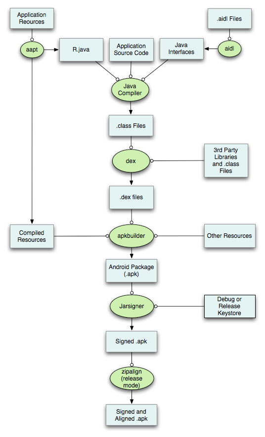

# 美团Android DEX自动拆包及动态加载简介

来源:[美团Android DEX自动拆包及动态加载简介](http://tech.meituan.com/mt-android-auto-split-dex.html)

## 概述
作为一个android开发者，在开发应用时，随着业务规模发展到一定程度，不断地加入新功能、添加新的类库，代码在急剧的膨胀，相应的apk包的大小也急剧增加， 那么终有一天，你会不幸遇到这个错误：

* 生成的apk在android 2.3或之前的机器上无法安装，提示INSTALL_FAILED_DEXOPT
* 方法数量过多，编译时出错，提示：
> Conversion to Dalvik format failed:Unable to execute dex: method ID not in [0, 0xffff]: 65536

而问题产生的具体原因如下：

* 无法安装（Android 2.3 INSTALL_FAILED_DEXOPT）问题，是由dexopt的LinearAlloc限制引起的，在Android版本不同分别经历了4M/5M/8M/16M限制，目前主流4.2.x系统上可能都已到16M， 在Gingerbread或者以下系统LinearAllocHdr分配空间只有5M大小的， 高于Gingerbread的系统提升到了8M。Dalvik linearAlloc是一个固定大小的缓冲区。在应用的安装过程中，系统会运行一个名为dexopt的程序为该应用在当前机型中运行做准备。dexopt使用LinearAlloc来存储应用的方法信息。Android 2.2和2.3的缓冲区只有5MB，Android 4.x提高到了8MB或16MB。当方法数量过多导致超出缓冲区大小时，会造成dexopt崩溃。

* 超过最大方法数限制的问题，是由于DEX文件格式限制，一个DEX文件中method个数采用使用原生类型short来索引文件中的方法，也就是4个字节共计最多表达65536个method，field/class的个数也均有此限制。对于DEX文件，则是将工程所需全部class文件合并且压缩到一个DEX文件期间，也就是Android打包的DEX过程中， 单个DEX文件可被引用的方法总数（自己开发的代码以及所引用的Android框架、类库的代码）被限制为65536；

## 插件化？ MultiDex？

[define_class_load_process]:http://android-developers.blogspot.hk/2011/07/custom-class-loading-in-dalvik.html
[dalvik_debug]:https://www.facebook.com/notes/facebook-engineering/under-the-hood-dalvik-patch-for-facebook-for-android/10151345597798920
[multidex]:https://developer.android.com/tools/building/MultiDex.html

解决这个问题，一般有下面几种方案，一种方案是加大Proguard的力度来减小DEX的大小和方法数，但这是治标不治本的方案，随着业务代码的添加，方法数终究会到达这个限制，一种比较流行的方案是插件化方案，另外一种是采用google提供的MultiDex方案，以及google在推出MultiDex之前Android Developers博客介绍的通过[自定义类加载过程][define_class_load_process]， 再就是Facebook推出的为Android应用开发的[Dalvik补丁][dalvik_debug]， 但facebook博客里写的不是很详细；我们在插件化方案上也做了探索和尝试，发现部署插件化方案，首先需要梳理和修改各个业务线的代码，使之解耦，改动的面和量比较巨大，通过一定的探讨和分析，我们认为对我们目前来说采用MultiDex方案更靠谱一些，这样我们可以快速和简洁的对代码进行拆分，同时代码改动也在可以接受的范围内； 这样我们采用了google提供的MultiDex方式进行了开发。

插件化方案在业内有不同的实现原理，这里不再一一列举，这里只列举下Google为构建超过65K方法数的应用提供官方支持的方案：[MultiDex][multidex]。

首先使用Android SDK Manager升级到最新的Android SDK Build Tools和Android Support Library。然后进行以下两步操作：

### 1.修改Gradle配置文件，启用MultiDex并包含MultiDex支持

```
android {
    compileSdkVersion 21 buildToolsVersion "21.1.0"

    defaultConfig {
        ...
        minSdkVersion 14
        targetSdkVersion 21
        ...

        // Enabling MultiDex support.
        multiDexEnabled true
    }
        ...
}
dependencies {
	compile 'com.android.support:MultiDex:1.0.0'
}

```

### 2.让应用支持多DEX文件。在官方文档中描述了三种可选方法

* 在AndroidManifest.xml的application中声明android.support.MultiDex.MultiDexApplication；
* 如果你已经有自己的Application类，让其继承MultiDexApplication；
* 如果你的Application类已经继承自其它类，你不想/能修改它，那么可以重写attachBaseContext()方法：

```
@Override 
protected void attachBaseContext(Context base) {
    super.attachBaseContext(base);
    MultiDex.install(this);
}
```

并在Manifest中添加以下声明：

```
<?xml version="1.0" encoding="utf-8"?>
<manifest xmlns:android="http://schemas.android.com/apk/res/android" package="com.example.android.MultiDex.myapplication">
	<application
        ...
        android:name="android.support.MultiDex.MultiDexApplication">
        ...
	</application>
</manifest>
```
如果已经有自己的Application，则让其继承MultiDexApplication即可.

## Dex自动拆包及动态加载
### MultiDex带来的问题

[issue_22586]:http://b.android.com/22586
[issue_78035]:http://b.android.com/78035
[art_divik_differents]:https://source.android.com/devices/tech/dalvik/index.html
[BaseDexClassLoader]:https://android.googlesource.com/platform/libcore/+/master/dalvik/src/main/java/dalvik/system/BaseDexClassLoader.java

在第一版本采用MultiDex方案上线后，在Dalvik下MultiDex带来了下列几个问题：

1. 在冷启动时因为需要安装DEX文件，如果DEX文件过大时，处理时间过长，很容易引发ANR（Application Not Responding）；

2. 采用MultiDex方案的应用可能不能在低于Android 4.0 (API level 14) 机器上启动，这个主要是因为Dalvik linearAlloc的一个bug ([Issue 22586][issue_22586]);

3. 采用MultiDex方案的应用因为需要申请一个很大的内存，在运行时可能导致程序的崩溃，这个主要是因为Dalvik linearAlloc 的一个限制([Issue 78035][issue_78035]). 这个限制在 Android 4.0 (API level 14)已经增加了, 应用也有可能在低于 Android 5.0 (API level 21)版本的机器上触发这个限制；

而在ART下MultiDex是不存在这个问题的，这主要是因为ART下采用Ahead-of-time (AOT) compilation技术，系统在APK的安装过程中会使用自带的dex2oat工具对APK中可用的DEX文件进行编译并生成一个可在本地机器上运行的文件，这样能提高应用的启动速度，因为是在安装过程中进行了处理这样会影响应用的安装速度，对ART感兴趣的可以参考一下[ART和Dalvik的区别][art_divik_differents].

MultiDex的基本原理是把通过DexFile来加载Secondary DEX，并存放在[BaseDexClassLoader][BaseDexClassLoader]的DexPathList中。

下面代码片段是BaseDexClassLoader findClass的过程:

```
protected Class<?> findClass(String name) throws ClassNotFoundException {
    List<Throwable> suppressedExceptions = new ArrayList<Throwable>();
    Class c = pathList.findClass(name, suppressedExceptions);
    if (c == null) {
        ClassNotFoundException cnfe = new ClassNotFoundException("Didn't find class \"" + name + "\" on path: " + pathList); 
        for (Throwable t : suppressedExceptions) {
            cnfe.addSuppressed(t);
        }
        throw cnfe;
    }
    return c;
}
```

下面代码片段为怎么通过DexFile来加载Secondary DEX并放到BaseDexClassLoader的DexPathList中:

```
private static void install(ClassLoader loader, List<File> additionalClassPathEntries,
                            File optimizedDirectory)
        throws IllegalArgumentException, IllegalAccessException,
        NoSuchFieldException, InvocationTargetException, NoSuchMethodException {
    /* The patched class loader is expected to be a descendant of
     * dalvik.system.BaseDexClassLoader. We modify its
     * dalvik.system.DexPathList pathList field to append additional DEX
     * file entries.
     */
    Field pathListField = findField(loader, "pathList");
    Object dexPathList = pathListField.get(loader);
    ArrayList<IOException> suppressedExceptions = new ArrayList<IOException>();
    expandFieldArray(dexPathList, "dexElements", makeDexElements(dexPathList,
            new ArrayList<File>(additionalClassPathEntries), optimizedDirectory,
            suppressedExceptions));
    try {
        if (suppressedExceptions.size() > 0) {
            for (IOException e : suppressedExceptions) {
                //Log.w(TAG, "Exception in makeDexElement", e);
            }
            Field suppressedExceptionsField =
                    findField(loader, "dexElementsSuppressedExceptions");
            IOException[] dexElementsSuppressedExceptions =
                    (IOException[]) suppressedExceptionsField.get(loader);

            if (dexElementsSuppressedExceptions == null) {
                dexElementsSuppressedExceptions =
                        suppressedExceptions.toArray(
                                new IOException[suppressedExceptions.size()]);
            } else {
                IOException[] combined =
                        new IOException[suppressedExceptions.size() +
                                dexElementsSuppressedExceptions.length];
                suppressedExceptions.toArray(combined);
                System.arraycopy(dexElementsSuppressedExceptions, 0, combined,
                        suppressedExceptions.size(), dexElementsSuppressedExceptions.length);
                dexElementsSuppressedExceptions = combined;
            }

            suppressedExceptionsField.set(loader, dexElementsSuppressedExceptions);
        }
    } catch(Exception e) {
    }
}
```

### Dex自动拆包及动态加载方案简介

通过查看MultiDex的源码，我们发现MultiDex在冷启动时容易导致ANR的瓶颈， 在2.1版本之前的Dalvik的VM版本中， MultiDex的安装大概分为几步，第一步打开apk这个zip包，第二步把MultiDex的dex解压出来（除去Classes.dex之外的其他DEX，例如：classes2.dex， classes3.dex等等)，因为android系统在启动app时只加载了第一个Classes.dex，其他的DEX需要我们人工进行安装，第三步通过反射进行安装，这三步其实都比较耗时， 为了解决这个问题我们考虑是否可以把DEX的加载放到一个异步线程中，这样冷启动速度能提高不少，同时能够减少冷启动过程中的ANR，对于Dalvik linearAlloc的一个缺陷([Issue 22586][issue_22586])和限制([Issue 78035][issue_78035])，我们考虑是否可以人工对DEX的拆分进行干预，使每个DEX的大小在一定的合理范围内，这样就减少触发Dalvik linearAlloc的缺陷和限制； 为了实现这几个目的，我们需要解决下面三个问题：

* 在打包过程中如何产生多个的DEX包？
* 如果做到动态加载，怎么决定哪些DEX动态加载呢？
* 如果启动后在工作线程中做动态加载，如果没有加载完而用户进行页面操作需要使用到动态加载DEX中的class怎么办？

我们首先来分析如何解决第一个问题，在使用MultiDex方案时，我们知道BuildTool会自动把代码进行拆成多个DEX包，并且可以通过配置文件来控制哪些代码放到第一个DEX包中， 下图是Android的打包流程示意图：



为了实现产生多个DEX包，我们可以在生成DEX文件的这一步中， 在Ant或gradle中自定义一个Task来干预DEX产生的过程，从而产生多个DEX，下图是在ant和gradle中干预产生DEX的自定task的截图:

```
tasks.whenTaskAdded { task ->
    if (task.name.startsWith('proguard') && (task.name.endsWith('Debug') || task.name.endsWith('Release'))) {
        task.doLast {
            makeDexFileAfterProguardJar();
        }
        task.doFirst {
            delete "${project.buildDir}/intermediates/classes-proguard";

            String flavor = task.name.substring('proguard'.length(), task.name.lastIndexOf(task.name.endsWith('Debug') ? "Debug" : "Release"));
            generateMainIndexKeepList(flavor.toLowerCase());
        }
    } else if (task.name.startsWith('zipalign') && (task.name.endsWith('Debug') || task.name.endsWith('Release'))) {
        task.doFirst {
            ensureMultiDexInApk();
        }
    }
}
```

上一步解决了如何打包出多个DEX的问题了，那我们该怎么该根据什么来决定哪些class放到Main DEX，哪些放到Secondary DEX呢（这里的Main DEX是指在2.1版本的Dalvik VM之前由android系统在启动apk时自己主动加载的Classes.dex，而Secondary DEX是指需要我们自己安装进去的DEX，例如：Classes2.dex, Classes3.dex等）， 这个需要分析出放到Main DEX中的class依赖，需要确保把Main DEX中class所有的依赖都要放进来，否则在启动时会发生ClassNotFoundException, 这里我们的方案是把Service、Receiver、Provider涉及到的代码都放到Main DEX中，而把Activity涉及到的代码进行了一定的拆分，把首页Activity、Laucher Activity、欢迎页的Activity、城市列表页Activity等所依赖的class放到了Main DEX中，把二级、三级页面的Activity以及业务频道的代码放到了Secondary DEX中，为了减少人工分析class的依赖所带了的不可维护性和高风险性，我们编写了一个能够自动分析Class依赖的脚本， 从而能够保证Main DEX包含class以及他们所依赖的所有class都在其内，这样这个脚本就会在打包之前自动分析出启动到Main DEX所涉及的所有代码，保证Main DEX运行正常。

[ActivityThread]:https://android.googlesource.com/platform/frameworks/base/+/master/core/java/android/app/ActivityThread.java
[Instrumentation]:https://android.googlesource.com/platform/frameworks/base/+/master/core/java/android/app/Instrumentation.java

随着第二个问题的迎刃而解，我们来到了比较棘手的第三问题，如果我们在后台加载Secondary DEX过程中，用户点击界面将要跳转到使用了在Secondary DEX中class的界面， 那此时必然发生ClassNotFoundException, 那怎么解决这个问题呢，在所有的Activity跳转代码处添加判断Secondary DEX是否加载完成？这个方法可行，但工作量非常大； 那有没有更好的解决方案呢？我们通过分析Activity的启动过程，发现Activity是由ActivityThread 通过Instrumentation来启动的，我们是否可以在Instrumentation中做一定的手脚呢？通过分析代码[ActivityThread][ActivityThread]和[Instrumentation][Instrumentation]发现，Instrumentation有关Activity启动相关的方法大概有：execStartActivity、newActivity等等，这样我们就可以在这些方法中添加代码逻辑进行判断这个Class是否加载了，如果加载则直接启动这个Activity，如果没有加载完成则启动一个等待的Activity显示给用户，然后在这个Activity中等待后台Secondary DEX加载完成，完成后自动跳转到用户实际要跳转的Activity；这样在代码充分解耦合，以及每个业务代码能够做到颗粒化的前提下，我们就做到Secondary DEX的按需加载了， 下面是Instrumentation添加的部分关键代码：

```
public ActivityResult execStartActivity(Context who, IBinder contextThread, IBinder token, Activity target,
                                            Intent intent, int requestCode) {
        ActivityResult activityResult = null;
        String className;
        if (intent.getComponent() != null) {
            className = intent.getComponent().getClassName();
        } else {
            ResolveInfo resolveActivity = who.getPackageManager().resolveActivity(intent, 0);

            if (resolveActivity != null && resolveActivity.activityInfo != null) {
                className = resolveActivity.activityInfo.name;
            } else {
                className = null;
            }
        }

        if (!TextUtils.isEmpty(className)) {
            boolean shouldInterrupted = !MeituanApplication.isDexAvailable();
            if (MeituanApplication.sIsDexAvailable.get() || mByPassActivityClassNameList.contains(className)) {
                shouldInterrupted = false;
            }
            if (shouldInterrupted) {
                Intent interruptedIntent = new Intent(mContext, WaitingActivity.class);

                activityResult = execStartActivity(who, contextThread, token, target, interruptedIntent, requestCode);
            } else {
                activityResult = execStartActivity(who, contextThread, token, target, intent, requestCode);
            }
        } else {
            activityResult = execStartActivity(who, contextThread, token, target, intent, requestCode);
        }

        return activityResult;
    }

    public Activity newActivity(Class<?> clazz, Context context, IBinder token,
                                Application application, Intent intent, ActivityInfo info,
                                CharSequence title, Activity parent, String id, Object lastNonConfigurationInstance)
            throws InstantiationException, IllegalAccessException {

        String className = "";
        Activity newActivity = null;
        if (intent.getComponent() != null) {
            className = intent.getComponent().getClassName();
        }

        boolean shouldInterrupted = !MeituanApplication.isDexAvailable();
        if (MeituanApplication.sIsDexAvailable.get() || mByPassActivityClassNameList.contains(className)) {
            shouldInterrupted = false;
        }
        if (shouldInterrupted) {
            intent = new Intent(mContext, WaitingActivity.class);
            newActivity = mBase.newActivity(clazz, context, token,
                    application, intent, info, title, parent, id,
                    lastNonConfigurationInstance);
        } else {
            newActivity = mBase.newActivity(clazz, context, token,
                    application, intent, info, title, parent, id,
                    lastNonConfigurationInstance);
        }
        return newActivity;
    }
```

[google-doc-non-constant-fields]:http://tools.android.com/tips/non-constant-fields

实际应用中我们还遇到另外一个比较棘手的问题， 就是Field的过多的问题，Field过多是由我们目前采用的代码组织结构引入的，我们为了方便多业务线、多团队并发协作的情况下开发，我们采用的aar的方式进行开发，并同时在aar依赖链的最底层引入了一个通用业务aar，而这个通用业务aar中包含了很多资源，而ADT14以及更高的版本中对Library资源处理时，Library的R资源不再是static final的了，详情请查看[google官方说明][google-doc-non-constant-fields]，这样在最终打包时Library中的R没法做到内联，这样带来了R field过多的情况，导致需要拆分多个Secondary DEX，为了解决这个问题我们采用的是在打包过程中利用脚本把Libray中R field（例如ID、Layout、Drawable等）的引用替换成常量，然后删去Library中R.class中的相应Field。

## 总结

上面就是我们在使用MultiDex过程中进化而来的DEX自动化拆包的方案， 这样我们就可以通过脚本控制来进行自动化的拆分DEX，然后在运行时自由的加载Secondary DEX，既能保证冷启动速度，又能减少运行时的内存占用。