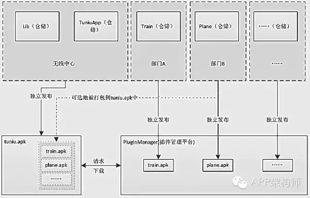

#  途牛原创|途牛Android App的插件实现

来源：[途牛原创|途牛Android App的插件实现](http://mp.weixin.qq.com/s?__biz=MzAwOTE0ODEwMQ==&mid=401731625&idx=1&sn=9bf2bacfbba43ba9dc7b2e854b64e66c&scene=23&srcid=1231ni0s2Y0OMfYSoNhkkJ47#rd&ADUIN=289832127&ADSESSION=1451551778&ADTAG=CLIENT.QQ.5425_.0&ADPUBNO=26509)

## 途牛的Android App插件化

途牛的插件化是基于dynamic-load-apk（github）实现的。定义了宿主和插件的通信方式，使得两者能够互起对方的页面，调用彼此的功能。同时对activity的启动方式singletask等进行了模式实现，并增加了对Service的支持等。总之使得插件开发最大限度的保持着原有的Android开发习惯。

然后，我们看下引入插件化后，途牛的组织架构，代码管理及版本发布方式：

从图中可以看出，部门独立出后，代码也随之独立出，再无强依赖，部门可以根据自己的需求快速响应，独立发版，再也不用依赖于宿主app的版本周期。这样带来的好处，我想大家都是懂的。
 
## 技术实现

我们来看下技术实现：

关于代理Activity的概念这里就不再赘述，详细请参阅dynamic-load-apk（github）[参见本文最后]。这里给一个代理Activity和插件activity的关系图。

下面主要描述下对其进行的扩展支持。先上图，如下：

###  1. 插件框架对于原生功能支持的实现
a）宿主App和插件的通讯方式定义

宿主App和插件的通讯方式定义使用桥接模式，分别为宿主和插件定义了接口（HostInterface，PluginInterface），各自对接口进行实现。宿主app在启动时将其接口实现set到DLlib中。插件将接口实现发布在其AndroidMainfest.xml中，并在宿主app初始化插件包时，通过反射获取该实现set到DLlib中。这样以来，两者可实现相互的界面跳转，及功能函数的调用。

b) Activity启动方式的模拟支持

Activity启动方式的模拟支持通过对代理Activity原理的了解，我们都会发现启动的插件页面实际上都是DLProxyActivity，插件activity只是这个代理Activity的一个成员对象，基于这个一对一的映射关系，我们为插件activity建立独立的task管理，通过监控DLProxyActivity的生命周期，来模拟实现插件activity的singletask，singleinstance的实现。

c) Service支持

Service支持参照代理Activity思想，同样设置代理Service。这个代理Service中维护着一个插件service的列表。每次向插件Service发送请求，实际上仍然是通过反射方式向代理Service发送请求，代理Service再进行分发。

d) 通过对代理Activity的监控，增加插件页面在被回收后，能够由系统自动恢复的支持。

e)其它细节不再赘述。
### 2. 宿主App和插件app的打包和发布方式
a) 宿主App打包时，compile依赖Lib库并一起打包成apk。 
b) 插件打包时，provide依赖Lib库，打包出的apk中不包含Lib库的内容。 

### 3. 插件app的开发调测
a) 插件app可更改Lib库的依赖为compile，打包生成可安装运行apk，进行开发调测。 
b) 插件app依赖宿主app进行开发调测。更改宿主app加载插件路径为自己方便拷贝的路径，然后插件app打包进行替换。需要debug时，可直接添加断点，进入debug模式。 

### 4.关于插件管理平台
a) 插件管理以宿主app的版本为key，进行管理。每个宿主app有其对应支持的插件列表。 
b) 插件的更新采用增量更新模式。 
c)对于下载的插件包或增量包进行签名校验 

 
## 对比

最后来做个对比，说下不足：

### 1. DynamicAPK（携程）

a) 看到插件的Activity需要注册在宿主app的AndroidMainfest.xml里，我就不喜欢了。需求上不希望插件增加一个界面，主app要跟着发版。

b) 打包要改aapt，插件编译要依赖宿主app，主app发版要合并R文件，这还是要捆绑发版，不喜欢。

c) Hook系统Instrumentation，这个很厉害，值得借鉴，看能否在此层面完成插件activity启动模式的支持。

d)迁移成本极其小，值得赞扬。

### 2.DroidPlugin（奇虎360）

这个不满足需求，途牛app需要宿主app和插件件进行频繁复杂的交互。直接pass。

 
## 优势与不足

### 不足：

* a) that的存在，导致迁移时要进行适当培训。
* b) 不支持插件自定义scheme应用到插件activity上。
* c) 不支持宿主FragmentActivity + 宿主Fragement + 插件Fragement这样的混合使用。
* d) 不支持插件ContentProvider。
* e) 不支持插件静态广播。
* f)不支持对Lib和宿主app中的资源访问.

### 优势：
再次说下优势，做个宣传。

* 最大的优势：插件增加或减少页面，宿主app不需要做任何修改，而且插件可独立发布。

综上，算是选择了一个最适合需求的框架。

备注：dynamic-load-apk（github）的链接：
[https://github.com/singwhatiwanna/dynamic-load-apk](https://github.com/singwhatiwanna/dynamic-load-apk)