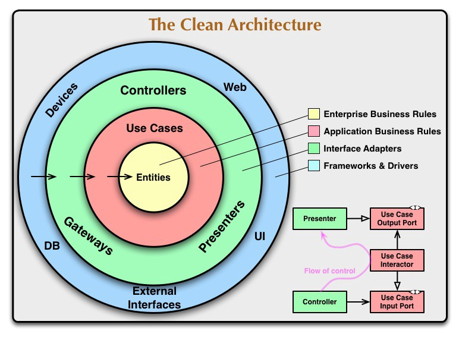
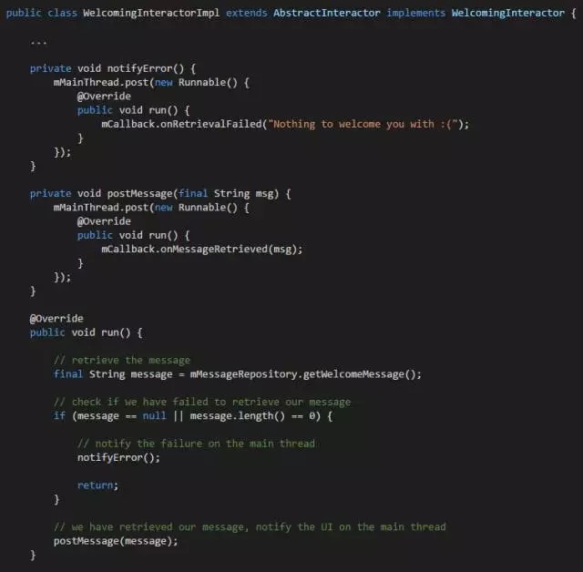
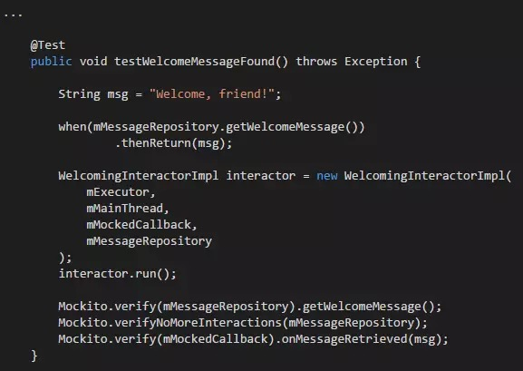
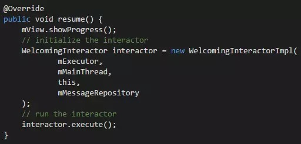
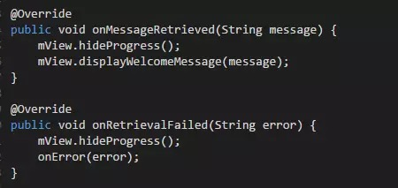
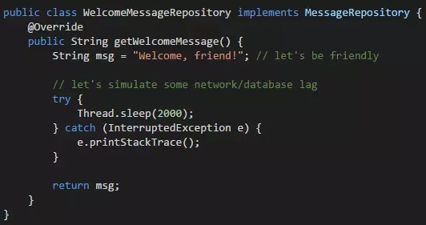

# Android干净架构详解：为你的应用打造一个清爽的架构！

来源:["移动开发前线"微信公众号](http://mp.weixin.qq.com/s?__biz=MzA3ODg4MDk0Ng==&mid=402486518&idx=1&sn=e466c3cfcbe02126d92f81cfc347fba4&scene=23&srcid=0305daqoPykAJloqnC6pa7wh#rd)

原文链接:[A detailed guide on developing Android apps using the Clean Architecture pattern](https://medium.com/@dmilicic/a-detailed-guide-on-developing-android-apps-using-the-clean-architecture-pattern-d38d71e94029#.te39hwu4b)

> **编者的话：**随着应用体积和代码数量的膨胀，Android应用的架构越来越复杂，遗留代码越来越多，接手开发、协作都变得越来越困难，有些人试图用框架、规范来解决这个问题，但为什么不从一开始就从架构上着手呢？干净架构就是一种很好的层级解耦、理清依赖的架构，作者在接触干净架构后就喜欢上了它，不仅在商业上成功应用，还撰文介绍、开源样板代码，简直化身干净架构布道师了，我们一起来看作者是如何向我们安利这一架构吧。

自从我开始进行Android应用的开发，我一直以为这项工作可以完成的更好。在我的职业生涯中，我见到过很多错误的软件设计决定，其中有一些还是我自己的。而且，这些决定导致了Android应用设计复杂度的急剧膨胀。但是，从你的错误中吸取教训并不断改进以后的做法才是非常重要的。在探索了很多应用开发的方法后，我遇到了干净架构（Clean Architecture）。在将其进行改良并引入了一些类似项目的灵感后，我把这种方法应用到了Android开发，发现该方法完全可以用于实践，值得推荐和分享。

这篇文章的目的是提供利用Clean方法进行Android应用开发的一个指南。它已在我最近为客户开发应用过程中得到成功验证。

## 何为干净架构

我不准备在这里解释太多细节，因为网上已经有了不少的资料（译者注：中文的资料也有一些）。下面我会给出理解Clean的关键信息。

Clean一般是指，代码以洋葱的形状依据一定的依赖规则被划分为多层：内层对于外层一无所知。这就意味着依赖只能由外向内。

其具体含义可以通过下图进行很好的展示。



（此图来源于[Bob大叔](https://blog.8thlight.com/uncle-bob/archive.html)，他也是干净架构的提出者）

干净架构使得代码可以实现：

* 框架的独立性
* 可测试
* UI的独立性
* 数据库的独立性
* 外部代理的独立性

在后面的例子中，我会详细讲解这些特征是如何达成的。我强烈推荐[8thlight的一篇文章](https://blog.8thlight.com/uncle-bob/2012/08/13/the-clean-architecture.html)和[vimeo上的视频](https://vimeo.com/43612849)来详细了解Clean的概念。

## 对Android来说的意义

一般而言，你的应用可以有任意数量的层。但是，除非需要在所有的Android应用中采用企业级的业务逻辑，一般的应用至多只有三层：

* 外层：实现层
* 中层：接口适配层
* 内层：业务逻辑层

实现层包含了所有框架相关的东西。框架相关的代码包含了所有不是专门用来解决目标问题的部分，例如创建activity和fragment、发送目标以及网络和数据库相关的框架代码。

接口适配层的目的就是负责连接业务逻辑和框架相关的代码。

应用中最重要的就是业务逻辑层。它负责解决你的应用所真正想解决的问题。该层不包含任何框架相关的代码，因此其代码应该可以在没有模拟器的情况下独立运行。这样，测试、开发和维护业务逻辑代码就要容易很多。而这就是干净架构的主要优势。

在核心层以上的每一层，也都负责在更低层使用模型之前将它们转换为更低层的模型。内层不能使用任何属于外部的模型类的引用；但是外层可以使用和引用内层的模型——这都是因为依赖规则。这种方式会造成一定的开销，但确保了层与层之间代码的解耦合。

> **为什么模型转换是必须的呢？**那是因为，业务逻辑模型未必适合直接向用户进行展示，或是需要一次展示多个业务逻辑模型的组合。因此，我建议先创建一个ViewModel类来充当中间人。然后，在外层使用一个转换类将业务模型转换为合适的ViewModel。
>
> 另外一个例子如下：假如从一个外部数据库层的ContentProvider中得到了一个Cursor对象。那么，外层首先将该对象转换为内部的业务模型，然后将其发送到业务逻辑层进行处理。

在文章最后，我会添加更多的相关资源来学习。现在我们已经知道了干净架构的基本概念，文章接下来将会用一些实际的代码来进行说明。下一节，我将展示了如何使用Clean来设计一个示例功能。

### 我所作的一些准备

我已经创建了一个框架搭建完毕的样例工程。以此作为Clean starter pack，你可以利用其中的常见的工具继续开发。该工程已发布在Github，你可以免费下载、修改和使用。

项目地址：[https://github.com/dmilicic/Android-Clean-Boilerplate](https://github.com/dmilicic/Android-Clean-Boilerplate)

## 开始编写一个新用例

本节将会对使用Clean方法创建一个用例所需要编写的代码进行解释。在这里，一个用例只是某个应用中被专门隔离出的部分功能。该用例可能被用户直接使用（例如，用户点击），也可能不被用户直接使用。

首先，对该方法的结构和术语进行解释。这只是我自己构建应用的方式，并非一成不变，你可以根据需求自己进行相应的变化。

### 结构

一个Android应用的通用结构如下：

* 外层包：UI、存储、网络等
* 中间层包：Presenter、Converter
* 内层包：Interactor、model、Repository、Executor

### 外层
正如之前所提到的，该层是框架的具体细节所在。

* **UI**——这是所有Activity、Fragment、适配模块和其他与用户接口相关的Android代码存在的地方。
* **存储**——Interactor访问和存储数据所需要使用的接口代码。例如，它包括了ContentProvider或者DBFlow等ORM。
* **网络**——包括了Retrofit等。

### 中间层

负责将实现细节和业务逻辑连接起来的粘合层。

* **Presenter**——Presenter负责处理来自UI的事件（如用户点击等）和内层模块（如Interaactor等）的回调。
* **Converte**r——Converter对象负责内层模型与外层模块的相互转换工作。

### 内层

该层包含了绝大部分高级代码。其中所有的类都是POJO。该层中的类和对象对于Android应用相关的东西一无所知，因此可以被轻易移植到任何运行JVM的机器中。

* **Interactor**——这就是包含实际的业务逻辑代码的类。他们在后台运行，并通过回调函数将事件报告给上层。在一些项目中，他们也被称作用例。通常情况下，项目中可能包含很多小的Interactor类，用来分别解决特定的问题。这符合了单一职责原则，也比较容易对类进行理解。
* **Model**——这些就是在业务逻辑中进行处理的业务模型。
* **Repository**——该包只包含了数据库或者其他外层实现的接口。Interactor使用这些接口来访问和存储数据。这就是所谓的[repository模式](https://msdn.microsoft.com/en-us/library/ff649690.aspx)。
* **Executor**——该包涵盖了使得Interactor在后台运行所需要的代码。一般情况下，用户不需要修改该包。

### 一个简单的例子

在该例子中，用例是：“当应用启动的时候，显示存储在数据库中的欢迎消息”。接下来，文章就分析如何编写该用例所需要用到的三个包：

* 显示包
* 存储包
* 域包

其中，前两个包属于外层，而最后一个属于内层（核心层）。

显示包负责将相关内容显示到屏幕上，因而它包含了整个的MVP栈（这就意味着该包包含了属于不同层的UI包和Presenter包）。

接下来，让我们开始讨论代码。

## 编写新的Interactor（内层/核心层）

你可以从结构中的任何一层开始编写，但是我推荐首先从核心业务逻辑开始。你可以编写、测试，并在没有activity的情况下确保其正常工作。

因此，首先从创建Interactor开始。Interactor就是用例的核心逻辑所在的地方。所有的Interactor都以后台线程的方式运行，不会对UI性能造成任何影响。假设将要创建的Interactor的名字为WelcomingInteractor。

```
public interface WelcomingInteractor extends Interactor { 
 
    interface Callback { 
 
        void onMessageRetrieved(String message);
 
        void onRetrievalFailed(String error);
    } 
}
```

Callback接口负责与主线程中的UI进行通信。它在Interactor接口内，因此并不需要将其专门命名为WelcomingInteractorCallback才可以与其他回调进行区别。接下来，开始实现提取消息的逻辑。设定给予欢迎消息的接口为MessageRepository 。

```
public interface MessageRepository { 
    String getWelcomeMessage();
}
```

然后，开始实现带有业务逻辑的Interactor接口。非常重要的是，其实现扩展了负责在后台线程运行它的AbstractInteractor。



上述命令试图提取消息，并将消息或错误发送到UI进行显示。可以通过实际上为Presenter的Callback来通知UI。这就是业务逻辑的主要内容。其他需要做的就全都是框架相关的内容了。

该Interactor所拥有的依赖关系如下：


从上面代码可以看出，其中没有涉及到任何的Android SDK代码。这也是Clean方法的主要优势。从中也可以看出“框架的独立性”这一特征是成立的。而且，你并不需要关心任何特定的UI或数据库，只需要调用外层中实现的接口函数即可。因此，“UI的独立性”和“数据库的独立性”同样成立。

## 测试刚创建的Interactor

现在，就可以在不运行模拟器的情况下运行和测试Interactor。因此，编写一个简单的JUnit测试以确保它能够正常工作：



同样的，该Interactor代码并不知道它即将被置于的Android应用。这就说了特征的第二项：业务逻辑是可独立测试的。

## 编写显示层

在干净架构中，显示代码属于外层。它包含了框架相关的代码，用于将UI显示给用户。这里设定使用MainActivity类来显示欢迎信息。

首先开始编写Presenter和View接口的代码。View所需要做的唯一事情就是显示欢迎信息：


那么，应用是如何又在哪里启动Interactor的呢？所有不是严格与View相关的东西都属于Presenter类。这就取得了**关注点分离**的效果，并避免了Activity类变得臃肿。

MainActivity类中我们重载了onResume()方法：


所有的Presenter对象都在扩展BasePresenter粗体文本时实现了resume()方法。

> 注意：尽管Presenter属于低层，本文还是将Android lifecycle的方法添加到了BasePresenter接口中。Presenter不应该知道UI层中的任何信息，如它拥有一个lifecycle。然而，有些时候每一个UI都需要展示给用户，我在这里并没有指定Android相关的事件。读者想象一下上述代码中使用onUIShow()，而非onResume()，即可明白其含义。

启动Interactor的工作是通过resume()方法中的MainPresenter类进行的：



其中，execute()方法将只执行后台线程中WelcomingInteractorImpl的run()方法。run()方法可以参看“编写一个新的Interactor”这一节。

读者或许注意到了，Interactor与AsyncTask类的行为类似。它需要所有运行和执行它所需要的东西作为输入。读者或许疑惑，为什么不干脆直接使用AsyncTask呢？其原因在于，那是Android特定的代码，需要一个模拟器才能运行和测试它。

我们提供以下东西给Interactor：

* 负责在后台线程执行Interactor的ThreadExecutor实例。我通常将其设为单例。该类实际上位于domain包内，并不需要在外层进行实现。
* 负责主线程中可运行内容的MainThreadImpl实例。主线程程可以通过框架相关的代码进行访问，因此该实例可以在外层中进行实现。
* this也是提供给Interactor的东西之一——MainPresenter 是Interactor用来通知UI相关事件的Callback对象。
* 最后，WelcomeMessageRepository实例负责实现Interactor使用的MessageRepository接口。该实例的细节将会在“编写存储层”一节进行展示。

> **注意：**由于一次提供给Interactor的内容太多，使用Dagger 2这样的依赖注入框架将是很好的选择。但是，本文为简单起见并未引入。读者可以自行决定是否使用这样的框架。

有关this，MainActivity的MainPresenter真正实现了Callback接口：

```
public class MainPresenterImpl extends AbstractPresenter 
			implements MainPresenter, WelcomingInteractor.Callback {
```

这也正是应用从Interactor监听消息的方法。以下就是MainPresenter中的相关方法：



在这些函数中可见的View就是实现这一接口的MainActivity类：

```
public class MainActivity extends AppCompatActivity 
								implements MainPresenter.View {
```

而负责显示欢迎信息的代码如下：


以上就是显示层的全部相关内容。

## 编写存储层

该层实现了repository的功能。所有数据库相关的代码都应该在该层中。repository模式仅仅对数据的来源进行了抽象。业务逻辑就可以不考虑数据的具体来源——是数据库、服务器或者文本文件。

对于复杂的数据，可以使用ContentProvider或DBFlow等ORM工具。如果需要从网页中抓取数据，Retrofit将会是很好的工具。如果需要简单的键值存储，SharedPreference会是不错的选择。不同的工作需要根据需求来选择不同的工具。

本文中的数据库将不会是一个真正的数据库。它只是一个拥有一定仿真延迟的类：



在我们关注到WelcomingInteractor时，延迟可能是实际网络或其他原因导致的。只要MessageRepository实现了该接口，其具体内容并不需要关心。

## 小结

本文的示例可以通过[Git仓库](https://github.com/dmilicic/Android-Clean-Boilerplate/tree/example)进行访问。类调用的关系总结如下：

**MainActivity ->MainPresenter -> WelcomingInteractor -> WelcomeMessageRepository -> WelcomingInteractor -> MainPresenter -> MainActivity**

控制流的顺序如下：

**Outer — Mid — Core — Outer — Core — Mid — Outer**

在一个用例中多次访问外层是很正常的。在需要从网络中显示、存储和访问一些内容的情况下，控制流会至少三次访问外层。

## 结论

对于我而言，干净架构已经是我至今开发应用中最好的架构模式。解耦合的代码使得你可以把注意力更多的聚焦到特定的问题上。 而且，干净架构不失为一个相当SOLID的方法，虽然它可能需要一定时间来习惯它。这也正是我编写该教程，通过一步一步的详细例子来帮助人们理解干净架构的原因。

此外，我还使用干净架构开发并开源了一个消费追踪的示例应用。该应用主要用于展示在实际应用中的代码。尽管该应用并没有很创新的特性，它涵盖了本文所讨论的所有内容，并通过更加复杂的例子进行了演示。你可以通过[Sample Cost Tracker App](https://github.com/dmilicic/android-clean-sample-app)找到相关信息。

该应用同样构建于我之前分享的干净架构样板代码之上，可以通过[Android Clean Boilerplate](https://github.com/dmilicic/Android-Clean-Boilerplate)找到详细信息。

##进一步阅读

本教程在一定意义上是对F[ernando Cejas文章](http://fernandocejas.com/2014/09/03/architecting-android-the-clean-way/)的扩展。二者不同之处在于，本文为了在演示干净时不给读者带来太多负担，采用了常规的Java例子。如果读者希望看到RxJava的例子，可以参考[Fernando Cejas的另一篇文章](http://fernandocejas.com/2015/07/18/architecting-android-the-evolution/)。


