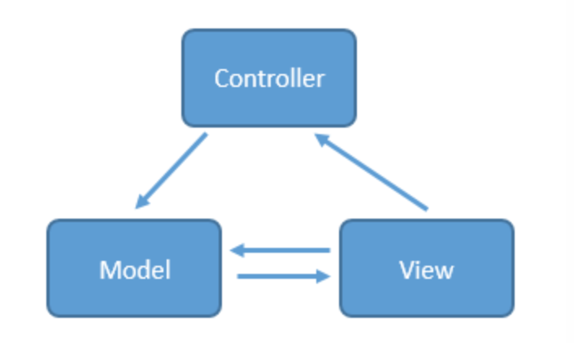
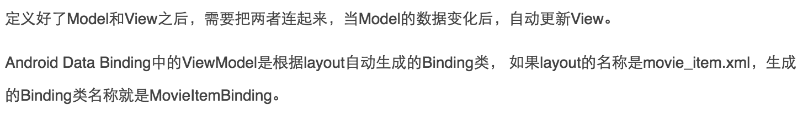

# 选择恐惧症的福音！教你认清MVC，MVP和MVVM

来源:[zjutkz.net](http://zjutkz.net/2016/04/13/%E9%80%89%E6%8B%A9%E6%81%90%E6%83%A7%E7%97%87%E7%9A%84%E7%A6%8F%E9%9F%B3%EF%BC%81%E6%95%99%E4%BD%A0%E8%AE%A4%E6%B8%85MVC%EF%BC%8CMVP%E5%92%8CMVVM/?hmsr=toutiao.io&utm_medium=toutiao.io&utm_source=toutiao.io)

相信大家对MVC，MVP和MVVM都不陌生，作为三个最耳熟能详的Android框架，它们的应用可以是非常广泛的，但是对于一些新手来说，可能对于区分它们三个都有困难，更别说在实际的项目中应用了，有些时候想用MVP的，代码写着写着就变成了MVC，久而久之就对它们三个的选择产生了恐惧感，如果你也是这样的人群，那么这篇文章可能会对你有很大的帮助，希望大家看完都会有收获吧！

文章重点：

(1)了解并区分MVC，MVP，MVVM。

(2)知道这三种模式在Android中如何使用。

(3)走出data binding的误区。

(4)了解MVP+data binding的开发模式。

本篇文章的demo我将会上传到[我的github](https://github.com/zjutkz)上。

## 水之积也不厚,则其负大舟也无力

正如庄子在逍遥游中说的，如果水不够深，那就没有能够担负大船的力量 。所以在真正开始涉及具体的代码之前，我们要先对MVC，MVP和MVVM做一个初步的了解。如果各位同学对此已经有所了解了，可以选择性跳过这一节。

## MVC

MVC，Model View Controller，是软件架构中最常见的一种框架，简单来说就是通过controller的控制去操作model层的数据，并且返回给view层展示，具体见下图



当用户出发事件的时候，view层会发送指令到controller层，接着controller去通知model层更新数据，model层更新完数据以后直接显示在view层上，这就是MVC的工作原理。

那具体到Android上是怎么样一个情况呢？

大家都知道一个Android工程有什么对吧，有java的class文件，有res文件夹，里面是各种资源，还有类似manifest文件等等。对于原生的Android项目来说，layout.xml里面的xml文件就对应于MVC的view层，里面都是一些view的布局代码，而各种java bean，还有一些类似repository类就对应于model层，至于controller层嘛，当然就是各种activity咯。大家可以试着套用我上面说的MVC的工作原理是理解。比如你的界面有一个按钮，按下这个按钮去网络上下载一个文件，这个按钮是view层的，是使用xml来写的，而那些和网络连接相关的代码写在其他类里，比如你可以写一个专门的networkHelper类，这个就是model层，那怎么连接这两层呢？是通过button.setOnClickListener()这个函数，这个函数就写在了activity中，对应于controller层。是不是很清晰。

大家想过这样会有什么问题吗？显然是有的，不然为什么会有MVP和MVVM的诞生呢，是吧。问题就在于xml作为view层，控制能力实在太弱了，你想去动态的改变一个页面的背景，或者动态的隐藏/显示一个按钮，这些都没办法在xml中做，只能把代码写在activity中，造成了activity既是controller层，又是view层的这样一个窘境。大家回想一下自己写的代码，如果是一个逻辑很复杂的页面，activity或者fragment是不是动辄上千行呢？这样不仅写起来麻烦，维护起来更是噩梦。（当然看过Android源码的同学其实会发现上千行的代码不算啥，一个RecyclerView.class的代码都快上万行了呢。。）

MVC还有一个重要的缺陷，大家看上面那幅图，view层和model层是相互可知的，这意味着两层之间存在耦合，耦合对于一个大型程序来说是非常致命的，因为这表示开发，测试，维护都需要花大量的精力。

正因为MVC有这样那样的缺点，所以才演化出了MVP和MVVM这两种框架。

## MVP

MVP作为MVC的演化，解决了MVC不少的缺点，对于Android来说，MVP的model层相对于MVC是一样的，而activity和fragment不再是controller层，而是纯粹的view层，所有关于用户事件的转发全部交由presenter层处理。下面还是让我们看图


从图中就可以看出，最明显的差别就是view层和model层不再相互可知，完全的解耦，取而代之的presenter层充当了桥梁的作用，用于操作view层发出的事件传递到presenter层中，presenter层去操作model层，并且将数据返回给view层，整个过程中view层和model层完全没有联系。看到这里大家可能会问，虽然view层和model层解耦了，但是view层和presenter层不是耦合在一起了吗？其实不是的，对于view层和presenter层的通信，我们是可以通过接口实现的，具体的意思就是说我们的activity，fragment可以去实现实现定义好的接口，而在对应的presenter中通过接口调用方法。不仅如此，我们还可以编写测试用的View，模拟用户的各种操作，从而实现对Presenter的测试。这就解决了MVC模式中测试，维护难的问题。

当然，其实最好的方式是使用fragment作为view层，而activity则是用于创建view层(fragment)和presenter层(presenter)的一个控制器。

## MVVM

MVVM最早是由微软提出的


这里要感谢[泡在网上的日子](http://www.jcodecraeer.com/plus/list.php?tid=16)，因为前面看到的三张图我都是从它的博客中摘取的，如果有人知道不允许这样做的话请告诉我，我会从我的博客中删除的，谢谢。

从图中看出，它和MVP的区别貌似不大，只不过是presenter层换成了viewmodel层，还有一点就是view层和viewmodel层是相互绑定的关系，这意味着当你更新viewmodel层的数据的时候，view层会相应的变动ui。

我们很难去说MVP和MVVM这两个MVC的变种孰优孰劣，还是要具体情况具体分析。

## 纸上得来终觉浅，绝知此事要躬行

对于程序员来说，空谈是最没效率的一种方式，相信大家看了我上面对于三种模式的分析，或多或少都会有点云里雾里，下面让我们结合代码来看看。

让我们试想一下下面这个情景，用户点击一个按钮A，获取github上对应公司对应仓库中贡献排行第一的任的名字，然后我们还会有一个按钮B，用户点击按钮B，界面上排行第一的那个人的名字就会换成自己的。

### MVC

MVC实现是最简单的。

首先看对应view层的xml文件

```
<?xml version="1.0" encoding="utf-8"?>

<LinearLayout xmlns:android="http://schemas.android.com/apk/res/android"
    xmlns:tools="http://schemas.android.com/tools"

    android:layout_width="match_parent"

    android:layout_height="match_parent"

    android:id="@+id/container"

    android:orientation="vertical"

    tools:context=".ui.view.MainActivity"

    android:fitsSystemWindows="true">


    <Button
        android:text="get"

        android:layout_width="match_parent"

        android:layout_height="wrap_content"

        android:onClick="get"/>

    <Button
        android:text="change"

        android:layout_width="match_parent"

        android:layout_height="wrap_content"

        android:onClick="change"/>

    <TextView
        android:id="@+id/top_contributor"

        android:layout_width="match_parent"

        android:layout_height="match_parent"

        android:gravity="center"

        android:textSize="30sp"/>

</LinearLayout>
```

很简单，两个Button一个TextView

接着看对应controller层的activity

```
public class MainActivity extends AppCompatActivity {


    private ProcessDialog dialog;

    private Contributor contributor = new Contributor();
    
    private TextView topContributor;
    
    private Subscriber<Contributor> contributorSub = new Subscriber<Contributor>() {
        
        @Override
        public void onStart() {
            showProgress();
        }
        
        @Override
        public void onCompleted() {
            
        }
        
        @Override
        public void onError(Throwable e) {
            
        }
        
        @Override
        public void onNext(Contributor contributor) {
            MainActivity.this.contributor = contributor;
            topContributor.setText(contributor.login);
            dismissProgress();
        }
    };


    @Override
    protected void onCreate(Bundle savedInstanceState) {

        super.onCreate(savedInstanceState);

        setContentView(R.layout.activity_main);

        topContributor = (TextView) findViewById(R.id.top_contributor);
    }


    public void get(View view) {
        getTopContributor("square", "retrofit");
    }
    
    public void change(View view) {
        contributor.login = "zjutkz";
        topContributor.setText(contributor.login);
    }
    
    public void getTopContributor(String owner, String repo) {

        GitHubApi.getContributors(owner, repo)
                .take(1)
                .observeOn(AndroidSchedulers.mainThread())
                .subscribeOn(Schedulers.newThread())
                .map(new Func1<List<Contributor>, Contributor>() {
                    
                    @Override

                    public Contributor call(List<Contributor> contributors) {
                        return contributors.get(0);
                    }
                })
                .subscribe(contributorSub);
    }
    
    public void showProgress() {
        if (dialog == null) {
            dialog = new ProcessDialog(this);
        }
        dialog.showMessage("正在加载...");
    }
    
    public void dismissProgress() {
        if (dialog == null) {
            dialog = new ProcessDialog(this);
        }
        dialog.dismiss();

    }

}
```

我们看一下get()方法中调用的getTopContributor方法

```
public void getTopContributor(String owner,String repo){
    GitHubApi.getContributors(owner, repo)
            .take(1)
            .observeOn(AndroidSchedulers.mainThread())
            .subscribeOn(Schedulers.newThread())
            .map(new Func1<List<Contributor>, Contributor>() {

                @Override
                public Contributor call(List<Contributor> contributors) {
                    return contributors.get(0);
                }
            })
            .subscribe(contributorSub);
}
```

熟悉rxjava和retrofit的同学应该都明白这是啥意思，如果对这两个开源库不熟悉也没事，可以参考[给 Android 开发者的 RxJava 详解](http://gank.io/post/560e15be2dca930e00da1083)和[用 Retrofit 2 简化 HTTP 请求](https://realm.io/cn/news/droidcon-jake-wharton-simple-http-retrofit-2/)这两篇文章。

对于这里大家只要知道这段代码的意思就是去获取github上owner公司中的repo仓库里贡献排名第一的那个人。贡献者是通过Contributor这个java bean存储的。

```
public class Contributor {

    public String login;
    public int contributions;

    @Override
    public String toString() {
        return login + ", " + contributions;
    }
}
```

很简单，login表示贡献者的名字，contributor表示贡献的次数。

然后通过rxjava的subscriber中的onNext()函数得到这个数据。

```
private Subscriber<Contributor> contributorSub = new Subscriber<Contributor>() {

    @Override
    public void onStart() {
        showProgress();
    }

    @Override
    public void onCompleted() {

    }

    @Override
    public void onError(Throwable e) {

    }

    @Override
    public void onNext(Contributor contributor) {
        MainActivity.this.contributor = contributor;

        topContributor.setText(contributor.login);

        dismissProgress();
    }
};
```

至于另外那个change按钮的工作大家应该都看得懂，这里不重复了。

好了，我们来回顾一遍整个流程。

首先在xml中写好布局代码。

其次，activity作为一个controller，里面的逻辑是监听用户点击按钮并作出相应的操作。比如针对get按钮，做的工作就是调用GithubApi的方法去获取数据。

GithubApi，Contributor等类则表示MVC中的model层，里面是数据和一些具体的逻辑操作。

说完了流程再来看看问题，还记得我们前面说的吗，MVC在Android上的应用，一个具体的问题就是activity的责任过重，既是controller又是view。这里是怎么体现的呢？看了代码大家发现其中有一个progressDialog，在加载数据的时候显示，加载完了以后取消，逻辑其实是view层的逻辑，但是这个我们没办法写到xml里面啊，包括TextView.setTextView()，这个也一样。我们只能把这些逻辑写到activity中，这就造成了activity的臃肿，这个例子可能还好，如果是一个复杂的页面呢？大家自己想象一下。

## MVP

通过具体的代码大家知道了MVC在Android上是如何工作的，也知道了它的缺点，那MVP是如何修正的呢？

这里先向大家推荐github上的一个第三方库，通过这个库大家可以很轻松的实现MVP。好了，还是看代码吧。

首先还是xml

```
<?xml version="1.0" encoding="utf-8"?>
<LinearLayout xmlns:android="http://schemas.android.com/apk/res/android"
    xmlns:tools="http://schemas.android.com/tools"
    android:layout_width="match_parent"
    android:layout_height="match_parent"
    android:id="@+id/container"
    android:orientation="vertical"
    tools:context=".ui.view.MainActivity"
    android:fitsSystemWindows="true">

    <Button
        android:text="get"
        android:layout_width="match_parent"
        android:layout_height="wrap_content"
        android:onClick="get"/>

    <Button
        android:text="change"
        android:layout_width="match_parent"
        android:layout_height="wrap_content"
        android:onClick="change"/>

    <TextView
        android:id="@+id/top_contributor"
        android:layout_width="match_parent"
        android:layout_height="match_parent"
        android:gravity="center"
        android:textSize="30sp"/>

</LinearLayout>
```

这个和MVC是一样的，毕竟界面的形式是一样的嘛。

接下去，我们看一个接口。

```
public interface ContributorView extends MvpView {

    void onLoadContributorStart();

    void onLoadContributorComplete(Contributor topContributor);

    void onChangeContributorName(String name);
}
```

这个接口起什么作用呢？还记得我之前说的吗？MVP模式中，view层和presenter层靠的就是接口进行连接，而具体的就是上面的这个了，里面定义的三个方法，第一个是开始获取数据，第二个是获取数据成功，第三个是改名。我们的view层（activity）只要实现这个接口就可以了。

下面看activity的代码

```
public class MainActivity extends MvpActivity<ContributorView,ContributorPresenter> implements ContributorView {

    private ProcessDialog dialog;

    private TextView topContributor;

    @Override
    protected void onCreate(Bundle savedInstanceState) {
        super.onCreate(savedInstanceState);
        setContentView(R.layout.activity_main);
        topContributor = (TextView)findViewById(R.id.top_contributor);
    }

    @NonNull
    @Override
    public ContributorPresenter createPresenter() {
        return new ContributorPresenter();
    }

    public void get(View view){
        getPresenter().get("square", "retrofit");
    }

    public void change(View view){
        getPresenter().change();
    }

    @Override
    public void onLoadContributorStart() {
        showProgress();
    }

    @Override
    public void onLoadContributorComplete(Contributor contributor) {

        topContributor.setText(contributor.toString());

        dismissProgress();
    }

    @Override
    public void onChangeContributorName(String name) {
        topContributor.setText(name);
    }

    public void showProgress(){
        if(dialog == null){
            dialog = new ProcessDialog(this);
        }

        dialog.showMessage("正在加载...");
    }

    public void dismissProgress(){
        if(dialog == null){
            dialog = new ProcessDialog(this);
        }

        dialog.dismiss();
    }
}
```

它继承自MvpActivity，实现了刚才的ContributorView接口。继承的那个MvpActivity大家这里不用太关心主要是做了一些初始化和生命周期的封装。我们只要关心这个activity作为view层，到底是怎么工作的。

```
public void get(View view){
    getPresenter().get("square", "retrofit");
}

public void change(View view){
    getPresenter().change();
}
```

get()和change()这两个方法是我们点击按钮以后执行的，可以看到，里面完完全全没有任何和model层逻辑相关的东西，只是简单的委托给了presenter，那我们再看看presenter层做了什么

```
public class ContributorPresenter extends MvpBasePresenter<ContributorView> {

    private Subscriber<Contributor> contributorSub = new Subscriber<Contributor>() {

        @Override
        public void onStart() {
            ContributorView view = getView();
            if(view != null){
                view.onLoadContributorStart();
            }
        }

        @Override
        public void onCompleted() {

        }

        @Override
        public void onError(Throwable e) {

        }

        @Override
        public void onNext(Contributor topContributor) {
            ContributorView view = getView();
            if(view != null){
                view.onLoadContributorComplete(topContributor);
            }
        }
    };

    public void get(String owner,String repo){
        GitHubApi.getContributors(owner, repo)
                .take(1)
                .observeOn(AndroidSchedulers.mainThread())
                .subscribeOn(Schedulers.newThread())
                .map(new Func1<List<Contributor>, Contributor>() {

                    @Override
                    public Contributor call(List<Contributor> contributors) {
                        return contributors.get(0);
                    }
                })
                .subscribe(contributorSub);
    }

    public void change(){
        ContributorView view = getView();
        if(view != null){
            view.onChangeContributorName("zjutkz");
        }
    }
}
```

其实就是把刚才MVC中activity的那部分和model层相关的逻辑抽取了出来，并且在相应的时机调用ContributorView接口对应的方法，而我们的activity是实现了这个接口的，自然会走到对应的方法中。

好了，我们来捋一捋。

首先，和MVC最大的不同，MVP把activity作为了view层，通过代码也可以看到，整个activity没有任何和model层相关的逻辑代码，取而代之的是把代码放到了presenter层中，presenter获取了model层的数据之后，通过接口的形式将view层需要的数据返回给它就OK了。

这样的好处是什么呢？首先，activity的代码逻辑减少了，其次，view层和model层完全解耦，具体来说，如果你需要测试一个http请求是否顺利，你不需要写一个activity，只需要写一个java类，实现对应的接口，presenter获取了数据自然会调用相应的方法，相应的，你也可以自己在presenter中mock数据，分发给view层，用来测试布局是否正确。


## MVVM

首先在看这段内容之前，你需要保证你对data binding框架有基础的了解。不了解的同学可以去看下[这篇文章](http://www.jcodecraeer.com/a/anzhuokaifa/androidkaifa/2015/0603/2992.html)。在接下去让我们开始探索MVVM，MVVM最近在Android上可谓十分之火，最主要的原因就是谷歌推出了data binding这个框架，可以轻松的实现MVVM。但是，我在网上查阅关于Android的data binding资料的时候，发现国内有很多人都误解了，首先，我们从一篇[错误的文章](http://www.thinksaas.cn/group/topic/379469/)开始。当然我在这里引用这篇文章也是对事不对人，如果对文章的作者产生了不好的影响我这里说一声抱歉。

上面那篇文章是一个关于data binding的使用，看起来很美好，但是，其中有一个错误可以说是非常，非常，非常严重的。



它竟然说data binding的viewmodel层是binding类，其实不止是这篇文章，其他有一些开发者写的关于data binding的文章里都犯了一样的错误。大家如果也有这样的概念，请务必纠正过来！！

说完了错误的概念，那data binding中真正的viewmodel是什么呢？我们还是以之前MVC，MVP的那个例子做引导。

首先是view层，这没啥好说的，和MVP一样，只不过多了数据绑定。view层就是xml和activity。

```
<layout xmlns:android="http://schemas.android.com/apk/res/android">
    <data>
        <variable name="contributor" type="zjutkz.com.mvvm.viewmodel.Contributor"/>
    </data>
    <LinearLayout
        android:layout_width="match_parent"
        android:layout_height="match_parent"
        android:id="@+id/container"
        android:orientation="vertical"
        android:fitsSystemWindows="true">

        <Button
            android:id="@+id/get"
            android:text="get"
            android:layout_width="match_parent"
            android:layout_height="wrap_content"
            android:onClick="get"/>

        <Button
            android:id="@+id/change"
            android:text="change"
            android:layout_width="match_parent"
            android:layout_height="wrap_content"
            android:onClick="change"/>
        
        <TextView
            android:id="@+id/top_contributor"
            android:layout_width="match_parent"
            android:layout_height="match_parent"
            android:gravity="center"
            android:textSize="30sp"
            android:text="@{contributor.login}"/>
    </LinearLayout>

</layout>
```

```
public class MainActivity extends AppCompatActivity {

    private Subscriber<Contributor> contributorSub = new Subscriber<Contributor>() {

        @Override
        public void onStart() {
            showProgress();
        }

        @Override
        public void onCompleted() {

        }

        @Override
        public void onError(Throwable e) {

        }

        @Override
        public void onNext(Contributor contributor) {
            binding.setContributor(contributor);

            dismissProgress();
        }
    };

    private ProcessDialog dialog;

    private MvvmActivityMainBinding binding;

    @Override
    protected void onCreate(Bundle savedInstanceState) {
        super.onCreate(savedInstanceState);
        binding = DataBindingUtil.setContentView(this, R.layout.mvvm_activity_main);
    }

    public void get(View view){
        getContributors("square", "retrofit");
    }

    public void change(View view){
        if(binding.getContributor() != null){
            binding.getContributor().setLogin("zjutkz");
        }
    }

    public void showProgress(){
        if(dialog == null){
            dialog = new ProcessDialog(this);
        }

        dialog.showMessage("正在加载...");
    }

    public void dismissProgress(){
        if(dialog == null){
            dialog = new ProcessDialog(this);
        }

        dialog.dismiss();
    }

    public void getContributors(String owner,String repo){
        GitHubApi.getContributors(owner, repo)
                .take(1)
                .observeOn(AndroidSchedulers.mainThread())
                .subscribeOn(Schedulers.newThread())
                .map(new Func1<List<Contributor>, Contributor>() {

                    @Override
                    public Contributor call(List<Contributor> contributors) {
                        return contributors.get(0);
                    }
                })
                .subscribe(contributorSub);
    }
}
```

如果你对data binding框架是有了解的，上面的代码你能轻松的看懂。

那model层又是什么呢？当然就是那些和数据相关的类，GithubApi等等。

重点来了，viewmodel层呢？好吧，viewmodel层就是是Contributor类！大家不要惊讶，我慢慢的来说。

```
public class Contributor extends BaseObservable{

    private String login;
    private int contributions;

    @Bindable
    public String getLogin(){
        return login;
    }

    @Bindable
    public int getContributions(){
        return contributions;
    }

    public void setLogin(String login){
        this.login = login;
        notifyPropertyChanged(BR.login);
    }

    public void setContributions(int contributions){
        this.contributions = contributions;
        notifyPropertyChanged(BR.contributions);
    }

    @Override
    public String toString() {
        return login + ", " + contributions;
    }
}
```

我们可以看到，Contributor和MVP相比，继承自了BaseObservable，有基础的同学都知道这是为了当Contributor内部的variable改变的时候ui可以同步的作出响应。

我为什么说Contributor是一个viewmodel呢。大家还记得viewmodel的概念吗？view和viewmodel相互绑定在一起，viewmodel的改变会同步到view层，从而view层作出响应。这不就是Contributor和xml中那些组件元素的关系吗？所以，大家不要被binding类迷惑了，data binding框架中的viewmodel是自己定义的那些看似是model类的东西！比如这里的Contributor！

话说到这里，那binding类又是什么呢？其实具体对应到之前MVVM的那张图就很好理解了，我们想一下，binding类的工作是什么？

```
binding = DataBindingUtil.setContentView(this, R.layout.mvvm_activity_main);

binding.setContributor(contributor);
```

首先，binding要通过DataBindingUtil.setContentView()方法将xml，也就是view层设定。

接着，通过setXXX()方法将viewmodel层注入进去。

由于这两个工作，view层(xml的各个组件)和viewmodel层(contributor)绑定在了一起。

好了，大家知道了吗，binding类，其实就是上图中view和viewmodel中间的那根线啊！！

## 真理在荒谬被证实以前，都只是暗室里的装饰

前面讨论了MVC，MVP和MVVM具体的实现方案，大家肯定都了解了它们三者的关系和使用方式。但是，这里我想说，不要把一个框架看作万能的，其实MVP和MVVM都是有自己的缺陷的！下面我一一来说。

### MVP

MVP的问题在于，由于我们使用了接口的方式去连接view层和presenter层，这样就导致了一个问题，如果你有一个逻辑很复杂的页面，你的接口会有很多，十几二十个都不足为奇。想象一个app中有很多个这样复杂的页面，维护接口的成本就会非常的大。

这个问题的解决方案就是你得根据自己的业务逻辑去斟酌着写接口。你可以定义一些基类接口，把一些公共的逻辑，比如网络请求成功失败，toast等等放在里面，之后你再定义新的接口的时候可以继承自那些基类，这样会好不少。

### MVVM

MVVM的问题呢，其实和MVC有一点像。data binding框架解决了数据绑定的问题，但是view层还是会过重，大家可以看我上面那个MVVM模式下的activity

```
public class MainActivity extends AppCompatActivity {

    private Subscriber<Contributor> contributorSub = new Subscriber<Contributor>() {

        @Override
        public void onStart() {
            showProgress();
        }

        @Override
        public void onCompleted() {

        }

        @Override
        public void onError(Throwable e) {

        }

        @Override
        public void onNext(Contributor contributor) {
            binding.setContributor(contributor);

            dismissProgress();
        }
    };

    private ProcessDialog dialog;

    private MvvmActivityMainBinding binding;

    @Override
    protected void onCreate(Bundle savedInstanceState) {
        super.onCreate(savedInstanceState);
        binding = DataBindingUtil.setContentView(this, R.layout.mvvm_activity_main);
    }

    public void get(View view){
        getContributors("square", "retrofit");
    }

    public void change(View view){
        if(binding.getContributor() != null){
            binding.getContributor().setLogin("zjutkz");
        }
    }

    public void showProgress(){
        if(dialog == null){
            dialog = new ProcessDialog(this);
        }

        dialog.showMessage("正在加载...");
    }

    public void dismissProgress(){
        if(dialog == null){
            dialog = new ProcessDialog(this);
        }

        dialog.dismiss();
    }

    public void getContributors(String owner,String repo){
        GitHubApi.getContributors(owner, repo)
                .take(1)
                .observeOn(AndroidSchedulers.mainThread())
                .subscribeOn(Schedulers.newThread())
                .map(new Func1<List<Contributor>, Contributor>() {

                    @Override
                    public Contributor call(List<Contributor> contributors) {
                        return contributors.get(0);
                    }
                })
                .subscribe(contributorSub);
    }
}
```

大家有没有发现，activity在MVVM中应该是view层的，但是里面却和MVC一样写了对model的处理。有人会说你可以把对model的处理放到viewmodel层中，这样不是更符合MVVM的设计理念吗？这样确实可以，但是progressDialog的show和dismiss呢？你怎么在viewmodel层中控制？这是view层的东西啊，而且在xml中也没有，我相信会有解决的方案，但是我们有没有一种更加便捷的方式呢？

## 路漫漫其修远兮，吾将上下而求索

其实，真正的最佳实践都是人想出来的，我们为何不结合一下MVP和MVVM的特点呢？其实谷歌已经做了这样的事，大家可以看下这个。没错，就是MVP+data binding，我们可以使用presenter去做和model层的通信，并且使用data binding去轻松的bind data。还是让我们看代码吧。

首先还是view层。

```
<layout xmlns:android="http://schemas.android.com/apk/res/android">
    <data>
        <variable name="contributor" type="zjutkz.com.mvpdatabinding.viewmodel.Contributor"/>
    </data>
    <LinearLayout
        android:layout_width="match_parent"
        android:layout_height="match_parent"
        android:id="@+id/container"
        android:orientation="vertical"
        android:fitsSystemWindows="true">

        <Button
            android:id="@+id/get"
            android:text="get"
            android:layout_width="match_parent"
            android:layout_height="wrap_content"
            android:onClick="get"/>

        <Button
            android:id="@+id/change"
            android:text="change"
            android:layout_width="match_parent"
            android:layout_height="wrap_content"
            android:onClick="change"/>

        <TextView
            android:id="@+id/top_contributor"
            android:layout_width="match_parent"
            android:layout_height="match_parent"
            android:gravity="center"
            android:textSize="30sp"
            android:text="@{contributor.login}"/>
    </LinearLayout>

</layout>
```

```
public class MainActivity extends MvpActivity<ContributorView,ContributorPresenter> implements ContributorView {

    private ProcessDialog dialog;

    private ActivityMainBinding binding;

    @Override
    protected void onCreate(Bundle savedInstanceState) {
        super.onCreate(savedInstanceState);
        binding = DataBindingUtil.setContentView(this, R.layout.activity_main);
    }

    @NonNull
    @Override
    public ContributorPresenter createPresenter() {
        return new ContributorPresenter();
    }

    public void get(View view){
        getPresenter().get("square", "retrofit");
    }

    public void change(View view){
        if(binding.getContributor() != null){
            binding.getContributor().setLogin("zjutkz");
        }
    }

    @Override
    public void onLoadContributorStart() {
        showProgress();
    }

    @Override
    public void onLoadContributorComplete(Contributor contributor) {
        binding.setContributor(contributor);
        dismissProgress();
    }

    public void showProgress(){
        if(dialog == null){
            dialog = new ProcessDialog(this);
        }

        dialog.showMessage("正在加载...");
    }

    public void dismissProgress(){
        if(dialog == null){
            dialog = new ProcessDialog(this);
        }

        dialog.dismiss();
    }
}
```

然后是presenter层

```
public class ContributorPresenter extends MvpBasePresenter<ContributorView> {

    private Subscriber<Contributor> contributorSub = new Subscriber<Contributor>() {

        @Override
        public void onStart() {
            ContributorView view = getView();
            if(view != null){
                view.onLoadContributorStart();
            }
        }

        @Override
        public void onCompleted() {

        }

        @Override
        public void onError(Throwable e) {

        }

        @Override
        public void onNext(Contributor topContributor) {
            ContributorView view = getView();
            if(view != null){
                view.onLoadContributorComplete(topContributor);
            }
        }
    };

    public void get(String owner,String repo){
        GitHubApi.getContributors(owner, repo)
                .take(1)
                .observeOn(AndroidSchedulers.mainThread())
                .subscribeOn(Schedulers.newThread())
                .map(new Func1<List<Contributor>, Contributor>() {

                    @Override
                    public Contributor call(List<Contributor> contributors) {
                        return contributors.get(0);
                    }
                })
                .subscribe(contributorSub);
    }
}
```

model层就是GithubApi等等。

我们使用了data binding框架去节省了类似findViewById和数据绑定的时间，又使用了presenter去将业务逻辑和view层分离。

当然这也不是固定的，你大可以在viewmodel中实现相应的接口，presenter层的数据直接发送到viewmodel中，在viewmodel里更新，因为view和viewmodel是绑定的，这样view也会相应的作出反应。

说到这里，我还是想重复刚才的那句话，最佳实践都是人想出来的，用这些框架根本的原因也是为了尽量低的耦合性和尽量高的可复用性。

## 下期预告

还是想好下期写点啥，如果我能想到的话，see you next week.
