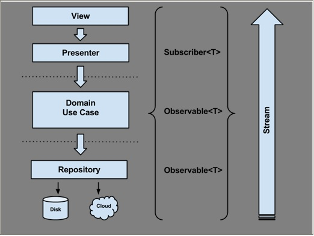

# 解析Android架构设计原则

来源：[伯乐在线](http://android.jobbole.com/81425/)

> 原文出处：[Fernando Cejas](http://fernandocejas.com/2015/07/18/architecting-android-the-evolution/)   译文出处：[张挥戈](http://www.csdn.net/article/1970-01-01/2825506) 

嘿！经过一段时间收集了大量反馈意见后，我认为应该来说说这个话题了。我会在这里给出我认为构建现代移动应用（Android）的好方法，这会是另一番体味。

开始之前，假设你已经阅读过我之前撰写的文章[“Architecting Android…The clean way?”](http://fernandocejas.com/2014/09/03/architecting-android-the-clean-way/)。如果还没有阅读过，为了更好地理解这篇文章，应借此机会读一读：


## 架构演变

演变意味着一个循序渐进的过程，由某些状态改变到另一种不同的状态，且新状态通常更好或更复杂。

照这么一说，软件是随着时间发展和改变的，是架构上的发展和改变。实际上，好的软件设计必须能够帮助我们发展和扩充解决方案，保持其健壮性，而不必每件事都重写代码（虽然在某些情况下重写的方法更好，但是那是另一篇文章的话题，所以相信我，让我们聚焦在前面所讨论的话题上）。

在这篇文章中，我将讲解我认为是必需的和重要的要点，为了保持基本代码条理清晰，要记住下面这张图片，我们开始吧！


## 响应式方法：RxJava

因为已经有[很多这方面的文章](http://blog.danlew.net/2014/09/15/grokking-rxjava-part-1/)，还有这方面[做得很好、令人景仰的人](https://speakerdeck.com/benjchristensen)，所以我不打算在这里讨论RxJava的好处（[我假设您已经对它有所体验了](https://github.com/ReactiveX/RxJava/wiki/)）。但是，我将指出在Android应用程序开发方面的有趣之处，以及如何帮助我形成第一个清晰的架构的方法。

首先，我选择了一种响应式的模式通过转换usecase（在这个清晰的架构命名规则中，其被称为interactor）返回Observables<T>，表示所有底层都遵循这一链条，也返回Observables<T> 。

```
public abstract class UseCase {

  private final ThreadExecutor threadExecutor;
  private final PostExecutionThread postExecutionThread;

  private Subscription subscription = Subscriptions.empty();

  protected UseCase(ThreadExecutor threadExecutor,
      PostExecutionThread postExecutionThread) {
    this.threadExecutor = threadExecutor;
    this.postExecutionThread = postExecutionThread;
  }

  protected abstract Observable buildUseCaseObservable();

  public void execute(Subscriber UseCaseSubscriber) {
    this.subscription = this.buildUseCaseObservable()
        .subscribeOn(Schedulers.from(threadExecutor))
        .observeOn(postExecutionThread.getScheduler())
        .subscribe(UseCaseSubscriber);
  }

  public void unsubscribe() {
    if (!subscription.isUnsubscribed()) {
      subscription.unsubscribe();
    }
  }
}
```

正如你所看到的，所有用例继承这个抽象类，并实现抽象方法buildUseCaseObservable()。该方法将建立一个Observables<T>，它承担了繁重的工作，还要返回所需的数据。

需要强调是，在execute()方法中，要确保Observables<T> 是在独立线程执行，因此，要尽可能减轻阻止android主线程的程度。其结果就是会通过android主线程调度程序将主线程压入线程队列的尾部（push back）。

到目前为止，我们的Observables<T>启动并且运行了。但是，正如你所知，必须要观察它所发出的数据序列。要做到这一点，我改进了presenters（MVP模式表现层的一部分），把它变成了观察者（Subscribers），它通过用例对发出的项目做出“react”，以便更新用户界面。

观察者是这样的：

```
private final class UserListSubscriber extends DefaultSubscriber<List<User>> {
 
  @Override public void onCompleted() {
    UserListPresenter.this.hideViewLoading();
  }
 
  @Override public void onError(Throwable e) {
    UserListPresenter.this.hideViewLoading();
    UserListPresenter.this.showErrorMessage(new DefaultErrorBundle((Exception) e));
    UserListPresenter.this.showViewRetry();
  }
 
  @Override public void onNext(List<User> users) {
    UserListPresenter.this.showUsersCollectionInView(users);
  }
}
```

每个观察者都是每个presenter的内部类，并实现了一个Defaultsubscriber<T>接口，创建了基本的默认错误处理。

将所有的片段放在一起后，通过下面的图，你可以获得完整的概念：



让我们列举一些摆脱基于RxJava方法的好处：

在观察者（Subscribers）与被观察者（Observables）之间去耦合：更加易于维护和测试。

* 简化异步任务：如果要求多个异步执行时，如果需要一个以上异步执行的级别，Java的thread和future的操作和同步比较复杂，因此通过使用调度程序，我们可以很方便地（不需要额外工作）在后台与主线程之间跳转，特别是当我们需要更新UI时。还可以避免“回调的坑”—— 它使我们代码可读性差，且难以跟进。
* 数据转换/组成：在不影响客户端情况下，我们能够整合多个Observables，使解决方案更灵活。
* 错误处理：在任何Observables内发生错误时，就向消费者发出信号。

从我的角度看有一点不足，甚至要为此需要付出代价，那些还不熟悉概念的开发人员还是要遵循学习曲线。但你从中得到了极有价值的东西。为了成功而reactive起来吧！

## 依赖注入：Dagger 2

关于依赖注入，因为我[已经写了一篇完整的文章](http://fernandocejas.com/2015/04/11/tasting-dagger-2-on-android/)，我不想说太多。强烈建议你阅读它，这样我们就可以接着说下面的内容了。

值得一提的是，通过实现一个像Dagger 2那样的依赖注入框架我们能够获得：

* 组件重用，因为依赖的对象可以在外部注入和配置。
* 当注入对象作为协作者（collaborators）时，由于对象的实例存在于在一个隔离和解耦地方，这样在我们的代码库中，就不需要做很多的改变，就可以改变任何对象的实现。
* 依赖可以注入到一个组件：这些将这些模拟实现的依赖对象注入成为可能，这使得测试更容易。

## Lambda表达式：Retrolambda

没有人会抱怨在代码中使用Java 8的lambada表达式，甚至在简化并摆脱了很多样板代码以后，使用得更多，如你看到这段代码：

```
private final Action1<UserEntity> saveToCacheAction =
    userEntity -> {
      if (userEntity != null) {
        CloudUserDataStore.this.userCache.put(userEntity);
      }
    };
```

然而，我百感交集，为什么呢？我们曾在[@SoundCloud](https://developers.soundcloud.com/blog/)讨论[Retrolambada](https://github.com/orfjackal/retrolambda)，主要是是否使用它，结果是：

* 1. 赞成的理由：
   * Lambda表达式和方法引用
   * “try-with-resources”语句
   * 使用karma做开发
* 2. 反对的理由：
   * Java 8 API的意外使用
   * 十分令人反感的第三方库
   * 要与Android一起使用的第三方插件Gradle

最后，我们认定它不能为我们解决任何问题：你的代码看起来很好且具有可读性，但这不是我们与之共存的东西，由于现在所有功能最强大的IDE都包含代码折叠式选项，这就涵盖这一需求了，至少是一个可接受的方式。

说实话，尽管我可能会在业余时间的项目中使用它，但在这里使用它的主要原因是尝试和体验Android中Lambda表达式。是否使用它由你自己决定。在这里我只是展示我的视野。当然，对于这样一项了不起的工作，这个库的作者值得称赞。

## 测试方法

在测试方面，与示例的第一个版本相关的部分变化不大：

* 表现层：用Espresso 2和Android Instrumentation测试框架测试UI。
* 领域层：JUnit + Mockito —— 它是Java的标准模块。
* 数据层：将测试组合换成了Robolectric 3 + JUnit + Mockito。这一层的测试曾经存在于单独的Android模块。由于当时（当前示例程序的第一个版本）没有内置单元测试的支持，也没有建立像robolectric那样的框架，该框架比较复杂，需要一群黑客的帮忙才能让其正常工作。

幸运的是，这都是过去的一部分，而现在所有都是即刻可用，这样我可以把它们重新放到数据模块内，专门为其默认的测试路径：src/test/java。

## 包的组织

我认为一个好的架构关键因素之一是代码/包的组织：程序员浏览源代码遇到的第一件事情就是包结构。一切从它流出，一切依赖于它。

我们能够辨别出将应用程序封装进入包（package）的2个路径：

* 按层分包：每一个包（package）中包含的项通常不是彼此密切相关的。这样包的内聚性低、模块化程度低，包之间偶合度高。因此，编辑某个特性要编辑来自不同包的文件。另外，单次操作几乎不可能删除掉某个功能特性。
* 按特性分包：用包来体现特性集。把所有相关某一特性（且仅特性相关）的项放入一个包中。这样包的内聚性高，模块化程度高，包之间偶合度低。紧密相关的项放在一起。它们没有分散到整个应用程序中。
我的建议是去掉按特性分包，会带来的好处有以下主要几点：

模块化程度更高

* 代码导航更容易
* 功能特性的作用域范围最小化了
* 如果与功能特性团队一起工作（就像我们在@SoundCloud的所作所为），也会是非常有趣的事情。代码的所有权会更容易组织，也更容易被模块化。在许多开发人员共用一个代码库的成长型组织当中，这是一种成功。


如你所见，我的方法看起来就像按层分包：这里我可能会犯错（例如，在“users”下组织一切），但在这种情况下我会原谅自己，因为这是个以学习为目的的例子，而且我想显示的是清晰架构方法的主要概念。领会其意，切勿盲目模仿:-)。

## 还需要做的事：组织构建逻辑

我们都知道，房子是从地基上建立起来的。软件开发也是这样，我想说的是，从我的角度来看，构建系统（及其组织）是软件架构的重要部分。

在Android平台上，我们采用Gradle，它事实上是一种与平台无关的构建系统，功能非常强大。这里的想法是通过一些提示和技巧，让你组织构建应用程序时能够得到简化。

* 在单独的gradle构建文件中按功能对内容进行分组


```
def ciServer = 'TRAVIS'
def executingOnCI = "true".equals(System.getenv(ciServer))
 
// Since for CI we always do full clean builds, we don't want to pre-dex
// See http://tools.android.com/tech-docs/new-build-system/tips
subprojects {
  project.plugins.whenPluginAdded { plugin ->
    if ('com.android.build.gradle.AppPlugin'.equals(plugin.class.name) ||
        'com.android.build.gradle.LibraryPlugin'.equals(plugin.class.name)) {
      project.android.dexOptions.preDexLibraries = !executingOnCI
    }
  }
}
```

```
apply from: 'buildsystem/ci.gradle'
apply from: 'buildsystem/dependencies.gradle'
 
buildscript {
  repositories {
    jcenter()
  }
  dependencies {
    classpath 'com.android.tools.build:gradle:1.2.3'
    classpath 'com.neenbedankt.gradle.plugins:android-apt:1.4'
  }
}
 
allprojects {
  ext {
	...
  }
}
...
```

因此，你可以用“apply from: ‘buildsystem/ci.gradle’”插入到任何Gradle建立的文件中进行配置。不要把所有都放置在一个build.gradle文件中，否则就是去创建一个怪物，这是教训。

* 创建依赖关系图

```
...
 
ext {
  //Libraries
  daggerVersion = '2.0'
  butterKnifeVersion = '7.0.1'
  recyclerViewVersion = '21.0.3'
  rxJavaVersion = '1.0.12'
 
  //Testing
  robolectricVersion = '3.0'
  jUnitVersion = '4.12'
  assertJVersion = '1.7.1'
  mockitoVersion = '1.9.5'
  dexmakerVersion = '1.0'
  espressoVersion = '2.0'
  testingSupportLibVersion = '0.1'
 
  ...
 
  domainDependencies = [
      daggerCompiler:     "com.google.dagger:dagger-compiler:${daggerVersion}",
      dagger:             "com.google.dagger:dagger:${daggerVersion}",
      javaxAnnotation:    "org.glassfish:javax.annotation:${javaxAnnotationVersion}",
      rxJava:             "io.reactivex:rxjava:${rxJavaVersion}",
  ]
 
  domainTestDependencies = [
      junit:              "junit:junit:${jUnitVersion}",
      mockito:            "org.mockito:mockito-core:${mockitoVersion}",
  ]
 
  ...
 
  dataTestDependencies = [
      junit:              "junit:junit:${jUnitVersion}",
      assertj:            "org.assertj:assertj-core:${assertJVersion}",
      mockito:            "org.mockito:mockito-core:${mockitoVersion}",
      robolectric:        "org.robolectric:robolectric:${robolectricVersion}",
  ]
}
```

```
apply plugin: 'java'
 
sourceCompatibility = 1.7
targetCompatibility = 1.7
 
...
 
dependencies {
  def domainDependencies = rootProject.ext.domainDependencies
  def domainTestDependencies = rootProject.ext.domainTestDependencies
 
  provided domainDependencies.daggerCompiler
  provided domainDependencies.javaxAnnotation
 
  compile domainDependencies.dagger
  compile domainDependencies.rxJava
 
  testCompile domainTestDependencies.junit
  testCompile domainTestDependencies.mockito
}
```

如果想在项目的不同模块间重用相同的组件版本，这很好；否则就要在不同的模块间使用不同的版本的组件依赖。另外一点，你是在同一个地方控制依赖关系，像组件版本发生冲突这样的事情一眼就能看出来。

## 结语

到目前为止讲了那么多，一句话，要记住没有灵丹妙药。但好的软件架构会帮助代码保持清晰和健壮，还可以保持代码的可扩展性，易于维护。

我想指出一些事情。面对软件存在的问题，要报以本应当解决的态度：

* 遵守SOLID原则
* 不要过度思考（不过度工程化）
* 务实
* 尽可能降低（Android）框架中模块的依赖性

## 源代码

* [Clean architecture github repository – master branch](https://github.com/android10/Android-CleanArchitecture)
* [Clean architecture github repository – releases](https://github.com/android10/Android-CleanArchitecture/releases)

## 延伸阅读

* [Architecting Android..the clean way](http://fernandocejas.com/2014/09/03/architecting-android-the-clean-way/)
* [Tasting Dagger 2 on Android](http://fernandocejas.com/2015/04/11/tasting-dagger-2-on-android/)
* [The Mayans Lost Guide to RxJava on Android](https://speakerdeck.com/android10/the-mayans-lost-guide-to-rxjava-on-android)
* [It is about philosophy: Culture of a good programmer](https://speakerdeck.com/android10/it-is-about-philosophy-culture-of-a-good-programmer)

## 参考资料

* [RxJava wiki by Netflix](https://github.com/ReactiveX/RxJava/wiki)
* [Framework bound by Uncle Bob](https://blog.8thlight.com/uncle-bob/2014/05/11/FrameworkBound.html)
* [Gradle user guide](https://docs.gradle.org/current/userguide/userguide.html)
* [Package by feature, not layer](http://www.javapractices.com/topic/TopicAction.do?Id=205)


