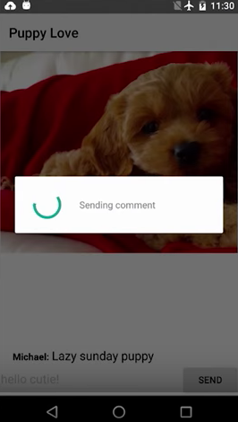
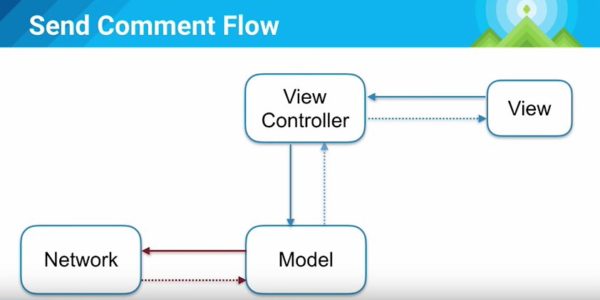
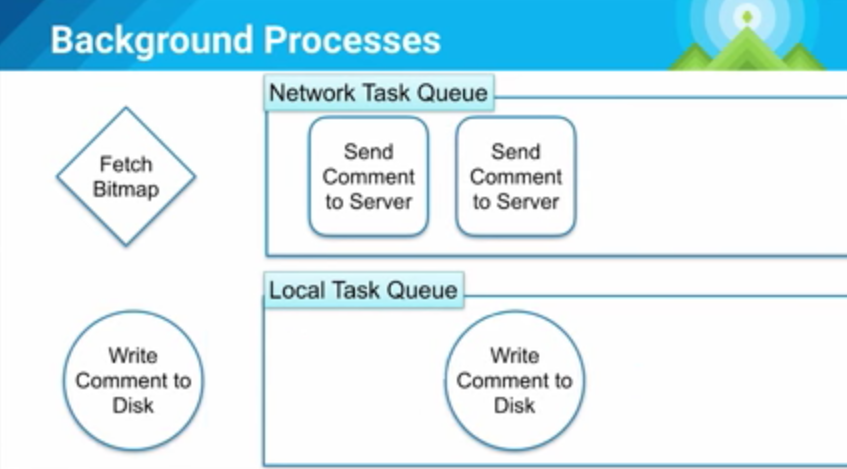
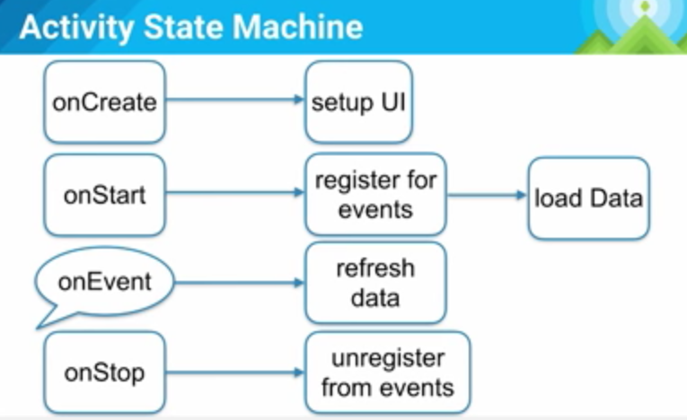

# 笔记 - Android应用架构 (Android Dev Summit 2015)

来源:[markzhai's home](http://blog.zhaiyifan.cn/2016/01/29/android-app-architecture-2015/)

视频见：[https://www.youtube.com/watch?v=BlkJzgjzL0c&feature=em-subs_digest](https://www.youtube.com/watch?v=BlkJzgjzL0c&feature=em-subs_digest)

印度哥们的发音每次都能让我一阵沉醉。

## 尽快行动
* 早期的设计抉择对app的影响很大
* 基本架构会让你思考需要解决的问题变得更容易或困难。

## 哪种模式？
* MVC
* MVP
* Reactive
* Cairngorm
* Flux
* fdsafdsa
* MVVM
* CLEAN

## 这不是一个库的调查
* 很多很棒的libraries展示了思考app的不同方式
* 趋势迅速改变，但一些挑战是永恒的
* 久而久之[“熔岩流”](https://en.wikipedia.org/wiki/Lava_flow_(programming)发生了

Lava Flow 熔岩流：解释一下，大致就是说一些因为种种状况写得不太好的代码，恩，比如产品/PM/某些开发老大等呵呵呵催进度的时候，被加入到实际生产环境，而其实际仍处于开发中的阶段，导致后期需要维护原先未完成状态的设计的兼容性，比如各种API/命名等。而在这种team里面，随着熔岩流的不断发生，人员的进进出出变动，系统内部各种设计的目的丢失，导致之后的工程师不仅不敢清理这些代码，反而只能继续增加它们的复杂性，把系统弄得越来越混乱。

如果你有一定工作经验，相信对这种状况一定不会陌生。:-D

## 为了用户体验（UX）的架构
用户不会关心你系统的架构，他们只在意用户体验。

接着我们看到了一个IM app的例子，用户发送了一个消息，然后就看到菊花转啊转，用户并不知道发生了什么。



## 非持久化的提示
见下图，view发送命令给view controller，然后controller请求网络，并等待网络response再更新view。


这样就会让用户觉得体验很差劲，如果我们试着再增加一个Model层（存储），如下图，当用户点击后，view controller并不会直接发送请求，而是先更改Model层状态，Model会先把更新后的状态回调给View Controller，更新View的UI，然后才去发送网络请求，并等待response，然后再次更新UI（其实这里的Model就是Repository层了，对上面屏蔽了数据来源，UGC/FEED流的app中这种体验很重要）。



这种设计下，我们就很容易可以造一种假feed（比如真实的是黑色，假的是灰色），等到网络response回来了，再变成真feed（黑色）。

这就是*非持久化*的提示。

## 缓存
第二个例子，当我们从详情页退出回到列表页，然后再次点击列表项进入刚才的详情页，数据竟然不见了。2秒前我还在这里，为什么当我再次回来的时候数据就没了呢。

因为数据不是持久化的！它只是一个短暂的存储，数据来源是网络。


于是我们就得到了上图这样的设计，这样一来我们一进页面就能看到数据，因为数据来自本地，Application Logic会在收到View Controller请求的时候同时请求Persistent Model和Network。

## 非持久化提示队列
再来个神奇的场景，见下图，当用户输入一条信息后，UI展示了假数据，但当他继续输入后，却没有更新新的假数据到界面，这其中发生了什么呢？


因为我们的架构是基于命令的！见下面的后台处理示意图：


当我们处理请求的时候，我们同时只能做2件事（想象一个一个max为2的线程池），当我们在一个线程抓取bitmap，另一个线程发送数据到服务器的时候，我们无法处理第三个命令（比如从磁盘读取评论）。这是一种很糟糕的情况，调度的优先级有问题，但设计者很难料到这种情况的发生，因为并不知道每一个命令要花多久，你并不能总是估算出来。

但我们可以分开这些东西。



见上图，我们把队列分为网络和本地队列，这样就不会出现刚才的情形了。就算网络出了问题，用户还是能看到本地的假反馈。

## Activity状态机



## 小结
为了离线设计（为了更好的UX不能责怪网络）

* UI是基于model的
* App Logic负责同步model和服务器
* 这两者不互相依赖（在必要的时候使用events和callbacks通知状态改变）

## Application Logic - 应用逻辑
解耦

* 如果有用的话，使用依赖注入（use it if it helps)
* 了解副作用（这不是那么容易的事，尤其是当你在只在自己桌上测试的时候，当你坐在那儿的时候一切都是在最佳状态）
* 为了更好的性能，避免反射（笔者看过一些项目在命令中心大肆使用反射，这真的很让我无语）

很多依赖注入框架有一个很重的运行期组件或者编译期组件。

比如Dagger2在编译期做这些事，从而达到更好的性能。所以要仔细看看这些库，权衡它们的优劣。

## 网络
API设计

* 为了你的用户设计后台（想到了一些后台API为了自己内部的解耦让app一个页面请求十几个接口）
* 在服务器尽量处理更多
* 传递metadata给客户端

比如有一张很大很大的图片：

```
{
  "user":{
    "name": "MarkZhai",
    "photoUrl": "https://blog.zhaiyifan.cn/..."
  }
}
```

如果只是传这些数据给客户端，那就意味着客户端需要自己处理很多逻辑，比如图片宽/高，processor等等：

```
{
  "user":{
    "name": "MarkZhai",
    "photoUrl": {
      "width" : 300,
      "height" : 500,
      "url" : "https://blog.zhaiyifan.cn/...",
      "palette" : {}
    }
  }
}
```

这样就灵活很多。

电池和数据

* 尽量做批量请求
* 如果有用的话，使用JobScheduler

批量请求会更省电。不想让你的app臭名昭著吧。

## Act locally, sync globally!
为了更好的用户体验。全局只做同步，更多的用户回馈性操作在本地进行。

## Activities 和 Fragments
（又想到了知乎3.0是怎么回事）

* Q: 我应该使用哪一个？
* A: Fragments是activity的封装部件

So…Fragment的英译是碎片，所以更多的不要为了Fragment而Fragment，当Activity太大，承载太多不同UI的时候，再去尝试拆分为独立的一个个Fragment。笔者在这里想到了*单一职责原则*。

## Fragments 和 Views
Q: 我应该使用哪一个？

* Views只是螺母和螺钉，即最基本的组成部分
* 而Activities和Fragments是有生命周期的结构
* 使用两者，保持职责清晰

## 内存
* 避免在代码热路径上分配对象（如：可以在外面申明的对象去放到循环里重复申明）
* 对象池 和 复用

一切都是为了减少GC。

来看一个例子

`Rect getBounds()` vs. `void getBounds(Rect in)`

显然第一个设计更干净更符合语言习惯，但它会额外创建一个Rect；而第二个方法则会从外面带Rect进来，从而不会做额外的内存分配。

难道我们都得用第二个么？不。我们只需要在一些很热的路径上去考虑这些问题，比如那些会运行很多很多次的布局，比如每秒需要进行60次的绘制。而像是你的那些事件处理，像是点击等，你真的不需要去为此而那样在内部扭曲系统。

## 性能
* 如果丑陋的代码可以帮助你的用户，没问题
* 用户不会去看你的代码，只会看你的UI，如果你的UI很难看，那才是真正影响他们体验的。
而且编译后的代码不管怎么都会很难看（笑
* 大部分的代码都不是性能关键

## Demo
[Talk is cheap, show me the code.](https://github.com/yigit/dev-summit-architecture-demo)

## Q and A
* 36min: 自定义view的使用

笔者在这想到了facebook发过的那篇feed view优化的文章，QQ空间Android版也有类似的实践。

许多人在应该使用Custom View的时候使用了Fragment，应该更多从内聚UI块来看待这个问题。比如有一些事件需要这块UI的某一个部分来响应，那它就更像viewgroup。而如果其中的一部分需要响应应用的其他元素，像是生命周期，做了一些事像是注册事件，那它可能更适合作为一个fragment。但人们在考虑特定子段的时候总会更偏重于fragment。

* 37:33min：怎么在app死掉的时候处理任务到磁盘的串行化和停止

在Demo里直接使用了演讲者自己写的Job Queue，开发者可以对它做简单的串行化，比如使用`Tape`。

* 在这个应用里，你会使用sync adapter还是异步REST请求来和服务器沟通？

在这个demo里，我们分开了本地和网络任务。对本地任务，我们总是使用同步请求。而对网络任务，我们使用Job Queue。

* 39min的时候有一个问题，提到了服务器数据问题，这里也有一个很重要的原则：不信任服务器，保持本地model的一致性。

在Model保存前，总是去检查是否正确（Null Pattern也是一个很好的实践哦）。


