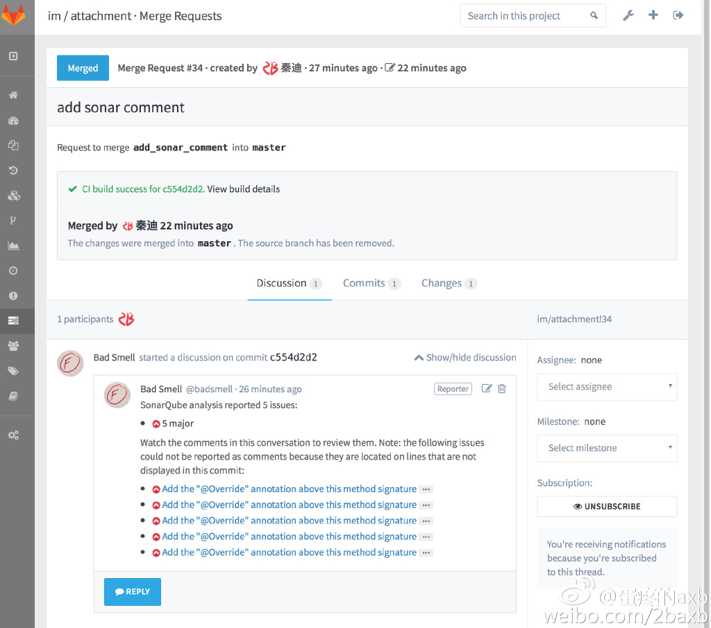

# 关于烂代码的那些事（下）

来源:[Axb的自我修养](http://blog.2baxb.me/archives/1499)

假设你已经读过烂代码系列的前两篇：了解了什么是烂代码，什么是好代码，但是还是不可避免的接触到了烂代码（就像之前说的，几乎没有程序员可以完全避免写出烂代码！）接下来的问题便是：如何应对这些身边的烂代码。

## 1.改善可维护性

改善代码质量是项大工程，要开始这项工程，从可维护性入手往往是一个好的开始，但也仅仅只是开始而已。

### 1.1.重构的悖论

很多人把重构当做一种一次性运动，代码实在是烂的没法改了，或者没什么新的需求了，就召集一帮人专门拿出来一段时间做重构。这在传统企业开发中多少能生效，但是对于互联网开发来说却很难适应，原因有两个：

* 互联网开发讲究快速迭代，如果要做大型重构，往往需要暂停需求开发，这个基本上很难实现。
* 对于没有什么新需求的项目，往往意味着项目本身已经过了发展期，即使做了重构也带来不了什么收益。

这就形成了一个悖论：一方面那些变更频繁的系统更需要重构；另一方面重构又会耽误开发进度，影响变更效率。

面对这种矛盾，一种方式是放弃重构，让代码质量自然下降，直到工程的生命周期结束，选择放弃或者重来。在某些场景下这种方式确实是有效的，但是我并不喜欢：比起让工程师不得不把每天的精力都浪费在毫无意义的事情上，为什么不做些更有意义的事呢？

### 1.2.重构step by step

#### 1.2.1.开始之前

开始改善代码的第一步是把IDE的重构快捷键设到一个顺手的键位上，这一步非常重要：决定重构成败的往往不是你的新设计有多么牛逼，而是重构本身会占用多少时间。

比如对于IDEA来说，我会把重构菜单设为快捷键：


这样在我想去重构的时候就可以随手打开菜单，而不是用鼠标慢慢去点，快捷键每次只能为重构节省几秒钟时间，但是却能明显减少工程师重构时的心理负担，后面会提到，小规模的重构应该跟敲代码一样属于日常开发的一部分。

我把重构分为三类：模块内部的重构、模块级别的重构、工程级别的重构。分为这三类并不是因为我是什么分类强迫症，后面会看到对重构的分类对于重构的意义。

#### 1.2.2.随时进行模块内部的重构

模块内部重构的目的是把模块内部的逻辑梳理清楚，并且把一个巨大无比的函数拆分成可维护的小块代码。大部分IDE都提供了对这类重构的支持，类似于：

* 重命名变量
* 重命名函数
* 提取内部函数
* 提取内部常量
* 提取变量

这类重构的特点是修改基本集中在一个地方，对代码逻辑的修改很少并且基本可控，IDE的重构工具比较健壮，因而基本没有什么风险。

以下例子演示了如何通过IDE把一个冗长的函数做重构：


上图的例子中，我们基本依靠IDE就把一个冗长的函数分成了两个子函数，接下来就可以针对子函数中的一些烂代码做进一步的小规模重构，而两个函数内部的重构也可以用同样的方法。每一次小规模重构的时间都不应该超过60s，否则将会严重影响开发的效率，进而导致重构被无尽的开发需求淹没。

在这个阶段需要对现有的模块补充一些单元测试，以保证重构的正确。不过以我的经验来看，一些简单的重构，例如修改局部变量名称，或者提取变量之类的重构，即使没有测试也是基本可靠的，如果要在快速完成模块内部重构和100%的单元测试覆盖率中选一个，我可能会选择快速完成重构。

而这类重构的收益主要是提高函数级别的可读性，以及消除超大函数，为未来进一步做模块级别的拆分打好基础。

#### 1.2.3.一次只做一个较模块级别的的重构

之后的重构开始牵扯到多个模块，例如：

* 删除无用代码
* 移动函数到其它类
* 提取函数到新类
* 修改函数逻辑

IDE往往对这类重构的支持有限，并且偶尔会出一些莫名其妙的问题，（例如修改类名时一不小心把配置文件里的常量字符串也给修改了）。

这类重构主要在于优化代码的设计，剥离不相关的耦合代码，在这类重构期间你需要创建大量新的类和新的单元测试，而此时的单元测试则是必须的了。

> 为什么要创建单元测试？
> 
> * 一方面，这类重构因为涉及到具体代码逻辑的修改，靠集成测试很难覆盖所有情况，而单元测试可以验证修改的正确性。
> * 更重要的意义在于，写不出单元测试的代码往往意味着糟糕的设计：模块依赖太多或者一个函数的职责太重，想象一下，想要执行一个函数却要模拟十几个输入对象，每个对象还要模拟自己依赖的对象……如果一个模块无法被单独测试，那么从设计的角度来考虑，无疑是不合格的。
>
> 还需要啰嗦一下，这里说的单元测试只对一个模块进行测试，依赖多个模块共同完成的测试并不包含在内-例如在内存里模拟了一个数据库，并在上层代码中测试业务逻辑-这类测试并不能改善你的设计。

在这个期间还会写一些过渡用的临时逻辑，比如各种adapter、proxy或者wrapper，这些临时逻辑的生存期可能会有几个月到几年，这些看起来没什么必要的工作是为了控制重构范围，例如：

```
class Foo {
  String foo() {
  ...
  }
}
```

```
class Foo {
  String foo() {
  ...
  }
}
```

如果要把函数声明改成

```
 class Foo {
   boolean foo() {
   ...
   }
 }
```

```
class Foo {
   boolean foo() {
   ...
   }
}
```
 
那么最好通过加一个过渡模块来实现：

```
 class FooAdaptor {
    private Foo foo;
    boolean foo() {
       return foo.foo().isEmpty();
    }
 }

```

```
 class FooAdaptor {
    private Foo foo;
    boolean foo() {
       return foo.foo().isEmpty();
    }
 }
```
 
这样做的好处是修改函数时不需要改动所有调用方，烂代码的特征之一就是模块间的耦合比较高，往往一个函数有几十处调用，牵一发而动全身。而一旦开始全面改造，往往就会把一次看起来很简单的重构演变成几周的大工程，这种大规模重构往往是不可靠的。

每次模块级别的重构都需要精心设计，提前划分好哪些是需要修改的，哪些是需要用兼容逻辑做过渡的。但实际动手修改的时间都不应该超过一天，如果超过一天就意味着这次重构改动太多，需要控制一下修改节奏了。

#### 1.2.4.工程级别的重构不能和任何其他任务并行

不安全的重构相对而言影响范围比较大，比如：

* 修改工程结构
* 修改多个模块

我更建议这类操作不要用IDE，如果使用IDE，也只使用最简单的“移动”操作。这类重构单元测试已经完全没有作用，需要集成测试的覆盖。不过也不必紧张，如果只做“移动”的话，大部分情况下基本的冒烟测试就可以保证重构的正确性。

这类重构的目的是根据代码的层次或者类型进行拆分，切断循环依赖和结构上不合理的地方。如果不知道如何拆分，可以依照如下思路：

* 优先按部署场景进行拆分，比如一部分代码是公用的，一部分代码是自己用的，可以考虑拆成两个部分。换句话说，A服务的修改能不能影响B服务。
* 其次按照业务类型拆分，两个无关的功能可以拆分成两个部分。换句话说，A功能的修改能不能影响B功能。
* 除此之外，尽量控制自己的代码洁癖，不要把代码切成一大堆豆腐块，会给日后的维护工作带来很多不必要的成本。
* 方案可以提前review几次，多参考一线工程师的意见，避免实际动手时才冒出新的问题。

而这类重构绝对不能跟正常的需求开发并行执行：代码冲突几乎无法避免，并且会让所有人崩溃。我的做法一般是在这类重构前先演练一次：把模块按大致的想法拖来拖去，通过编译器找到依赖问题，在日常上线中把容易处理的依赖问题解决掉；然后集中团队里的精英，通知所有人暂停开发，花最多2、3天时间把所有问题集中突击掉，新的需求都在新代码的基础上进行开发。

如果历史包袱实在太重，可以把这类重构也拆成几次做：先大体拆分成几块，再分别拆分。无论如何，这类重构务必控制好变更范围，一次严重的合并冲突有可能让团队中的所有人几个周缓不过劲来。

### 1.3.重构的周期

典型的重构周期类似下面的过程：

* 1、在正常需求开发的同时进行模块内部的重构，同时理解工程原有代码。
* 2、在需求间隙进行模块级别的重构，把大模块拆分为多个小模块，增加脚手架类，补充单元测试，等等。
* 3、（如果有必要，比如工程过于巨大导致经常出现相互影响问题）进行一次工程级别的拆分，期间需要暂停所有开发工作，并且这次重构除了移动模块和移动模块带来的修改之外不做任何其他变更。
* 4、重复1、2步骤

#### 1.3.1.一些重构的tips

* 只重构经常修改的部分，如果代码一两年都没有修改过，那么说明改动的收益很小，重构能改善的只是可维护性，重构不维护的代码不会带来收益。
* 抑制住自己想要多改一点的冲动，一次失败的重构对代码质量改进的影响可能是毁灭性的。
* 重构需要不断的练习，相比于写代码来说，重构或许更难一些。
* 重构可能需要很长时间，有可能甚至会达到几年的程度（我之前用断断续续两年多的时间重构了一个项目），主要取决于团队对于风险的容忍程度。
* 删除无用代码是提高代码可维护性最有效的方式，切记，切记。
* 单元测试是重构的基础，如果对单元测试的概念还不是很清晰，可以参考使用[Spock框架进行单元测试](http://blog.2baxb.me/archives/1398)

## 2.改善性能与健壮性

### 2.1.改善性能的80%

性能这个话题越来越多的被人提起，随便收到一份简历不写上点什么熟悉高并发、做过性能优化之类的似乎都不好意思跟人打招呼。

说个真事，几年前在我做某公司的ERP项目，里面有个功能是生成一个报表。而使用我们系统的公司里有一个人，他每天要在下班前点一下报表，导出到excel，再发一封邮件出去。

问题是，那个报表每次都要2，3分钟才能生成。

我当时正年轻气盛，看到有个两分钟才能生成的报表一下就来了兴趣，翻出了那段不知道谁写的代码，发现里面用了3层循环，每次都会去数据库查一次数据，再把一堆数据拼起来，一股脑塞进一个tableview里。

面对这种代码，我还能做什么呢？

* 我立刻把那个三层循环干掉了，通过一个存储过程直接输出数据。
* sql数据计算的逻辑也被我精简了，一些没必要做的外联操作被我干掉了。
* 我还发现很多ctrl+v生成的无用的控件（那时还是用的delphi），那些控件密密麻麻的贴在显示界面上，只是被前面的大table挡住了，我当然也把这些玩意都删掉了；
* 打开界面的时候还做了一些杂七杂八的工作（比如去数据库里更新点击数之类的），我把这些放到了异步任务里。
* 后面我又觉得没必要每次打开界面都要加载所有数据（那个tableview有几千行，几百列！），于是我hack了默认的tableview，每次打开的时候先计算当前实际显示了多少内容，把参数发给存储过程，初始化只加载这些数据，剩下的再通过线程异步加载。

做了这些之后，界面只需要不到1s就能展示出来了，不过我要说的不是这个。

后来我去客户公司给那个操作员演示新的模块的时候，点一下，刷，数据出来了。那个人很惊恐的看着我，然后问我，是不是数据不准了。

再后来，我又加了一个功能，那个模块每次打开之后都会显示一个进度条，上面的标题是“正在校验数据……”，进度条走完大概要1分钟左右，我跟那人说校验数据计算量很大，会比较慢。当然，实际上那60秒里程序毛事都没做，只是在一点点的更新那个进度条（我还做了个彩蛋，在读进度的时候按上上下下左右左右BABA的话就可以加速10倍读条…）。客户很开心，说感觉数据准确多了，当然，他没发现彩蛋。

我写了这么多，是想让你明白一个事实：大部分程序对性能并不敏感。而少数对性能敏感的程序里，一大半可以靠调节参数解决性能问题；最后那一小撮需要修改代码优化性能的程序里，性价比高的工作又是少数。

什么是性价比？回到刚才的例子里，我做了那么多事，每件事的收益是多少？

* 把三层循环sql改成了存储过程，大概让我花了一天时间，让加载时间从3分钟变成了2秒，模块加载变成了”唰“的一下。
后面的一坨事情大概花了我一周多时间，尤其是hack那个tableview，让我连周末都搭进去了。而所有的优化加起来，大概优化了1秒左右，这个数据是通过日志查到的：即使是我自己，打开模块也没感觉出有什么明显区别。
* 我现在遇到的很多面试者说程序优化时总是喜欢说一些玄乎的东西：调用栈、尾递归、内联函数、GC调优……但是当我问他们：把一个普通函数改成内联函数是把原来运行速度是多少的程序优化成多少了，却很少有人答出来；或者是扭扭捏捏的说，应该很多，因为这个函数会被调用很多遍。我再问会被调用多少遍，每遍是多长时间，就答不上来了。

所以关于性能优化，我有两个观点：

* 优化主要部分，把一次网络IO改为内存计算带来的收益远大于捯饬编译器优化之类的东西。这部分内容可以参考Numbers you should know；或者自己写一个for循环，做一个无限i++的程序，看看一秒钟i能累加多少次，感受一下cpu和内存的性能。
* 性能优化之后要有量化数据，明确的说出优化后哪个指标提升了多少。如果有人因为”提升性能“之类的理由写了一堆让人无法理解的代码，请务必让他给出性能数据：这很有可能是一坨没有什么收益的烂代码。

至于具体的优化措施，无外乎几类：

* 让计算靠近存储
* 优化算法的时间复杂度
* 减少无用的操作
* 并行计算

关于性能优化的话题还可以讲很多内容，不过对于这篇文章来说有点跑题，这里就不再详细展开了。

### 2.2.决定健壮性的20%

前一阵听一个技术分享，说是他们在编程的时候要考虑太阳黑子对cpu计算的影响，或者是农民伯伯的猪把基站拱塌了之类的特殊场景。如果要优化程序的健壮性，那么有时候就不得不去考虑这些极端情况对程序的影响。

大部分的人应该不用考虑太阳黑子之类的高深的问题，但是我们需要考虑一些常见的特殊场景，大部分程序员的代码对于一些特殊场景都会有或多或少考虑不周全的地方，例如：

* 用户输入
* 并发
* 网络IO

常规的方法确实能够发现代码中的一些bug，但是到了复杂的生产环境中时，总会出现一些完全没有想到的问题。虽然我也想了很久，遗憾的是，对于健壮性来说，我并没有找到什么立竿见影的解决方案，因此，我只能谨慎的提出一点点建议：

* 更多的测试测试的目的是保证代码质量，但测试并不等于质量，你做覆盖80%场景的测试，在20%测试不到的地方还是有可能出问题。关于测试又是一个巨大的话题，这里就先不展开了。
* 谨慎发明轮子。例如UI库、并发库、IO client等等，在能满足要求的情况下尽量采用成熟的解决方案，所谓的“成熟”也就意味着经历了更多实际使用环境下的测试，大部分情况下这种测试的效果是更好的。

## 3.改善生存环境

看了上面的那么多东西之后，你可以想一下这么个场景：

> 在你做了很多事情之后，代码质量似乎有了质的飞跃。正当你以为终于可以摆脱天天踩屎的日子了的时候，某次不小心瞥见某个类又长到几千行了。
>
>你愤怒的翻看提交日志，想找出罪魁祸首是谁，结果却发现每天都会有人往文件里提交那么十几二十行代码，每次的改动看起来都没什么问题，但是日积月累，一年年过去，当初花了九牛二虎之力重构的工程又成了一坨烂代码……

任何一个对代码有追求的程序员都有可能遇到这种问题，技术在更新，需求在变化，公司人员会流动，而代码质量总会在不经意间偷偷的变差……

想要改善代码质量，最后往往就会变成改善生存环境。

### 3.1.统一环境

团队需要一套统一的编码规范、统一的语言版本、统一的编辑器配置、统一的文件编码，如果有条件最好能使用统一的操作系统，这能避免很多无意义的工作。

就好像最近渣浪给开发全部换成了统一的macbook，一夜之间以前的很多问题都变得不是问题了：字符集、换行符、IDE之类的问题只要一个配置文件就解决了，不再有各种稀奇古怪的代码冲突或者不兼容的问题，也不会有人突然提交上来一些编码格式稀奇古怪的文件了。

### 3.2.代码仓库

代码仓库基本上已经是每个公司的标配，而现在的代码仓库除了储存代码，还可以承担一些团队沟通、代码review甚至工作流程方面的任务，如今这类开源的系统很多，像gitlab(github)、Phabricator这类优秀的工具都能让代码管理变得简单很多。我这里无意讨论svn、git、hg还是什么其它的代码管理工具更好，就算最近火热的git在复杂性和集中化管理上也有一些问题，其实我是比较期待能有替代git的工具产生的，扯远了。

代码仓库的意义在于让更多的人能够获得和修改代码，从而提高代码的生命周期，而代码本身的生命周期足够持久，对代码质量做的优化才有意义。

### 3.3.持续反馈

大多数烂代码就像癌症一样，当烂代码已经产生了可以感觉到的影响时，基本已经是晚期，很难治好了。

因此提前发现代码变烂的趋势很重要，这类工作可以依赖类似于checkstyle，findbug之类的静态检查工具，及时发现代码质量下滑的趋势，例如：

* 每天都在产生大量的新代码
* 测试覆盖率下降
* 静态检查的问题增多

有了代码仓库之后，就可以把这种工具与仓库的触发机制结合起来，每次提交的时候做覆盖率、静态代码检查等工作，jenkins+sonarqube或者类似的工具就可以完成基本的流程：伴随着代码提交进行各种静态检查、运行各种测试、生成报告并供人参考。

在实践中会发现，关于持续反馈的五花八门的工具很多，但是真正有用的往往只有那么一两个，大部分人并不会去在每次提交代码之后再打开一个网页点击“生成报告”，或者去登陆什么系统看一下测试的覆盖率是不是变低了，因此一个一站式的系统大多数情况下会表现的更好。与其追求更多的功能，不如把有限的几个功能整合起来，例如我们把代码管理、回归测试、代码检查、和code review集成起来，就是这个样子：



### 3.4.质量文化

不同的团队文化会对技术产生微妙的影响，关于代码质量没有什么共同的文化，每个公司都有自己的一套观点，并且似乎都能说得通。

对于我自己来说，关于代码质量是这样的观点：

* 烂代码无法避免
* 烂代码无法接受
* 烂代码可以改进
* 好的代码能让工作更开心一些

如何让大多数人认同关于代码质量的观点实际上是有一些难度的，大部分技术人员对代码质量的观点是既不赞成、也不反对的中立态度，而代码质量就像是熵值一样，放着不管总是会像更加混乱的方向演进，并且写烂代码的成本实在是太低了，以至于一个实习生花上一个礼拜就可以毁了你花了半年精心设计的工程。

所以在提高代码质量时，务必想办法拉上团队里的其他人一起。虽然“引导团队提高代码质量”这件事情一开始会很辛苦，但是一旦有了一些支持者，并且有了可以参考的模板之后，剩下的工作就简单多了。

这里推荐《布道之道：引领团队拥抱技术创新》这本书，里面大部分的观点对于代码质量也是可以借鉴的。仅靠喊口号很难让其他人写出高质量的代码，让团队中的其他人体会到高质量代码的收益，比喊口号更有说服力。

## 4.最后再说两句

优化代码质量是一件很有意思，也很有挑战性的事情，而挑战不光来自于代码原本有多烂，要改进的也并不只是代码本身，还有工具、习惯、练习、开发流程、甚至团队文化这些方方面面的事情。

写这一系列文章前前后后花了半年多时间，一直处在写一点删一点的状态：我自身关于代码质量的想法和实践也在经历着不断变化。我更希望能写出一些能够实践落地的东西，而不是喊喊口号，忽悠忽悠“敏捷开发”、“测试驱动”之类的几个名词就结束了。

但是在写文章的过程中就会慢慢发现，很多问题的改进方法确实不是一两篇文章可以说明白的，问题之间往往又相互关联，全都展开说甚至超出了一本书的信息量，所以这篇文章也只能删去了很多内容。

我参与过很多代码质量很好的项目，也参与过一些质量很烂的项目，改进了很多项目，也放弃了一些项目，从最初的单打独斗自己改代码，到后来带领团队优化工作流程，经历了很多。无论如何，关于烂代码，我决定引用一下《布道之道》这本书里的一句话：

> “‘更好’，其实不是一个目的地，而是一个方向…在当前的位置和将来的目标之间，可能有很多相当不错的地方。你只需关注离开现在的位置，而不要关心去向何方。”