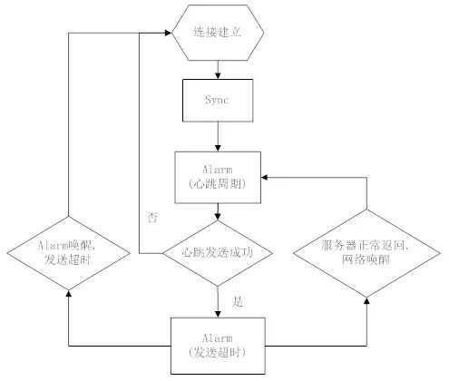

# 微信Android客户端后台保活经验分享

来源:[infoQ](http://www.infoq.com/cn/articles/wechat-android-background-keep-alive)

[TOC]

本文为『移动前线』群在3月31日的分享总结整理而成，转载请注明来自『移动开发前线』公众号。

**嘉宾介绍**

**杨干荣**，微信Android客户端基础平台、性能优化负责人

保活，按照我们的理解包含两部分：

* **网络连接保活：**如何保证消息接收实时性。
* **进程保活：**尽量保证应用的进程不被Android系统回收。

## 1  网络连接保活

网络保活，业界主要手段有：

* a. GCM
* b. 公共的第三方push通道(信鸽等)
* c. 自身跟服务器通过轮询，或者长连接

国产机器大多缺乏GMS，在国内GCM也不稳定(心跳原因)，第三方通道需要考虑安全问题和承载能力，最后微信选择使用自己的长连接。而国外， GCM作为辅助，微信无法建立长连接时，才使用GCM。

之前看到大家在聊各种Java网络框架，而微信实际上都是没用上的。早年的微信，直接通过Java socket 实现。微信v5.0后，考虑各系统平台的统一，开始使用自研c++组件。

长连接实现包括几个要素：

* a. 网络切换或者初始化时 server ip 的获取。
* b. 连接前的 ip筛选，出错后ip 的抛弃。
* c. 维护长连接的心跳。
* d. 服务器通过长连notify。
* e. 选择使用长连通道的业务。
* f. 断开后重连的策略。

今天主题在保活，  我们重点讨论心跳和 notify 机制。

### 1.1 心跳机制

心跳的目的很简单：通过定期的数据包，对抗NAT超时。以下是部分地区网络NAT 超时统计：

上表说明：

* a. GCM无法适应国内2G环境(GCM 28分钟心跳)。
* b. 为了兼容国内网络要求，我们至少5分钟心跳一次。

老版本的微信是4.5分钟发送一次心跳，运行良好。

心跳的实现：

* a. 连接后主动到服务器Sync拉取一次数据，确保连接过程的新消息。
* b. 心跳周期的Alarm 唤醒后，一般有几秒的cpu 时间，无需wakelock。
* c. 心跳后的Alarm防止发送超时，如服务器正常回包，该Alarm 取消。
* d. 如果服务器回包，系统通过网络唤醒，无需wakelock。

流程基于两个系统特性：

* a. Alarm唤醒后，足够cpu时间发包。
* b. 网络回包可唤醒机器。

特别是b项，假如Android封堵该特性，那就只能用GCM了。**API level >= 23**的doze就关闭所有的网络， alarm等。但进入doze条件苛刻，现在6.0普及低，至今微信没收到相关投诉。另Google也最终加入**REQUEST_IGNORE_BATTERY_OPTIMIZATIONS**权限。

### 1.2 动态心跳

4.5min心跳周期是稳定可靠的，但无法确定是最大值。通过终端的尝试，可以获取到特定用户网络下，心跳的最大值。

引入该特性的背景：

* a. 运营商的信令风暴
* b. 运营商网络换代，NAT超时趋于增大
* c. Alarm耗电，心跳耗流量。

动态心跳引入下列状态：

* a. 前台活跃态：亮屏，微信在前台，  周期minHeart (4.5min) ，保证体验。
* b. 后台活跃态：微信在后台10分钟内，周期minHeart ，保证体验。
* c. 自适应计算态：步增心跳，尝试获取最大心跳周期(sucHeart)。
* d. 后台稳定态：通过最大周期，保持稳定心跳。

自适应计算态流程：

在自适应态：

* a. curHeart初始值为minHeart ， 步增(heartStep)为1分钟。
* b. curHeart 失败5次， 意味着整个自适应态最多只有5分钟无法接收消息。
* c. 结束后，如果sucHeart > minHeart，会减去10s(避开临界)，为该网络下的稳定周期。
* d. 进入稳定态时，要求连接连续三次成功minHeart心跳周期，再使用sucHeart。

稳定态的退出：

sucHeart 会对应网络存储下来， 重启后正常使用。考虑到网络的不稳定，如NAT超时变小，用户地理位置变换。当发现sucHeart 连续5次失败， sucHeart 置为minHeart ，重新进入自适应态。

### 1.3 notify机制

网络保活的意义在于消息实时。通过长连接，微信有下列机制保证消息的实时。

#### Sync：

通过Sync CGI直接请求后台数据。Sync 通过后台和终端的seq值对比，判断该下发哪些消息。终端正常处理消息后，seq更新为最新值。

Sync 的主要场景：

* a. 长连无法建立时，通过Sync 定期轮询
* b. 微信切到前台时，触发Sync(保命机制)
* c. 长连建立完成，立即触发Sync，防止连接过程漏消息
* d. 接收到Notify 或者 gcm 后，终端触发Sync 接收消息.

#### Notify：

类似于GCM。通过长连接，后台发出仅带seq的小包，终端根据seq决定是否触发Sync拉取消息。

#### NotifyData：

在长连稳定， Notify机制正常的情况下(保证seq的同步)。后台直接推送消息内容，节省1个RTT (Sync) 消息接收时间。终端收到内容后，带上seq回应NotifyAck，确认成功。这里会出现Notify和NotifyData状态互相切换的情况：

如NotifyData 后，服务器在没收到NotifyAck，而有新消息的情况下，会切换回到Notify，Sync可能需要冗余之前NotifyData的消息。终端要保证串行处理NotifyData和Sync ，否则seq可能回退。

#### GCM：

只要机器上有GMS ，启动时就尝试注册GCM，并通知后台。服务器会根据终端是否保持长连，决定是否由GCM通知。GCM主要针对国外比较复杂的网络环境。

## 2 进程保活

在Android系统里，进程被杀的原因通常为以下几个方面：

* a. 应用Crash
* b. 系统回收内存
* c. 用户触发
* d. 第三方root权限app.

原因a可以单独作为一个课题研究。原因c、d目前在微信上没有特殊处理。这里讨论的就是如何应对**Android Low Memory Killer**。

下面分享几个微信保活的方法：

### 2.1 进程拆分

上图表述的是微信主要的几个进程：

* a. push主要用于网络交互，没有UI
* b. worker就是用户看到的主要UI
* c. tools主要包含gallery和webview

拆分网络进程，确实就是为了减少进程回收带来的网络断开。

可以看到push的内存要远远小于worker。而且push的工作性质稳定，内存增长会非常少。这样就可以保证，尽量的减少push 被杀的可能。

这里有个思路，但限制比较多，也抛砖引玉。启动一个纯C/C++ 的进程，没有Java run time ，内存使用极低。

这种做法限制很明显，如：没有Java run time ，所以无法使用Android系统接口。缺乏权限，也无法使用各种shell命令操作(如am)。但可以考虑一下用途：高强度运算，网络连接，心跳维持等。比如Shadowsocks-android就如此，通过纯c命令行进程，维护着socks5代理 (Android M运行正常)。

tools进程的拆分也同样是内存的原因：

* a. 老版本的webview 是有内存泄漏的
* b. Gallery大量缩略图导致内存使用大

微信在进入后台后，会主动把tools进程kill掉。

### 2.2 及时拉起

系统回收不可避免，及时重新拉起的手段主要依赖系统特性。从上图看到， push有AlarmReceiver， ConnectReceiver，BootReceiver。这些receiver 都可以在push被杀后，重新拉起。特别AlarmReceiver ，结合心跳逻辑，微信被杀后，重新拉起最多一个心跳周期。

而对于worker，除了用户UI操作启动。在接收消息，或者网络切换等事件， push也会通过LocalBroadcast，重新拉起worker。这种拉起的worker ，大部分初始化已经完成，也能大大提高用户点击微信的启动速度。

历史原因，我们在push和worker通信使用Broadcast和AIDL。实际上，我一直不喜欢这里的实现，AIDL代码冗余多， broadcast效率低。欢迎大家分享更好的思路或者方法。

### 2.3 进程优先级

**Low Memory Killer **决定是否杀进程除了内存大小，还有进程优先级：

上表的数字可能在不同系统会有一定的出入，但明确的是，数值越小，优先级越高。对于优先级相同的进程，总是会把内存占用多的先kill。提高进程优先级是保活的最好手段。

正常情况下微信的oom_adj：

而被提高优先级后：

从统计上报看，提高后的效果极佳。

原理：Android 的前台service机制。但该机制的缺陷是通知栏保留了图标。

对于 API level < 18 ：调用startForeground(ID， new Notification())，发送空的Notification ，图标则不会显示。

对于 API level >= 18：在需要提优先级的service A启动一个InnerService，两个服务同时startForeground，且绑定同样的 ID。Stop 掉InnerService ，这样通知栏图标即被移除。

这方案实际利用了Android前台service的漏洞。微信在评估了国内不少app已经使用后，才进行了部署。其实目标是让大家站同一起跑线上，哪天google 把漏洞堵了，效果也是一样的。

## QA环节

* Q：在智能心跳自适应阶段，如果5次心跳失败是否会促发重连？因为5次心跳都失败的话连接是不是已经断开了？

> A：这里可能刚才描述不够清晰，任何一次心跳失败后，必然就已经断开重连了，所以每次心跳失败，对应一次重连操作。

* Q：在某些网络下，经常出现网络闪断的情况，这种情况下势必会引起频繁的socket重连，微信有没有遇到类似的情况？有没有什么优化的方法，求指教。

> A：这种情况是有的，微信在前台时，我们会比较积极的更换ip重试，或者换短连ip。在后台时，如果出现频繁，会加上比较长的间隔。

* Q：之前看微信的架构分享，貌似是通过单一Activity，用多个Fragment切换来实现的多窗口。如果分进程的话，看起来Gallery和 WebView是单独的一个Activity，我的理解是否正确呢？以及进入后台之后，为何只kill tools而不一起释放work呢？

> A：Fragment 的改造只是用在有限的几个UI上，大部分的UI，对于切换时间要求不高，还是保留成activity，Gallery和WebView都是单独的 activity，所以才可能另外一个进程的。对于我们来说worker的保活仅次于网络的push，worker如果频繁被杀，用户每次启动微信都需要等待，这个就不好了。所以，我们在后台，只会kill tools，不会主动kill worker。

* Q：除了提高进程的优先级，微信在内存方面有什么处理或优化的技术吗？

> A：不可否认，其实微信是内存大户了，现阶段我们主要关注内存泄漏，没有专门去减少内存的使用，毕竟内存意味着cache，意味着用户体验更快，后续对于内存优化我们有一些规划，比如说，在cache这块照顾一些低端机。

* Q：我记得很久以前听说过微信使用一个像素的浮动窗口来保活，不知道现在还有没有呢？

> A：我们有想过，也听说过有其他app是这样做的，但从来没实现过这个方案。

* Q：多端同时登录情况(手机，电脑同时登录)，假如有一端网络情况不好，怎么保证收到消息一致性？

> A：多终端登录消息一致的问题，是由后台保证的，实际原理也就是上面提到的seq。

* Q：你们push进程与worker进程采用过socket通信方案么？采用的话效果怎么样？

> A：有考虑过用socket，后续也可能会有这种尝试，但因为push和worker依赖代码太多，伤筋动骨了，但估计也要比AIDL好，AIDL对于应用出问题后能做的事情太少了。

* Q：有没有遇到过有一些端口被运营商封了的情况？我们之前有一些用户就是死活连不上某个端口。

> A：服务器给我们开的端口有好几个，比如80/8080/443等，而且允许服务器下发，所以实际上现在服务器会用哪些端口，终端这边都无需关注了。

* Q：再问一个问题，服务端主动notify的话，时间间隔是如何选择的？因为这个关系到用户的流量消耗。

> A：notifydata是实时的，只要你的状态允许，你的好友给你发消息的时候就会立即在服务器转换成notifydata给到你，所以这里的频率并不在于时间间隔，而在于你接收消息然后返回ack的间隔。流量消耗上，实际要比触发sync更少。

* Q：这种保活机制会极大的增加app的耗电量，在可以通过GCM稳定唤醒app的场景下，是否可以停用后台保活，从而省电？

> A：其实心跳机制真的不会带来多少耗电，一个心跳包发出和接收，实际的消耗远远低于您收发一条消息。心跳间隔时间微信实际不会使用任何cpu的。唤醒机制靠的是网络回包。 
> GCM唤醒这种模式国外有app是这样做的，但还是因为国内GCM不靠谱，另外这种模式要比notify，notifydata都慢。